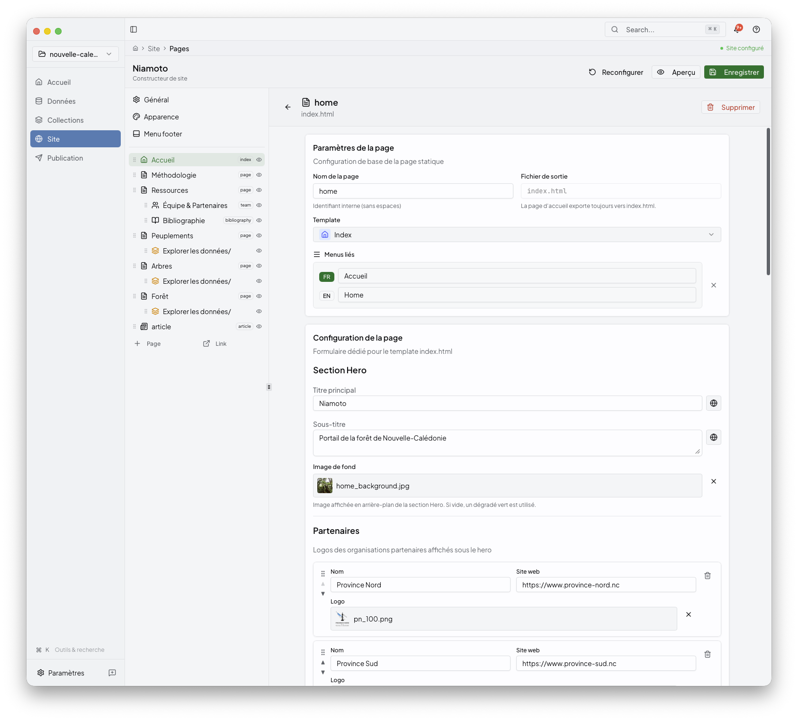
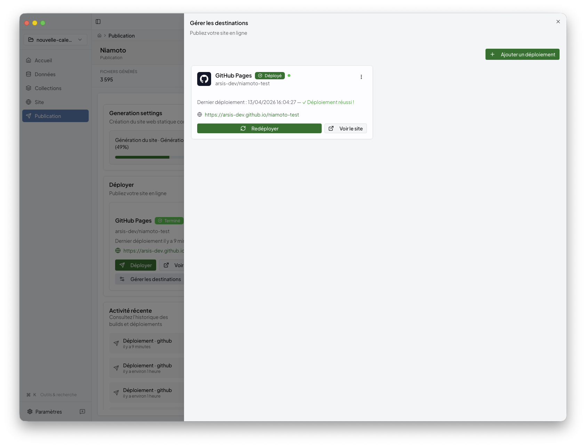

# Your first Niamoto project

A fifteen-minute walk-through of the desktop app, from the welcome
screen to a published portal.

## Prerequisites

- Niamoto desktop installed ([installation.md](installation.md)).
- Your data (a CSV of occurrences, and optionally shapefiles), or a
  sample from
  [niamoto-example-data](https://github.com/niamoto/niamoto-example-data).

## 1. Create a project

Launch the app. The welcome screen lists recent projects and offers to
create a new one:


Click *Create project*, pick a name and a folder. Niamoto lays out the
standard tree:

```
my-project/
├── config/
│   ├── config.yml
│   ├── import.yml
│   ├── transform.yml
│   └── export.yml
├── imports/
├── exports/
├── plugins/
├── templates/
├── db/
└── logs/
```

## 2. Import your data

Drop CSVs, shapefiles, or GeoPackages onto the import screen. The
built-in ML classifier suggests roles for each column (taxonomy,
occurrences, plots, shapes, raster):


Review the suggestions, adjust what the classifier missed, hit
*Import*. A progress panel reports rows ingested and rows rejected.

See [../05-ml-detection/README.md](../05-ml-detection/README.md) for
the details of the auto-detection pipeline.

## 3. Explore the collections

The dashboard lists the collections Niamoto has built — taxa, plots,
shapes. Open any of them to browse the raw rows or the computed
widgets:


Each collection comes with a catalogue of widgets (ranking tables,
histograms, maps). Previews render locally against your imported data.

## 4. Arrange the portal

The site builder lays out the pages of the final portal. Drag widgets
into pages, set titles and descriptions, wire up the navigation:



## 5. Publish

When the preview looks right, click *Publish*. Pick a deployment
target — GitHub Pages, Netlify, S3, or an ordinary folder — and
Niamoto renders the static site and pushes it:



Your portal is live.

## What's next

- [concepts.md](concepts.md) — the import / transform / export model
  under the UI.
- [../02-user-guide/README.md](../02-user-guide/README.md) — deep
  dives into each desktop screen.
- [../03-cli-automation/README.md](../03-cli-automation/README.md) —
  run the same pipeline from a shell for CI and automation.
- [../04-plugin-development/README.md](../04-plugin-development/README.md) —
  extend Niamoto with custom transformers, widgets, loaders.
