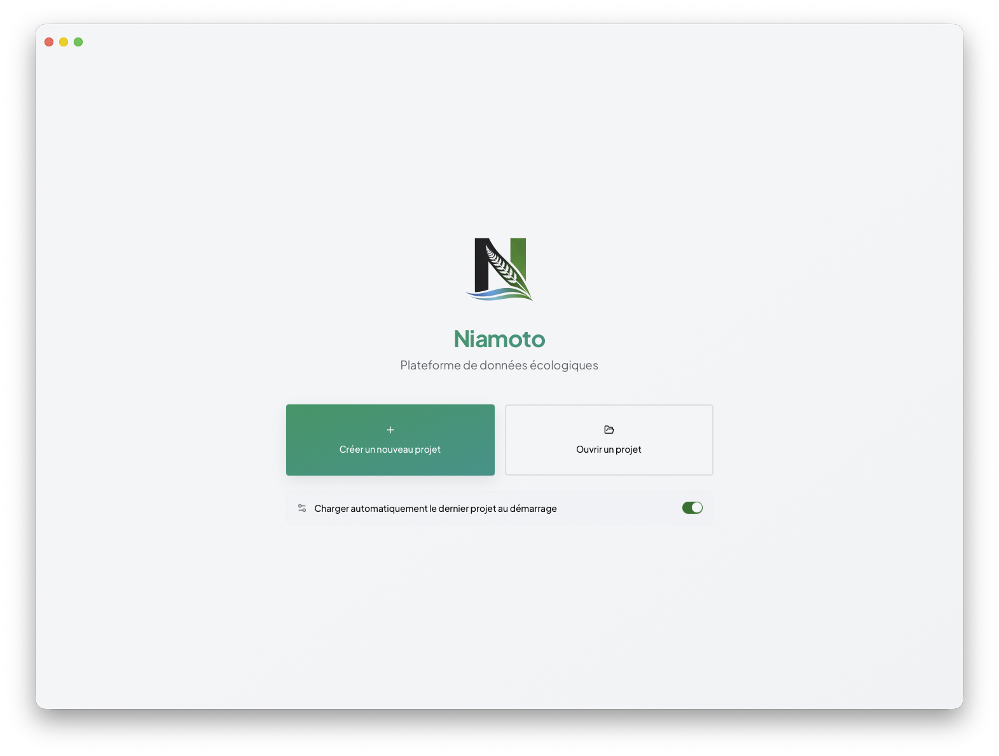
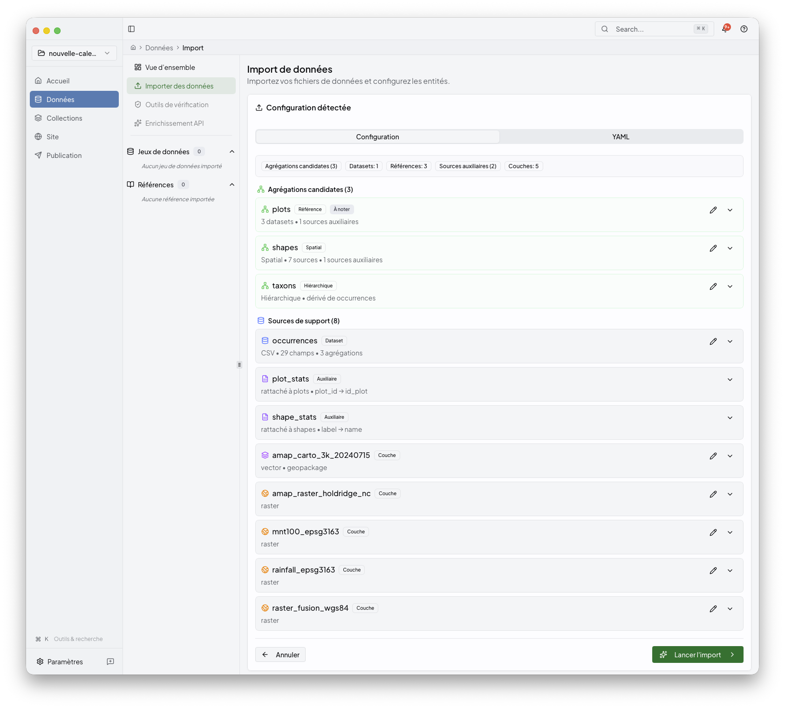
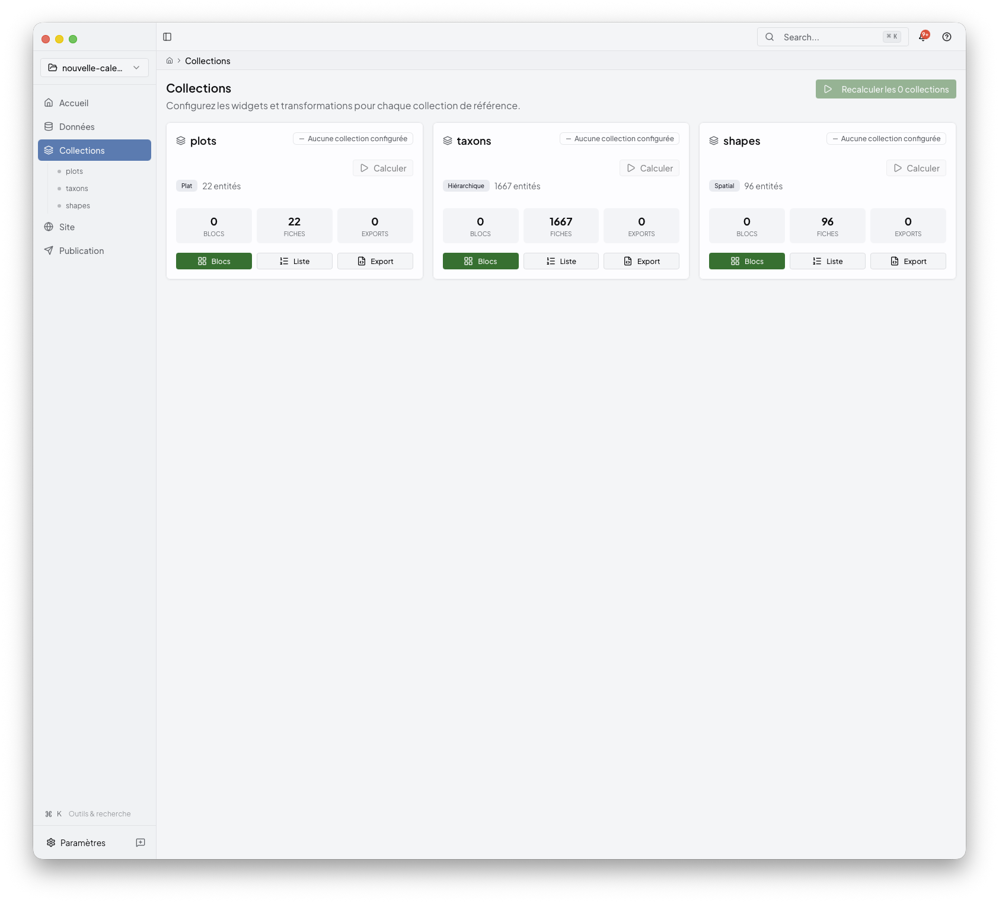
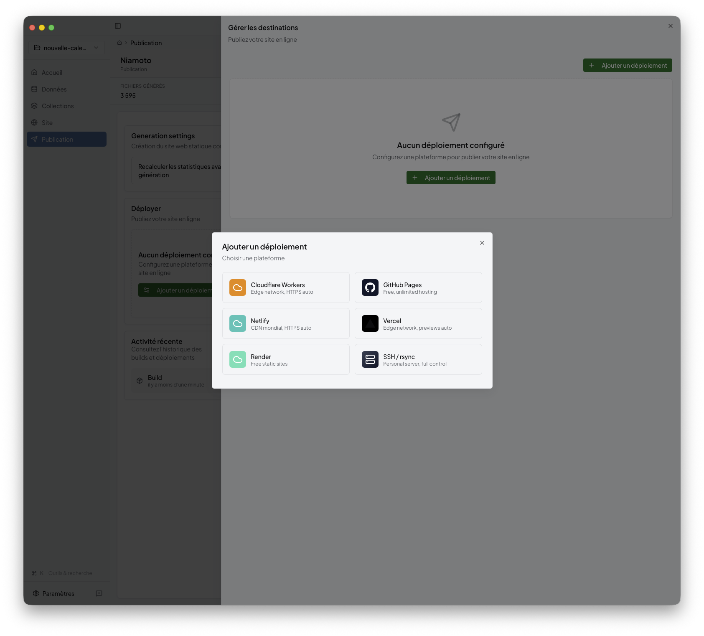

# Desktop App Tour

Use this section when you already have the desktop app installed and want the
full UI path from project setup to publication.

If you want the quick version first, start with
[../01-getting-started/first-project.md](../01-getting-started/first-project.md).
This guide is the detailed follow-up.

## Main path

### 1. Create or open a project

Start from the welcome screen, create a project, or reopen an existing one.



The detailed onboarding flow stays in
[../01-getting-started/first-project.md](../01-getting-started/first-project.md).
Once the project exists, the main desktop workflow is:

- import sources
- configure collections
- build the site
- publish the result

### 2. Import the project data

Import is where you add CSVs, spatial files, and rasters, let Niamoto detect
their roles, then review the generated configuration before loading the data.



See [import.md](import.md).

### 3. Configure collections

Collections is the reader-facing name for the stage backed by
`config/transform.yml` and the collection-facing parts of `config/export.yml`.
Use it to inspect grouped outputs, add widgets, and recompute collection
content.



See [collections.md](collections.md).

### 4. Build the site

The Site area is where you shape the generated portal: shared pages, collection
pages, navigation, and appearance.


See [site.md](site.md).

### 5. Publish the portal

Publish is the final desktop stage. Build the output, inspect the generated
site preview, pick a deployment target, and review the result.



See [publish.md](publish.md).

## Module pages

- [import.md](import.md): source files, auto-detection, config review, import execution
- [collections.md](collections.md): collection outputs, widgets, recompute workflow
- [site.md](site.md): pages, navigation, appearance, site-builder workflow
- [publish.md](publish.md): build preview, deployment targets, publish status

## Supporting references

- [widget-catalogue.md](widget-catalogue.md): widget selection, index pages, API exports
- [preview.md](preview.md): the three preview surfaces used across the desktop app

## Other routes

- Starting from scratch: [../01-getting-started/README.md](../01-getting-started/README.md)
- Running from a shell: [../03-cli-automation/README.md](../03-cli-automation/README.md)
- Extending the product with plugins: [../04-plugin-development/README.md](../04-plugin-development/README.md)

## Related

- [../06-reference/widgets-and-transform-workflow.md](../06-reference/widgets-and-transform-workflow.md)
- [../07-architecture/gui-overview.md](../07-architecture/gui-overview.md)

```{toctree}
:hidden:

import
collections
site
publish
widget-catalogue
preview
```
