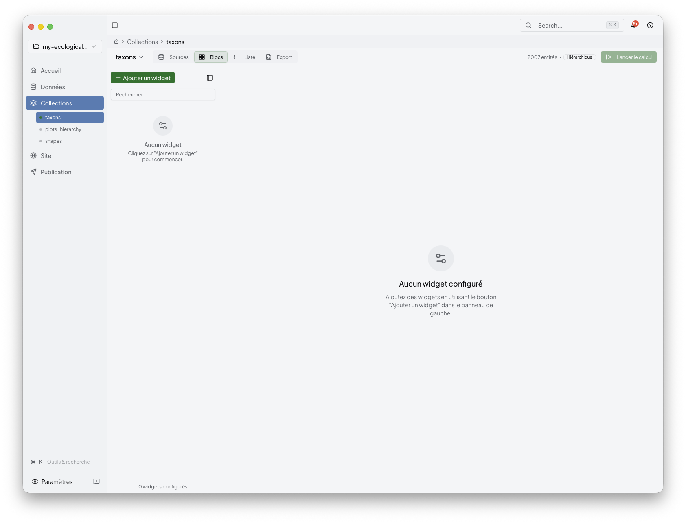
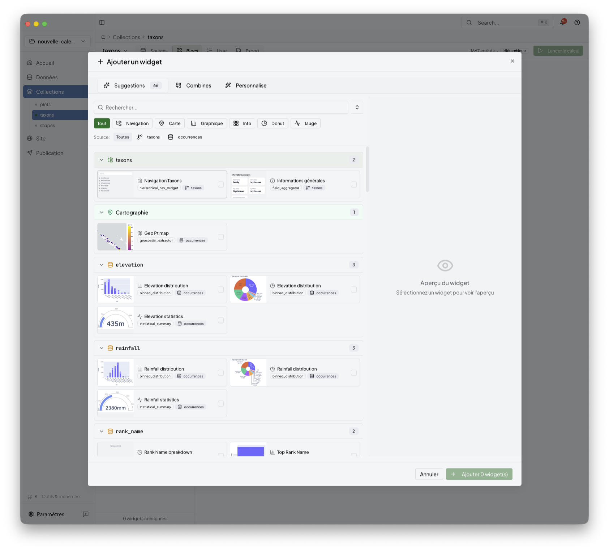
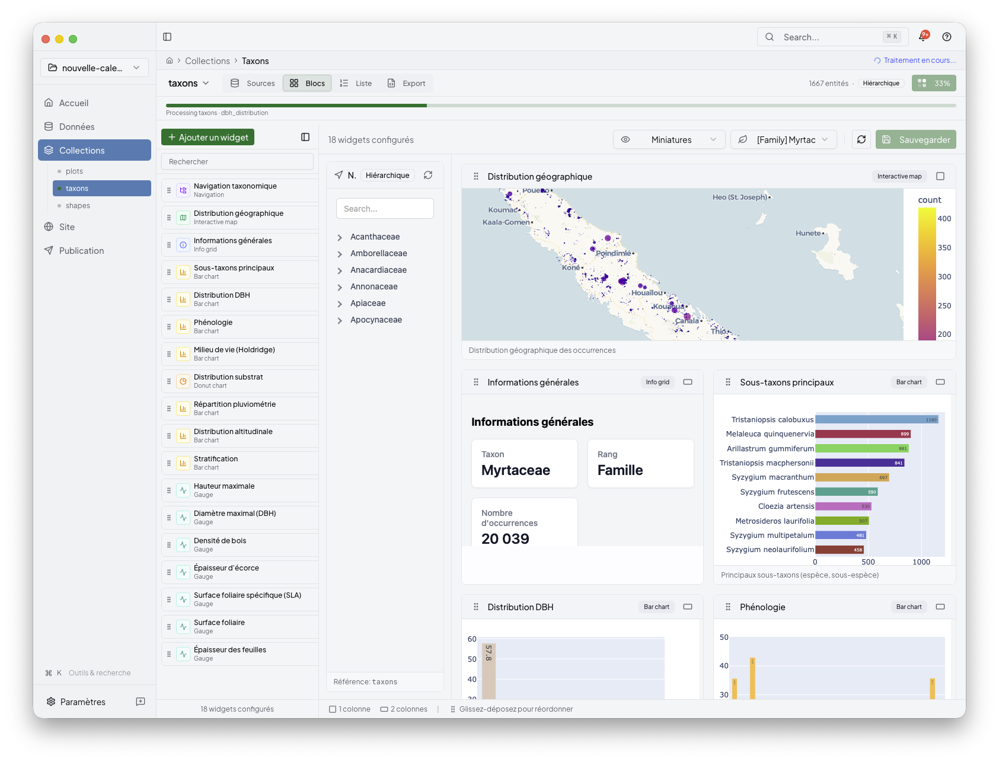

# Collections

Collections is the reader-facing name for the desktop area that manages grouped
outputs. Behind the interface, this stage spans `config/transform.yml` and the
collection-facing parts of `config/export.yml`.

Use Collections to:

- inspect the collections created from imported data
- configure widgets and other computed outputs
- preview a collection before recomputing everything
- recompute and validate the generated collection content

## 1. Start from the collections overview

After import, open the collections area to see the project entities Niamoto can
turn into pages, widgets, and reusable outputs.

Typical collections include taxa, plots, or shapes, but the exact set depends
on the project you imported.

## 2. Configure collection content

Open a collection to edit the content blocks attached to it.

This is where you decide:

- which widgets belong to the collection
- which source fields or grouped values feed them
- which parameters shape the final result

Niamoto keeps the workflow UI-first. You do not need to start from raw YAML, but
the changes you make here can update both `config/transform.yml` and
`config/export.yml`, depending on whether you are defining data, widget display,
list pages, or API outputs.

## 3. Add widgets from the gallery

When you need a new content block, open the widget picker and browse the
available suggestions.

The gallery helps you discover:

- recommended widgets for the current collection
- plugin-backed parameter forms
- combinations that already make sense for the available data

For a more focused view of widget selection, list pages, and API outputs, see
[widget-catalogue.md](widget-catalogue.md).

## 4. Recompute and validate the result

After editing a collection, recompute it so the saved configuration and the
generated output stay aligned.

Use this step when:

- you added or removed widgets
- a parameter changed
- imported data changed and the collection needs a fresh run

## How this stage fits the full flow

Collections sits between Import and Site:

- Import loads the project data
- Collections defines reusable grouped outputs
- Site arranges those outputs into the generated portal
- Publish builds and deploys the final result

## Related

- [widget-catalogue.md](widget-catalogue.md)
- [preview.md](preview.md)
- [site.md](site.md)
- [../06-reference/transform-plugins.md](../06-reference/transform-plugins.md)
- [../06-reference/widgets-and-transform-workflow.md](../06-reference/widgets-and-transform-workflow.md)
