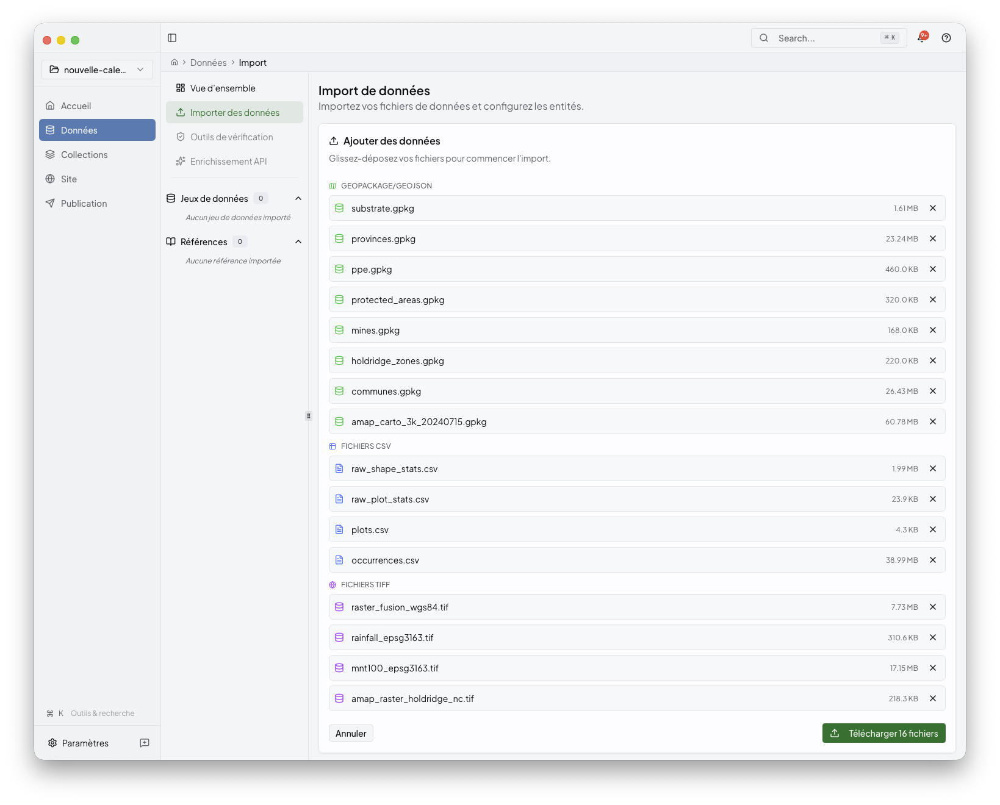
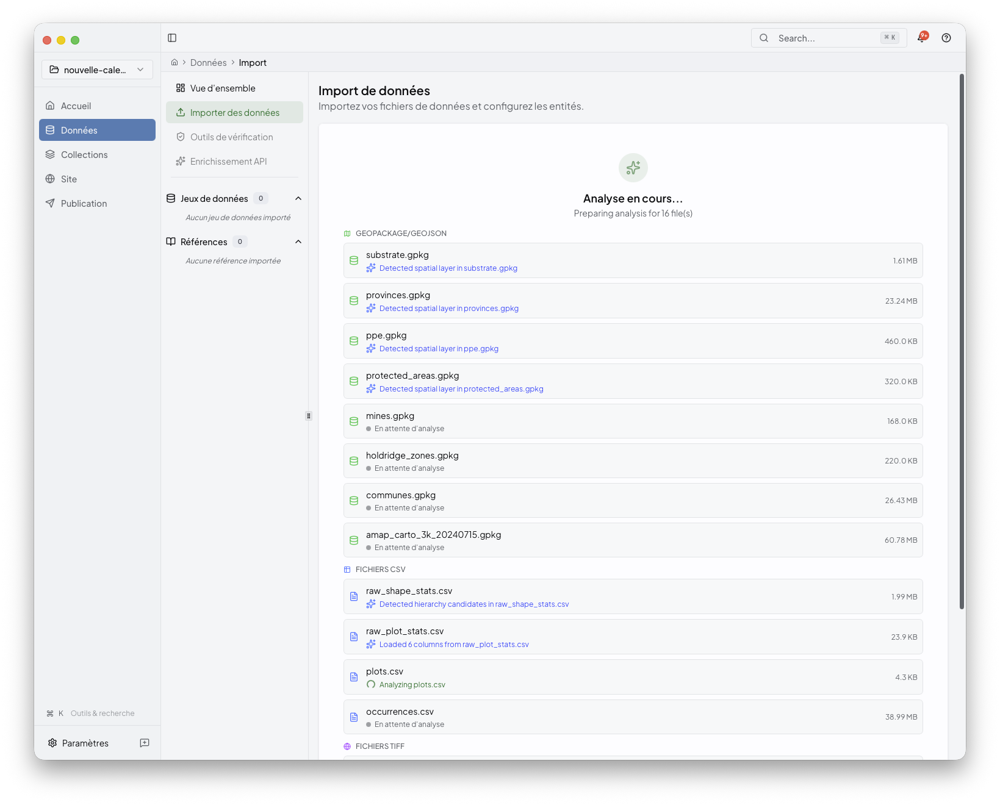
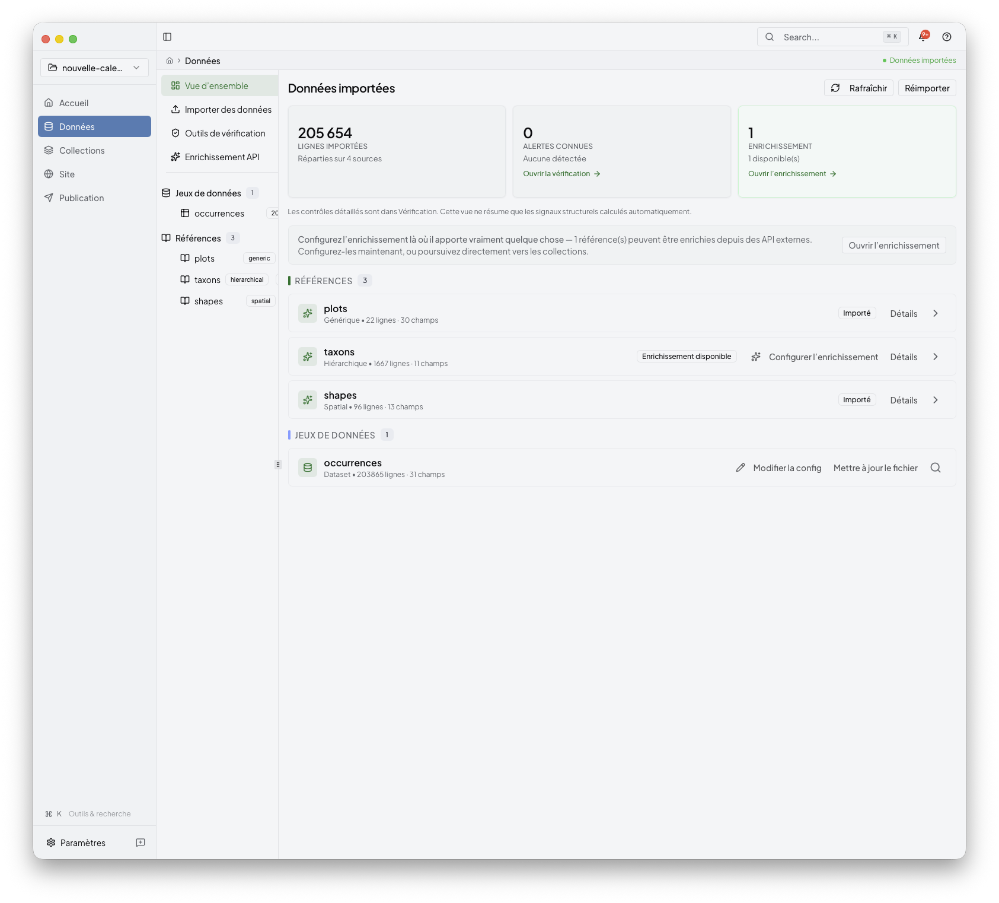

# Import

Import is where a project becomes usable. Add the source files, let Niamoto
detect their roles, review the generated configuration, then load the data into
the project workspace.

## What this stage controls

Use Import to:

- add CSV tables, spatial layers, and rasters
- review detected identifiers and source roles
- edit the generated configuration before import
- run the import and confirm the project is ready for Collections

If you are still at the very beginning, pair this page with
[../01-getting-started/first-project.md](../01-getting-started/first-project.md).

## 1. Add the source files

Start from the dashboard or the Import area and select the files that belong to
the project.

The desktop app keeps the source list visible while you work, so you can check
which files are in scope before analysis starts.

Typical inputs include:

- CSV tables
- GeoPackage or GeoJSON layers
- shapefiles
- TIFF rasters

## 2. Let Niamoto analyse the files

After selection, Niamoto runs live analysis and shows progress in place.

This stage is where the app tries to recognise:

- main datasets
- reference entities
- supporting sources
- layers or auxiliary files that should stay attached to a collection

You do not need to understand the ML pipeline to use this step, but if you want
the deeper explanation, see [../05-ml-detection/README.md](../05-ml-detection/README.md).

## 3. Review the generated configuration

When analysis finishes, the review surface shows what Niamoto inferred and what
still needs confirmation.

At this point you can:

- confirm entity names
- review identifiers and file roles
- decide which sources become primary entities or supporting inputs
- edit the generated YAML when you need more control

Behind the UI, this stage is mostly shaping `config/import.yml`. The goal is
not to hand-edit YAML by default, but to understand that the review screen is
saving the same import structure the CLI can also use.

## 4. Run the import

Once the configuration looks right, start the import and follow the progress in
the same workspace.

After a successful import, the project dashboard becomes the handoff point to
the next stages:

- inspect the imported entities
- continue into [collections.md](collections.md)
- move later into [site.md](site.md) and [publish.md](publish.md)

## Optional follow-up: enrichment

Some imported references can expose enrichment as a later step. Keep that as a
follow-up once the main import is stable; it is not required for the first pass
through the desktop workflow.

## Related

- [collections.md](collections.md)
- [../06-reference/configuration-guide.md](../06-reference/configuration-guide.md)
- [../06-reference/database-schema.md](../06-reference/database-schema.md)
