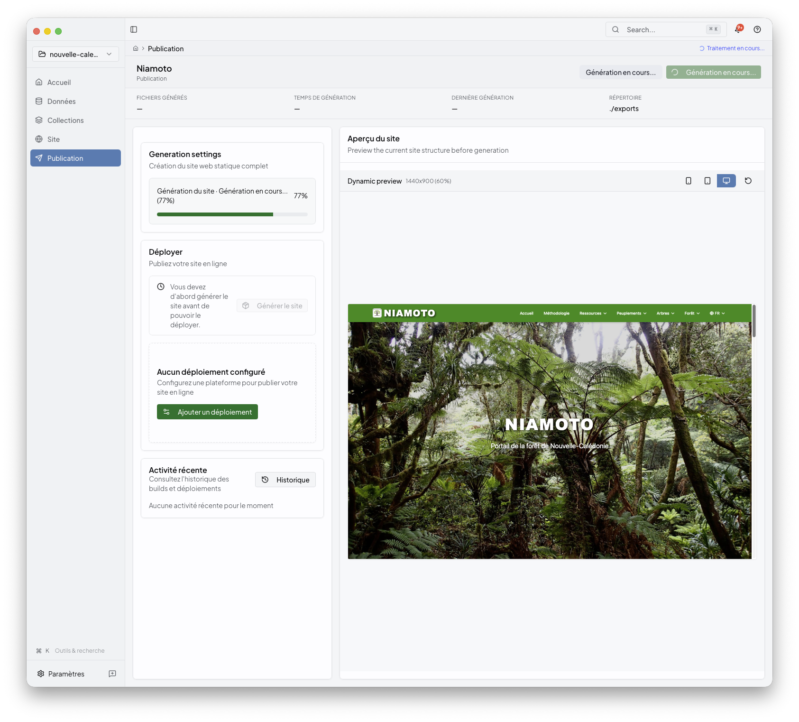
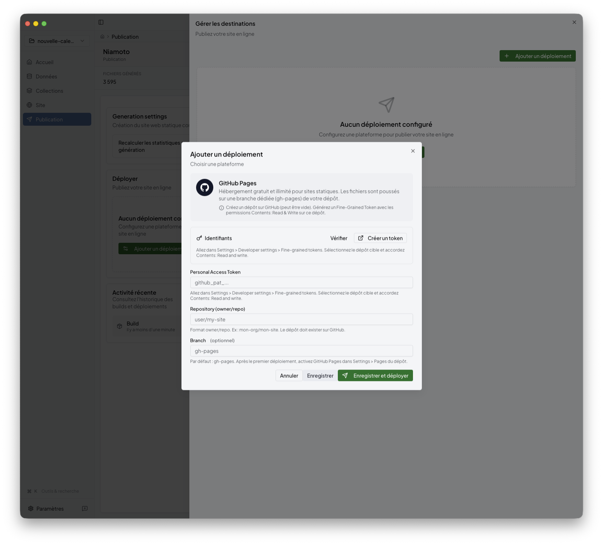
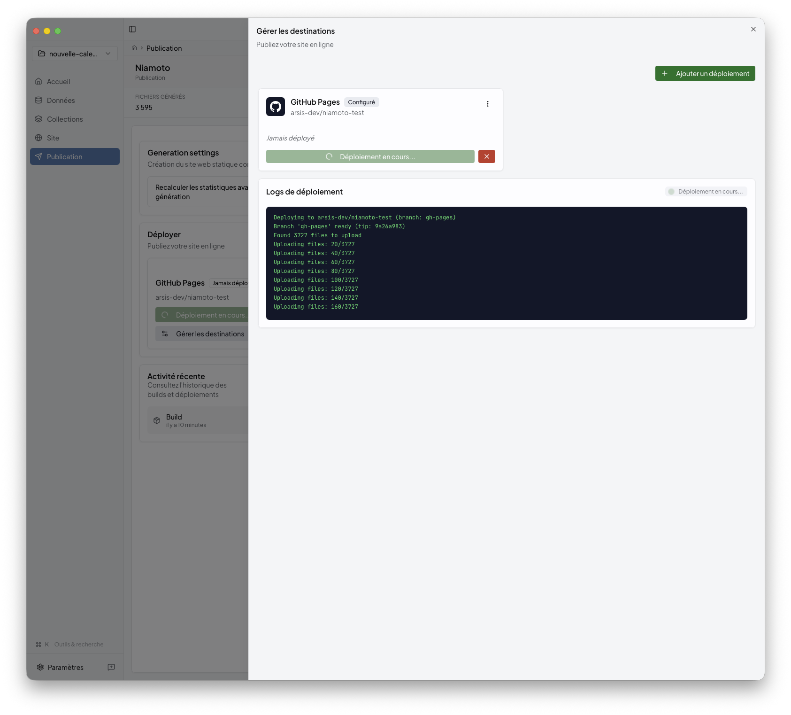

# Publish

Publish is the final desktop stage. Use it to build the generated site, inspect
the result, choose a deployment target, and follow the deployment status to the
end.

## What this stage is for

Publish is where you:

- generate the site from the current project state
- check the built preview
- pick a deployment target
- review logs and the final result

This stage comes after [site.md](site.md).

## 1. Build and inspect the generated site

Before deploying, generate the site and check the built preview inside the app.

This is the best checkpoint for deciding whether you should publish now or go
back to Site or Collections for another adjustment.

## 2. Choose a deployment target

When the generated preview looks right, select the destination that should
receive the site.

The current desktop product exposes these publish destinations:

- Cloudflare Workers
- GitHub Pages
- Netlify
- Vercel
- Render
- SSH / rsync

## 3. Fill in provider settings

Each destination has its own configuration surface. For example, GitHub Pages
asks for the repository-oriented settings needed to publish the built output.

## 4. Review logs and final status

Publish keeps the build and deployment lifecycle visible while the job runs.

When the deployment finishes, the success state confirms that the generated
portal was uploaded correctly.

## Behind the UI

If you work directly with project files, the build side of this stage is mostly
driven by `config/export.yml`. In the desktop app, deployment settings are
managed from the UI, and credentials are stored through the OS keyring. For CLI
automation, `config/deploy.yml` can still provide deployment defaults.

## Related

- [site.md](site.md)
- [preview.md](preview.md)
- [../03-cli-automation/README.md](../03-cli-automation/README.md)
- [../06-reference/api-export-guide.md](../06-reference/api-export-guide.md)
