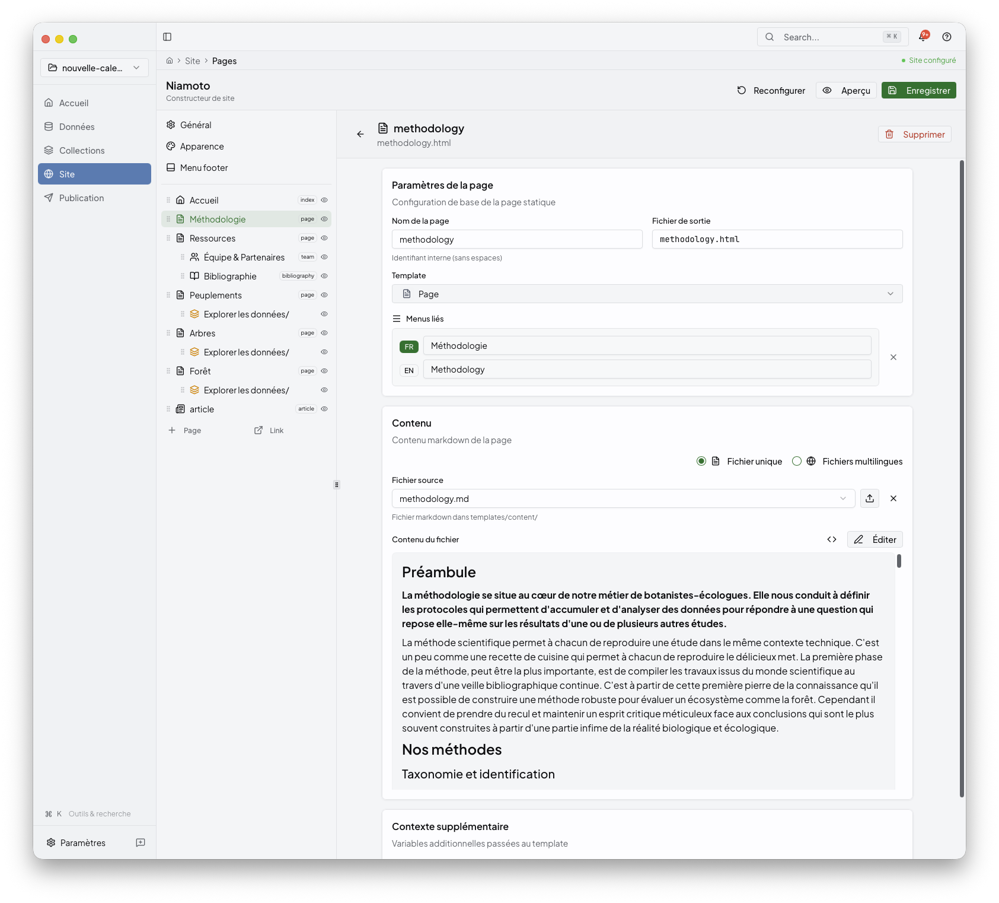

# Site Builder

The Site area turns imported and computed project content into the public portal
structure. This is where you shape pages, navigation, and presentation before
you move to Publish.

## What this stage is for

Use Site to:

- edit shared pages such as the homepage or methodology
- configure collection pages
- organise navigation and page order
- check the live page preview while you edit

If you are not there yet, start with [collections.md](collections.md).

## 1. Edit shared pages

Use the main Site Builder view to shape the pages that define the public portal.

This is the right place to work on:

- homepage structure
- introductory content
- page order and navigation
- the overall feel of the generated site

## 2. Build the supporting pages

The Site area is not limited to the front page. Use it to document methodology
or other static pages that give readers context.

Treat this stage as the editorial layer of the project: the part that turns raw
project outputs into a coherent site people can actually read.

## 3. Configure collection pages

Collections can also feed their own public-facing pages inside the site.

This is where the Collections stage and the Site stage meet:

- Collections defines the reusable outputs
- Site decides how they appear inside the portal

## Behind the UI

If you look at the project config directly, this stage mainly maps to the site
structure stored in `config/export.yml`. The desktop app keeps that complexity
behind the interface, but it helps to know that page and navigation edits are
driving the generated site definition.

## What comes next

Once the site structure looks right, move to [publish.md](publish.md) to build
the output, inspect the generated preview, and deploy it.

## Related

- [collections.md](collections.md)
- [preview.md](preview.md)
- [publish.md](publish.md)
- [../06-reference/configuration-guide.md](../06-reference/configuration-guide.md)
