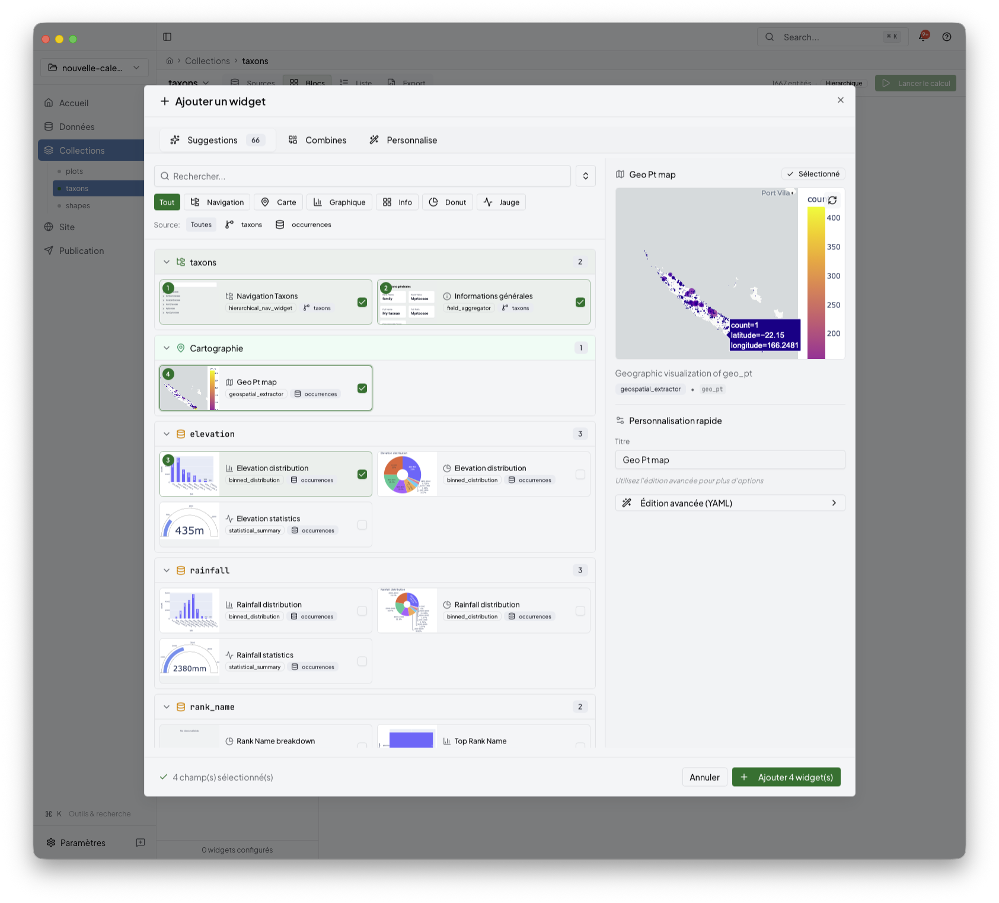

# Widget Catalogue and Collection Extras

This page is a supporting reference for the Collections area. Use it when the
main [collections.md](collections.md) page is not enough and you need to focus
on widget selection, list pages, or API-oriented outputs.

## Use this page for

- browsing available widgets for a collection
- comparing suggested widget types
- managing list or index-style outputs
- understanding where API or machine-readable outputs attach to a collection

## Widget selection

The widget picker helps you choose the right block for the current collection.

Expect the catalogue to group suggestions around the available data and to
surface parameter forms when a widget needs more detail.

## Collection extras beyond a single widget

Collections can also own outputs that are not just one visual block, for
example:

- index or list pages
- collection-specific API outputs
- reusable content structures that the Site stage can later place into pages

These features still belong to the same Collections stage even when the route
name in the app remains `/groups`.

## Related

- [collections.md](collections.md)
- [preview.md](preview.md)
- [site.md](site.md)
- [../06-reference/transform-plugins.md](../06-reference/transform-plugins.md)
- [../06-reference/widgets-and-transform-workflow.md](../06-reference/widgets-and-transform-workflow.md)
