# Auto-Configuration Generation Roadmap

## Executive Summary

This roadmap details the implementation of Niamoto's intelligent auto-configuration system that generates complete pipeline configurations (`import.yml`, `transform.yml`, `export.yml`) from raw data files using ML detection and Pydantic introspection.

**Golden Rule**: If you can explain it to a field ecologist in 2 minutes, it's the right solution.

## Vision: Drop Files → Working Pipeline

### Current Pain Points
1. Users must manually write 2500+ lines of YAML configuration
2. Complex field mappings require deep system knowledge
3. No guidance on which transformations make sense for their data
4. Trial and error approach to get a working pipeline

### Target Solution

```mermaid
graph LR
    Files[📁 Drop Files] --> ML[🤖 ML Detection]
    ML --> Import[import.yml]
    ML --> Transform[transform.yml]
    ML --> Export[export.yml]
    Transform --> Pipeline[✅ Working Pipeline]
```


**User Experience**: Drop files → Get working pipeline in 30 seconds → Refine if needed

## System Architecture

### High-Level Flow


### Core Components

```text
# System architecture
AutoConfigSystem:
    ├── MLColumnDetector       # ✅ Already implemented (85% done)
    │   └── extract_features() # 21 statistical features
    │   └── predict()          # Random Forest classification
    │
    ├── DataProfiler           # ✅ Already implemented (90% done)
    │   └── profile()          # Semantic type detection
    │   └── detect_dataset_type() # hierarchical/spatial/factual
    │
    ├── AutoDetector           # ✅ Already implemented (80% done)
    │   └── analyze_directory() # Orchestrates profiling
    │   └── generate_config()  # Creates import.yml
    │
    ├── TransformGenerator     # 🚧 To implement (Phase 2)
    │   └── introspect_plugins() # Pydantic schema analysis
    │   └── auto_generate_params() # Smart parameter generation
    │
    └── ExportGenerator        # 🚧 To implement (Phase 3)
        └── generate_widgets()  # 1 type = 1 widget rule
```

## Current State Analysis

### What's Already Implemented

#### 1. ML Column Detector (`ml_detector.py`) - 85% Complete
```text
# Current implementation
class MLColumnDetector:
    def extract_features(self, series: pd.Series) -> np.ndarray:
        """Extracts 21 statistical features without using column names"""
        # ✅ Numeric features: mean, std, skew, kurtosis, ranges
        # ✅ Text patterns: binomial nomenclature, family endings
        # ✅ Distribution analysis: histograms, unique ratios

    def predict(self, series: pd.Series) -> Tuple[str, float]:
        """Returns (column_type, confidence)"""
        # Types: diameter, height, species_name, latitude, etc.
```

**Status**: Model training script exists, needs more training data

#### 2. Data Profiler (`profiler.py`) - 90% Complete
```text
# Current implementation
class DataProfiler:
    def profile(self, file_path: Path) -> DatasetProfile:
        # ✅ Column profiling with semantic detection
        # ✅ Dataset type detection (hierarchical/spatial/factual)
        # ✅ Relationship detection
        # ✅ ML detector integration
```

**Status**: Working well, could benefit from more patterns

#### 3. Auto Detector (`auto_detector.py`) - 80% Complete
```text
# Current implementation
class AutoDetector:
    def analyze_directory(self, directory: Path) -> Dict:
        # ✅ File discovery
        # ✅ Profile generation
        # ✅ import.yml generation (old format)
        # ⚠️ Generates old format, needs update for new format
```

**Status**: Generates config but in old rigid format

### What's Missing

1. **Transform Generation**: No automatic `transform.yml` generation
2. **Export Generation**: No automatic `export.yml` generation
3. **Plugin Introspection**: Not leveraging Pydantic schemas
4. **GUI Integration**: No visual configuration interface
5. **New Import Format**: Still using rigid taxonomy/plots/occurrences

## Implementation Phases

### Phase 1: Complete ML Detection & New Import Format (Week 1-2)

#### 1.1 Enhance ML Training Data
```text
# scripts/enhance_ml_training.py
def generate_enhanced_training_data():
    """Generate more diverse training examples"""

    # Add more ecological patterns
    training_data = []

    # Biomass data (log-normal, range 0.1-5000 kg)
    biomass = np.random.lognormal(mean=4, sigma=1.5, size=300)
    training_data.append((pd.Series(biomass), 'biomass'))

    # Rainfall data (normal, range 500-3000 mm)
    rainfall = np.random.normal(1500, 400, size=300)
    training_data.append((pd.Series(rainfall), 'rainfall'))

    # Soil pH (normal, range 3.5-8.5)
    ph = np.random.normal(6.5, 1, size=300)
    ph = np.clip(ph, 3.5, 8.5)
    training_data.append((pd.Series(ph), 'soil_ph'))

    return training_data
```

#### 1.2 Update Auto Detector for New Format
```text
# core/imports/auto_detector.py
class AutoDetector:
    def _generate_config(self, profiles: List[DatasetProfile]) -> Dict:
        """Generate new generic format"""
        config = {
            'references': {},  # No more fixed taxonomy/plots
            'data': {}
        }

        for profile in profiles:
            if self._is_reference(profile):
                # Generic reference entity
                config['references'][profile.suggested_name] = {
                    'source': str(profile.file_path),
                    'type': profile.detected_type,
                    'id_field': self._detect_id_field(profile),
                    **self._extract_specific_fields(profile)
                }
            else:
                # Factual data with links
                config['data'][profile.suggested_name] = {
                    'source': str(profile.file_path),
                    'links': self._detect_links(profile, config['references'])
                }

        return config
```

### Phase 2: Transform Generation with Introspection (Week 3-4)

#### 2.1 Plugin Introspector
```text
# core/transforms/introspector.py
from pydantic import BaseModel
from typing import Dict, Any, List, Type

class PluginIntrospector:
    """Introspects Pydantic schemas to understand plugin requirements"""

    def __init__(self, plugin_registry: Dict[str, Type[BaseModel]]):
        self.registry = plugin_registry

    def get_compatible_plugins(self, column_type: str) -> List[str]:
        """Find plugins that can process this column type"""

        TYPE_TO_PLUGINS = {
            'diameter': ['binned_distribution', 'basic_stats', 'percentiles'],
            'height': ['binned_distribution', 'basic_stats', 'percentiles'],
            'species_name': ['top_ranking', 'diversity_indices'],
            'latitude': ['spatial_clustering', 'heatmap'],
            'longitude': ['spatial_clustering', 'heatmap'],
            'count': ['sum_aggregation', 'basic_stats'],
            'date': ['temporal_distribution', 'seasonality'],
            'measurement': ['binned_distribution', 'basic_stats']
        }

        return TYPE_TO_PLUGINS.get(column_type, ['basic_stats'])

    def generate_params(self, plugin_name: str, column_name: str,
                       column_data: pd.Series) -> Dict[str, Any]:
        """Generate parameters by introspecting schema and analyzing data"""

        plugin_class = self.registry[plugin_name]
        schema = plugin_class.schema()

        params = {'source_column': column_name}

        for field, field_info in schema['properties'].items():
            if field == 'bins' and 'bins' in field_info:
                # Auto-calculate bins using Sturges' rule
                params['bins'] = self._calculate_bins(column_data)

            elif field == 'top_n':
                # Reasonable default
                params['top_n'] = min(10, column_data.nunique())

            elif 'default' in field_info:
                # Use schema default
                params[field] = field_info['default']

        return params

    def _calculate_bins(self, data: pd.Series) -> List[float]:
        """Calculate optimal bins using Sturges' rule"""
        clean_data = data.dropna()
        n_bins = int(np.ceil(np.log2(len(clean_data)) + 1))

        # Use quantiles for better distribution
        bins = np.quantile(clean_data, np.linspace(0, 1, n_bins + 1))

        # Round for readability
        if bins.max() > 100:
            bins = np.round(bins, -1)  # Round to nearest 10
        elif bins.max() > 10:
            bins = np.round(bins, 0)   # Round to nearest 1
        else:
            bins = np.round(bins, 1)   # Round to 1 decimal

        return np.unique(bins).tolist()
```

#### 2.2 Transform Config Generator
```text
# core/transforms/generator.py
class TransformConfigGenerator:
    """Generates transform.yml from detected column types"""

    def __init__(self):
        self.introspector = PluginIntrospector(plugin_registry)

    def generate(self, detected_columns: Dict[str, str],
                 data: pd.DataFrame) -> List[Dict]:
        """Generate complete transform configuration"""

        transforms = []

        for col_name, col_type in detected_columns.items():
            if col_type == 'other':
                continue  # Skip unknown types

            # Get compatible plugins
            plugins = self.introspector.get_compatible_plugins(col_type)

            for plugin_name in plugins:
                # Generate parameters
                params = self.introspector.generate_params(
                    plugin_name, col_name, data[col_name]
                )

                # Create transform entry
                transforms.append({
                    'name': f'{col_name}_{plugin_name}',
                    'plugin': plugin_name,
                    'params': params
                })

        return transforms
```

### Phase 3: Export Generation (Week 5)

#### 3.1 Simple Widget Generator
```text
# core/exports/generator.py
class ExportConfigGenerator:
    """Generates export.yml with 1 type = 1 widget rule"""

    # Simple color palette
    COLORS = ['#4A90E2', '#50C878', '#F5A623', '#BD10E0',
              '#9013FE', '#50E3C2', '#B8E986', '#F8E71C']

    def __init__(self):
        self.color_index = 0

    def generate(self, transform_outputs: List[str],
                 detected_types: Dict[str, str]) -> Dict:
        """Generate export configuration"""

        widgets = []

        for transform_name in transform_outputs:
            # Parse transform name (e.g., "dbh_distribution")
            parts = transform_name.split('_')
            if len(parts) < 2:
                continue

            col_name = parts[0]
            transform_type = '_'.join(parts[1:])

            # Generate appropriate widget
            widget = self._create_widget(
                col_name, transform_type,
                detected_types.get(col_name)
            )

            if widget:
                widgets.append(widget)

        return {
            'widgets': widgets,
            'layout': 'auto',  # Let system auto-layout
            'theme': 'default'
        }

    def _create_widget(self, col_name: str, transform_type: str,
                      col_type: str) -> Dict:
        """Create widget based on transform output"""

        widget = {
            'id': f'widget_{col_name}_{transform_type}',
            'data_source': f'{col_name}_{transform_type}'
        }

        # Match transform type to widget
        if 'distribution' in transform_type:
            widget['plugin'] = 'bar_plot'
            widget['params'] = {
                'title': f'{col_name.replace("_", " ").title()} Distribution',
                'color': self._next_color(),
                'orientation': 'vertical'
            }

        elif 'ranking' in transform_type or 'top' in transform_type:
            widget['plugin'] = 'bar_plot'
            widget['params'] = {
                'title': f'Top {col_name.replace("_", " ").title()}',
                'color': self._next_color(),
                'orientation': 'horizontal'
            }

        elif 'stats' in transform_type or 'summary' in transform_type:
            widget['plugin'] = 'stat_card'
            widget['params'] = {
                'title': f'{col_name.replace("_", " ").title()} Statistics'
            }

        elif 'diversity' in transform_type:
            widget['plugin'] = 'gauge'
            widget['params'] = {
                'title': 'Diversity Indices',
                'color': self._next_color()
            }

        else:
            # Default to simple display
            widget['plugin'] = 'data_table'
            widget['params'] = {
                'title': f'{col_name.replace("_", " ").title()}'
            }

        return widget

    def _next_color(self) -> str:
        """Get next color from palette"""
        color = self.COLORS[self.color_index % len(self.COLORS)]
        self.color_index += 1
        return color
```

### Phase 4: Complete Integration (Week 6-7)

#### 4.1 Orchestrator
```text
# core/bootstrap/orchestrator.py
class NiamotoBootstrap:
    """Complete auto-configuration orchestrator"""

    def __init__(self, instance_path: Path):
        self.instance_path = instance_path
        self.ml_detector = MLColumnDetector()
        self.auto_detector = AutoDetector()
        self.transform_gen = TransformConfigGenerator()
        self.export_gen = ExportConfigGenerator()

    def bootstrap(self, data_dir: Path) -> Dict[str, Any]:
        """Generate complete pipeline configuration"""

        print("🔍 Analyzing files...")

        # Step 1: Detect column types
        analysis = self.auto_detector.analyze_directory(data_dir)
        detected_columns = {}

        for profile in analysis['profiles']:
            for col in profile['columns']:
                if col['semantic_type']:
                    # ML detection for better accuracy
                    ml_type, confidence = self.ml_detector.predict(
                        pd.read_csv(profile['file_path'])[col['name']]
                    )
                    if confidence > 0.7:
                        detected_columns[col['name']] = ml_type

        print(f"✓ Detected {len(detected_columns)} typed columns")

        # Step 2: Generate import.yml
        import_config = analysis['config']
        self._save_config(import_config, 'import.yml')
        print("✓ Generated import.yml")

        # Step 3: Generate transform.yml
        # Load a sample for parameter calculation
        sample_data = pd.read_csv(list(data_dir.glob('*.csv'))[0])
        transform_config = self.transform_gen.generate(
            detected_columns, sample_data
        )
        self._save_config(transform_config, 'transform.yml')
        print(f"✓ Generated transform.yml with {len(transform_config)} transforms")

        # Step 4: Generate export.yml
        transform_outputs = [t['name'] for t in transform_config]
        export_config = self.export_gen.generate(
            transform_outputs, detected_columns
        )
        self._save_config(export_config, 'export.yml')
        print(f"✓ Generated export.yml with {len(export_config['widgets'])} widgets")

        # Step 5: Summary
        return {
            'status': 'success',
            'detected_columns': len(detected_columns),
            'transforms': len(transform_config),
            'widgets': len(export_config['widgets']),
            'confidence': analysis['confidence']
        }

    def _save_config(self, config: Dict, filename: str):
        """Save configuration to YAML"""
        output_path = self.instance_path / 'config' / filename
        output_path.parent.mkdir(exist_ok=True)

        with open(output_path, 'w') as f:
            yaml.dump(config, f, default_flow_style=False)
```

#### 4.2 CLI Integration
```text
# cli/commands/bootstrap.py
@click.command()
@click.option('--data-dir', type=click.Path(exists=True), required=True)
@click.option('--auto', is_flag=True, help='Skip confirmation prompts')
def bootstrap(data_dir, auto):
    """Bootstrap complete pipeline from data files"""

    bootstrap = NiamotoBootstrap(Path.cwd())

    # Analyze
    result = bootstrap.analyze(Path(data_dir))

    if not auto:
        # Show preview
        click.echo("\n📊 Detection Results:")
        click.echo(f"Files: {result['file_count']}")
        click.echo(f"Columns detected: {result['detected_columns']}")
        click.echo(f"Confidence: {result['confidence']:.1%}")

        if not click.confirm("\nGenerate configuration?"):
            return

    # Generate
    result = bootstrap.bootstrap(Path(data_dir))

    click.echo("\n✅ Configuration generated successfully!")
    click.echo("Run 'niamoto import' to import your data")
```

## GUI Integration

### React Components

```text
// components/bootstrap/AutoConfigWizard.tsx
interface AutoConfigState {
    stage: 'upload' | 'analyzing' | 'review' | 'generating' | 'complete';
    files: File[];
    detection?: DetectionResult;
    configs?: GeneratedConfigs;
}

export const AutoConfigWizard: React.FC = () => {
    const [state, setState] = useState<AutoConfigState>({
        stage: 'upload',
        files: []
    });

    const handleFileDrop = async (files: File[]) => {
        setState({...state, files, stage: 'analyzing'});

        // Upload and analyze
        const formData = new FormData();
        files.forEach(f => formData.append('files', f));

        const response = await fetch('/api/bootstrap/analyze', {
            method: 'POST',
            body: formData
        });

        const detection = await response.json();
        setState({...state, stage: 'review', detection});
    };

    const handleGenerate = async () => {
        setState({...state, stage: 'generating'});

        const response = await fetch('/api/bootstrap/generate', {
            method: 'POST',
            headers: {'Content-Type': 'application/json'},
            body: JSON.stringify({detection: state.detection})
        });

        const configs = await response.json();
        setState({...state, stage: 'complete', configs});
    };

    return (
        <Card className="p-6">
            {state.stage === 'upload' && (
                <FileDropZone onDrop={handleFileDrop}>
                    Drop your CSV, Excel, or GeoJSON files here
                </FileDropZone>
            )}

            {state.stage === 'review' && (
                <DetectionReview
                    detection={state.detection}
                    onConfirm={handleGenerate}
                    onEdit={(d) => setState({...state, detection: d})}
                />
            )}

            {state.stage === 'complete' && (
                <SuccessScreen configs={state.configs}>
                    <Button onClick={() => window.location.href = '/pipeline'}>
                        View Pipeline
                    </Button>
                </SuccessScreen>
            )}
        </Card>
    );
};
```

## Complete Example: End-to-End

### Input Files
```
data/
├── observations.csv (10,000 rows)
│   ├── species_name: "Araucaria columnaris", "Agathis lanceolata"...
│   ├── dbh: 12.3, 45.6, 23.4...
│   ├── height: 15.2, 22.1, 18.9...
│   └── plot_id: "P001", "P002"...
└── plots.csv (50 rows)
    ├── plot_id: "P001", "P002"...
    ├── latitude: -22.1234...
    └── longitude: 166.4321...
```

### ML Detection Results
```text
detected = {
    'species_name': ('species_name', 0.95),
    'dbh': ('diameter', 0.92),
    'height': ('height', 0.89),
    'plot_id': ('identifier', 0.78),
    'latitude': ('latitude', 0.99),
    'longitude': ('longitude', 0.99)
}
```

### Generated import.yml
```yaml
references:
  plots:
    source: data/plots.csv
    type: spatial
    id_field: plot_id
    geometry:
      latitude: latitude
      longitude: longitude

data:
  observations:
    source: data/observations.csv
    links:
      - reference: plots
        field: plot_id
```

### Generated transform.yml
```yaml
- name: dbh_distribution
  plugin: binned_distribution
  params:
    source_column: dbh
    bins: [10, 20, 30, 40, 60, 100, 200]  # Auto-calculated

- name: height_stats
  plugin: basic_stats
  params:
    source_column: height

- name: species_ranking
  plugin: top_ranking
  params:
    source_column: species_name
    top_n: 10
```

### Generated export.yml
```yaml
widgets:
  - id: widget_dbh_distribution
    plugin: bar_plot
    data_source: dbh_distribution
    params:
      title: DBH Distribution
      color: "#4A90E2"

  - id: widget_species_ranking
    plugin: bar_plot
    data_source: species_ranking
    params:
      title: Top Species
      color: "#50C878"
      orientation: horizontal

  - id: widget_height_stats
    plugin: stat_card
    data_source: height_stats
    params:
      title: Height Statistics
```

### Result
User gets a working pipeline with:
- ✅ Data imported correctly with relationships
- ✅ Meaningful transformations applied
- ✅ Relevant visualizations displayed
- ⏱️ Total time: 30 seconds

## Testing Strategy

### Unit Tests
```text
# tests/test_ml_detector.py
def test_detect_diameter():
    """Test diameter detection from values alone"""
    # Log-normal distribution typical of DBH
    data = np.random.lognormal(3, 0.8, 500)
    data = np.clip(data, 5, 200)

    detector = MLColumnDetector()
    col_type, confidence = detector.predict(pd.Series(data))

    assert col_type == 'diameter'
    assert confidence > 0.8

# tests/test_introspector.py
def test_auto_bins():
    """Test automatic bin calculation"""
    data = pd.Series(np.random.normal(50, 20, 1000))

    introspector = PluginIntrospector({})
    bins = introspector._calculate_bins(data)

    # Should use Sturges' rule
    expected_n_bins = int(np.ceil(np.log2(1000) + 1))  # ~11
    assert len(bins) <= expected_n_bins + 1
```

### Integration Tests
```text
# tests/test_bootstrap.py
def test_complete_bootstrap():
    """Test end-to-end bootstrap"""

    with tempfile.TemporaryDirectory() as tmpdir:
        # Create test data
        create_test_dataset(tmpdir)

        # Run bootstrap
        bootstrap = NiamotoBootstrap(Path(tmpdir))
        result = bootstrap.bootstrap(Path(tmpdir) / 'data')

        # Check results
        assert result['status'] == 'success'
        assert (Path(tmpdir) / 'config' / 'import.yml').exists()
        assert (Path(tmpdir) / 'config' / 'transform.yml').exists()
        assert (Path(tmpdir) / 'config' / 'export.yml').exists()

        # Verify pipeline runs
        runner = CliRunner()
        result = runner.invoke(import_cmd, ['--config', tmpdir])
        assert result.exit_code == 0
```

## Performance Targets

- **Detection accuracy**: >85% correct column type detection
- **Bootstrap time**: <30 seconds for typical datasets (10k rows)
- **Configuration size**: 80% smaller than manual configs
- **Pipeline success rate**: >95% configs work without modification

## Migration Path

### From Existing Instances
```text
# scripts/migrate_config.py
def migrate_to_generic_format(old_config: Dict) -> Dict:
    """Convert old rigid format to new generic format"""

    new_config = {'references': {}, 'data': {}}

    # Map old taxonomy → generic reference
    if 'taxonomy' in old_config:
        new_config['references']['species'] = {
            'source': old_config['taxonomy']['path'],
            'type': 'hierarchical',
            'hierarchy': old_config['taxonomy']['hierarchy']['levels']
        }

    # Map old plots → generic reference
    if 'plots' in old_config:
        new_config['references']['locations'] = {
            'source': old_config['plots']['path'],
            'type': 'spatial'
        }

    return new_config
```

## Future Enhancements (Optional)

### V2 Features (After V1 Success)

1. **Community Presets** (Low Priority)
   - User-contributed domain templates
   - Shareable configuration sets
   - Only if users explicitly request

2. **Advanced ML Training**
   - Learn from user corrections
   - Domain-specific models
   - Multi-language support

3. **Smart Suggestions**
   - Recommend additional analyses
   - Suggest data quality improvements
   - Propose enrichment options

### What We DON'T Build (Over-Engineering to Avoid)

❌ Complex preset systems with 10 choices
❌ Abstract DAG architectures
❌ Machine learning for business logic
❌ Complicated template inheritance
❌ Plugin marketplace in V1

## Success Metrics

### Week 1 Checkpoint
- [ ] ML detector trained with 90% accuracy
- [ ] New import format working
- [ ] 100% test coverage on profiler

### Week 3 Checkpoint
- [ ] Transform generation working
- [ ] Introspection implemented
- [ ] Auto-bins calculating correctly

### Week 5 Checkpoint
- [ ] Export generation complete
- [ ] Full pipeline bootstraps successfully
- [ ] <30 second generation time

### Week 7 (Launch)
- [ ] GUI wizard complete
- [ ] Documentation written
- [ ] 5 real datasets tested

## Implementation Priority

1. **MUST HAVE** (Week 1-4)
   - Complete ML training
   - Transform generation via introspection
   - Basic export generation
   - CLI bootstrap command

2. **SHOULD HAVE** (Week 5-6)
   - GUI wizard
   - Better error messages
   - Config preview/edit

3. **NICE TO HAVE** (Week 7+)
   - Learning from corrections
   - Config templates (maybe)
   - Multi-language detection

## Key Decisions

1. **Introspection over Templates**: Use Pydantic schemas, not rigid templates
2. **Simple Widgets**: 1 type = 1 widget, no complex choices
3. **Auto-bins**: Calculate from data with Sturges/quartiles
4. **Default Colors**: Simple palette, no color science
5. **No Presets in V1**: Just detect and generate

## Summary

This roadmap delivers a **working auto-configuration system in 7 weeks** that:
- Detects column types with ML (no column names needed)
- Generates configs via Pydantic introspection (no templates)
- Creates simple, predictable visualizations
- Follows the golden rule: explicable in 2 minutes

The system is **simple, predictable, and actually helpful** - not a complex framework that requires a PhD to understand.
