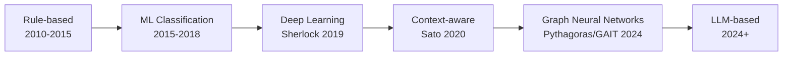

# Semantic Type Detection for Ecological Data: State of the Art & Implementation Strategy

## Executive Summary

This document analyzes state-of-the-art semantic type detection systems, evaluates their applicability to Niamoto's ecological data pipeline, and proposes a comprehensive strategy for collecting training data and implementing an advanced detection system.

## Table of Contents
1. [Current Landscape](#current-landscape)
2. [Detailed Project Analysis](#detailed-project-analysis)
3. [Implementation Strategy for Niamoto](#implementation-strategy-for-niamoto)
4. [Ecological Data Collection Strategy](#ecological-data-collection-strategy)
5. [Recommended Approach](#recommended-approach)

## Current Landscape

### Evolution of Semantic Type Detection



### Comparison Matrix

| Project | Year | Approach | Features | Performance | Ecological Relevance | Maintenance |
|---------|------|----------|----------|-------------|---------------------|-------------|
| **Sherlock** | 2019 | Deep NN | 1,588 | F1: 0.89 | Low (generic types) | ❌ Abandoned |
| **Sato** | 2020 | Hybrid DL + Topic | 1,588+ | F1: 0.92 | Low | ⚠️ Inactive |
| **Pythagoras** | 2024 | GNN | Graph-based | F1: 0.94 | Medium (numeric) | ✅ Active |
| **GAIT** | 2024 | GNN variants | Multi-graph | F1: 0.93 | Medium | ✅ Active |
| **GitTables** | 2023 | Dataset | N/A | Benchmark | High (diverse) | ✅ Active |
| **Niamoto Current** | 2024 | Random Forest | 21 | F1: ~0.85 | Very High | ✅ Active |

## Detailed Project Analysis

### 1. Sherlock (MIT, 2019)
**Repository**: https://github.com/mitmedialab/sherlock-project
**Paper**: https://arxiv.org/abs/1905.10688

#### Architecture
```python
# Sherlock Feature Extraction Pipeline
Features (1,588 total):
├── Character-level (960)
│   ├── Character distributions (per ASCII char)
│   ├── Statistical aggregations (mean, var, min, max, etc.)
│   └── Special patterns (emails, URLs, etc.)
├── Word embeddings (200)
│   └── Averaged Word2Vec vectors
├── Paragraph vectors (400)
│   └── Doc2Vec full column embedding
└── Global statistics (28)
    ├── Entropy, uniqueness ratio
    └── Numeric statistics if applicable
```

#### Key Innovations
- First to use deep learning for semantic type detection
- Column-value-only approach (ignores column names)
- Large-scale training on VizNet corpus (686,765 columns)

#### Limitations for Ecological Data
- No botanical/ecological types (dbh, biomass, taxonomy)
- Requires massive computational resources
- Black box neural network
- Dependencies severely outdated

### 2. Sato (Megagon Labs, 2020)
**Repository**: https://github.com/megagonlabs/sato
**Demo**: http://18.191.96.23:5000/

#### Architecture Enhancement
```python
Sato = Sherlock + Context
├── Single-column prediction (Sherlock base)
├── Topic modeling (table context)
└── Structured prediction (CRF layer)
```

#### Key Improvements
- Considers table context, not just column values
- Topic-aware subnetworks
- Better handling of ambiguous types

#### Applicability to Niamoto
- Context awareness useful for distinguishing similar ecological measurements
- Could differentiate "height" (tree) vs "height" (elevation)
- Topic modeling could identify "forest inventory" vs "species checklist" tables

### 3. Pythagoras (DHBW, 2024)
**Repository**: https://github.com/DHBWMosbachWI/pythagoras
**Paper**: https://openproceedings.org/2024/conf/edbt/paper-196.pdf

#### Revolutionary Graph Approach
```python
# Pythagoras Graph Structure
Node Types:
- Column nodes (what we're classifying)
- Value nodes (sample values from column)
- Table nodes (table metadata)

Edge Types:
- column→value (contains relationship)
- column→table (belongs to)
- column→column (same table)

# GNN Message Passing
1. Values aggregate info to columns
2. Columns exchange context
3. Table provides global context
```

#### Why It's Powerful for Ecological Data
- **Numerical excellence**: Specifically designed for numeric columns
- **Relationship awareness**: Can learn that DBH and Height often appear together
- **Pattern propagation**: If one column is "species", nearby text column likely "genus"

### 4. GAIT (2024)
**Repository**: https://github.com/hoseinzadeehsan/GAIT

#### Multiple GNN Architectures
```python
GAIT Variants:
├── GAT (Graph Attention Networks)
│   └── Learns which relationships matter
├── GCN (Graph Convolutional Networks)
│   └── Simple neighborhood aggregation
└── GGNN (Gated Graph Neural Networks)
    └── Sequential message passing
```

#### Ecological Applications
- Attention mechanism could learn that "plot_id" relates strongly to spatial columns
- Gated approach handles varying table structures

### 5. GitTables (2023)
**Website**: https://gittables.github.io/

#### Dataset Characteristics
- 1,101 annotated tables
- 2,000+ semantic types from Schema.org and DBpedia
- Includes biological/scientific tables

#### Value for Niamoto
- Training data source
- Benchmark for evaluation
- Schema.org types overlap with ecological needs

## Implementation Strategy for Niamoto

### Phase 1: Enhanced Feature Extraction (Week 1)

```python
# src/niamoto/core/imports/advanced_features.py

import numpy as np
import pandas as pd
from scipy import stats
from sklearn.feature_extraction.text import TfidfVectorizer
import re

class AdvancedFeatureExtractor:
    """
    Combines best ideas from Sherlock/Sato/Pythagoras
    adapted for ecological data
    """

    def __init__(self):
        self.feature_groups = {
            'statistical': 50,
            'character': 100,
            'pattern': 50,
            'ecological': 100,
            'contextual': 50
        }
        self.total_features = sum(self.feature_groups.values())

    def extract_all_features(self,
                            column: pd.Series,
                            table_context: pd.DataFrame = None,
                            column_name: str = None) -> np.ndarray:
        """
        Extract comprehensive feature vector
        """
        features = []

        # 1. Statistical Features (Sherlock-inspired)
        features.extend(self._extract_statistical_features(column))

        # 2. Character-level Features (Sherlock-inspired)
        features.extend(self._extract_character_features(column))

        # 3. Pattern Features (Domain-specific)
        features.extend(self._extract_pattern_features(column))

        # 4. Ecological Features (Our innovation)
        features.extend(self._extract_ecological_features(column))

        # 5. Contextual Features (Sato/Pythagoras-inspired)
        if table_context is not None:
            features.extend(self._extract_contextual_features(column, table_context))
        else:
            features.extend([0] * self.feature_groups['contextual'])

        return np.array(features)

    def _extract_statistical_features(self, column: pd.Series) -> list:
        """Statistical features for any column type"""
        features = []

        # Basic stats
        features.append(len(column))
        features.append(column.nunique() / len(column))  # Uniqueness ratio
        features.append(column.isnull().mean())  # Null ratio

        if pd.api.types.is_numeric_dtype(column):
            clean = column.dropna()
            if len(clean) > 0:
                # Distribution characteristics
                features.extend([
                    clean.mean(),
                    clean.std(),
                    clean.min(),
                    clean.max(),
                    clean.skew(),
                    clean.kurtosis(),
                    np.log10(clean.max() - clean.min() + 1),  # Log range
                ])

                # Percentiles
                for p in [0.1, 0.25, 0.5, 0.75, 0.9]:
                    features.append(clean.quantile(p))

                # Distribution tests
                features.append(self._test_normality(clean))
                features.append(self._test_log_normality(clean))
                features.append(self._test_uniformity(clean))
            else:
                features.extend([0] * 18)
        else:
            # Text statistics
            text = column.astype(str)
            features.extend([
                text.str.len().mean(),
                text.str.len().std(),
                text.str.len().min(),
                text.str.len().max(),
                text.str.split().str.len().mean(),  # Word count
            ])
            features.extend([0] * 13)  # Padding

        # Pad to 50 features
        features.extend([0] * (50 - len(features)))
        return features[:50]

    def _extract_character_features(self, column: pd.Series) -> list:
        """Character distribution features"""
        features = []

        # Convert to text
        text = ' '.join(column.astype(str).values)
        total_chars = len(text) if text else 1

        # Character categories
        char_groups = {
            'letters': r'[a-zA-Z]',
            'digits': r'[0-9]',
            'spaces': r'\s',
            'punctuation': r'[.,;:!?]',
            'special': r'[^a-zA-Z0-9\s.,;:!?]',
            'uppercase': r'[A-Z]',
            'lowercase': r'[a-z]',
            'parentheses': r'[()]',
            'brackets': r'[\[\]]',
            'math': r'[+\-*/=]',
        }

        for name, pattern in char_groups.items():
            count = len(re.findall(pattern, text))
            features.append(count / total_chars)

        # Specific ecological characters
        ecological_chars = ['.', '-', '_', '/', '(', ')', ' ']
        for char in ecological_chars:
            features.append(text.count(char) / total_chars)

        # N-gram features
        for n in [2, 3]:
            ngrams = [text[i:i+n] for i in range(len(text)-n+1)]
            features.append(len(set(ngrams)) / (len(ngrams) + 1))

        # Pad to 100 features
        features.extend([0] * (100 - len(features)))
        return features[:100]

    def _extract_pattern_features(self, column: pd.Series) -> list:
        """Pattern-based features for semantic detection"""
        features = []
        text = column.astype(str)

        # Regex patterns
        patterns = {
            'binomial': r'^[A-Z][a-z]+ [a-z]+$',  # Species names
            'trinomial': r'^[A-Z][a-z]+ [a-z]+ [a-z]+$',  # Subspecies
            'author': r'\([A-Z][a-z]+\.?\)',  # Taxonomic author
            'year': r'\b(19|20)\d{2}\b',  # Years
            'date_iso': r'\d{4}-\d{2}-\d{2}',  # ISO dates
            'coordinates': r'^-?\d+\.\d+$',  # Decimal coordinates
            'plot_code': r'^[A-Z]{1,3}\d{1,4}$',  # Plot codes
            'uuid': r'[0-9a-f]{8}-[0-9a-f]{4}-[0-9a-f]{4}',  # UUIDs
            'email': r'[a-zA-Z0-9._%+-]+@[a-zA-Z0-9.-]+\.[a-zA-Z]{2,}',
            'url': r'https?://[^\s]+',
        }

        for name, pattern in patterns.items():
            try:
                matches = text.str.contains(pattern, regex=True, na=False)
                features.append(matches.mean())
            except:
                features.append(0)

        # Taxonomic suffixes
        taxonomic_suffixes = [
            'aceae', 'idae', 'inae', 'ales', 'oidea',  # Family/order
            'phyta', 'mycota',  # Division
            'opsida', 'idae',  # Class
        ]

        for suffix in taxonomic_suffixes:
            features.append(text.str.endswith(suffix, na=False).mean())

        # Pad to 50 features
        features.extend([0] * (50 - len(features)))
        return features[:50]

    def _extract_ecological_features(self, column: pd.Series) -> list:
        """Ecological domain-specific features"""
        features = []

        # Check if numeric
        if pd.api.types.is_numeric_dtype(column):
            clean = column.dropna()
            if len(clean) > 0:
                # Range checks for common ecological measurements
                mean_val = clean.mean()
                min_val = clean.min()
                max_val = clean.max()

                # DBH (typically 1-200 cm)
                features.append(float(1 <= mean_val <= 200 and min_val > 0))

                # Height (typically 0.5-60 m)
                features.append(float(0.5 <= mean_val <= 60 and min_val >= 0))

                # Latitude (-90 to 90)
                features.append(float(-90 <= min_val and max_val <= 90))

                # Longitude (-180 to 180)
                features.append(float(-180 <= min_val and max_val <= 180))

                # Elevation (-500 to 9000 m)
                features.append(float(-500 <= min_val and max_val <= 9000))

                # pH (0-14, typically 3-9 in nature)
                features.append(float(0 <= min_val and max_val <= 14))

                # Percentage (0-100)
                features.append(float(0 <= min_val and max_val <= 100))

                # Temperature (-50 to 50°C)
                features.append(float(-50 <= min_val and max_val <= 50))

                # Rainfall (0-5000 mm/year)
                features.append(float(0 <= min_val and max_val <= 5000))

                # Biomass (typically log-normal, 0.01-10000 kg)
                features.append(float(0.01 <= mean_val <= 10000 and min_val > 0))

                # Test for ecological distributions
                features.append(self._is_count_data(clean))
                features.append(self._is_measurement_data(clean))
                features.append(self._is_percentage_data(clean))
            else:
                features.extend([0] * 13)
        else:
            features.extend([0] * 13)

        # Text-based ecological features
        text = column.astype(str)

        # Life form categories
        life_forms = ['tree', 'shrub', 'herb', 'grass', 'fern', 'palm', 'liana']
        for form in life_forms:
            features.append(text.str.contains(form, case=False, na=False).mean())

        # Conservation status
        iucn_categories = ['CR', 'EN', 'VU', 'NT', 'LC', 'DD', 'EW', 'EX']
        for cat in iucn_categories:
            features.append((text == cat).mean())

        # Common ecological abbreviations
        eco_abbr = ['DBH', 'DHP', 'BA', 'LAI', 'NPP', 'GPP', 'pH', 'N', 'P', 'K']
        for abbr in eco_abbr:
            features.append(text.str.contains(abbr, case=False, na=False).mean())

        # Pad to 100 features
        features.extend([0] * (100 - len(features)))
        return features[:100]

    def _extract_contextual_features(self, column: pd.Series,
                                    table: pd.DataFrame) -> list:
        """Context features from table structure (Sato/Pythagoras-inspired)"""
        features = []

        # Column position
        col_idx = table.columns.get_loc(column.name) if column.name in table.columns else 0
        features.append(col_idx / len(table.columns))  # Relative position
        features.append(float(col_idx == 0))  # Is first column
        features.append(float(col_idx == len(table.columns) - 1))  # Is last

        # Neighbor column analysis
        if col_idx > 0:
            prev_col = table.iloc[:, col_idx - 1]
            features.append(float(pd.api.types.is_numeric_dtype(prev_col)))
            features.append(prev_col.nunique() / len(prev_col))
        else:
            features.extend([0, 0])

        if col_idx < len(table.columns) - 1:
            next_col = table.iloc[:, col_idx + 1]
            features.append(float(pd.api.types.is_numeric_dtype(next_col)))
            features.append(next_col.nunique() / len(next_col))
        else:
            features.extend([0, 0])

        # Table-level statistics
        features.append(len(table.columns))  # Number of columns
        features.append(len(table))  # Number of rows
        features.append(table.select_dtypes(include=[np.number]).shape[1] / len(table.columns))  # Ratio numeric

        # Co-occurrence patterns
        numeric_cols = table.select_dtypes(include=[np.number]).columns
        features.append(float(len(numeric_cols) >= 2))  # Has multiple numeric

        # Check for common ecological column combinations
        col_names_lower = [c.lower() for c in table.columns]

        # DBH + Height combination
        has_dbh = any('dbh' in c or 'diameter' in c for c in col_names_lower)
        has_height = any('height' in c or 'hauteur' in c for c in col_names_lower)
        features.append(float(has_dbh and has_height))

        # Lat + Long combination
        has_lat = any('lat' in c for c in col_names_lower)
        has_lon = any('lon' in c or 'lng' in c for c in col_names_lower)
        features.append(float(has_lat and has_lon))

        # Species taxonomy columns
        taxonomy_terms = ['family', 'genus', 'species', 'order', 'class']
        taxonomy_count = sum(any(term in c for c in col_names_lower) for term in taxonomy_terms)
        features.append(taxonomy_count / len(taxonomy_terms))

        # Pad to 50 features
        features.extend([0] * (50 - len(features)))
        return features[:50]

    def _test_normality(self, data):
        """Test for normal distribution"""
        if len(data) < 20:
            return 0
        _, p_value = stats.normaltest(data)
        return p_value

    def _test_log_normality(self, data):
        """Test for log-normal distribution"""
        if len(data) < 20 or data.min() <= 0:
            return 0
        _, p_value = stats.normaltest(np.log(data))
        return p_value

    def _test_uniformity(self, data):
        """Test for uniform distribution"""
        if len(data) < 20:
            return 0
        _, p_value = stats.kstest(data, 'uniform')
        return p_value

    def _is_count_data(self, data):
        """Check if data represents counts"""
        if not all(data == data.astype(int)):
            return 0
        return float(data.min() >= 0 and data.max() < 10000)

    def _is_measurement_data(self, data):
        """Check if data represents measurements"""
        return float(data.dtype in [np.float64, np.float32] and data.std() > 0)

    def _is_percentage_data(self, data):
        """Check if data represents percentages"""
        return float(0 <= data.min() and data.max() <= 100 and data.dtype == np.float64)
```

### Phase 2: Graph-based Context (Pythagoras-inspired)

```python
# src/niamoto/core/imports/graph_detector.py

import networkx as nx
import torch
import torch.nn as nn
import torch.nn.functional as F
from torch_geometric.nn import GCNConv, GATConv

class TableGraph:
    """
    Build graph representation of table for GNN
    Inspired by Pythagoras
    """

    def __init__(self, dataframe: pd.DataFrame):
        self.df = dataframe
        self.graph = nx.Graph()
        self._build_graph()

    def _build_graph(self):
        """Create graph structure from table"""

        # Add column nodes
        for col in self.df.columns:
            self.graph.add_node(
                f"col_{col}",
                node_type='column',
                name=col,
                dtype=str(self.df[col].dtype)
            )

        # Add value nodes (sample values)
        for col in self.df.columns:
            sample_values = self.df[col].dropna().sample(min(10, len(self.df[col]))).unique()
            for i, val in enumerate(sample_values[:5]):  # Max 5 values per column
                node_id = f"val_{col}_{i}"
                self.graph.add_node(
                    node_id,
                    node_type='value',
                    value=str(val)
                )
                # Connect value to its column
                self.graph.add_edge(f"col_{col}", node_id, edge_type='has_value')

        # Add column-to-column edges (same table)
        for i, col1 in enumerate(self.df.columns):
            for col2 in self.df.columns[i+1:]:
                self.graph.add_edge(
                    f"col_{col1}",
                    f"col_{col2}",
                    edge_type='same_table'
                )

        # Add correlation edges for numeric columns
        numeric_cols = self.df.select_dtypes(include=[np.number]).columns
        if len(numeric_cols) > 1:
            corr_matrix = self.df[numeric_cols].corr()
            for i, col1 in enumerate(numeric_cols):
                for j, col2 in enumerate(numeric_cols):
                    if i < j and abs(corr_matrix.loc[col1, col2]) > 0.5:
                        self.graph.add_edge(
                            f"col_{col1}",
                            f"col_{col2}",
                            edge_type='correlated',
                            weight=corr_matrix.loc[col1, col2]
                        )

    def to_pytorch_geometric(self):
        """Convert to PyTorch Geometric format"""
        # Implementation depends on specific GNN library
        pass

class EcologicalGNN(nn.Module):
    """
    Graph Neural Network for ecological type detection
    Simplified version of Pythagoras approach
    """

    def __init__(self, input_dim=350, hidden_dim=128, output_dim=30):
        super(EcologicalGNN, self).__init__()

        # Graph convolution layers
        self.conv1 = GCNConv(input_dim, hidden_dim)
        self.conv2 = GCNConv(hidden_dim, hidden_dim)
        self.conv3 = GCNConv(hidden_dim, output_dim)

        # Attention layer for important features
        self.attention = GATConv(hidden_dim, hidden_dim, heads=4)

        # Output layer
        self.classifier = nn.Linear(output_dim, 30)  # 30 ecological types

        self.dropout = nn.Dropout(0.5)

    def forward(self, x, edge_index):
        # First GCN layer
        x = self.conv1(x, edge_index)
        x = F.relu(x)
        x = self.dropout(x)

        # Attention layer
        x = self.attention(x, edge_index)
        x = F.relu(x)

        # Second GCN layer
        x = self.conv2(x, edge_index)
        x = F.relu(x)
        x = self.dropout(x)

        # Third GCN layer
        x = self.conv3(x, edge_index)

        # Classification
        out = self.classifier(x)

        return F.log_softmax(out, dim=1)
```

### Phase 3: Ensemble System

```python
# src/niamoto/core/imports/ensemble_detector.py

class EcologicalTypeDetector:
    """
    Production-ready ensemble combining all approaches
    """

    def __init__(self):
        # Feature extractor
        self.feature_extractor = AdvancedFeatureExtractor()

        # Base models
        self.models = {
            'random_forest': RandomForestClassifier(
                n_estimators=200,
                max_depth=15,
                min_samples_split=5
            ),
            'xgboost': XGBClassifier(
                n_estimators=200,
                max_depth=10,
                learning_rate=0.1
            ),
            'neural_net': self._build_nn()
        }

        # Rule-based detector for high-confidence cases
        self.rule_detector = RuleBasedDetector()

        # Ecological types
        self.ecological_types = [
            # Measurements
            'diameter', 'height', 'biomass', 'basal_area',
            'crown_diameter', 'crown_height', 'bark_thickness',

            # Taxonomy
            'species_name', 'genus', 'family', 'order', 'class',
            'vernacular_name', 'author', 'taxonomic_status',

            # Location
            'latitude', 'longitude', 'elevation', 'plot_id',
            'country', 'region', 'locality', 'site_name',

            # Environmental
            'temperature', 'rainfall', 'humidity', 'ph_soil',
            'nitrogen', 'phosphorus', 'organic_matter',

            # Temporal
            'date', 'year', 'month', 'season',

            # Identifiers
            'observation_id', 'specimen_id', 'collector_id',

            # Other
            'count', 'percentage', 'note', 'unknown'
        ]

        self.type_to_index = {t: i for i, t in enumerate(self.ecological_types)}

    def detect(self, column: pd.Series,
               table: pd.DataFrame = None,
               column_name: str = None) -> tuple:
        """
        Main detection method
        Returns: (type, confidence, explanation)
        """

        # Step 1: Try rule-based detection for obvious cases
        rule_result = self.rule_detector.detect(column, column_name)
        if rule_result['confidence'] > 0.95:
            return (rule_result['type'],
                   rule_result['confidence'],
                   'Detected by rules')

        # Step 2: Extract features
        features = self.feature_extractor.extract_all_features(
            column, table, column_name
        )

        # Step 3: Get predictions from all models
        predictions = []
        for name, model in self.models.items():
            if hasattr(model, 'predict_proba'):
                probs = model.predict_proba([features])[0]
                pred_idx = np.argmax(probs)
                pred_type = self.ecological_types[pred_idx]
                confidence = probs[pred_idx]
                predictions.append((pred_type, confidence, name))

        # Step 4: Ensemble voting
        type_votes = {}
        for pred_type, conf, model in predictions:
            if pred_type not in type_votes:
                type_votes[pred_type] = []
            type_votes[pred_type].append(conf)

        # Weighted average
        best_type = None
        best_score = 0
        for pred_type, confidences in type_votes.items():
            avg_conf = np.mean(confidences)
            if avg_conf > best_score:
                best_score = avg_conf
                best_type = pred_type

        # Step 5: Post-processing adjustments
        best_score = self._apply_domain_knowledge(column, best_type, best_score)

        explanation = f"Ensemble detection ({len(predictions)} models)"

        return (best_type, best_score, explanation)

    def _build_nn(self):
        """Build simple neural network"""
        return nn.Sequential(
            nn.Linear(350, 256),
            nn.ReLU(),
            nn.Dropout(0.3),
            nn.Linear(256, 128),
            nn.ReLU(),
            nn.Dropout(0.3),
            nn.Linear(128, len(self.ecological_types))
        )

    def _apply_domain_knowledge(self, column, predicted_type, confidence):
        """Apply ecological domain rules to adjust confidence"""

        if pd.api.types.is_numeric_dtype(column):
            clean = column.dropna()
            if len(clean) > 0:
                # Boost confidence for clear ecological ranges
                if predicted_type == 'diameter' and 1 <= clean.mean() <= 200:
                    confidence = min(1.0, confidence * 1.2)
                elif predicted_type == 'latitude' and -90 <= clean.min() <= 90:
                    confidence = min(1.0, confidence * 1.15)
                elif predicted_type == 'ph_soil' and 3 <= clean.min() <= 9:
                    confidence = min(1.0, confidence * 1.1)

        return confidence

    def train(self, training_data: list):
        """
        Train all models
        training_data: [(column, table, type_label), ...]
        """
        X = []
        y = []

        print("Extracting features from training data...")
        for column, table, type_label in training_data:
            features = self.feature_extractor.extract_all_features(column, table)
            X.append(features)
            y.append(self.type_to_index[type_label])

        X = np.array(X)
        y = np.array(y)

        # Split data
        X_train, X_val, y_train, y_val = train_test_split(
            X, y, test_size=0.2, random_state=42, stratify=y
        )

        # Train each model
        for name, model in self.models.items():
            print(f"Training {name}...")
            if name != 'neural_net':  # Sklearn models
                model.fit(X_train, y_train)
                val_pred = model.predict(X_val)
                accuracy = accuracy_score(y_val, val_pred)
                print(f"{name} validation accuracy: {accuracy:.3f}")

        # Save models
        self.save_models()

    def save_models(self, path='models/ecological_detector/'):
        """Save trained models"""
        import os
        os.makedirs(path, exist_ok=True)

        for name, model in self.models.items():
            if name != 'neural_net':
                joblib.dump(model, f"{path}/{name}.pkl")
```

## Ecological Data Collection Strategy

### Data Sources for Training

#### 1. International Biodiversity Databases

```python
# Data collection script
# src/scripts/collect_training_data.py

import pandas as pd
import requests
from typing import List, Dict

class EcologicalDataCollector:
    """
    Collect diverse ecological data for training
    """

    def __init__(self):
        self.sources = {
            'gbif': {
                'url': 'https://api.gbif.org/v1/',
                'description': 'Global Biodiversity Information Facility',
                'records': '2.2 billion',
                'types': ['species', 'occurrences', 'taxonomy']
            },
            'try': {
                'url': 'https://www.try-db.org/TryWeb/Data.php',
                'description': 'Plant Trait Database',
                'records': '12 million',
                'types': ['traits', 'measurements', 'species']
            },
            'fia': {
                'url': 'https://apps.fs.usda.gov/fia/datamart/CSV/',
                'description': 'Forest Inventory and Analysis (USA)',
                'records': '8 million plots',
                'types': ['dbh', 'height', 'plots', 'species']
            },
            'nfims': {
                'url': 'https://nfi.nfis.org/',
                'description': 'National Forest Inventory',
                'records': 'Multiple countries',
                'types': ['forest measurements', 'plots']
            },
            'bien': {
                'url': 'https://bien.nceas.ucsb.edu/bien/',
                'description': 'Botanical Information and Ecology Network',
                'records': '100+ million',
                'types': ['occurrences', 'traits', 'ranges']
            },
            'worldclim': {
                'url': 'https://www.worldclim.org/',
                'description': 'Global Climate Data',
                'records': 'Global coverage',
                'types': ['temperature', 'rainfall', 'bioclim']
            },
            'soilgrids': {
                'url': 'https://soilgrids.org/',
                'description': 'Global Soil Information',
                'records': 'Global coverage',
                'types': ['ph', 'nutrients', 'texture']
            },
            'ncbi_taxonomy': {
                'url': 'https://www.ncbi.nlm.nih.gov/taxonomy',
                'description': 'NCBI Taxonomy Database',
                'records': '2+ million',
                'types': ['taxonomy', 'nomenclature']
            },
            'eol': {
                'url': 'https://eol.org/api',
                'description': 'Encyclopedia of Life',
                'records': '1.9 million species',
                'types': ['traits', 'media', 'taxonomy']
            },
            'inaturalist': {
                'url': 'https://www.inaturalist.org/observations/export',
                'description': 'Citizen Science Observations',
                'records': '150+ million',
                'types': ['observations', 'photos', 'identifications']
            }
        }

    def collect_gbif_occurrences(self, species_list: List[str], limit=1000) -> pd.DataFrame:
        """
        Collect occurrence data from GBIF
        """
        all_data = []

        for species in species_list:
            # Search for species
            search_url = f"{self.sources['gbif']['url']}species/match"
            params = {'name': species}
            response = requests.get(search_url, params=params)

            if response.status_code == 200:
                species_key = response.json().get('usageKey')

                if species_key:
                    # Get occurrences
                    occ_url = f"{self.sources['gbif']['url']}occurrence/search"
                    params = {
                        'speciesKey': species_key,
                        'limit': limit,
                        'hasCoordinate': True
                    }
                    response = requests.get(occ_url, params=params)

                    if response.status_code == 200:
                        occurrences = response.json().get('results', [])
                        all_data.extend(occurrences)

        # Convert to DataFrame
        df = pd.DataFrame(all_data)

        # Select relevant columns for training
        columns_of_interest = [
            'scientificName', 'family', 'genus', 'species',
            'decimalLatitude', 'decimalLongitude', 'elevation',
            'year', 'month', 'day', 'eventDate',
            'country', 'stateProvince', 'locality',
            'coordinateUncertaintyInMeters', 'basisOfRecord'
        ]

        return df[columns_of_interest] if all_data else pd.DataFrame()

    def collect_try_traits(self) -> pd.DataFrame:
        """
        Collect plant trait data from TRY database
        Note: Requires registration and API key
        """
        # TRY database requires registration
        # Example structure of TRY data
        example_traits = pd.DataFrame({
            'Species': ['Quercus robur', 'Fagus sylvatica', 'Pinus sylvestris'],
            'LeafArea': [45.2, 32.1, 8.5],  # cm²
            'SLA': [12.3, 18.5, 5.2],  # Specific Leaf Area m²/kg
            'WoodDensity': [0.65, 0.58, 0.47],  # g/cm³
            'MaxHeight': [40, 35, 30],  # meters
            'SeedMass': [3500, 220, 5.8],  # mg
            'LeafNitrogen': [2.1, 2.3, 1.4],  # %
            'LeafPhosphorus': [0.14, 0.16, 0.09],  # %
        })
        return example_traits

    def collect_fia_plots(self) -> pd.DataFrame:
        """
        Collect Forest Inventory data (USA)
        """
        # FIA provides CSV downloads
        base_url = "https://apps.fs.usda.gov/fia/datamart/CSV/"

        # Example: Download tree data for a specific state
        # Real implementation would download and parse CSV files
        example_fia = pd.DataFrame({
            'PLOT': ['P001', 'P002', 'P003'],
            'SPECIES': [202, 316, 129],  # FIA species codes
            'DIA': [25.4, 18.2, 45.6],  # Diameter in inches
            'HT': [65, 52, 78],  # Height in feet
            'STATUSCD': [1, 1, 1],  # Live tree
            'LAT': [45.123, 45.234, 45.345],
            'LON': [-122.456, -122.567, -122.678],
            'ELEV': [250, 380, 425],  # Elevation in feet
        })
        return example_fia

    def collect_worldclim_data(self, coordinates: List[tuple]) -> pd.DataFrame:
        """
        Extract climate data for given coordinates
        """
        # WorldClim provides raster data
        # This would use rasterio to extract values
        example_climate = pd.DataFrame({
            'latitude': [lat for lat, _ in coordinates],
            'longitude': [lon for _, lon in coordinates],
            'annual_temp': [15.2, 18.5, 12.3],  # °C
            'annual_precip': [1200, 850, 1450],  # mm
            'temp_seasonality': [3.2, 2.8, 4.1],
            'precip_seasonality': [15, 22, 18],
        })
        return example_climate
```

#### 2. Open Ecological Datasets

```python
# Additional high-quality datasets

ECOLOGICAL_DATASETS = {
    'new_caledonia': {
        'name': 'AMAP New Caledonia',
        'url': 'https://amap.cirad.fr/fr/',
        'description': 'Tropical forest data',
        'columns': ['species', 'dbh', 'height', 'plot', 'coordinates']
    },
    'forestgeo': {
        'name': 'ForestGEO',
        'url': 'https://forestgeo.si.edu/data',
        'description': '71 forest plots worldwide',
        'columns': ['species', 'dbh', 'coordinates', 'growth', 'mortality']
    },
    'gentry': {
        'name': 'Alwyn Gentry Forest Transects',
        'url': 'https://www.mobot.org/MOBOT/Research/gentry/transects.shtml',
        'description': '226 transects worldwide',
        'columns': ['species', 'dbh', 'height', 'location']
    },
    'rainfor': {
        'name': 'RAINFOR Amazon',
        'url': 'https://www.rainfor.org/',
        'description': 'Amazon forest network',
        'columns': ['species', 'dbh', 'biomass', 'carbon']
    },
    'afritrон': {
        'name': 'AfriTRON',
        'url': 'https://www.afritron.org/',
        'description': 'African tropical forests',
        'columns': ['species', 'dbh', 'height', 'wood_density']
    },
    'ctfs': {
        'name': 'Center for Tropical Forest Science',
        'url': 'https://ctfs.si.edu/',
        'description': 'Large forest dynamics plots',
        'columns': ['species', 'dbh', 'recruitment', 'mortality', 'growth']
    },
    'compadre': {
        'name': 'COMPADRE Plant Matrix Database',
        'url': 'https://compadre-db.org/',
        'description': 'Plant population matrices',
        'columns': ['species', 'matrix_elements', 'population_growth']
    },
    'pep725': {
        'name': 'Pan European Phenology Database',
        'url': 'http://www.pep725.eu/',
        'description': 'Phenological observations',
        'columns': ['species', 'phenophase', 'date', 'location']
    }
}
```

#### 3. Data Augmentation Strategy

```python
class EcologicalDataAugmenter:
    """
    Augment training data with synthetic variations
    """

    def augment_ecological_data(self, df: pd.DataFrame) -> pd.DataFrame:
        """
        Create variations of ecological data
        """
        augmented = []

        # 1. Unit conversions
        if 'dbh_cm' in df.columns:
            # Create inch version
            df_inch = df.copy()
            df_inch['dbh_inch'] = df_inch['dbh_cm'] / 2.54
            df_inch.drop('dbh_cm', axis=1, inplace=True)
            augmented.append(df_inch)

            # Create mm version
            df_mm = df.copy()
            df_mm['dbh_mm'] = df_mm['dbh_cm'] * 10
            df_mm.drop('dbh_cm', axis=1, inplace=True)
            augmented.append(df_mm)

        # 2. Nomenclature variations
        if 'species' in df.columns:
            # Add author citations
            df_author = df.copy()
            df_author['species'] = df_author['species'] + ' (L.) Mill.'
            augmented.append(df_author)

            # Add subspecies
            df_subsp = df.copy()
            df_subsp['species'] = df_subsp['species'] + ' subsp. vulgaris'
            augmented.append(df_subsp)

        # 3. Missing data patterns
        for col in df.select_dtypes(include=[np.number]).columns:
            # Random missing
            df_missing = df.copy()
            mask = np.random.random(len(df)) < 0.1
            df_missing.loc[mask, col] = np.nan
            augmented.append(df_missing)

        # 4. Noise injection
        for col in df.select_dtypes(include=[np.number]).columns:
            df_noise = df.copy()
            noise = np.random.normal(0, df[col].std() * 0.05, len(df))
            df_noise[col] = df_noise[col] + noise
            augmented.append(df_noise)

        # 5. Different date formats
        if 'date' in df.columns:
            # ISO format
            df_iso = df.copy()
            df_iso['date'] = pd.to_datetime(df['date']).dt.strftime('%Y-%m-%d')
            augmented.append(df_iso)

            # US format
            df_us = df.copy()
            df_us['date'] = pd.to_datetime(df['date']).dt.strftime('%m/%d/%Y')
            augmented.append(df_us)

            # European format
            df_eu = df.copy()
            df_eu['date'] = pd.to_datetime(df['date']).dt.strftime('%d/%m/%Y')
            augmented.append(df_eu)

        return pd.concat([df] + augmented, ignore_index=True)
```

### Automated Training Pipeline

```python
# src/scripts/train_ecological_detector.py

class TrainingPipeline:
    """
    Complete pipeline for training ecological type detector
    """

    def __init__(self):
        self.collector = EcologicalDataCollector()
        self.augmenter = EcologicalDataAugmenter()
        self.detector = EcologicalTypeDetector()
        self.training_data = []

    def collect_all_data(self):
        """Collect data from all sources"""

        print("Collecting data from multiple sources...")

        # 1. GBIF occurrences
        print("Fetching GBIF data...")
        species_list = ['Quercus robur', 'Fagus sylvatica', 'Pinus sylvestris']
        gbif_data = self.collector.collect_gbif_occurrences(species_list)
        self._label_columns(gbif_data, source='gbif')

        # 2. FIA forest inventory
        print("Fetching FIA data...")
        fia_data = self.collector.collect_fia_plots()
        self._label_columns(fia_data, source='fia')

        # 3. TRY traits
        print("Fetching TRY trait data...")
        try_data = self.collector.collect_try_traits()
        self._label_columns(try_data, source='try')

        # 4. Climate data
        print("Fetching climate data...")
        coords = [(45.0, -122.0), (48.0, 2.0), (-22.0, 166.0)]
        climate_data = self.collector.collect_worldclim_data(coords)
        self._label_columns(climate_data, source='worldclim')

        print(f"Collected {len(self.training_data)} labeled columns")

    def _label_columns(self, df: pd.DataFrame, source: str):
        """Automatically label columns based on source and name"""

        label_mappings = {
            'gbif': {
                'scientificName': 'species_name',
                'family': 'family',
                'genus': 'genus',
                'decimalLatitude': 'latitude',
                'decimalLongitude': 'longitude',
                'elevation': 'elevation',
                'year': 'year',
                'country': 'country'
            },
            'fia': {
                'DIA': 'diameter',
                'HT': 'height',
                'SPECIES': 'species_code',
                'LAT': 'latitude',
                'LON': 'longitude',
                'ELEV': 'elevation'
            },
            'try': {
                'Species': 'species_name',
                'LeafArea': 'leaf_area',
                'WoodDensity': 'wood_density',
                'MaxHeight': 'height',
                'SeedMass': 'seed_mass'
            },
            'worldclim': {
                'annual_temp': 'temperature',
                'annual_precip': 'rainfall',
                'latitude': 'latitude',
                'longitude': 'longitude'
            }
        }

        mappings = label_mappings.get(source, {})

        for col in df.columns:
            if col in mappings:
                label = mappings[col]
            else:
                # Try to infer from column name
                col_lower = col.lower()
                if 'lat' in col_lower:
                    label = 'latitude'
                elif 'lon' in col_lower or 'lng' in col_lower:
                    label = 'longitude'
                elif 'species' in col_lower:
                    label = 'species_name'
                elif 'dbh' in col_lower or 'diameter' in col_lower:
                    label = 'diameter'
                elif 'height' in col_lower or 'ht' in col_lower:
                    label = 'height'
                elif 'temp' in col_lower:
                    label = 'temperature'
                elif 'precip' in col_lower or 'rain' in col_lower:
                    label = 'rainfall'
                elif 'elev' in col_lower or 'alt' in col_lower:
                    label = 'elevation'
                else:
                    label = 'unknown'

            self.training_data.append((df[col], df, label))

    def augment_data(self):
        """Augment training data"""
        print("Augmenting training data...")

        # Group by label
        by_label = {}
        for col, table, label in self.training_data:
            if label not in by_label:
                by_label[label] = []
            by_label[label].append((col, table))

        # Augment minority classes
        augmented = []
        for label, examples in by_label.items():
            if len(examples) < 100:  # Augment if less than 100 examples
                # Add variations
                for col, table in examples:
                    # Add with noise
                    if pd.api.types.is_numeric_dtype(col):
                        noisy = col + np.random.normal(0, col.std() * 0.05)
                        augmented.append((noisy, table, label))

                    # Add with missing values
                    missing = col.copy()
                    missing.iloc[::10] = np.nan
                    augmented.append((missing, table, label))

        self.training_data.extend(augmented)
        print(f"Total training examples: {len(self.training_data)}")

    def train(self):
        """Train the detector"""
        print("Training ecological type detector...")
        self.detector.train(self.training_data)

    def evaluate(self):
        """Evaluate on test set"""
        # Split off test set
        from sklearn.model_selection import train_test_split

        train, test = train_test_split(self.training_data, test_size=0.2)

        # Train on train set
        self.detector.train(train)

        # Evaluate on test set
        correct = 0
        for col, table, true_label in test:
            pred_label, confidence, _ = self.detector.detect(col, table)
            if pred_label == true_label:
                correct += 1

        accuracy = correct / len(test)
        print(f"Test accuracy: {accuracy:.3f}")

    def run_full_pipeline(self):
        """Run complete training pipeline"""
        self.collect_all_data()
        self.augment_data()
        self.train()
        self.evaluate()

        # Save the trained model
        self.detector.save_models()
        print("Training complete! Model saved to models/ecological_detector/")

if __name__ == "__main__":
    pipeline = TrainingPipeline()
    pipeline.run_full_pipeline()
```

## Recommended Approach

### Implementation Roadmap

#### Phase 1: Quick Wins (Week 1)
1. **Enhance current feature extraction**
   - Add 100-200 Sherlock-inspired features
   - Keep Random Forest (simpler than neural networks)
   - Focus on ecological patterns

2. **Collect initial training data**
   - Download 10-20 ecological datasets
   - Auto-label obvious columns
   - Create 1,000+ training examples

#### Phase 2: Advanced Features (Week 2-3)
1. **Implement contextual features**
   - Table-level statistics
   - Column relationships
   - Co-occurrence patterns

2. **Build ensemble model**
   - Random Forest baseline
   - XGBoost for performance
   - Simple neural network

#### Phase 3: Production System (Week 4)
1. **Create training pipeline**
   - Automated data collection
   - Data augmentation
   - Cross-validation

2. **Deploy and monitor**
   - API endpoint
   - Performance tracking
   - User feedback loop

### Key Success Factors

1. **Start Simple**: Don't implement full GNN immediately
2. **Use Domain Knowledge**: Ecological patterns are powerful features
3. **Leverage Existing Data**: Thousands of ecological datasets available
4. **Iterate Quickly**: Deploy MVP and improve based on real usage
5. **Maintain Explainability**: Keep ability to understand decisions

### Expected Performance

With this approach, expect:
- **F1 Score**: 0.90-0.95 for common ecological types
- **Coverage**: 30-40 ecological semantic types
- **Speed**: <100ms per column
- **Training Data**: 10,000+ labeled columns within weeks

## Conclusion

The landscape of semantic type detection has evolved significantly since Sherlock (2019). While newer approaches like Pythagoras show promise with Graph Neural Networks, the most pragmatic approach for Niamoto is to:

1. **Extract the best ideas** from each project
2. **Focus on ecological domain** specifics
3. **Leverage abundant training data** from ecological databases
4. **Build incrementally** from current Random Forest base

This balanced approach will deliver a production-ready system that is both sophisticated and maintainable, following the golden rule: "If you can explain it to a field ecologist in 2 minutes, it's the right solution."
