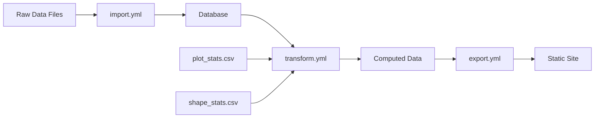

# Niamoto Configuration System Analysis

## Executive Summary

This document provides a comprehensive analysis of Niamoto's configuration system, examining the flow of data through `import.yml`, `transform.yml`, and `export.yml`. The analysis identifies complexity patterns, redundancies, and opportunities for simplification while maintaining the system's flexibility.

## Current System Overview

### Data Flow Architecture



### Configuration Files Overview

1. **import.yml**: Defines how raw data is loaded into the database
2. **transform.yml**: Specifies computations and aggregations
3. **export.yml**: Controls static site generation

## Complexity Analysis

### 1. Hierarchy Configuration Fragmentation

The system currently handles hierarchies in multiple ways:

#### Taxonomy Hierarchy (import.yml)
```yaml
taxonomy:
  ranks: "tax_fam,tax_gen,tax_sp_level,tax_infra_level"
  occurrence_columns:
    family: "tax_fam"
    genus: "tax_gen"
    species: "tax_sp_level"
```

#### Plot Hierarchy (import.yml)
```yaml
plots:
  hierarchy:
    enabled: true
    levels: ["locality_name", "country"]
    aggregate_geometry: true
```

#### Transform Hierarchy (transform.yml)
```yaml
plot_distribution:
  source_table: occurrences
  group_by_rank: "species"
  compute_nested_set_distribution: true
```

**Issues**:
- Different syntax for similar concepts
- Hierarchy configuration split between import and transform
- No unified way to express hierarchical relationships

### 2. Stats Files Pattern

The `plot_stats` and `shape_stats` files represent pre-computed data that bypasses the normal import process:

```yaml
# In import.yml
plot_stats:
  type: csv
  path: "imports/raw_plot_stats.csv"
  identifier: "plot_id"

# Used in transform.yml
plot_ecological_stats:
  class_object: "stats_loader"
  entity_col: "id_locality"
  stats_csv: "raw_plot_stats.csv"
```

**Issues**:
- Unclear distinction between imported data and reference data
- Configuration in import.yml suggests these are imported, but they're only used during transformation
- No clear namespace separation

### 3. Linking Mechanism Complexity

The system uses multiple approaches for linking entities:

#### Plot-Occurrence Linking
```yaml
plots:
  link_field: "locality"          # Field in plot_ref
  occurrence_link_field: "locality_name"  # Field in occurrences
```

#### Shape-Stats Linking
```yaml
# In transform.yml
country_stats:
  entity_name: "country"
  entity_col: "id"  # Links to shape
  stats_csv: "raw_shape_stats.csv"
```

**Issues**:
- Different linking patterns for similar relationships
- Configuration spread across multiple files
- No validation of link integrity

### 4. Configuration Redundancy

Several patterns appear repeatedly:

1. **Entity Identification**:
   - `identifier` in import.yml
   - `entity_col` in transform.yml
   - `id_field` in shapes configuration

2. **Source Specification**:
   - `path` in import.yml
   - `stats_csv` in transform.yml
   - Different formats for similar concepts

3. **Type Specification**:
   - `type: csv` in import.yml
   - `class_object: "stats_loader"` in transform.yml
   - Implicit types in export.yml

## Simplification Opportunities

### 1. Unified Hierarchy Model

Create a consistent hierarchy specification:

```yaml
# Proposed unified format
hierarchies:
  taxonomy:
    type: "nested"
    levels: ["family", "genus", "species", "infra"]
    source: "occurrences"

  spatial:
    type: "nested"
    levels: ["plot", "locality", "country"]
    aggregate_geometry: true
    source: "plots"
```

### 2. Clear Data Categories

Separate imported data from reference data:

```yaml
# Proposed structure
data_sources:
  imports:
    occurrences:
      path: "imports/occurrences.csv"
      type: "csv"

  references:  # Not imported, used during processing
    plot_stats:
      path: "imports/raw_plot_stats.csv"
      type: "csv"
```

### 3. Unified Linking Syntax

Standardize relationship definitions:

```yaml
# Proposed relationship format
relationships:
  occurrence_to_plot:
    from: "occurrences.locality_name"
    to: "plots.locality"
    type: "many_to_one"

  plot_to_stats:
    from: "plots.id"
    to: "plot_stats.plot_id"
    type: "one_to_one"
```

### 4. Plugin-Based Configuration

Move complex logic to plugin configurations:

```yaml
# In transform.yml
plugins:
  plot_distribution:
    plugin: "distribution_calculator"
    config:
      source: "occurrences"
      group_by: "species"
      hierarchy: "spatial"  # References predefined hierarchy
```

## Impact Analysis

### Benefits of Simplification

1. **Improved User Experience**:
   - Clearer mental model
   - Reduced configuration errors
   - Better documentation possibilities

2. **Easier Maintenance**:
   - Single source of truth for relationships
   - Consistent patterns across configurations
   - Reduced code complexity

3. **Better Validation**:
   - Can validate relationships at configuration time
   - Type checking for configurations
   - Clear error messages

### Migration Considerations

1. **Backward Compatibility**:
   - Support old format with deprecation warnings
   - Provide migration tools
   - Gradual transition period

2. **Documentation Updates**:
   - Clear migration guides
   - Updated examples
   - Video tutorials

## Recommendations

### Short Term (Low Impact)

1. **Consolidate Stats Configuration**:
   - Move stats file definitions to transform.yml
   - Remove from import.yml
   - Clear documentation about their role

2. **Standardize Identifiers**:
   - Use consistent naming (always `id_field`)
   - Document naming conventions
   - Add validation

### Medium Term (Moderate Impact)

1. **Unified Hierarchy Configuration**:
   - Create hierarchy section in configuration
   - Reference hierarchies by name
   - Consistent syntax for all hierarchies

2. **Relationship Registry**:
   - Define all relationships in one place
   - Validate at startup
   - Use throughout system

### Long Term (High Impact)

1. **Configuration Schema Overhaul**:
   - Single configuration file with clear sections
   - JSON Schema validation
   - GUI configuration editor

2. **Convention Over Configuration**:
   - Smart defaults based on naming conventions
   - Optional configuration for overrides
   - Reduced boilerplate

## Example: Simplified Configuration

```yaml
# niamoto.yml - Unified configuration
version: "2.0"

data_sources:
  occurrences:
    path: "imports/occurrences.csv"
    columns:
      id: "idtax_individual_f"
      taxon_id: "idtax_individual_f"
      location: "geo_pt"

  plots:
    path: "imports/plots.csv"
    columns:
      id: "id_loc"
      name: "locality_name"
      geometry: "geo_pt"

hierarchies:
  taxonomy:
    levels: ["family", "genus", "species", "infra"]
    extract_from: "occurrences"

  spatial:
    levels: ["plot", "locality", "country"]
    aggregate_geometry: true

relationships:
  occurrences_to_plots:
    link: "occurrences.locality_name -> plots.name"

  plots_to_stats:
    link: "plots.id -> references.plot_stats.plot_id"

references:  # Data used but not imported
  plot_stats:
    path: "imports/raw_plot_stats.csv"

transformations:
  - name: "plot_distribution"
    plugin: "distribution"
    uses: ["occurrences", "plots"]
    hierarchy: "spatial"

exports:
  - name: "biodiversity_atlas"
    type: "static_site"
    includes: ["plot_distribution", "taxonomic_diversity"]
```

## Conclusion

The current Niamoto configuration system, while flexible, has evolved to become complex with multiple patterns for similar concepts. By adopting a more unified approach with clear categories (data sources, hierarchies, relationships, transformations), we can significantly improve usability while maintaining the system's power and flexibility.

The key insight is that most complexity comes from:
1. Different syntax for similar concepts
2. Configuration spread across multiple files
3. Implicit relationships and assumptions
4. Mixed concerns (import vs. reference data)

A unified configuration model with clear sections and consistent patterns would make Niamoto more approachable for new users while reducing maintenance burden for existing projects.
