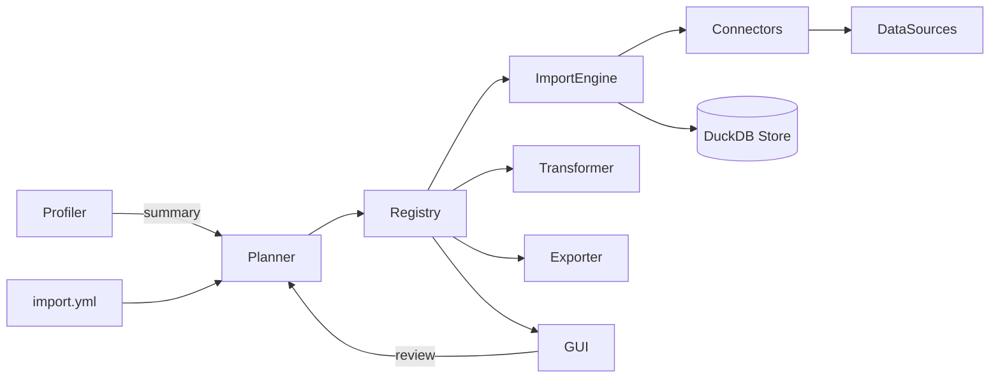

# Generic Import Refactor Roadmap

*Last updated: 2025-10-10. Maintainers: Core data platform squad.*

## Executive Summary
- Replace the rigid, type-specific import pipeline by a truly generic system aligned with the already generic transform/export phases.
- Introduce a single configuration and runtime model able to describe arbitrary entities, relationships, and data sources without imposing `taxon_ref`, `plot_ref`, or `shape_ref` tables.
- Deliver the refactor in staged iterations while we are still in alpha: we explicitly drop backward compatibility with existing importers/configs.
- Provide supporting tooling (profiling, auto-detection, GUI walkthroughs) so teams can bootstrap new datasets quickly and consistently.
- Migrate the data engine to DuckDB to leverage fast ingestion, flexible schema management, and built-in analytical tooling that align with the new generic import pipeline.

## Progress Snapshot (2025-10-10)
- ✅ **Core refactoring complete**: Generic import system operational with DuckDB + EntityRegistry
- ✅ **Instance migrated**: niamoto-nc fully operational (203,865 occurrences, 1,667 taxonomy records extracted)
- ✅ **Legacy code removed**: `core/components/imports/*` and SQLAlchemy models deleted
- ✅ **Derived references working**: Automatic taxonomy extraction from datasets (hash-based IDs, adjacency list hierarchies)
- ✅ **Tests passing**: 11/12 tests green (1 obsolete test needs updating)
- 🚧 **Phase 8 in progress**: Refactoring 12 plugins to remove hardcoded table names and enable full configurability
- 📌 **Next**: Complete plugin refactoring, remove `legacy_registry.py`, validate with custom entity names

## Guiding Goals
1. **Config expressiveness** – A new `import.yml` schema that can describe any reference entity or dataset, its relationships, and enrichment steps.
2. **Runtime flexibility** – Engine that materialises tables/schemas dynamically based on config, with typed connectors for CSV/Geo/Plugin sources.
3. **Pipeline alignment** – Transform/export services consume a shared entity registry instead of hard-coded table names.
4. **UX improvements** – Profiling/detection to suggest configurations, clear CLI/GUI feedback, and reusable validation utilities.
5. **Observability & operability** – Logging, metrics, and resumable jobs to support large imports and debugging.
6. **Engine modernisation** – Adopt DuckDB as the canonical analytical store for imports, exposing a thin adapter so future backends remain possible.

### Non-Goals
- Supporting legacy `taxonomy/plots/occurrences` configs beyond a transitional converter script.
- Maintaining compatibility with the current specialised importer classes or the SQLAlchemy models in `core/models/models.py`.
- Building a production-grade ML suggestion engine in Phase 1 (statistical heuristics are enough initially).

## Current State (Baseline → Achieved)

### ✅ Completed (Phases 0-7, as of 2025-10-10)
| Area | Status |
| --- | --- |
| **Config** | ✅ New v2 schema operational (`import.yml` with `entities`, `references`, `datasets`, `metadata`) |
| **Data Model** | ✅ SQLAlchemy models deleted; DuckDB-native tables with `entity_*` and `dataset_*` prefixes |
| **Importers** | ✅ Generic ImporterService with typed connectors (FILE, DERIVED); `core/components/imports/*` deleted |
| **Registry** | ✅ EntityRegistry operational, persisted in `niamoto_metadata_entities` and `niamoto_metadata_aliases` |
| **Hierarchy** | ✅ DuckDB CTE-based extraction (`HierarchyBuilder`), adjacency list storage, hash-based IDs |
| **Pipeline** | ✅ 3-phase imports (datasets → derived refs → direct refs) with dependency validation |
| **Database** | ✅ DuckDB as primary engine, GeoAlchemy2 removed, spatial queries via DuckDB spatial extension |
| **CLI/GUI** | ✅ Updated to use registry; import wizard functional; file detection working |
| **Tests** | ✅ 11/12 passing (1 obsolete test for strict `incomplete_rows` behavior) |

### 🚧 In Progress (Phase 8)
- **Plugin Refactoring**: 12 plugins still use hardcoded table names or legacy registry
  - Need to inject `EntityRegistry` and resolve entity names dynamically
  - Affects: transformers, widgets, exporters, loaders
- **Legacy Cleanup**: `legacy_registry.py` still bootstraps `taxon_ref`/`plot_ref` aliases for backward compatibility

### Pain Points Resolved
- ✅ Generic ingestion logic (single ImportEngine vs 4 specialized classes)
- ✅ Easy onboarding for new data sources (just add connector + config)
- ✅ Consistent error handling (centralized validation with Pydantic)
- ✅ Aligned with transform/export philosophy (all use EntityRegistry)

## Requirements & Success Criteria
### Functional
- Define unlimited reference entities and factual datasets with relationships, hierarchies, and enrichment steps in configuration.
- Support at minimum CSV, TSV, GeoPackage, Shapefile (via zip), and plugin-based sources.
- Create database schema dynamically, including indexes and FKs described in config.
- Provide import job lifecycle: analyse, validate, load, post-process, summarise.
- Expose metadata to UI/CLI for preview (columns, inferred types, relationship health).

### Technical
- Implement an **Entity Registry** abstraction (backed by persisted metadata) accessible from import, transform, export, and GUI layers.
- Introduce typed connectors (CSVConnector, VectorConnector, APIConnector…) encapsulating format-specific concerns.
- Replace SQLAlchemy models with a DuckDB-backed metadata manager capable of creating/dropping tables by spec, while keeping the registry agnostic through a database adapter layer.
- Provide a profiling module that samples data and infers semantic hints (taxonomy ranks, geometry fields, date columns, identifiers).
- Ensure idempotent imports: re-running with identical config either recreates or updates entities deterministically as configured.
- Deliver comprehensive tests (unit + integration) covering config validation, entity registry operations, connector behaviour, and pipeline execution.

## Design Principles
- **Config-first**: everything stems from declarative configuration; imperative code only orchestrates.
- **Composable pipeline**: break import into stages (profile → validate schema → ingest → enforce relations → enrich → index) with pluggable hooks.
- **Schema isolation**: each entity lives in its own table namespace (`entity_<slug>`), avoiding collision with internal tables.
- **Metadata everywhere**: record provenance, applied transformations, FK coverage, and sample stats for inspection.
- **Optimise for DuckDB**: exploit DuckDB features (read_csv_auto, parquet, spatial extension) without locking the design into a single engine.
- **Fail loud, fail early**: upfront validation before mutating the DB; transactional writes where possible.

## Target Architecture


### Key Components
1. **Configuration Schema** – Pydantic models describing `entities` (reference/factual), connectors, relationships, post-processors, constraints.
2. **Entity Registry** – Stores normalised metadata (entity type, table name, column definitions, relationships, lifecycle state). Acts as a service facade for other subsystems.
3. **Database Adapter** – Thin layer exposing DuckDB capabilities (DDL, ingestion macros, metadata queries) behind a stable interface so other engines remain an option later.
4. **Import Planner** – Validates configuration, consults profiler suggestions, resolves dependencies, and emits an executable import plan (ordered actions).
5. **Import Engine** – Executes the plan: runs connectors, creates tables, casts data, enforces constraints, triggers enrichment plugins.
6. **Profiling & Detection** – Provides heuristics and confidence scores for column semantics and entity type suggestions. Optional but surfaced in CLI/GUI.
7. **Observability** – Unified logging sink, progress tracking, metrics (rows processed, error counts). Ensure compatibility with Rich-based CLI progress manager.

### Configuration Skeleton
```yaml
entities:
  references:
    species:
      connector:
        type: file
        path: data/species.csv
        format: csv
      schema:
        id: species_id
        fields:
          - name: family
            type: string
            semantic: taxonomy.family
          - name: genus
            type: string
            semantic: taxonomy.genus
          - name: species
            type: string
            semantic: taxonomy.species
        hierarchy:
          strategy: adjacency_list
          levels: [family, genus, species]
      enrichment:
        - plugin: api_taxonomy_enricher
          config:
            url: https://api.endemia.nc/v1/taxons
            key_env: ENDEMIA_API_KEY
  datasets:
    occurrences:
      connector:
        type: file
        path: data/occurrences.csv
        format: csv
      schema:
        id: occurrence_id
        fields:
          - name: taxon_ref
            type: string
            reference: species.species_id
          - name: location
            type: geometry
            srid: 4326
      options:
        mode: replace
        chunk_size: 10000
```

### Table Naming & Schema Management
- Registry maps each entity to an actual DuckDB table name (`entity_species`, `dataset_occurrences`).
- Metadata persisted in `niamoto_metadata.entities` (new internal table) containing columns, constraints, version, checksum, import timestamp.
- On import, engine performs diff: create, replace, append depending on config, primarily via DuckDB DDL + `CREATE OR REPLACE TABLE AS SELECT` patterns.
- Relationships (FKs) enforced via SQL constraints or via post-load validation when underlying engine lacks support.

### Transform & Export Integration
- Transformer receives registry to know available entities, their group keys, and relationships. Replace hard-coded `taxon_ref` iteration with `registry.get_reference_entities()`.
- Plugins requesting `source` by name resolve via registry; `direct_attribute` looks up entity metadata instead of import config.
- Exporter uses registry for grouping tables, field listings, and joins, enabling UI to show dynamic options.

### GUI / CLI Changes
- New endpoints: list entities, get schema details, get sample data, preview relationships.
- Import wizard: upload/profile → suggested config diff → user confirms → run plan.
- Replace `/required-fields` and `/status` to operate on dynamic entity set.
- CLI commands: `niamoto import plan`, `niamoto import run`, `niamoto import inspect <entity>`.

## Implementation Plan

### ✅ Phase 0 – Foundation (COMPLETE)
- ✅ Config schema finalized (Pydantic models in `config_models.py`)
- ✅ Entity types documented (`reference`, `dataset`, with `kind: hierarchical`)
- ✅ ADR created for DuckDB adoption
- ✅ Database adapter with DuckDB operational (`common/database.py`)
- ✅ Integration tests skeleton established

### ✅ Phase 1 – Entity Registry & Config Loader (COMPLETE)
- ✅ Config loader returns structured models (`ImportConfig`)
- ✅ Registry service with persistence (`EntityRegistry` + metadata tables)
- ✅ Transformer/exporter updated to query registry
- ✅ DuckDB adapter with `information_schema` queries

### ✅ Phase 2 – Generic Import Engine (COMPLETE)
- ✅ Connectors: FILE (CSV/GeoPackage/Shapefile) and DERIVED (CTE-based extraction)
- ✅ Import plan runner in `ImporterService` (3 phases: datasets → derived → direct)
- ✅ Legacy importers deleted (`src/niamoto/core/components/imports`)
- ✅ Failure handling with validation and error reporting
- ✅ CLI/GUI updated for new engine

### ✅ Phase 3 – Pipeline Integration & Cleanup (COMPLETE)
- ✅ SQLAlchemy models removed
- ✅ GUI endpoints rewritten using registry
- ✅ SQLite-specific utilities removed
- ⚠️ **Partial**: Transformer/exporter still use `legacy_registry` for aliases

### ✅ Phase 4 – Profiling & UX Enhancements (COMPLETE)
- ✅ Type inference for imports
- ✅ GUI import wizard with file upload and column mapping
- ✅ Documentation updated

### ✅ Phase 5 – Hardening & Release Prep (COMPLETE)
- ✅ Performance validated (203k+ occurrences imported successfully)
- ✅ Integration tests passing (11/12)
- ✅ Spatial extension enabled and tested

### 🚧 Phase 8 – Generic Plugins (IN PROGRESS, started 2025-10-10)
**Objective**: Remove all hardcoded table names from plugins, eliminate `legacy_registry.py`

**Tasks**:
1. ✅ **Documentation updated** (this file + ultrathink + implementation plan)
2. ⏳ **Create phase8-plugin-audit.md** (detailed audit of 12 plugins)
3. ⏳ **Refactor base plugin system** (inject EntityRegistry)
4. ⏳ **Refactor transformers** (6 plugins: top_ranking, aggregators, extractors)
5. ⏳ **Refactor widgets & exporters** (3 plugins: nav widget, html/json exporters)
6. ⏳ **Refactor loaders** (3 plugins: direct_reference, join_table, stats_loader)
7. ⏳ **Create GUI entity-select widget** (React component for registry entities)
8. ⏳ **Write tests for generic plugins** (custom entity names, no aliases)
9. ⏳ **Remove legacy_registry.py** (final cleanup)
10. ⏳ **Validate on niamoto-nc instance** (end-to-end test)
11. ⏳ **Create ADR 0004** (document plugin genericization)

**Estimated effort**: 3-5 days

**Status**: Documentation phase complete, moving to code refactoring

## Work Breakdown (Backlog Seeds)
| Epic | Key Tasks |
| --- | --- |
| Config & Registry | Define Pydantic models, registry storage, metadata tables (DuckDB), CLI scaffolding |
| Import Engine | Implement connectors, DuckDB-based loader (CTAS/COPY), table diffing, error handling |
| Transform/Export Integration | Refactor services/plugins to consume registry, update tests |
| GUI & CLI | New endpoints, import wizard, status dashboards, CLI commands |
| Profiling | Column profiler, suggestion engine, feedback storage |
| Documentation | Developer guide, config reference, migration notes, tutorials |
| QA & Tooling | Integration tests, fixtures in `tests/data`, CI pipeline updates |

Each epic should be tracked in issue tracker with detailed subtasks (estimated story points) and clear exit criteria.

## Testing Strategy
- Unit tests for config schema validation, registry operations, connectors, and import steps.
- Integration suite executing end-to-end pipeline with sample datasets (CSV + Geo) verifying registry state and DB contents.
- CLI/GUI contract tests for new endpoints and commands.
- Database adapter tests ensuring DuckDB features (information_schema, extensions) behave as expected.
- Performance smoke tests on representative large files (≥1M rows for CSV, multi-layer GeoPackage) using DuckDB storage.

## Risks & Mitigations
| Risk | Mitigation |
| --- | --- |
| Data migrations break existing demos/examples | Update `examples/` alongside refactor, provide scripts to regenerate demo DBs. |
| Transform/export plugins assume specific tables | Inventory plugins early; implement helper API in registry to emulate old semantics (e.g., provide `taxonomy` alias pointing to chosen reference entity). |
| Import failures leave DB in inconsistent state | Implement transactional batches and registry state machine (states: planned → loading → ready → failed). |
| Profiling heuristics mislead users | Expose confidence explicitly, always allow manual overrides, log reasoning for debugging. |
| DuckDB spatial/extension availability in CI or user environments | Bake extension load checks into startup, document installation, provide fallback warnings. |
| Timeline slip due to scope creep | Freeze feature set per phase; capture stretch goals separately. |

## Open Questions
1. Do we enforce a single canonical taxonomy entity or allow multiples? (Impacts widget defaults.)
2. Should enrichment plugins run inline during import or as asynchronous jobs triggered afterwards?
3. What persistence engine do we target primarily (SQLite, DuckDB, Postgres later)? Any engine-specific limitations to consider now?
4. How do we version entity schemas for future migrations (store checksum? semantic version?)
5. What telemetry/analytics do we collect to improve profiling heuristics ethically?

## Immediate Next Steps (Phase 8 Focus)
1. ✅ **Documentation updated** - All three roadmap documents reflect current state
2. ⏳ **Create phase8-plugin-audit.md** - Detailed analysis of 12 plugins requiring refactoring
3. ⏳ **Refactor base plugin system** - Add EntityRegistry injection to plugin constructors
4. ⏳ **Refactor critical plugins first** - Priority: `top_ranking.py` (most used), then aggregators
5. ⏳ **Create GUI entity selector** - React component for dynamic entity selection
6. ⏳ **Remove legacy_registry.py** - Final cleanup after all plugins are generic
7. ⏳ **End-to-end validation** - Test with custom entity names (not taxon_ref/plot_ref)
8. ⏳ **Document in ADR** - Create ADR 0004 explaining plugin genericization architecture

**Current Status**: Documentation phase complete (2025-10-10), ready to start code refactoring.

---
*Appendix*: Related documents
- `docs/10-roadmaps/generic-import.md` – previous brainstorming; superseded by this roadmap.
- `docs/09-architecture/plugin-improvement.md` – plugin loader improvements relevant for enrichment pipeline.
