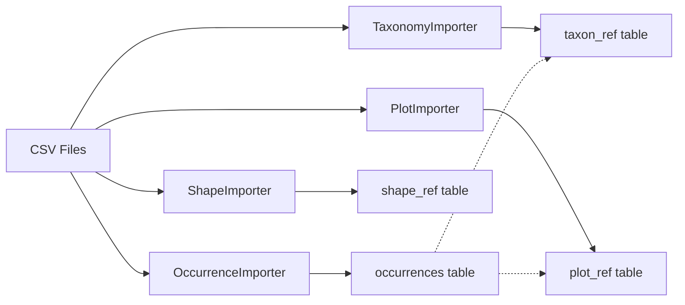
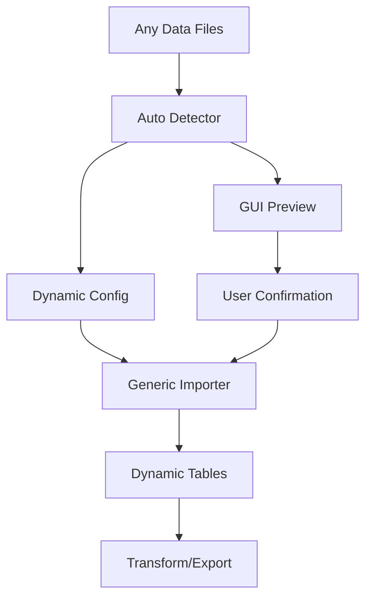

# Generic Import System Roadmap

## Executive Summary

This roadmap outlines the transformation of Niamoto's import system from a rigid, table-specific architecture to a fully generic, auto-detecting data pipeline. The goal is to enable a "data-first bootstrap" where users can drop their files and immediately get a working pipeline, which they can then refine through the GUI.

## Current State Analysis

### Problems with Current Architecture

1. **Fixed Table Structure**
   - Three imposed tables: `taxon_ref`, `plot_ref`, `shape_ref`
   - Hardcoded models in `core/models/models.py`
   - Specialized importers for each entity type

2. **Rigid Import Process**
   - Fixed field mappings
   - Predefined hierarchical structures
   - Limited flexibility for user-specific schemas

3. **Inconsistency with Transform/Export**
   - Transform and Export are already generic
   - Import remains the only specific/rigid component
   - Creates a philosophical mismatch in the pipeline

### Current Import Flow



## Vision: Generic Import with Auto-Detection

### Target Architecture



### Key Principles

1. **No Imposed Structure**: Users define their own entities and relationships
2. **Auto-Detection**: Smart analysis suggests configuration automatically
3. **Dynamic Schema**: Tables created on-the-fly based on data
4. **Unified Naming**: Consistent entity names across import/transform/export
5. **GUI Integration**: Visual configuration and validation

## Proposed Configuration Format

### Old Format (Rigid)

```yaml
# import.yml - Current rigid format
taxonomy:
  path: imports/occurrences.csv
  hierarchy:
    levels: [family, genus, species]
    taxon_id_column: id_taxonref

plots:
  path: imports/plots.csv
  identifier: id_plot
  locality_field: plot

occurrences:
  path: imports/occurrences.csv
  identifier: id_taxonref
  location_field: geo_pt
```

### New Format (Generic)

```yaml
# import.yml - New generic format
references:
  # User-defined reference entities (no fixed names)
  species:
    source: data/observations.csv
    type: hierarchical
    hierarchy:
      - family
      - genus
      - species
    id_field: species_code
    enrich:  # Optional enrichment
      plugin: api_enricher
      url: "https://api.biodiversity.org"

  locations:
    source: data/sites.geojson
    type: spatial
    id_field: site_id
    name_field: site_name
    geometry_field: geometry

  habitats:
    source: data/habitats.csv
    type: categorical
    id_field: habitat_code
    name_field: habitat_type

# Factual data linking to references
data:
  observations:
    source: data/observations.csv
    links:
      - reference: species
        field: species_code
      - reference: locations
        field: site_id
      - reference: habitats
        field: habitat_code
```

## Implementation Phases

### Phase 1: Data Profiling and Auto-Detection (Week 1-2)

#### 1.1 Create Data Profiler

**File**: `src/niamoto/core/imports/profiler.py`

```python
from dataclasses import dataclass
from typing import List, Dict, Optional, Any
import pandas as pd
import geopandas as gpd
from pathlib import Path

@dataclass
class ColumnProfile:
    """Profile of a single column"""
    name: str
    dtype: str
    semantic_type: Optional[str]  # 'taxonomy', 'geometry', 'date', etc.
    unique_ratio: float
    null_ratio: float
    sample_values: List[Any]

@dataclass
class DatasetProfile:
    """Complete profile of a dataset"""
    file_path: Path
    record_count: int
    columns: List[ColumnProfile]
    detected_type: str  # 'hierarchical', 'spatial', 'factual', etc.
    suggested_name: str
    relationships: List[Dict[str, str]]

class DataProfiler:
    """Analyzes datasets to detect structure and semantics"""

    # Semantic detection patterns
    TAXONOMY_PATTERNS = {
        'family': ['family', 'famille', 'fam'],
        'genus': ['genus', 'genre', 'gen'],
        'species': ['species', 'espece', 'sp'],
        'rank': ['rank', 'rang', 'level']
    }

    SPATIAL_PATTERNS = {
        'geometry': ['geometry', 'geom', 'shape', 'polygon'],
        'latitude': ['lat', 'latitude', 'y'],
        'longitude': ['lon', 'longitude', 'x'],
        'coordinates': ['coordinates', 'coords', 'xy']
    }

    def profile(self, file_path: Path) -> DatasetProfile:
        """Generate complete profile of a dataset"""
        # Load data
        data = self._load_data(file_path)

        # Profile columns
        columns = [self._profile_column(data[col]) for col in data.columns]

        # Detect dataset type
        dataset_type = self._detect_dataset_type(columns)

        # Suggest entity name
        suggested_name = self._suggest_entity_name(file_path, dataset_type)

        # Detect relationships
        relationships = self._detect_relationships(columns)

        return DatasetProfile(
            file_path=file_path,
            record_count=len(data),
            columns=columns,
            detected_type=dataset_type,
            suggested_name=suggested_name,
            relationships=relationships
        )

    def _detect_dataset_type(self, columns: List[ColumnProfile]) -> str:
        """Determine if dataset is hierarchical, spatial, or factual"""
        semantic_types = [col.semantic_type for col in columns if col.semantic_type]

        if any('taxonomy' in t for t in semantic_types):
            return 'hierarchical'
        elif any('geometry' in t for t in semantic_types):
            return 'spatial'
        else:
            return 'factual'
```

#### 1.2 Create Auto-Detector

**File**: `src/niamoto/core/imports/auto_detector.py`

```python
from typing import List, Dict, Any
from pathlib import Path
from .profiler import DataProfiler

class AutoDetector:
    """Automatically detects data structure and suggests configuration"""

    def __init__(self):
        self.profiler = DataProfiler()

    def analyze_directory(self, directory: Path) -> Dict[str, Any]:
        """Analyze all files in directory and suggest configuration"""
        files = self._discover_files(directory)
        profiles = [self.profiler.profile(f) for f in files]

        config = self._generate_config(profiles)
        validation = self._validate_config(config)

        return {
            'config': config,
            'profiles': profiles,
            'validation': validation,
            'confidence': self._calculate_confidence(profiles)
        }

    def _generate_config(self, profiles: List) -> Dict[str, Any]:
        """Generate import.yml configuration from profiles"""
        config = {
            'references': {},
            'data': {}
        }

        # Separate references from factual data
        for profile in profiles:
            if profile.detected_type in ['hierarchical', 'spatial', 'categorical']:
                config['references'][profile.suggested_name] = {
                    'source': str(profile.file_path),
                    'type': profile.detected_type,
                    **self._extract_fields(profile)
                }
            else:
                config['data'][profile.suggested_name] = {
                    'source': str(profile.file_path),
                    'links': self._detect_links(profile, config['references'])
                }

        return config

    def _detect_links(self, data_profile, references: Dict) -> List[Dict]:
        """Detect relationships between data and references"""
        links = []

        for col in data_profile.columns:
            for ref_name, ref_config in references.items():
                if self._is_likely_foreign_key(col, ref_config):
                    links.append({
                        'reference': ref_name,
                        'field': col.name
                    })

        return links
```

### Phase 2: Generic Import Engine (Week 3-4)

#### 2.1 Dynamic Table Creator

**File**: `src/niamoto/core/imports/table_factory.py`

```python
from sqlalchemy import MetaData, Table, Column, Integer, String, Float, ForeignKey, Index
from sqlalchemy.orm import declarative_base
from typing import Dict, Any, List

class TableFactory:
    """Creates database tables dynamically from configuration"""

    TYPE_MAPPING = {
        'integer': Integer,
        'string': String(255),
        'float': Float,
        'text': String,
        'geometry': String  # Will store WKT
    }

    def __init__(self, database):
        self.db = database
        self.metadata = MetaData()
        self.tables = {}

    def create_reference_table(self, name: str, config: Dict[str, Any]) -> Table:
        """Create a reference table dynamically"""
        columns = [
            Column('id', Integer, primary_key=True, autoincrement=True)
        ]

        # Add configured fields
        for field in config.get('fields', []):
            col_type = self.TYPE_MAPPING.get(field['type'], String)
            columns.append(Column(field['name'], col_type))

        # Add hierarchy fields if needed
        if config.get('type') == 'hierarchical':
            columns.extend([
                Column('lft', Integer),
                Column('rght', Integer),
                Column('level', Integer),
                Column('parent_id', Integer, ForeignKey(f'{name}_ref.id'))
            ])

        # Create table
        table = Table(f'{name}_ref', self.metadata, *columns)

        # Add indexes
        self._add_indexes(table, config.get('indexes', []))

        # Create in database
        table.create(self.db.engine)

        self.tables[name] = table
        return table

    def create_data_table(self, name: str, config: Dict[str, Any]) -> Table:
        """Create a factual data table with foreign keys"""
        columns = [
            Column('id', Integer, primary_key=True, autoincrement=True)
        ]

        # Add foreign key columns for links
        for link in config.get('links', []):
            ref_table = f"{link['reference']}_ref"
            columns.append(
                Column(f"{link['reference']}_id", Integer, ForeignKey(f'{ref_table}.id'))
            )

        # Detect and add other columns from data
        # This would analyze the actual data file
        data_columns = self._detect_data_columns(config['source'])
        columns.extend(data_columns)

        # Create table
        table = Table(name, self.metadata, *columns)
        table.create(self.db.engine)

        self.tables[name] = table
        return table
```

#### 2.2 Generic Importer

**File**: `src/niamoto/core/imports/generic_importer.py`

```python
import pandas as pd
from typing import Dict, Any
from .table_factory import TableFactory

class GenericImporter:
    """Generic importer that works with any configuration"""

    def __init__(self, database):
        self.db = database
        self.table_factory = TableFactory(database)

    def import_all(self, config: Dict[str, Any]) -> Dict[str, int]:
        """Import all data according to configuration"""
        results = {}

        # Step 1: Create and populate reference tables
        for name, ref_config in config.get('references', {}).items():
            table = self.table_factory.create_reference_table(name, ref_config)
            count = self._import_reference(name, ref_config, table)
            results[f'{name}_ref'] = count

        # Step 2: Create and populate data tables
        for name, data_config in config.get('data', {}).items():
            table = self.table_factory.create_data_table(name, data_config)
            count = self._import_data(name, data_config, table)
            results[name] = count

        return results

    def _import_reference(self, name: str, config: Dict, table) -> int:
        """Import reference data"""
        data = self._load_data(config['source'])

        if config.get('type') == 'hierarchical':
            return self._import_hierarchical(data, config, table)
        elif config.get('type') == 'spatial':
            return self._import_spatial(data, config, table)
        else:
            return self._import_simple(data, config, table)

    def _import_hierarchical(self, data: pd.DataFrame, config: Dict, table) -> int:
        """Import hierarchical data with nested set model"""
        # Build hierarchy
        hierarchy = self._build_hierarchy(data, config['hierarchy'])

        # Calculate nested set values
        self._calculate_nested_set(hierarchy)

        # Insert into database
        count = 0
        for node in hierarchy:
            self.db.execute(table.insert().values(**node))
            count += 1

        return count
```

### Phase 3: Bootstrap System (Week 5)

#### 3.1 Data Bootstrap

**File**: `src/niamoto/core/imports/bootstrap.py`

```python
from pathlib import Path
from typing import Dict, Any, Optional
from .auto_detector import AutoDetector
from .generic_importer import GenericImporter
import yaml

class DataBootstrap:
    """Automatic bootstrap from data files"""

    def __init__(self, instance_path: Path):
        self.instance_path = instance_path
        self.detector = AutoDetector()

    def run(self, data_dir: Path, auto_confirm: bool = False) -> Dict[str, Any]:
        """Run complete bootstrap process"""

        # Step 1: Analyze data
        print("🔍 Analyzing data files...")
        analysis = self.detector.analyze_directory(data_dir)

        # Step 2: Show suggestions (unless auto_confirm)
        if not auto_confirm:
            self._display_suggestions(analysis)
            if not self._confirm_suggestions():
                return self._interactive_refinement(analysis)

        # Step 3: Generate configuration
        config = analysis['config']
        self._save_config(config, 'import.yml')

        # Step 4: Create database and import
        print("📥 Importing data...")
        importer = GenericImporter(self.get_database())
        results = importer.import_all(config)

        # Step 5: Generate default transform configuration
        print("⚙️ Generating transform configuration...")
        transform_config = self._generate_transform_config(config)
        self._save_config(transform_config, 'transform.yml')

        # Step 6: Generate default export configuration
        print("📤 Generating export configuration...")
        export_config = self._generate_export_config(config)
        self._save_config(export_config, 'export.yml')

        return {
            'status': 'success',
            'import_results': results,
            'configs_created': ['import.yml', 'transform.yml', 'export.yml']
        }

    def _generate_transform_config(self, import_config: Dict) -> Dict:
        """Generate default transform configuration"""
        transforms = []

        for ref_name in import_config['references']:
            transforms.append({
                'group_by': ref_name,
                'sources': [{
                    'name': list(import_config['data'].keys())[0],
                    'data': list(import_config['data'].keys())[0],
                    'grouping': ref_name
                }],
                'widgets_data': {
                    'statistics': {
                        'plugin': 'statistical_summary',
                        'params': {
                            'calculations': ['count', 'sum', 'mean']
                        }
                    },
                    'distribution': {
                        'plugin': 'categorical_distribution',
                        'params': {
                            'top_n': 10
                        }
                    }
                }
            })

        return transforms
```

### Phase 4: GUI Integration (Week 6-7)

#### 4.1 API Endpoints

**File**: `src/niamoto/gui/api/routers/bootstrap.py`

```python
from fastapi import APIRouter, UploadFile, File, HTTPException
from typing import List, Dict, Any
from pathlib import Path
import tempfile
import shutil

router = APIRouter(prefix="/api/bootstrap", tags=["bootstrap"])

@router.post("/analyze")
async def analyze_files(files: List[UploadFile] = File(...)):
    """Analyze uploaded files and return configuration suggestions"""

    with tempfile.TemporaryDirectory() as temp_dir:
        temp_path = Path(temp_dir)

        # Save uploaded files
        for file in files:
            file_path = temp_path / file.filename
            with open(file_path, "wb") as f:
                shutil.copyfileobj(file.file, f)

        # Analyze
        detector = AutoDetector()
        analysis = detector.analyze_directory(temp_path)

        return {
            "suggestions": analysis['config'],
            "confidence": analysis['confidence'],
            "profiles": [
                {
                    "filename": p.file_path.name,
                    "type": p.detected_type,
                    "suggested_name": p.suggested_name,
                    "record_count": p.record_count
                }
                for p in analysis['profiles']
            ]
        }

@router.post("/bootstrap")
async def bootstrap_instance(config: Dict[str, Any]):
    """Create new instance with provided configuration"""

    try:
        bootstrap = DataBootstrap(Path(config['instance_path']))
        result = bootstrap.run(
            Path(config['data_path']),
            auto_confirm=config.get('auto_confirm', False)
        )

        return result

    except Exception as e:
        raise HTTPException(status_code=400, detail=str(e))
```

#### 4.2 React Components

**File**: `src/niamoto/gui/ui/src/components/bootstrap/DataBootstrap.tsx`

```typescript
import React, { useState } from 'react';
import { useDropzone } from 'react-dropzone';
import { Card, Button, Alert, Progress } from '@/components/ui';

interface BootstrapState {
  stage: 'upload' | 'analyzing' | 'review' | 'importing' | 'complete';
  files: File[];
  analysis?: AnalysisResult;
  config?: ImportConfig;
  results?: ImportResults;
}

export const DataBootstrap: React.FC = () => {
  const [state, setState] = useState<BootstrapState>({
    stage: 'upload',
    files: []
  });

  const { getRootProps, getInputProps } = useDropzone({
    onDrop: async (acceptedFiles) => {
      setState({ ...state, files: acceptedFiles, stage: 'analyzing' });

      // Analyze files
      const formData = new FormData();
      acceptedFiles.forEach(file => formData.append('files', file));

      const response = await fetch('/api/bootstrap/analyze', {
        method: 'POST',
        body: formData
      });

      const analysis = await response.json();
      setState({
        ...state,
        stage: 'review',
        analysis,
        config: analysis.suggestions
      });
    }
  });

  const handleBootstrap = async () => {
    setState({ ...state, stage: 'importing' });

    const response = await fetch('/api/bootstrap/bootstrap', {
      method: 'POST',
      headers: { 'Content-Type': 'application/json' },
      body: JSON.stringify({
        config: state.config,
        auto_confirm: true
      })
    });

    const results = await response.json();
    setState({ ...state, stage: 'complete', results });
  };

  return (
    <Card className="p-6">
      {state.stage === 'upload' && (
        <div {...getRootProps()} className="border-2 border-dashed p-12 text-center">
          <input {...getInputProps()} />
          <h3>Drop your data files here</h3>
          <p>CSV, Excel, GeoJSON, Shapefiles...</p>
        </div>
      )}

      {state.stage === 'review' && (
        <div>
          <h3>Analysis Results</h3>
          <Alert>
            We detected:
            <ul>
              {state.analysis?.profiles.map(p => (
                <li key={p.filename}>
                  {p.suggested_name}: {p.type} ({p.record_count} records)
                </li>
              ))}
            </ul>
          </Alert>

          <ConfigEditor
            config={state.config}
            onChange={(config) => setState({ ...state, config })}
          />

          <Button onClick={handleBootstrap}>
            Create Instance
          </Button>
        </div>
      )}

      {state.stage === 'complete' && (
        <Alert type="success">
          Instance created successfully!
          <br />
          Imported: {Object.entries(state.results?.import_results || {})
            .map(([k, v]) => `${k}: ${v} records`).join(', ')}
        </Alert>
      )}
    </Card>
  );
};
```

## Migration Strategy

### For Existing Instances

1. **Compatibility Layer**: Create mapping from old format to new
2. **Migration Tool**: Script to convert existing import.yml
3. **Gradual Transition**: Support both formats initially

```python
# src/niamoto/core/imports/migration.py
class ImportConfigMigration:
    """Migrate old import.yml to new format"""

    def migrate(self, old_config: Dict) -> Dict:
        new_config = {
            'references': {},
            'data': {}
        }

        # Map taxonomy → species reference
        if 'taxonomy' in old_config:
            new_config['references']['taxon'] = {
                'source': old_config['taxonomy']['path'],
                'type': 'hierarchical',
                'hierarchy': old_config['taxonomy']['hierarchy']['levels']
            }

        # Map plots → locations reference
        if 'plots' in old_config:
            new_config['references']['plot'] = {
                'source': old_config['plots']['path'],
                'type': 'spatial',
                'id_field': old_config['plots']['identifier']
            }

        # Map occurrences → observations data
        if 'occurrences' in old_config:
            new_config['data']['occurrences'] = {
                'source': old_config['occurrences']['path'],
                'links': [
                    {'reference': 'taxon', 'field': old_config['occurrences']['identifier']},
                    {'reference': 'plot', 'field': 'plot_id'}
                ]
            }

        return new_config
```

## Testing Strategy

### Unit Tests

```python
# tests/core/imports/test_auto_detector.py
def test_detect_hierarchical_data():
    """Test detection of taxonomic hierarchy"""
    detector = AutoDetector()
    profile = detector.analyze_file('test_data/taxonomy.csv')

    assert profile.detected_type == 'hierarchical'
    assert 'family' in profile.hierarchy_fields
    assert 'genus' in profile.hierarchy_fields

def test_detect_spatial_data():
    """Test detection of spatial data"""
    detector = AutoDetector()
    profile = detector.analyze_file('test_data/sites.geojson')

    assert profile.detected_type == 'spatial'
    assert profile.geometry_field == 'geometry'

def test_detect_relationships():
    """Test foreign key detection"""
    detector = AutoDetector()
    analysis = detector.analyze_directory('test_data/')

    obs_config = analysis['config']['data']['observations']
    assert len(obs_config['links']) >= 2
    assert any(link['reference'] == 'species' for link in obs_config['links'])
```

### Integration Tests

```python
# tests/integration/test_bootstrap.py
def test_complete_bootstrap():
    """Test complete bootstrap workflow"""
    bootstrap = DataBootstrap('test_instance/')
    result = bootstrap.run('test_data/', auto_confirm=True)

    assert result['status'] == 'success'
    assert 'import.yml' in result['configs_created']

    # Verify data was imported
    db = Database('test_instance/niamoto.db')
    assert db.execute('SELECT COUNT(*) FROM species_ref').fetchone()[0] > 0
    assert db.execute('SELECT COUNT(*) FROM observations').fetchone()[0] > 0
```

## Performance Considerations

1. **Chunked Processing**: For large files, process in chunks
2. **Parallel Analysis**: Analyze multiple files concurrently
3. **Caching**: Cache profiling results for repeated analyses
4. **Index Creation**: Automatically create optimal indexes based on detected relationships

## Success Metrics

- **Auto-detection accuracy**: >90% correct entity type detection
- **Bootstrap time**: <30 seconds for typical datasets
- **User modifications**: <3 adjustments needed after auto-detection
- **Pipeline success rate**: >95% of bootstrapped instances work without errors

## Timeline

| Week | Phase | Deliverables |
|------|-------|-------------|
| 1-2 | Data Profiling (Simple) | Basic profiler module, simple pattern detection |
| 3-4 | Generic Import | Dynamic tables, generic importer |
| 5 | Bootstrap | Auto-configuration, CLI integration |
| 6-7 | GUI Integration | API endpoints, React components |
| 8 | Testing & Polish | Complete test suite, documentation |
| 9-12 | Advanced Detection (Phase 2) | ML-based detection, knowledge base, multi-language support |

## Next Steps

1. Review and approve this roadmap
2. Create feature branch `feat/generic-import`
3. Start with Phase 1 implementation (simple detection)
4. Weekly progress reviews
5. User testing with alpha testers
6. Iterate on detection accuracy based on feedback

## Phase 2: Advanced Detection System (Future Enhancement)

### Overview

After validating the core generic import system with simple pattern detection, Phase 2 will introduce sophisticated detection capabilities to handle complex real-world datasets across multiple domains and languages.

### Advanced Detection Components

#### 1. Statistical and ML-based Detection

```python
# core/imports/smart_analyzer.py
class SmartColumnAnalyzer:
    """Advanced analysis based on data characteristics, not just column names"""

    def analyze_column(self, series: pd.Series) -> ColumnProfile:
        profile = ColumnProfile(name=series.name)

        # Statistical analysis
        profile.unique_ratio = series.nunique() / len(series)
        profile.null_ratio = series.isnull().sum() / len(series)

        # Pattern detection in VALUES, not names
        if self._looks_like_taxonomy(series):
            profile.semantic_type = 'taxonomy'
            profile.taxonomy_level = self._detect_taxonomy_level(series)
        elif self._looks_like_coordinates(series):
            profile.semantic_type = 'coordinates'
        elif self._looks_like_identifier(series):
            profile.semantic_type = 'identifier'

        return profile

    def _looks_like_taxonomy(self, series: pd.Series) -> bool:
        """Detect taxonomic data from value patterns"""
        sample = series.dropna().head(100)
        checks = [
            # Binomial nomenclature (Genus species)
            sample.str.match(r'^[A-Z][a-z]+ [a-z]+$').mean() > 0.5,
            # Taxonomic suffixes
            sample.str.contains(r'(aceae|idae|inae|ini|oidea)$', case=False).mean() > 0.2,
            # Hierarchical distribution
            series.value_counts().head(10).sum() / len(series) > 0.3
        ]
        return sum(checks) >= 2
```

#### 2. Learning Knowledge Base

```python
# core/imports/knowledge_base.py
class SemanticKnowledgeBase:
    """Self-improving knowledge base that learns from user corrections"""

    def __init__(self):
        self.base_patterns = self._load_base_patterns()
        self.learned_patterns = self._load_user_patterns()
        self.column_stats = self._load_column_statistics()

    def suggest_semantic_type(self, column_profile: ColumnProfile) -> Dict[str, float]:
        """Suggest types with confidence scores"""
        suggestions = {}

        # Check learned patterns
        if column_profile.name.lower() in self.learned_patterns:
            suggestions.update(self.learned_patterns[column_profile.name.lower()])

        # Find similar columns
        similar = self._find_similar_columns(column_profile)
        for col, similarity in similar:
            suggestions[col.semantic_type] = similarity * 0.8

        # Statistical inference
        suggestions.update(self._infer_from_stats(column_profile))

        return suggestions

    def learn_from_user(self, column_name: str, semantic_type: str, context: Dict):
        """Learn from user corrections"""
        self.learned_patterns[column_name.lower()] = {
            'type': semantic_type,
            'confidence': 1.0,
            'context': context
        }
        self._save_user_patterns()
```

#### 3. Multi-language Support

```python
# core/imports/multilingual_detector.py
class MultilingualDetector:
    """Support for multiple languages in detection"""

    TAXONOMY_TERMS = {
        'en': ['family', 'genus', 'species', 'order', 'class'],
        'fr': ['famille', 'genre', 'espèce', 'ordre', 'classe'],
        'es': ['familia', 'género', 'especie', 'orden', 'clase'],
        'de': ['familie', 'gattung', 'art', 'ordnung', 'klasse'],
        'pt': ['família', 'gênero', 'espécie', 'ordem', 'classe'],
        'it': ['famiglia', 'genere', 'specie', 'ordine', 'classe']
    }

    def detect_language(self, dataframe: pd.DataFrame) -> str:
        """Detect probable language of dataset"""
        # Analyze column names and sample values
        pass
```

#### 4. Contextual Detection

```python
# core/imports/contextual_detector.py
class ContextualDetector:
    """Use context to improve detection accuracy"""

    def analyze_relationships(self, profiles: List[ColumnProfile]) -> Dict:
        """Analyze inter-column relationships to deduce types"""

        # If we find "genus" and "species", look for "family"
        has_genus = any(p.semantic_type == 'taxonomy.genus' for p in profiles)
        has_species = any(p.semantic_type == 'taxonomy.species' for p in profiles)

        if has_genus and has_species:
            for profile in profiles:
                if profile.semantic_type is None:
                    if self._could_be_family(profile, profiles):
                        profile.semantic_type = 'taxonomy.family'
                        profile.confidence *= 1.2

        return relationships
```

#### 5. External Validation APIs

```python
# core/imports/external_enrichment.py
class ExternalValidator:
    """Validate detections using external APIs"""

    async def validate_species_names(self, names: List[str]) -> Dict:
        """Verify species names via GBIF or similar APIs"""
        # API calls to validate taxonomic names
        pass

    async def validate_locations(self, locations: List[str]) -> Dict:
        """Verify locations via geographic APIs"""
        # OpenStreetMap, GeoNames, etc.
        pass
```

#### 6. Coherence Validation

```python
# core/imports/coherence_validator.py
class CoherenceValidator:
    """Validate overall detection coherence"""

    def validate_detection(self, analysis: Dict) -> Dict:
        """Check global coherence"""
        issues = []

        # Example: Taxonomic hierarchy
        if self._has_taxonomy(analysis):
            if not self._validate_taxonomy_hierarchy(analysis):
                issues.append({
                    'type': 'taxonomy_hierarchy',
                    'message': 'Inconsistent taxonomic hierarchy detected',
                    'suggestion': 'Check taxonomic level order'
                })

        # Example: Coordinates
        if self._has_coordinates(analysis):
            if not self._validate_coordinate_ranges(analysis):
                issues.append({
                    'type': 'coordinates',
                    'message': 'Out-of-range coordinates detected'
                })

        return {'valid': len(issues) == 0, 'issues': issues}
```

### User Configuration Support

```yaml
# ~/.niamoto/semantic_patterns.yml
# User-specific custom patterns
custom_patterns:
  taxonomy:
    columns:
      - name_patterns: ['esp.*', 'tax.*']
        level: species
      - exact_names: ['nom_scientifique', 'scientific_name']
        level: species

  locations:
    columns:
      - patterns: ['site_.*', 'loc_.*']
      - exact: ['lieu_dit', 'toponyme']

  identifiers:
    suffixes: ['_id', '_code', '_ref', '_num']
    prefixes: ['id_', 'code_', 'num_']
```

### Detection Strategy

1. **Multi-level detection**:
   - Level 1: Statistical patterns on data
   - Level 2: Knowledge base + learning
   - Level 3: Contextual validation
   - Level 4: User confirmation

2. **Confidence scoring**:
   ```python
   confidence = (
       statistical_score * 0.4 +
       knowledge_score * 0.3 +
       context_score * 0.2 +
       validation_score * 0.1
   )
   ```

3. **Smart fallback**:
   - Confidence < 70%: Ask user
   - Confidence 70-90%: Suggest with warning
   - Confidence > 90%: Apply automatically

### GUI Integration for Learning

```typescript
// Component for user feedback and learning
const ColumnTypeSelector: React.FC<{suggestion: SemanticSuggestion}> = ({suggestion}) => {
  return (
    <Select
      defaultValue={suggestion.detectedType}
      confidence={suggestion.confidence}
      onChange={(newType) => {
        // Send feedback for learning
        api.learn({
          column: suggestion.column,
          userType: newType,
          context: getCurrentContext()
        });
      }}
    >
      <Option value={suggestion.detectedType}>
        {suggestion.detectedType} ({Math.round(suggestion.confidence * 100)}% confident)
      </Option>
      {suggestion.alternatives.map(alt => (
        <Option value={alt.type}>
          {alt.type} ({Math.round(alt.score * 100)}%)
        </Option>
      ))}
    </Select>
  );
};
```

### Phase 2 Timeline

| Week | Task | Description |
|------|------|-------------|
| 9-10 | Statistical Detection | Implement value-based pattern detection |
| 10-11 | Knowledge Base | Build learning system with user feedback |
| 11-12 | Multi-language & Validation | Add language support and coherence checks |
| 12 | Integration & Testing | Integrate with Phase 1 system |

### Benefits of Phased Approach

1. **Phase 1 validates core architecture** with simple detection
2. **Real user feedback** informs Phase 2 requirements
3. **Learning system** improves over time with usage
4. **Gradual complexity** reduces initial development risk
5. **Early delivery** of working system to users

This approach ensures we deliver value quickly while building toward a robust, production-ready detection system.

## Appendix: Complete Code Examples

### Example: Auto-Generated Configuration

**Input**: User drops 3 files
- `species_list.csv` (taxonomic data)
- `monitoring_sites.shp` (spatial data)
- `observations_2024.csv` (occurrence data)

**Auto-Generated `import.yml`**:

```yaml
# Automatically generated by Niamoto Bootstrap
# Confidence: 94%

references:
  species:
    source: data/species_list.csv
    type: hierarchical
    hierarchy: [kingdom, family, genus, species]
    id_field: species_id
    detected_patterns:
      - taxonomy.family: 0.98
      - taxonomy.genus: 0.97
      - taxonomy.species: 0.99

  monitoring_sites:
    source: data/monitoring_sites.shp
    type: spatial
    id_field: SITE_ID
    name_field: SITE_NAME
    geometry_field: geometry
    crs: EPSG:4326

data:
  observations:
    source: data/observations_2024.csv
    links:
      - reference: species
        field: species_id
        confidence: 0.96
      - reference: monitoring_sites
        field: site_code
        confidence: 0.88
    detected_fields:
      - observation_date: date
      - observer: string
      - count: integer
      - notes: text
```

This configuration is immediately usable and creates a working Niamoto instance!
