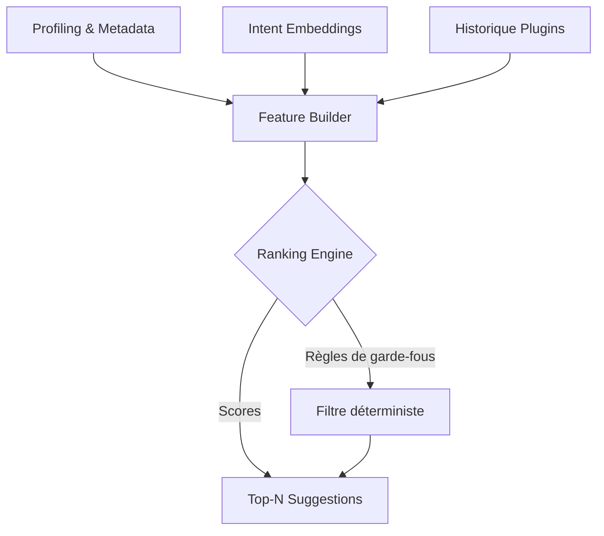

# 🧭 Stratégie Recommandation de Plugins & Expérience Guidée

## Vue d'ensemble

Ce document détaillé complète la réflexion stratégique autour des étapes **3** et **4** proposées pour renforcer la différenciation de Niamoto face à Data Formulator. Il décrit :

- Un système de routage intelligent des plugins basé sur des modèles ML légers et des règles déterministes.
- Une adaptation du paradigme de « concept binding » qui conserve les avantages d'un pipeline structuré.
- Un backlog de fonctionnalités différenciantes, hiérarchisé par valeur et effort.
- Des métriques, risques et jalons qui alignent l'équipe produit, design et engineering.

## Objectifs Produit & Contraintes

- **Fluidifier l'onboarding** sans sacrifier la traçabilité ni la robustesse du pipeline.
- **Réduire l'effort cognitif** : proposer automatiquement les bons plugins, expliquer le choix, permettre l'override manuel.
- **Maintenir un cadre gouvernable** : logs, configurations versionnées, exécution déterministe.
- **Limiter la dépendance aux LLM** : privilégier des modèles open-source, légers, déployables on-prem.

---

## Axe 3 — Recommandation de Plugins via ML Léger

### 3.1 Synthèse des besoins

- **Entrées** : métadonnées dataset, schéma typé, historique utilisateur, objectifs déclarés (via UI/texte court).
- **Sorties** : top N plugins suggérés avec score, justificatif, paramètres pré-remplis.
- **Contraintes** : inférence <200 ms, offline-friendly, explicable.

### 3.2 Signaux exploités

| Signal | Description | Source | Normalisation |
| --- | --- | --- | --- |
| *Profil de colonnes* | Types sémantiques (ML Detector) + stats (distributions, cardinalités, anomalies) | `DataProfiler` | Features standardisées |
| *Intent utilisateur* | Champs ciblés, verbatims courts ("analyser la mortalité", "cartographier") | UI (text input) | Embeddings 768d |
| *Historique* | Plugins utilisés sur des jeux similaires (par dataset, par organisation) | Logs pipeline | TF-IDF ou fréquence |
| *Contextes métiers* | Taxonomies déclarées, normes attachées au projet | Config YAML | Encodage one-hot |

### 3.3 Architecture hybride recommandée



- **Feature Builder** : assemble un vecteur dense (embeddings) + features discrètes (one-hot, stats) pour chaque plugin candidat.
- **Ranking Engine** : modèle gradient boosting ou réseau léger (MLP) entraîné en apprentissage supervisé sur les sélections historiques + feedbacks.
- **Filtre déterministe** : applique les règles métier (ex. exclure plugins non compatibles avec type, contraintes de licence, dépendances non satisfaites).

### 3.4 Modèles ML candidats

| Modèle | Description | Avantages | Inconvénients | Use case |
| --- | --- | --- | --- | --- |
| `all-MiniLM-L6-v2` (SentenceTransformers) | 384-dim, léger | 22 MB, rapide CPU, multi-langues | Info sémantique limitée vs modèles plus gros | Embeddings d'intent |
| `paraphrase-multilingual-MiniLM` | Multilingue, 512-dim | Bonne couverture FR/EN/ES | 90 MB | Intent textes courts |
| `fastText` (custom) | Embeddings entraînés sur corpus métier | Très léger, offline | Préparation corpus nécessaire | Fallback intent |
| `LightGBM` / `XGBoost` | Gradient boosting sur features tabulaires | Interprétable (gain, SHAP), performant | Besoin dataset labellisé | Ranking plugins |
| `MLP` 2-3 couches | Dense sur vecteurs concaténés | Flexible, peu de features engineering | Moins interprétable | Alternative si dataset large |

> ⚖️ **Choix recommandé** : `paraphrase-multilingual-MiniLM` pour l'encodage sémantique (FR/EN) + `LightGBM` pour le ranking, assorti de règles de garde-fous explicites.

### 3.5 Données d'entraînement

1. **Log structuré** (`logs/plugin_recommendations.jsonl`)
   - `dataset_hash`
   - `column_types`
   - `user_intent`
   - `candidate_plugin`
   - `selected` (bool)
   - `feedback_score`
2. **Sources initiales** :
   - Rejeux des pipelines existants.
   - Scénarios synthétiques générés via `scripts/generate_synthetic_workflows.py`.
   - Ateliers UX (étiquetage manuel de cas représentatifs).
3. **Protocoles** : split temporel (train/val/test), pondération des feedbacks négatifs pour éviter sur-recommandations.

### 3.6 Implémentation incrémentale

| Sprint | Livrables | Détails |
| --- | --- | --- |
| S1 | Collecte & instrumentation | Ajouter tracking côté GUI/API, stocker signaux + décisions |
| S2 | Baseline règles statiques améliorées | Table `plugin_rulebook.yaml` (mapping type → plugin) |
| S3 | POC embeddings + scoring heuristique | Similarité cosinus sur intents + types |
| S4 | Entraînement LightGBM + API `POST /plugin_recommendations` | Endpoint stateless, renvoie top-5 + explications |
| S5 | Feedback loop UI | Boutons « pertinent / hors-sujet », ajustement poids |

### 3.7 Explicabilité & Observabilité

- Générer un résumé SHAP (top features) pour chaque recommandation.
- Stocker rationnel dans `logs/recommendation_audit/` pour audit.
- Dashboard Grafana/Metabase : taux d'acceptation, latence, dérive intents.

### 3.8 Risques & Mitigation

| Risque | Impact | Mitigation |
| --- | --- | --- |
| Dataset insuffisant | Modèle non généralisable | Bootstrapping synthétique + feedback UX |
| Intent bruités | Suggestions erronées | UI guidée : chips prédéfinies + champs facultatifs |
| Sur-ajustement sur clients majeurs | Biais | Stratégie de pondération + évaluation croisée par secteur |
| Maintenance embeddings | Drift linguistique | Retraining trimestriel automatisé |

---

## Axe 4 — Adaptation Sélective du Concept Binding

### 4.1 Principes directeurs

1. **Modèle conceptuel explicite** : concepts = champs dérivés ou agrégats, versionnés dans la config.
2. **UX duale** : mode express (drag & drop + suggestions) ↔ mode avancé (édition YAML/code).
3. **Compatibilité pipeline** : chaque concept doit se traduire en étapes déterministes (transform, validate, export).

### 4.2 Représentation interne des concepts

```yaml
concepts:
  - id: mortality_rate_30d
    base_columns: [tree_id, status_date]
    transformation: rolling_mortality_30d
    lineage:
      - plugin: survival_analysis.rolling_window
        params:
          window: 30
          grouping: plot_id
    validation:
      - check: not_null
      - check: range(0, 1)
    exposures:
      - ui_channel: metric_card
      - pipeline_step: transforms/mortality.yml
```

- **`base_columns`** : colonnes source identifiées par le profiler.
- **`transformation`** : référence à un plugin ou macro.
- **`lineage`** : trace le code généré/exécuté, aligné avec le pipeline.
- **`exposures`** : indique où le concept est rendu (UI, export, alerting).

### 4.3 UX : shelves & intents adaptés

- **Shelves dynamiques** : l'utilisateur glisse un concept (existant ou à créer) vers un canal visuel.
- **Création assistée** : champ « définir un nouveau concept » → suggestions basées sur colonnes similaires + templates (calculer ratio, rolling, classification).
- **Preview pipeline** : panneau latéral affichant les étapes générées (transform YAML) avec possibilité de « freeze » (analogous à anchoring).

### 4.4 Backend orchestration

1. **Concept Registry** (`src/niamoto/core/concepts/registry.py`)
   - CRUD sur concepts (stockage YAML/DB).
   - Normalisation des dépendances inter-concepts.
2. **Concept Compiler** (`compile_concept_to_pipeline`)
   - Traduit concept en DAG d'étapes existantes.
   - Vérifie la disponibilité des plugins + paramètres.
3. **Execution Anchors**
   - Introduire notion d'`ExecutionAnchor` : snapshot de données intermédiaires persisté (`duckdb` / parquet) + hash pour reproductibilité.
4. **Prompt Adapter** (pour interactions IA facultatives)
   - Préparer prompts courts pour LLM ou modèles légers lorsqu'un concept dépasse les patterns préconfigurés.

### 4.5 Livrables UX/Tech

| Sprint | Design | Backend | Frontend |
| --- | --- | --- | --- |
| S1 | Wireframes shelves & concept editor | Concept schema (Pydantic) | Base components (shelves, concept chips) |
| S2 | Prototype mode express | Concept registry CRUD | UI création concept + suggestions |
| S3 | Preview pipeline + anchoring | Compiler + anchors | Timeline (threads) rafraîchie |
| S4 | Tests utilisateurs | Validation + audit trail | Feedback inline (SHAP, règles) |

### 4.6 Compatibilité & Migration

- Scripts pour convertir configs YAML actuelles en concepts.
- Documentation « comment créer un concept » vs « comment coder un plugin ».
- Flag `feature_concept_binding` pour rollout progressif (feature toggle).

---

## Backlog de Features Différenciantes

| Priorité | Feature | Description | Valeur Ajoutée | Effort (t-shirt) |
| --- | --- | --- | --- | --- |
| P0 | `Plugin Recommendation Engine` | Stack hybride embeddings + LightGBM + règles | Réduit friction, UX moderne | L |
| P0 | `Concept Registry & Anchors` | Gestion pipeline via concepts versionnés + snapshots | Traçabilité, audit, différenciation face à Data Formulator | L |
| P1 | `Quality Gates Automatisés` | Checks de validation auto-injectés (profiling, seuils) | Garantie qualité pipeline | M |
| P1 | `Scenario Branching` | Branches d'analyse visualisées (threads) + merge vers pipeline | Exploration contrôlée | M |
| P1 | `Domain Packs` | Bundles de plugins + règles métiers (foresterie, climat, santé) | Expertise sectorielle | M |
| P2 | `CI/CD Pipeline Templates` | Génération de workflows GitHub Actions/GitLab pour pipelines | Intégration devops | S |
| P2 | `Observability Dashboard` | Latence, taux d'acceptation, drift modèles | Pilotage produit & ML | M |
| P3 | `Offline Agent` | Mode déconnecté (edge) via modèles embarqués | Clients sensibles | L |
| P3 | `Collaborative Review` | Commentaires + validation à plusieurs | Gouvernance | M |

---

## Plan de Livraison & Jalons

1. **MVP Reco plugins (6 semaines)**
   - Instrumentation + dataset
   - Baseline heuristique → modèle LightGBM
   - Explanations + feedback UI
2. **MVP Concepts & Anchors (8 semaines)**
   - Concept schema + registry
   - Editor UI + preview pipeline
   - Anchoring + snapshots deduplicated
3. **Rollout Contrôlé (4 semaines)**
   - Beta clients pilotes
   - Ajustements modèle (retraining)
   - Documentation, guides, vidéos

> Les deux axes peuvent être menés en parallèle avec squads dédiées, synchronisation toutes les 2 semaines pour aligner la représentation des concepts et les signaux envoyés au moteur de recommandation.

---

## Indicateurs de Succès

- **Taux d'acceptation** des recommandations ≥ 65 % après 2 itérations.
- **Temps de configuration** d'un pipeline express ≤ 5 minutes.
- **Nombre moyen d'étapes manuelles** réduites de 40 % par rapport à la version actuelle.
- **Auditabilité** : 100 % des concepts ont un lineage complet et un anchor associé.

## Ouvertures & Prochaines Étapes

- Prototyper le storage des concepts dans `duckdb` (format `concepts.parquet`) pour compatibilité analytics.
- Définir les normes de nommage et translation i18n des concepts (FR/EN).
- Lancer une campagne interne de tests utilisateurs (design partners) pour collecter les intents réels.
- Évaluer la possibilité d'exposer le moteur de recommandation comme service externe (SaaS) pour partenaires.
