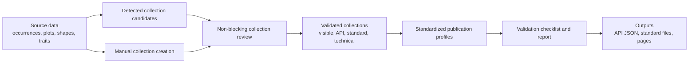

# Standardized Export Profiles

## Summary

Define a target product model for standardized exports in Niamoto: detected collections become reviewable and adjustable, standards become publication profiles with validation, and Darwin Core Occurrence and Humboldt/Event are treated as distinct profiles that can produce API JSON and standard publication files.

---

## Problem Frame

Niamoto currently organizes transformed data around aggregate collections such as taxons, plots, and shapes. That works well for website pages and static JSON APIs, but it creates ambiguity for biodiversity standards. The historical `dwc_occurrence_json` export is not a generic collection format; it publishes Darwin Core occurrence records, usually by transforming occurrence source data and contextualizing it with taxon data.

This becomes misleading when a user opens a plot collection and sees a Darwin Core option as though plots could directly become Darwin Core occurrences. A plot can be related to occurrences, and it may sometimes represent an inventory or sampling context, but it is not automatically an occurrence-level output. The more serious risk is not poor ergonomics; it is giving users confidence to publish a false Darwin Core output.

Humboldt/Eco makes this distinction more important. The Humboldt Extension is designed to describe ecological inventories and extends Darwin Core vocabulary for `dwc:Event` records, not `dwc:Occurrence` records. Plot-centered or inventory-centered Niamoto data may be relevant for Humboldt/Event outputs, but only when the source data and metadata support that interpretation.

---

## Conceptual Model

The important product distinction is that collections are Niamoto views over data, while standards are publication profiles with their own grain and validation rules.

---

## Actors

- A1. Ecology project maintainer: configures imports, collections, pages, APIs, and standards without hand-editing YAML for every decision.
- A2. Data publisher: needs confidence that standard exports are valid enough for downstream publication or exchange.
- A3. Advanced integrator: understands mappings and standards, and needs escape hatches for manual refinement.
- A4. Downstream planner or implementer: uses this document to design implementation without inventing product behavior or scope boundaries.

---

## Key Flows

- F1. Review detected collections after import
  - **Trigger:** Niamoto imports source data and detects collection candidates.
  - **Actors:** A1
  - **Steps:** Niamoto creates or proposes the detected collections, shows a non-blocking review step, and lets the user accept, rename, hide, re-role, or defer review of each candidate.
  - **Outcome:** Existing auto-detection remains fast, but collection meaning becomes explicit and correctable.
  - **Covered by:** R1, R2, R3, R4, R5

- F2. Create a collection from a source or aggregation
  - **Trigger:** The user needs a collection that was not created automatically, such as an occurrence-centered collection or an inventory/event-centered view.
  - **Actors:** A1, A3
  - **Steps:** The user asks to add a collection, Niamoto presents plausible source or aggregation choices, the user chooses the intended grain and role, then names the collection.
  - **Outcome:** Niamoto can represent collections that exist for API or standards without pretending they are normal visible pages.
  - **Covered by:** R6, R7, R8, R9

- F3. Configure a standardized publication profile
  - **Trigger:** The user wants a Darwin Core Occurrence or Humboldt/Event output.
  - **Actors:** A1, A2, A3
  - **Steps:** Niamoto evaluates compatible collections and source relations, presents a profile with compatibility status, shows required and recommended mapping gaps, and lets the user configure or refine the profile.
  - **Outcome:** Standards are selected as validated publication profiles, not as opaque collection formats.
  - **Covered by:** R10, R11, R12, R13, R14, R15

- F4. Validate before publication
  - **Trigger:** The user previews, exports, or marks a standard profile as publishable.
  - **Actors:** A2, A3
  - **Steps:** Niamoto runs validation, shows a checklist summary, offers a detailed report, and blocks “conformant” status when critical errors remain.
  - **Outcome:** Users can export drafts or partial outputs with warnings, but cannot accidentally present invalid output as conformant.
  - **Covered by:** R16, R17, R18, R19, R20

---

## Requirements

**Collection detection and review**
- R1. Niamoto must keep automatic collection detection available so the import flow remains fast for existing projects.
- R2. Detected collections must become reviewable candidates rather than opaque, final product decisions.
- R3. The collection review must be non-blocking: users can continue with the current defaults and return to review later.
- R4. The review must let users adjust user-facing meaning, including naming, visibility, and role.
- R5. The review must expose when collection meaning is inferred with uncertainty, especially when a collection could be interpreted as a site, aggregation, occurrence view, or inventory context.

**Manual collection creation**
- R6. Users must be able to create a collection manually from a source dataset or plausible aggregation path.
- R7. Manual creation must allow collections that are not intended as website pages.
- R8. A collection must support explicit roles such as site, API, standard, technical, or combinations of those roles.
- R9. Manual collection creation must help users choose intended grain from the available data rather than relying only on collection names.

**Standardized publication profiles**
- R10. Standard outputs must be modeled as publication profiles, not as ordinary collection formats.
- R11. Darwin Core Occurrence must be represented as an occurrence-grain profile whose source is occurrence data, optionally filtered or contextualized by aggregate collections.
- R12. Humboldt/Event must be represented as an event or inventory-grain profile, not as an occurrence profile.
- R13. Aggregate collections such as taxons, plots, and shapes may expose standard profile compatibility only when their relation to the target grain is explicit.
- R14. Standard profile compatibility must be permissive with warnings: plausible profiles can be started even when required or recommended information is incomplete.
- R15. Standard profiles must support multiple output types, including static API JSON and standard publication files.

**Validation and publication safety**
- R16. Niamoto must not label a standard output as conformant while critical validation errors remain.
- R17. Validation must include a visible checklist summary for each standard profile.
- R18. Validation must also provide a detailed report for advanced review, debugging, or handoff.
- R19. Validation must distinguish critical errors, warnings, missing recommended information, and draft or partial states.
- R20. Validation must check both mapping structure and product semantics, including whether the chosen collection or source can legitimately produce the standard’s expected grain.

**User understanding**
- R21. The UI must explain the difference between collection, source data, standard profile, and output format in domain language.
- R22. Existing simple JSON API exports must remain available for collection-centered data and must not be confused with standard-conformance workflows.
- R23. The current Darwin Core occurrence export should be described as a Darwin Core Occurrence profile output rather than as a generic Darwin Core collection format.

---

## Acceptance Examples

- AE1. **Covers R1, R2, R3, R4, R5.** Given an import that detects taxon, plot, and shape collections, when the import finishes, Niamoto keeps those defaults available and offers a non-blocking review where the user can rename, hide, or re-role each detected collection.
- AE2. **Covers R6, R7, R8, R9.** Given source occurrence data that was not exposed as a visible collection, when the user adds a collection manually, Niamoto can offer an occurrence-centered collection that may be technical, API-only, visible, standard-oriented, or any compatible combination.
- AE3. **Covers R10, R11, R13, R23.** Given a taxon collection related to occurrence data, when the user opens standard export options, Niamoto can offer Darwin Core Occurrence as an occurrence-grain profile filtered or grouped through taxons, rather than as a generic taxon collection format.
- AE4. **Covers R10, R12, R14, R20.** Given a plot collection with partial inventory metadata, when the user explores Humboldt/Event, Niamoto may offer it as a plausible profile but must show that the plot is not automatically a valid `dwc:Event` without sufficient evidence.
- AE5. **Covers R16, R17, R18, R19.** Given a standard profile missing critical fields, when the user validates it, Niamoto shows checklist failures and report details, permits draft or partial export when appropriate, but does not mark the profile conformant.
- AE6. **Covers R15, R22.** Given a collection with both simple API needs and standard publication needs, when the user configures outputs, Niamoto keeps simple JSON API separate from standard profile outputs such as API JSON and standard publication files.

---

## Success Criteria

- A project maintainer can understand why an occurrence standard belongs to occurrence-grain data, even when reached from a taxon, plot, or shape context.
- A data publisher cannot accidentally mark a false Darwin Core or Humboldt output as conformant.
- A user can keep the fast auto-detected collection workflow while gaining a path to review, correct, and extend detected collections.
- A user can create a technical or standard-oriented collection without forcing it to become a website page.
- A planner can proceed without inventing the product relationship between collections, grains, standard profiles, validation, and outputs.

---

## Scope Boundaries

### Deferred for later

- Detailed term-by-term Humboldt mapping rules.
- Exact validation rule catalogs for each standard profile.
- Exact UI layout for the collection review and standard profile editor.
- Migration behavior for every existing export configuration.
- Final implementation sequencing beyond the target progression described here.

### Outside this product's identity

- Treating any standard as a cosmetic JSON shape without validation.
- Treating `dwc_occurrence_json` as a universal export format for every collection.
- Replacing Niamoto’s collection model with a standards-only publishing tool.
- Removing automatic collection detection as a prerequisite for this model.
- Forcing all standard-oriented collections to be visible website pages.

---

## Key Decisions

- Hybrid model: Collections remain the natural workspace, but standards are publication profiles with their own grain and validation.
- Auto-detection stays: The existing fast path remains, but detected collections become reviewable and adjustable.
- Standards are permissive but honest: Users can start plausible profiles with warnings, but conformance requires passing critical validation.
- Darwin Core Occurrence is occurrence-grain: It can be filtered or contextualized through aggregate collections, but its output grain remains occurrences.
- Humboldt/Event is event or inventory-grain: Plot collections may be candidates, but they are not automatically valid Humboldt/Event outputs.
- Outputs are profile outputs: API JSON and standard files are outputs of a profile, not separate product concepts that each redefine the standard.
- Validation is first-class: Checklist and detailed report are part of the standard workflow, not an optional advanced afterthought.

---

## Dependencies / Assumptions

- Current API export UX work remains useful for simple JSON API and visual mapping, but the standard-profile model supersedes the idea that Darwin Core is just another collection export format.
- The historical Darwin Core occurrence configuration remains useful as an occurrence-profile output example, not as the general model for standards.
- Humboldt/Eco requires dedicated standard research during planning because it targets `dwc:Event` and inventory semantics.
- Compatibility detection will depend on source data, relations, and metadata quality; collection names alone are insufficient.
- The official Humboldt Extension reference is a source for profile semantics: https://eco.tdwg.org/terms/

---

## Outstanding Questions

### Deferred to Planning

- [Affects R5, R9, R13][Technical] What evidence should Niamoto use to infer collection grain and compatibility confidence from source data and relations?
- [Affects R12, R14, R20][Needs research] Which Humboldt/Event fields are critical, recommended, or optional for Niamoto’s first supported inventory profile?
- [Affects R16, R17, R18, R19][Technical] What validation severity model should be used for standard profiles, and how should draft, partial, invalid, and conformant states be represented?
- [Affects R15][Technical] Which standard file outputs should be supported first for Darwin Core Occurrence and Humboldt/Event?
- [Affects R4, R6, R8][Technical] How should existing auto-detected collections and manual collections be persisted without breaking current projects?
