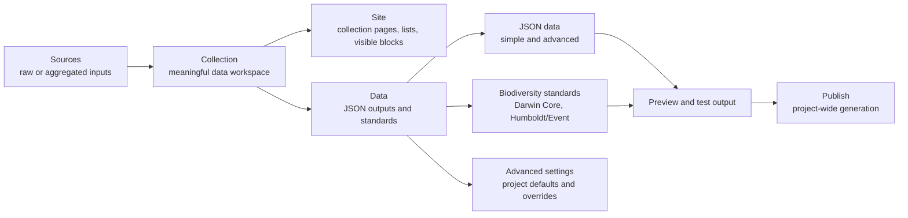

# Collections Data Outputs UX

## Summary

Redesign the collection output experience around user intent: sources feed a collection, collection-level site outputs serve human readers, and data outputs serve reuse, interoperability, and biodiversity publication. The collection Data workspace should guide users through JSON and standard outputs, recommend the next useful action only when evidence is strong enough, surface existing outputs before removing legacy entry points, and keep advanced technical configuration available without making it the default path.

---

## Problem Frame

The current collection workflow exposes multiple technical concepts side by side: blocks, list configuration, static API exports, standard profiles, global export settings, raw mappings, source paths, generators, and JSON configuration. These concepts are valid internally, but the interface asks users to understand Niamoto's architecture before they can decide what to do next.

This is especially risky in collection outputs. A maintainer who simply wants to make a collection reusable must choose between an Export tab and a Standards tab, then encounter free-form fields that require knowledge of transformed field names, JSON paths, Darwin Core terms, output patterns, or advanced configuration. Even if the engine is powerful, the normal user experience feels like editing machinery rather than choosing a publication outcome.

The primary observed signal is internal product friction rather than user-testing evidence: while exercising the interface, the product owner found it difficult to know where to go and what to do. This should be treated as a strong usability hypothesis to validate with future users, not as completed evidence.

---

## Actors

- A1. Project maintainer: configures a Niamoto project and wants to expose useful outputs without understanding low-level export configuration.
- A2. Scientific data manager: understands the dataset, fields, and publication goals, but does not want to hand-author JSON paths or standard mappings.
- A3. Advanced integrator: needs access to exact technical settings, raw JSON/YAML, output paths, and overrides.
- A4. Downstream planner or implementer: uses this document to plan implementation without inventing the product model.

---

## Conceptual Model

---

## Key Flows

- F1. Configure site-facing collection output
  - **Trigger:** A maintainer wants a collection to appear correctly in the generated site.
  - **Actors:** A1, A2
  - **Steps:** The user opens the collection, goes to the collection site-oriented workspace, reviews page/list status, edits visible blocks or listing behavior, and previews the result.
  - **Outcome:** Human-facing collection output is configured separately from machine-readable data output, while project-wide site ownership remains in the global Site and Publish areas.
  - **Covered by:** R1, R2, R3

- F2. Start from the recommended data action
  - **Trigger:** A user opens the collection Data workspace with no clear idea what to configure.
  - **Actors:** A1, A2
  - **Steps:** Niamoto evaluates the collection's available semantics, shows a primary recommended action only when the evidence is sufficient, otherwise shows an intent chooser, lists other output options by suitability, and lets the user start the relevant guided flow.
  - **Outcome:** The user sees a next action instead of a blank technical configuration surface.
  - **Covered by:** R4, R5, R6, R7, R8

- F3. Configure reusable JSON data
  - **Trigger:** A user wants a partner, script, website, or external app to reuse collection data.
  - **Actors:** A1, A2, A3
  - **Steps:** The user chooses JSON data, starts from a suggested configuration, selects fields from detected source data, reviews a representative preview, and optionally opens advanced customization.
  - **Outcome:** Simple JSON remains low-friction while custom JSON becomes an advanced extension of the same flow.
  - **Covered by:** R9, R10, R11, R12, R13

- F4. Configure a biodiversity standard output
  - **Trigger:** A user wants Darwin Core Occurrence or Humboldt/Event output.
  - **Actors:** A2, A3
  - **Steps:** Niamoto classifies standards as recommended, possible with verification, or not recommended; the user reviews why, maps required or recommended terms using guided controls, previews output, and generates a draft when appropriate.
  - **Outcome:** Standards are discoverable and permissive, but the UI remains honest about grain, missing terms, and validation state.
  - **Covered by:** R14, R15, R16, R17, R18

- F5. Access advanced settings without making them primary
  - **Trigger:** An advanced integrator needs exact output settings or project defaults.
  - **Actors:** A3
  - **Steps:** The user opens advanced settings from the Data workspace, reviews project defaults, overrides settings for a specific output when needed, and can inspect raw configuration.
  - **Outcome:** Power remains available without intimidating the normal path.
  - **Covered by:** R19, R20, R21

---

## Requirements

**Collection navigation and mental model**
- R1. Collection navigation must be organized around user-facing domains: source data, site output, and data output.
- R2. Static API exports and standard profiles must not appear as competing top-level collection tabs once existing outputs can be detected, surfaced, edited, and tested from the Data workspace.
- R3. Collection-level Site output must remain conceptually distinct from data output: pages, lists, and visible blocks serve human readers; JSON and standards serve reuse and publication. Project-wide site ownership and final generation remain in the global Site and Publish areas.

**Data workspace entry point**
- R4. The Data workspace must open on an intent-first assistant or dashboard rather than a raw technical form.
- R5. The first screen must show one primary recommended action for the active collection only when available evidence is sufficient and not contradictory; otherwise it must show an intent chooser with suitability explanations and no single default.
- R6. The first screen must also show a catalog of available data outputs grouped or ranked by suitability.
- R7. Recommendations must be based on collection semantics such as grain, role, source, relations, fields, and validation evidence rather than a fixed global default, and must expose the main evidence or missing-evidence reason in user-facing language.
- R8. Technical labels such as JSON, static API, Darwin Core, Humboldt/Event, mapping, and advanced configuration may remain visible, but they must support user intent rather than drive the primary choice.

**Reusable JSON outputs**
- R9. Simple JSON sharing must remain the default low-friction data output for collections where no stronger standard-specific recommendation applies.
- R10. Custom JSON must be treated as an advanced extension of simple JSON, not as an unrelated third output family.
- R11. JSON configuration must favor guided field selection over free-form field or path entry in the normal flow.
- R12. JSON field selection must expose enough context for users to recognize source fields, including detected names and representative values where available.
- R13. JSON outputs must provide a representative preview before users are expected to trust the configuration.

**Biodiversity standards**
- R14. Standard outputs must be presented as biodiversity publication choices inside the Data workspace, not as a separate collection universe.
- R15. Standard options must be classified as recommended, possible with verification, or not recommended for the active collection.
- R16. The standard flow must explain why an option has its classification in domain language.
- R17. Standard term mapping must favor guided term selection over free-form term entry in the normal flow.
- R18. Standard outputs must support draft preview or draft generation when plausible, while preserving validation safeguards for publication-grade files.

**Advanced settings and technical escape hatches**
- R19. Global output settings must remain accessible but must be treated as advanced project defaults rather than a primary collection destination.
- R20. Individual outputs may expose advanced overrides for users who need precise control.
- R21. Raw JSON/YAML or equivalent technical configuration access must remain available for advanced integrators, but not as the default editing mode.

**Execution boundary**
- R22. The Data workspace must allow configuration, preview, validation, and generating an individual test output.
- R23. Project-wide generation and final publication must remain the responsibility of the Publish area.

**First implementation slice**
- R24. The first implementation slice must prioritize consolidation and clarity over a complete recommendation engine: reuse the existing Export and Standards capabilities, show configured outputs, and replace the highest-friction free-form inputs first.
- R25. The first slice may use only metadata already available in the collection catalog, export configuration, standard profiles, source fields, and validation results. Richer semantic inference and ML-assisted recommendations belong to later slices unless they can be delivered without widening the first slice.
- R26. Any old Export or Standards entry point must remain discoverable until existing static API exports and standard profiles are represented inside Data with equivalent edit, preview, and test actions.

**Data options contract**
- R27. The Data workspace must be backed by a collection-scoped read model, such as `GET /api/collections/{collection_name}/data-options`, rather than assembling recommendations only in React from unrelated endpoints.
- R28. The Data options contract must return configured outputs, available output options, suitability or classification, reasons, evidence, confidence, and a nullable primary action.
- R29. The Data options contract must define fallbacks for missing semantics, empty source data, unavailable previews, upstream errors, and incompatible outputs.

**Configured workspace states**
- R30. When no data output exists, Data prioritizes the recommendation or intent chooser, then the suitability catalog, then advanced settings.
- R31. When one or more data outputs already exist, Data prioritizes configured outputs and their status, then unresolved recommendations, then advanced settings. Each configured output must have clear edit, preview, validate, and test actions.
- R32. Data must make the selected output context explicit so compatibility, validation, previews, and generation controls never look global when they apply to one configured output.

**Guided selectors**
- R33. Guided source-field and standard-term selectors must support search, filtering, required and recommended groups, representative values when safe, missing-field states, conflict states, and an advanced custom entry path.
- R34. Selectors must define mapping cardinality and save behavior: whether one source field can map to multiple terms, whether one term can combine multiple sources, how conflicts are shown, and when custom references are allowed.

**Preview, validation, and test output states**
- R35. Representative previews must declare their sample basis, row count, source snapshot where available, omitted or invalid fields, and whether the preview is illustrative rather than exhaustive.
- R36. Preview and test-generation UI must cover loading, no representative data, partial mappings, validation warnings, blocking validation errors, generation success with output location, and generation failure with retry or technical details.
- R37. Individual test or draft outputs generated from Data must be written to an isolated non-public preview location, marked as drafts, kept separate from Publish outputs, and governed by an explicit cleanup or retention policy.

**Standard classification actions**
- R38. Standard classification states must have explicit action rules:
  - Recommended: allow guided configuration, preview, validation, and draft generation.
  - Possible with verification: allow configuration and draft generation with visible warnings and required validation review.
  - Not recommended: explain why, disable normal draft generation, and allow override only through an advanced path when technically valid.
- R39. Publication-grade standard output must be blocked when validation has critical errors or when the rule coverage for the selected standard is incomplete. Incomplete standard support can generate draft artifacts only when they are clearly labeled as drafts.
- R40. This requirements slice is limited to Darwin Core Occurrence and Humboldt/Event. Any other biodiversity standard requires a separate requirements document or explicit scope expansion.

**Disclosure and safe output controls**
- R41. Each reusable JSON or standard output must declare its intended audience and apply field minimization before generating shareable or publication-oriented artifacts.
- R42. Field selectors, representative values, previews, drafts, and generated outputs must respect sensitivity metadata when available, mask restricted values by default, and avoid writing preview contents to application logs.
- R43. Raw configuration, output-path overrides, and archive filename overrides must be available only in advanced contexts, must be schema-validated before saving, and must be constrained to approved project or export roots.

**Advanced settings information architecture**
- R44. Project-level output defaults must live in an advanced project-defaults area reachable from Data but visually secondary to configured outputs and guided flows.
- R45. Per-output overrides must live inside the relevant output detail, with a clear return path to the guided configuration.
- R46. Raw JSON/YAML editing must be presented as an advanced mode for exact configuration inspection or repair, not as the normal creation flow.

**Accessibility and responsive behavior**
- R47. Data navigation, output cards, selectors, previews, validation messages, and generation controls must support keyboard navigation, visible focus order, accessible labels, and screen-reader-readable status changes.
- R48. The Data workspace must define a small-screen layout that preserves the relationship between configured outputs and their detail panels without text overlap, hidden validation state, or inaccessible actions.

---

## Acceptance Examples

- AE1. **Covers R1, R2, R3, R26.** Given a user opens a collection, when they look at the collection tabs, they see a clear distinction between source data, collection site-facing output, and data-facing output; any legacy Export or Standards access remains only until its configured outputs are visible inside Data.
- AE2. **Covers R4, R5, R6, R7, R8, R27, R28, R29.** Given a collection with no configured data outputs and enough semantic evidence, when the user opens Data, Niamoto shows a recommended next action, the evidence behind it, and a ranked set of other options instead of an empty editor.
- AE3. **Covers R4, R5, R6, R7, R8, R27, R28, R29.** Given a collection has missing or contradictory recommendation evidence, when the user opens Data, Niamoto shows an intent chooser and suitability explanations rather than pretending one output is clearly recommended.
- AE4. **Covers R9, R10, R11, R12, R13, R33, R34.** Given a user chooses reusable JSON, when they configure fields, they choose from searchable detected source fields with safe representative context and can fall back to advanced custom entry only when needed.
- AE5. **Covers R13, R22, R23, R35, R36, R37.** Given a user previews or test-generates a data output, when the preview or draft completes, Niamoto shows sample basis, row count, warnings or errors, draft location, and keeps the artifact separate from final Publish outputs.
- AE6. **Covers R14, R15, R16, R17, R18, R38, R39, R40.** Given a collection may plausibly support Darwin Core through occurrence data, when the user opens standard outputs, Niamoto explains the classification, lets the user start a draft only when allowed, and blocks publication-grade output when validation or rule coverage is insufficient.
- AE7. **Covers R19, R20, R21, R43, R44, R45, R46.** Given an advanced integrator needs output paths or raw configuration, when they open advanced settings, they can reach validated project defaults, per-output overrides, and raw configuration without those controls appearing in the normal first-run path.
- AE8. **Covers R24, R25.** Given implementation starts, when the first slice is planned, it reuses current export and standard-profile capabilities, uses only available metadata, and defers richer semantic inference unless it is clearly bounded.
- AE9. **Covers R30, R31, R32.** Given a collection already has configured data outputs, when the user opens Data, configured outputs and status appear first, each detail panel is clearly scoped to the selected output, and recommendations do not displace existing work.
- AE10. **Covers R41, R42.** Given a field is marked restricted or sensitive, when selectors, previews, drafts, or generated outputs are shown, Niamoto masks or omits restricted values unless an explicit allowed audience and review path permits disclosure.
- AE11. **Covers R47, R48.** Given a user navigates Data by keyboard, screen reader, or small viewport, when they use selectors, previews, validation messages, and generation controls, all actions and statuses remain reachable and understandable without layout overlap.

---

## Success Criteria

- A project maintainer can open a collection and understand the next data-output action without knowing the difference between internal export targets and standard profiles.
- A scientific data manager can configure common JSON or biodiversity-standard outputs without typing unknown source paths or standard terms from memory.
- An advanced integrator can still reach precise settings and raw configuration without the main flow being shaped around those settings.
- The Data workspace reduces fear of breaking configuration by using evidence-backed recommendations, guided selectors, validation, representative previews, and isolated test outputs.
- Existing static API exports and standard profiles remain discoverable during the transition and are represented in Data before legacy entry points are hidden.
- Shareable outputs are harder to publish accidentally because drafts, sensitive fields, advanced paths, and publication-grade generation have explicit gates.
- A planner can proceed without inventing the relationship between collection navigation, JSON outputs, standard outputs, advanced settings, and Publish.

---

## Scope Boundaries

- This does not rewrite the export engine or remove current configuration power.
- This does not remove raw JSON/YAML or advanced settings access.
- This does not make the guided assistant mandatory for every edit once outputs already exist.
- This does not define full Humboldt/Event rule coverage.
- This does not add biodiversity standards beyond Darwin Core Occurrence and Humboldt/Event in this requirements slice.
- This does not redesign the whole Publish area beyond clarifying that final project-wide publication remains there.
- This does not require automatic migration of all existing exports into a new model, but it does require Data to detect and surface existing static API exports and standard profiles before old entry points disappear.
- This does not create a standalone custom-format product separate from JSON output.
- This does not require ML-assisted recommendation in the first slice.

---

## Key Decisions

- Use `Sources / Site / Data` as the product-level collection model: this matches how users think about input, collection-level human-facing output, and reusable data output.
- Merge static API exports and standard profiles into the Data workspace only when existing configured outputs can be detected and surfaced there: both are data outputs, even though their validation and configuration differ.
- Make the Data entry point evidence-guided rather than blindly recommendation-led: the highest-value fix is helping users know where to go and what to do next without overclaiming when the system lacks evidence.
- Keep technical vocabulary visible but secondary: terms like JSON and Darwin Core are useful anchors, but they should not be the first decision users must decode.
- Treat custom JSON as advanced JSON: this avoids creating a third conceptual family and preserves the simple path.
- Keep standards permissive but pedagogical: users can start plausible drafts, but the interface must clearly explain risks and validation gaps.
- Hide global settings from the main path without removing them: advanced users keep power while normal users avoid intimidating project-wide forms.
- Keep Data and Publish separate: Data is for configuration and testing; Publish is for final project-wide generation.
- Start with a narrow implementation slice: consolidate current capabilities first, then improve recommendation intelligence as semantic evidence becomes reliable.

---

## Dependencies / Assumptions

- The existing standardized export profiles work remains the foundation for standard outputs, but its UI surface needs to be absorbed into the Data workspace.
- The previous API export UX simplification work remains useful for guided JSON editing, synchronized advanced configuration, and representative previews.
- Recommendation quality depends on semantic collection metadata such as grain, roles, source, relations, and validation evidence.
- The first slice assumes recommendation evidence will sometimes be incomplete; the UI and Data options contract must support a no-primary-action state.
- Existing static API exports and standard profiles must be discoverable from current configuration sources before collection-level navigation can safely hide their old entry points.
- Sensitivity metadata may be incomplete in early projects; where it is missing, Data should default to minimization and explicit review for shareable outputs rather than broad disclosure.
- The current concern is based on product-owner experience, not yet direct user testing; follow-up validation with real maintainers or data managers should be considered.
- Existing documentation to reconcile during planning includes `docs/brainstorms/2026-03-31-api-export-ux-simplification-brainstorm.md` and `docs/brainstorms/2026-04-29-standardized-export-profiles-requirements.md`.

---

## Outstanding Questions

### Deferred to Planning

- [Affects R1, R2, R3][Product/UX] What exact collection navigation transition minimizes disruption for current users while moving toward Sources / Site / Data?
- [Affects R1, R2, R3][Product/UX] What would invalidate the Sources / Site / Data model in user testing, and when should a visible Standards or Export entry remain?
- [Affects R5, R6, R7, R27, R28, R29][Technical] What recommendation inputs are already available, which should appear in the first Data options contract, and which need later derivation?
- [Affects R11, R12, R17][Technical] Which current free-form fields can be replaced by selectors in the first vertical slice?
- [Affects R13, R18, R22, R35, R36, R37][Technical] Which previews and test-generation actions can reuse existing output preview behavior, and which need isolated draft output storage?
- [Affects R19, R20, R21][Product/UX] Where should advanced project defaults live so they remain findable without looking like the normal workflow?
- [Affects R41, R42, R43][Product/Security] What sensitivity metadata exists today, and what should Data do when no sensitivity classification is available?
- [Affects R47, R48][UX/Engineering] What minimum small-screen and accessibility behavior should be included in the first implementation slice?
