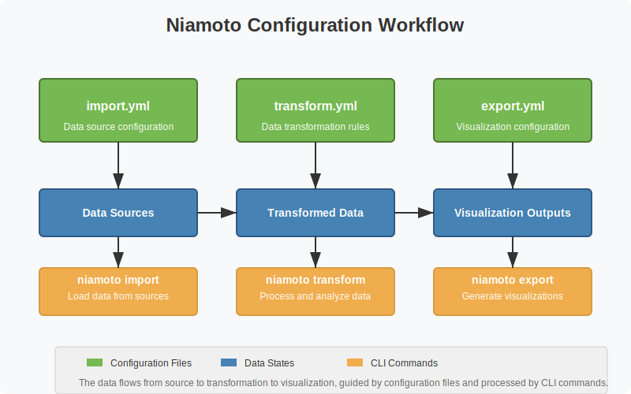
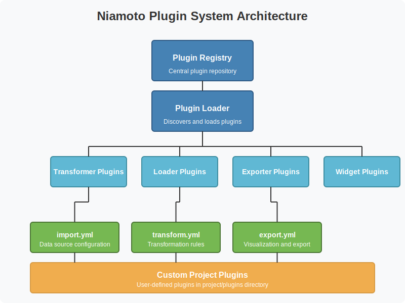
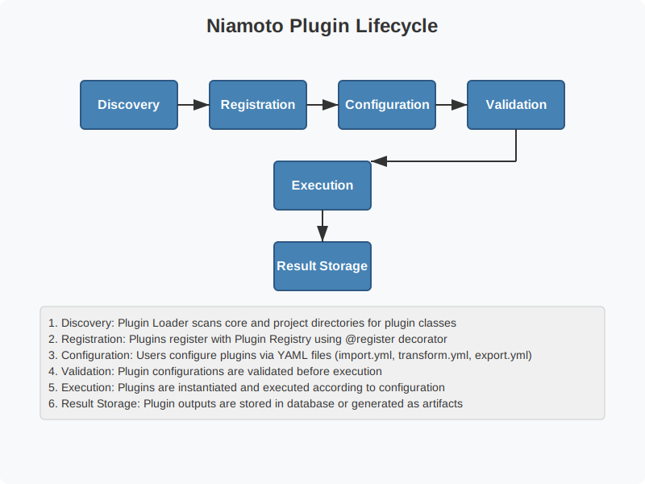

# Niamoto Configuration Reference

## Table of Contents

- [Niamoto Configuration Reference](#niamoto-configuration-reference)
  - [Table of Contents](#table-of-contents)
  - [Introduction](#introduction)
  - [Configuration Files Overview](#configuration-files-overview)
  - [config.yml](#configyml)
  - [import.yml](#importyml)
    - [Taxonomy Configuration](#taxonomy-configuration)
      - [Method 1: Dedicated Taxonomy CSV File](#method-1-dedicated-taxonomy-csv-file)
      - [Method 2: Extraction from Occurrences](#method-2-extraction-from-occurrences)
      - [API Enrichment (Optional)](#api-enrichment-optional)
    - [Plots Configuration](#plots-configuration)
      - [Hierarchical Plot Structure](#hierarchical-plot-structure)
        - [CSV Structure Example](#csv-structure-example)
        - [Field Mapping](#field-mapping)
        - [Navigation Generation](#navigation-generation)
        - [Example with Hierarchical Navigation Widget](#example-with-hierarchical-navigation-widget)
        - [Best Practices](#best-practices)
    - [Occurrences Configuration](#occurrences-configuration)
    - [Shape Statistics Configuration](#shape-statistics-configuration)
    - [Shapes Configuration](#shapes-configuration)
    - [Layers Configuration](#layers-configuration)
  - [transform.yml](#transformyml)
    - [Group Configuration](#group-configuration)
    - [Source Configuration](#source-configuration)
    - [Transformation Plugins](#transformation-plugins)
    - [Plugin Reference](#plugin-reference)
      - [Example Configurations](#example-configurations)
  - [export.yml](#exportyml)
    - [Basic Structure](#basic-structure)
    - [Available Widget Types](#available-widget-types)
    - [Widget Configuration Reference](#widget-configuration-reference)
      - [info\_grid](#info_grid)
      - [interactive\_map](#interactive_map)
      - [bar\_plot](#bar_plot)
      - [donut\_chart](#donut_chart)
      - [radial\_gauge](#radial_gauge)
      - [line\_plot](#line_plot)
      - [stacked\_area\_plot](#stacked_area_plot)
      - [sunburst\_chart](#sunburst_chart)
      - [hierarchical\_nav\_widget](#hierarchical_nav_widget)
  - [Configuration Relationships](#configuration-relationships)
  - [Best Practices](#best-practices-1)
  - [FAQ](#faq)
  - [Diagrams](#diagrams)
    - [Configuration Overview](#configuration-overview)

## Introduction

Niamoto uses a "Configuration over code" philosophy, with YAML configuration files directing data import, transformation, and visualization. This reference document provides detailed information about each configuration file, its structure, and available options.

## Configuration Files Overview

Niamoto uses four main YAML configuration files:

- **config.yml**: Global configuration settings for the application
- **import.yml**: Data source definitions and import parameters
- **transform.yml**: Data transformation and calculation rules
- **export.yml**: Visualization and UI configuration

These files work together in a pipeline, where:

1. `import.yml` defines **where** to get data from
2. `transform.yml` defines **what** calculations to perform
3. `export.yml` defines **how** to present the results

## config.yml

The global configuration file contains system-level settings.

```yaml
database:
  path: db/niamoto.db
logs:
  path: logs
exports:
  web: exports      # web root directory
  api: exports/api  # api root directory
  files: exports/files # static files directory
plugins:
  path: plugins     # project plugins directory
```

| Section    | Option  | Description                          | Required | Default         |
| ---------- | ------- | ------------------------------------ | -------- | --------------- |
| `database` | `path`  | Path to SQLite database file         | Yes      | `db/niamoto.db` |
| `logs`     | `path`  | Directory for log files              | Yes      | `logs`          |
| `exports`  | `web`   | Root directory for generated website | Yes      | `exports`       |
| `exports`  | `api`   | Directory for API JSON files         | Yes      | `exports/api`   |
| `exports`  | `files` | Directory for other exported files   | Yes      | `exports/files` |
| `plugins`  | `path`  | Directory for custom plugins         | Yes      | `plugins`       |

## import.yml

This file defines data sources for import into the Niamoto system.

### Taxonomy Configuration

Niamoto offers two methods for importing taxonomy data:

#### Method 1: Dedicated Taxonomy CSV File

```yaml
taxonomy:
  type: csv
  path: "imports/taxonomy.csv"
  source: "file"  # Explicit but optional as it's the default value
  identifier: "id_taxon"
  ranks: "id_famille,id_genre,id_espèce,id_sous-espèce"
```

This method requires a structured CSV file with the following columns:

| Column           | Description                                          |
| ---------------- | ---------------------------------------------------- |
| `id_taxon`       | Unique identifier of the taxon                       |
| `full_name`      | Full name of the taxon                               |
| `rank_name`      | Taxonomic rank (e.g., famille, genre, espèce)        |
| `id_famille`     | Identifier of the family to which the taxon belongs  |
| `id_genre`       | Identifier of the genus to which the taxon belongs   |
| `id_espèce`      | Identifier of the species to which the taxon belongs |
| `id_sous-espèce` | Infraspecific identifier of the taxon                |
| `authors`        | Authors of the taxon name                            |

#### Method 2: Extraction from Occurrences

```yaml
taxonomy:
  type: csv
  path: "imports/occurrences.csv"  # Path to occurrences file
  source: "occurrence"  # Indicates to extract taxonomy from occurrences
  ranks: "family,genus,species,infra"
  occurrence_columns:
    taxon_id: "id_taxonref"
    family: "family"
    genus: "genus"
    species: "species"
    infra: "infra"
    authors: "taxonref"  # Can extract authors from taxonref
```

This method extracts taxonomy directly from the occurrences file, with mappings defined in `occurrence_columns`.

#### API Enrichment (Optional)

For detailed information about the API taxonomy enrichment features, refer to the [API Taxonomy Enrichment Guide](api_taxonomy_enrichment.md).

```yaml
api_enrichment:
  enabled: true
  plugin: "api_taxonomy_enricher"
  api_url: "https://api.example.com/v1/taxons"
  auth_method: "api_key"
  auth_params:
    key: "your-api-key"
    location: "header"
    name: "apiKey"
  # Additional configuration...
```

### Plots Configuration

Options for importing plot data with support for hierarchical relationships.

```yaml
plots:
  type: csv  # or vector
  path: "imports/plots.csv"
  identifier: "id_plot"
  locality_field: "plot"
  location_field: "geo_pt"
  link_field: "locality"
  occurrence_link_field: "plot_name"
```

| Option                  | Description                          | Required | Example               |
| ----------------------- | ------------------------------------ | -------- | --------------------- |
| `type`                  | Data source type (`csv` or `vector`) | Yes      | `csv`                 |
| `path`                  | Path to source file                  | Yes      | `"imports/plots.csv"` |
| `identifier`            | Field with plot identifier           | Yes      | `"id_plot"`           |
| `locality_field`        | Field with locality name             | Yes      | `"plot"`              |
| `location_field`        | Field with geometry data             | Yes      | `"geo_pt"`            |
| `link_field`            | Field in plot_ref for links          | No       | `"locality"`          |
| `occurrence_link_field` | Field in occurrences for links       | No       | `"plot_name"`         |

#### Hierarchical Plot Structure

Niamoto supports a three-level hierarchy for organizing plots:

1. **Plot** (lowest level) - Individual sampling locations
2. **Locality** (middle level) - Geographical groupings of plots
3. **Country** (highest level) - Country or territory containing localities

This hierarchy is automatically established through the CSV data structure. Here's how to configure it:

##### CSV Structure Example

Your plots CSV file should include columns that define the hierarchy:

```csv
id_plot,plot,locality,country,lat,lon,geo_pt
PLOT001,Forest Plot A,Mont-Dore,Nouvelle-Calédonie,-22.2666,166.4535,"POINT(166.4535 -22.2666)"
PLOT002,Forest Plot B,Mont-Dore,Nouvelle-Calédonie,-22.2750,166.4620,"POINT(166.4620 -22.2750)"
PLOT003,Coastal Plot,Nouméa,Nouvelle-Calédonie,-22.2758,166.4580,"POINT(166.4580 -22.2758)"
```

##### Field Mapping

The hierarchical structure is built using these fields:

- **plot**: The name of the individual plot (maps to `locality_field`)
- **locality**: The locality containing the plot
- **country**: The country or territory

##### Navigation Generation

The hierarchical structure enables automatic generation of navigation widgets that allow users to:

- Browse plots by country → locality → plot
- See aggregated statistics at each level
- Navigate between related plots in the same locality

##### Example with Hierarchical Navigation Widget

```yaml
# In export.yml
hierarchical_nav:
  type: hierarchical_nav_widget
  title: "Browse Plots"
  description: "Navigate through plots by location"
  source: plot_hierarchy
  options:
    levels:
      - field: "country"
        label: "Country"
        icon: "fa-globe"
      - field: "locality"
        label: "Locality"
        icon: "fa-map-marker"
      - field: "plot"
        label: "Plot"
        icon: "fa-tree"
```

##### Best Practices

1. **Consistent Naming**: Use standardized names for localities and countries
2. **Complete Hierarchy**: Ensure every plot has both locality and country values
3. **Unique Identifiers**: Plot identifiers should be globally unique
4. **Coordinate Validation**: Verify that plot coordinates fall within their declared locality/country

### Occurrences Configuration

Options for importing occurrence data.

```yaml
occurrences:
  type: csv
  path: "imports/occurrences.csv"
  identifier: "id_taxonref"
  location_field: "geo_pt"
```

| Option           | Description                 | Required | Example                     |
| ---------------- | --------------------------- | -------- | --------------------------- |
| `type`           | Data source type            | Yes      | `csv`                       |
| `path`           | Path to source file         | Yes      | `"imports/occurrences.csv"` |
| `identifier`     | Field with taxon identifier | Yes      | `"id_taxonref"`             |
| `location_field` | Field with geometry data    | Yes      | `"geo_pt"`                  |

### Shape Statistics Configuration

```yaml
shape_stats:
  type: csv
  path: "imports/row_shape_stats.csv"
  identifier: "id"
```

| Option       | Description                 | Required | Example                         |
| ------------ | --------------------------- | -------- | ------------------------------- |
| `type`       | Data source type            | Yes      | `csv`                           |
| `path`       | Path to source file         | Yes      | `"imports/row_shape_stats.csv"` |
| `identifier` | Field with shape identifier | Yes      | `"id"`                          |

### Shapes Configuration

List of vector shapes to import.

```yaml
shapes:
  - category: "provinces"
    type: vector
    format: directory_shapefiles
    path: "imports/shapes/provinces"
    name_field: "nom"
    label: "Provinces"
    description: "Administrative boundaries of the provinces"
  # Additional shapes...
```

| Option        | Description          | Required | Example                          |
| ------------- | -------------------- | -------- | -------------------------------- |
| `category`    | Category identifier  | Yes      | `"provinces"`                    |
| `type`        | Data type            | Yes      | `vector`                         |
| `format`      | Vector format        | Yes      | `directory_shapefiles`           |
| `path`        | Path to source file  | Yes      | `"imports/shapes/provinces"`     |
| `name_field`  | Field with name      | Yes      | `"nom"`                          |
| `label`       | Human-readable label | Yes      | `"Provinces"`                    |
| `description` | Description          | No       | `"Administrative boundaries..."` |

### Layers Configuration

List of raster and vector layers to import.

```yaml
layers:
  - name: "forest_cover"
    type: vector
    format: shapefile
    path: "imports/layers/forest_cover.shp"
    description: "Forest cover layer"

  - name: "elevation"
    type: raster
    path: "imports/layers/mnt100.tif"
    description: "Digital elevation model"
  # Additional layers...
```

| Option        | Description                | Required | Example                     |
| ------------- | -------------------------- | -------- | --------------------------- |
| `name`        | Layer name                 | Yes      | `"forest_cover"`            |
| `type`        | Layer type                 | Yes      | `raster` or `vector`        |
| `format`      | Format (for vector layers) | No       | `shapefile`                 |
| `path`        | Path to source file        | Yes      | `"imports/layers/file.tif"` |
| `description` | Description                | No       | `"Forest cover layer"`      |

## transform.yml

This file defines data transformations that process the imported data.

### Group Configuration

Each transformation group begins with:

```yaml
- group_by: taxon  # or plot, shape
  source:
    # Source configuration
  widgets_data:
    # Transformation definitions
```

| Option         | Description             | Required | Example                     |
| -------------- | ----------------------- | -------- | --------------------------- |
| `group_by`     | Group type              | Yes      | `taxon`, `plot`, or `shape` |
| `source`       | Source configuration    | Yes      | See below                   |
| `widgets_data` | List of transformations | Yes      | See below                   |

### Source Configuration

```yaml
source:
  data: occurrences       # Source data table
  grouping: taxon_ref     # Table for grouping
  relation:
    plugin: nested_set    # Relation plugin
    key: taxon_ref_id     # Key field
    fields:               # Optional fields
      parent: parent_id
      left: lft
      right: rght
```

| Option            | Description        | Required | Example        |
| ----------------- | ------------------ | -------- | -------------- |
| `data`            | Source data table  | Yes      | `occurrences`  |
| `grouping`        | Table for grouping | Yes      | `taxon_ref`    |
| `relation.plugin` | Relation plugin    | Yes      | `nested_set`   |
| `relation.key`    | Key field          | Yes      | `taxon_ref_id` |
| `relation.fields` | Additional fields  | No       | See above      |

### Transformation Plugins

Each transformation is defined by a plugin and its parameters:

```yaml
widget_name:
  plugin: plugin_name
  params:
    # Plugin-specific parameters
```

### Plugin Reference

The following table lists common transformation plugins:

| Plugin                              | Description                              | Key Parameters                                   | Example Use                  |
| ----------------------------------- | ---------------------------------------- | ------------------------------------------------ | ---------------------------- |
| `field_aggregator`                  | Aggregates fields from different sources | `fields`                                         | General information          |
| `geospatial_extractor`              | Extracts geospatial data                 | `source`, `field`, `format`                      | Distribution maps            |
| `binary_counter`                    | Counts binary values                     | `source`, `field`, `true_label`, `false_label`   | Distribution by substrate    |
| `top_ranking`                       | Identifies top items in a dataset        | `source`, `field`, `target_ranks`, `count`       | Most common species          |
| `binned_distribution`               | Creates histogram data                   | `source`, `field`, `bins`                        | DBH distribution             |
| `statistical_summary`               | Calculates statistics                    | `source`, `field`, `stats`, `units`, `max_value` | Maximum height, wood density |
| `categorical_distribution`          | Distribution of categorical values       | `source`, `field`, `categories`, `labels`        | Life zone distribution       |
| `transform_chain`  | Chains multiple transformations ([detailed guide](../guides/transform_chain_guide.md))| `steps`              | Complex transformations      |
| `class_object_field_aggregator`     | Aggregates class object fields           | `fields`                                         | Shape statistics             |
| `class_object_binary_aggregator`    | Aggregates binary class objects          | `groups`                                         | Forest cover                 |
| `class_object_categories_extractor` | Extracts categories from class objects   | `class_object`, `categories_order`               | Land use                     |

For detailed documentation on each plugin, refer to the [Plugin Reference Guide](plugin_reference.md).

#### Example Configurations

**field_aggregator**:

```yaml
general_info:
  plugin: field_aggregator
  params:
    fields:
      - source: taxon_ref
        field: full_name
        target: name
      - source: taxon_ref
        field: rank_name
        target: rank
      - source: occurrences
        field: id
        target: occurrences_count
        transformation: count
```

**binned_distribution**:

```yaml
dbh_distribution:
  plugin: binned_distribution
  params:
    source: occurrences
    field: dbh
    bins: [10, 20, 30, 40, 50, 75, 100, 200, 300, 400, 500]
```

**transform_chain**:

```yaml
phenology:
  plugin: "transform_chain"
  params:
    steps:
      - plugin: "time_series_analysis"
        params:
          source: occurrences
          fields:
            fleur: flower
            fruit: fruit
          time_field: month_obs
          labels: ["Jan", "Feb", "Mar", "Apr", "May", "Jun", "Jul", "Aug", "Sep", "Oct", "Nov", "Dec"]
        output_key: "phenology_raw"

      - plugin: "custom_calculator"
        params:
          operation: "peak_detection"
          time_series: "@phenology_raw.month_data"
          threshold: 30
        output_key: "phenology_peaks"
```

For a comprehensive explanation of the transform chain system, including advanced reference resolution, function application, and best practices, see the [Transform Chain Guide](../guides/transform_chain_guide.md).

## export.yml

This file defines how transformed data is visualized and exported through the static site generator. It specifies pages, their data sources, and the widgets used to visualize the data.

### Basic Structure

Each export group defines pages for a specific entity type:

```yaml
- group_by: taxon  # or plot, shape
  widgets:
    widget_name:
      type: widget_type
      config:
        # Widget configuration
```

### Available Widget Types

Niamoto provides a comprehensive set of widgets for data visualization:

| Type                    | Description                              | Use Case                        |
| ----------------------- | ---------------------------------------- | ------------------------------- |
| `info_grid`             | Grid of key metrics and information     | KPIs, stats, general info       |
| `interactive_map`       | Interactive Plotly maps                  | Geographic distribution         |
| `bar_plot`              | Bar charts (grouped, stacked)            | Comparisons, distributions      |
| `donut_chart`           | Donut or pie charts                      | Proportions, compositions       |
| `radial_gauge`          | Gauge visualizations                     | Single metrics, percentages     |
| `line_plot`             | Line charts for trends                   | Time series, trends             |
| `stacked_area_plot`     | Stacked area charts                      | Evolution, cumulative data      |
| `sunburst_chart`        | Hierarchical sunburst charts             | Taxonomic/hierarchical data     |
| `hierarchical_nav_widget` | Interactive tree navigation            | Browsing hierarchical data      |
| `diverging_bar_plot`    | Bar plots with positive/negative values | Comparisons with baseline       |
| `scatter_plot`          | Scatter plot visualizations              | Correlations, distributions     |
| `summary_stats`         | Statistical summaries                    | Data overview                   |
| `table_view`            | Tabular data display                     | Detailed data                   |
| `raw_data_widget`       | Display raw data                         | Debug, raw data inspection      |

### Widget Configuration Reference

#### info_grid
Display a grid of key information items:

```yaml
general_info:
  type: info_grid
  config:
    title: "Forest Statistics"  # optional
    description: "Key metrics"  # optional
    grid_columns: 3  # optional, 1-6
    items:
      - label: "Total Area"
        source: stats.forest_area  # dot-notation path
        unit: "ha"
        icon: "fas fa-tree"
        description: "Total forest coverage"
      - label: "Status"
        value: "Protected"  # static value
        icon: "fas fa-shield-alt"
      - label: "Type"
        source: stats.forest_type
        format: "map"  # use mapping
        mapping:
          1: "Primary Forest"
          2: "Secondary Forest"
```

#### interactive_map
Interactive maps with scatter or choropleth layers:

```yaml
distribution_map:
  type: interactive_map
  config:
    title: "Species Distribution"
    map_type: "scatter_map"  # or 'choropleth_map'
    zoom: 9.0
    center_lat: -21.5
    center_lon: 165.5

    # Scatter map fields
    latitude_field: "lat"
    longitude_field: "lon"
    color_field: "species_count"
    size_field: "plot_area"
    size_max: 20
    hover_name: "plot_name"
    hover_data: ["elevation", "forest_type"]

    # Styling
    opacity: 0.8
    color_continuous_scale: "Viridis"
    range_color: [0, 100]
```

#### bar_plot
Bar charts with multiple configurations:

```yaml
species_by_family:
  type: bar_plot
  config:
    title: "Species by Family"
    x_axis: "family_name"
    y_axis: "species_count"

    # Optional configurations
    orientation: "v"  # 'v' or 'h'
    barmode: "group"  # 'group', 'stack', 'relative'
    sort_order: "descending"  # 'ascending', 'descending', null
    text_auto: true  # show values on bars

    # Color options
    color_field: "conservation_status"
    auto_color: true  # generate harmonious colors
    color_discrete_map:
      "Endangered": "#ff4444"
      "Vulnerable": "#ff8844"
      "Secure": "#44ff44"
```

#### donut_chart
Donut or pie charts:

```yaml
forest_types:
  type: donut_chart
  config:
    title: "Forest Type Distribution"
    labels_field: "forest_type"
    values_field: "area_hectares"
    hole_size: 0.3  # 0 for pie, 0.3 for donut

    # Label mapping
    label_mapping:
      "primary": "Primary Forest"
      "secondary": "Secondary Forest"
      "plantation": "Forest Plantation"
```

#### radial_gauge
Gauge visualizations for metrics:

```yaml
forest_coverage:
  type: radial_gauge
  config:
    title: "Forest Coverage"
    value_field: "coverage.percentage"  # supports nested paths
    min_value: 0
    max_value: 100
    unit: "%"

    # Styling
    gauge_shape: "angular"  # or 'bullet'
    bar_color: "green"
    steps:
      - range: [0, 30]
        color: "red"
      - range: [30, 70]
        color: "yellow"
      - range: [70, 100]
        color: "green"
```

#### line_plot
Line charts for trends:

```yaml
population_trends:
  type: line_plot
  config:
    title: "Population Trends"
    x_axis: "year"
    y_axis: "population"  # or list: ["pop_1", "pop_2"]

    # Line configuration
    color_field: "species_name"
    line_shape: "spline"  # 'linear', 'spline', 'hv', etc.
    markers: true  # show data points

    # Axis options
    log_y: false
    range_y: [0, 1000]
    labels:
      year: "Year"
      population: "Population Count"
```

#### stacked_area_plot
Stacked area charts:

```yaml
forest_evolution:
  type: stacked_area_plot
  config:
    title: "Forest Cover Evolution"
    x_field: "year"
    y_fields: ["primary_forest", "secondary_forest", "plantation"]

    # Styling
    fill_type: "tonexty"  # or 'tozeroy'
    colors: ["#2ca02c", "#8fbc8f", "#daa520"]
    axis_titles:
      x: "Year"
      y: "Area (hectares)"
```

#### sunburst_chart
Hierarchical sunburst charts:

```yaml
taxonomic_distribution:
  type: sunburst_chart
  config:
    title: "Taxonomic Distribution"
    branchvalues: "total"  # or 'remainder'

    # Label mapping
    category_labels:
      "plant": "Plants"
      "animal": "Animals"
    leaf_labels:
      "fern": "Ferns"
      "palm": "Palms"
      "bird": "Birds"
      "mammal": "Mammals"

    # Colors by category
    leaf_colors:
      plant:
        "fern": "#90ee90"
        "palm": "#228b22"
      animal:
        "bird": "#87ceeb"
        "mammal": "#daa520"
```

#### hierarchical_nav_widget
Interactive tree navigation:

```yaml
species_browser:
  type: hierarchical_nav_widget
  config:
    title: "Species Browser"
    referential_data: "taxon_ref"
    id_field: "taxon_id"
    name_field: "full_name"
    base_url: "taxon/"

    # Hierarchy structure (choose one)
    # Option 1: Parent-child
    parent_id_field: "parent_id"

    # Option 2: Nested set
    lft_field: "lft"
    rght_field: "rght"
    level_field: "level"

    # Display options
    show_search: true
```

## Configuration Relationships

The three main configuration files work together in a pipeline:

1. **import.yml** defines data sources:
   - `taxonomy`, `plots`, `occurrences`, etc.

2. **transform.yml** processes these sources with plugins:
   - References source tables from import.yml
   - Produces JSON data structures as output

3. **export.yml** visualizes the transformed data:
   - References output data by the `source` field
   - Creates visual representations of the data

For example:

- A `top_ranking` transformation in transform.yml produces data with `tops` and `counts` fields
- A `bar_chart` in export.yml references this with `source: top_species` and maps `tops` to labels and `counts` to values

## Best Practices

1. **Consistent naming**: Use consistent naming throughout your configuration files
2. **Comment your configuration**: Add comments to explain complex transformations
3. **Keep transformations focused**: Each transformation should do one thing well
4. **Start simple**: Begin with simple transformations and build complexity gradually
5. **Validate your data**: Ensure your source data meets the expected format
6. **Test incrementally**: Test each step of your configuration pipeline independently

## FAQ

**Q: Can I use multiple data sources in a single transformation?**
A: Yes, many plugins like `field_aggregator` can reference multiple sources.

**Q: How do I debug a transformation that isn't working?**
A: Use `niamoto transform --verbose` to see detailed logs.

**Q: Can I extend Niamoto with custom transformations?**
A: Yes, you can create custom plugins in the `plugins/` directory.

**Q: How do widget names relate to transformation outputs?**
A: The widget name in transform.yml becomes the JSON field name in the database, which is then referenced by the `source` field in export.yml.

**Q: Can I change the appearance of widgets without changing the data?**
A: Yes, modify export.yml to change visualization without affecting data transformations.

## Diagrams

### Configuration Overview






