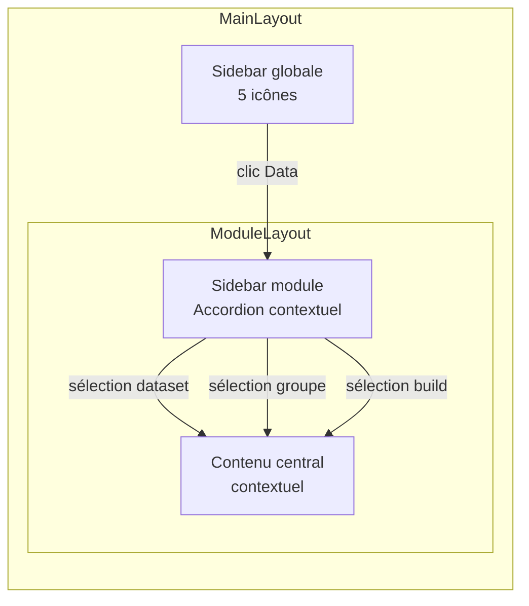

# Layout sidebar unifié pour Publish, Groups et Data

## Overview

Appliquer le pattern de layout fixe du **Site Builder** (header + sidebar + contenu) aux 3 modules restants : **Publish**, **Groups** et **Data (Sources)**. Actuellement ces modules utilisent un layout full-width plat avec des cards et des navigations par sous-routes. Le SiteBuilder a prouvé l'efficacité d'un layout avec sidebar contextuelle (Accordion + sélection → éditeur contextuel).

## Problem Statement / Motivation

Le SiteBuilder est le seul module avec une vraie sidebar de navigation contextuelle (SiteTree + ResizablePanel). Les 3 autres modules forcent l'utilisateur à naviguer par routes (`/publish/build`, `/groups/taxon`, `/sources/dataset/occurrences`) au lieu de basculer rapidement entre les éléments via la sidebar.

**Incohérence UX** : l'utilisateur apprend un pattern dans le Site Builder, mais les autres modules fonctionnent différemment. Unifier les layouts crée une expérience prévisible.

**Contexte perdu** : quand l'utilisateur navigue vers `/groups/taxon` puis revient à `/groups`, il perd le contexte. Avec une sidebar, la sélection est persistante.

## Proposed Solution

Créer un composant `ModuleLayout` réutilisable encapsulant le pattern `ResizablePanelGroup` (sidebar | contenu | preview optionnel), puis l'appliquer dans chaque module.

### Architecture

```
ModuleLayout (nouveau composant partagé)
├── ResizablePanelGroup direction="horizontal"
│   ├── ResizablePanel id="sidebar" (15%, 12-25%)
│   │   └── ScrollArea + Accordion sections (spécifique au module)
│   ├── ResizableHandle
│   └── ResizablePanel id="content" (85%, 30%+)
│       └── {children} (rendu contextuel basé sur la sélection)
```

---

## Analyse par module : contenu sidebar

### Module 1 — Data (Sources) `/sources`

Le module Data gère les datasets importés et les références. La sidebar liste ces entités pour navigation rapide.

**Sidebar — `DataTree`**

```
📊 Datasets                    [3]
  ├── occurrences              12 450 rows
  ├── plots                    89 rows
  └── shapes                   5 rows

📋 Références                  [2]
  ├── taxon                    hierarchical · 1 230
  └── communes                 generic · 33

⬇️ Import
  └── Importer des données     (action)
```

**Sélection → Contenu central :**

| Sélection | Composant affiché |
|-----------|------------------|
| (aucune / défaut) | `ImportDashboard` — vue d'ensemble existante |
| Dataset `occurrences` | `DatasetDetailPanel` — détail du dataset |
| Référence `taxon` | `ReferenceDetailPanel` — détail de la référence |
| Import | `ImportWizard` — wizard d'import |

**Données sidebar** : `useDatasets()` + `useReferences()` (hooks existants)

**Routes absorbées** : `/sources/dataset/:name`, `/sources/reference/:name`, `/sources/import` → deviennent des sélections internes, plus besoin de routes séparées (ou garder les routes pour deep-linking en mappant l'URL vers la sélection).

---

### Module 2 — Groups `/groups`

Le module Groups configure les widgets par groupe de référence. Chaque groupe a 3 onglets (Sources, Contenu, Liste).

**Sidebar — `GroupsTree`**

```
📁 Groupes                     [3]
  ├── taxon                    hierarchical · 12 widgets
  ├── communes                 generic · 8 widgets
  └── forêts                   spatial · 5 widgets

⚙️ Transformations
  └── Exécuter les calculs     (action)
```

**Sélection → Contenu central :**

| Sélection | Composant affiché |
|-----------|------------------|
| (aucune / défaut) | Vue d'ensemble — résumé de tous les groupes avec statuts |
| Groupe `taxon` | `GroupPanel` — le panneau existant avec ses 3 onglets |
| Transformations | Panel de lancement des transformations |

**Données sidebar** : `useReferences()` (hook existant)

**Routes absorbées** : `/groups/:name` → sélection interne dans la sidebar.

---

### Module 3 — Publish `/publish`

Le module Publish gère la génération (build) et le déploiement du site. Les étapes sont séquentielles.

**Sidebar — `PublishTree`**

```
📋 Vue d'ensemble              (dashboard)

📦 Génération
  └── Build                    ✅ 1 250 fichiers

🚀 Déploiement
  └── Deploy                   ✅ Cloudflare

📜 Historique
  └── Builds & Déploiements    [12]

👁️ Aperçu
  └── Voir le site généré      (action)
```

**Sélection → Contenu central :**

| Sélection | Composant affiché |
|-----------|------------------|
| (défaut) | Vue d'ensemble — dashboard résumé existant (cards statut + quick actions) |
| Build | `PublishBuild` — panel de build existant |
| Deploy | `PublishDeploy` — panel de déploiement existant |
| History | `PublishHistory` — historique existant |
| Preview | `StaticSitePreview` — aperçu iframe existant |

**Données sidebar** : `usePublishStore()` (store Zustand existant) pour les statuts build/deploy.

**Routes absorbées** : `/publish/build`, `/publish/deploy`, `/publish/history` → sélections internes.

---

## Technical Considerations

### Composant partagé `ModuleLayout`

```tsx
// components/layout/ModuleLayout.tsx
interface ModuleLayoutProps {
  sidebar: React.ReactNode       // Tree/Accordion du module
  children: React.ReactNode      // Contenu contextuel
  sidebarDefaultSize?: number    // Défaut 15
  sidebarMinSize?: number        // Défaut 12
  sidebarMaxSize?: number        // Défaut 25
}
```

Réutilise `ResizablePanelGroup`, `ResizablePanel`, `ResizableHandle` et `ScrollArea` déjà utilisés dans le SiteBuilder.

### Pattern de sélection

Chaque module définit son propre type de sélection :

```tsx
// Exemple pour Data
type DataSelection =
  | { type: 'overview' }
  | { type: 'dataset'; name: string }
  | { type: 'reference'; name: string }
  | { type: 'import' }

// Géré par useState local dans le composant page
const [selection, setSelection] = useState<DataSelection>({ type: 'overview' })
```

### Deep-linking (routes ↔ sélection)

Pour conserver la possibilité de deep-linking, synchroniser l'URL avec la sélection :

```tsx
// Option 1 : URL → sélection au mount (lecture du path)
// Option 2 : sélection → URL (pushState sans navigation React Router)
// Option 3 : garder les routes React Router, le module unique détecte le param
```

**Recommandation** : Option 3 — garder les routes existantes mais les résoudre toutes vers un composant unique qui lit les params et initialise la sélection. Cela préserve la compatibilité breadcrumbs et le deep-linking.

```tsx
// App.tsx — toutes les routes publish pointent vers PublishModule
<Route path="publish/*" element={<PublishModule />} />
```

### Impact sur les breadcrumbs

Le `routeLabels` dans `navigationStore.ts` reste pertinent : les breadcrumbs reflètent la sélection courante. Mettre à jour `setBreadcrumbs()` à chaque changement de sélection (pattern déjà utilisé dans les pages existantes).

### Responsive

La sidebar suit le même pattern que le SiteBuilder : visible sur desktop (≥1024px), cachée sur mobile avec un bouton toggle. `ResizablePanel` gère déjà le responsive.

---

## Acceptance Criteria

### Fonctionnel

- [x] Composant `ModuleLayout` créé et utilisé par les 3 modules
- [x] **Data** : sidebar liste datasets + références, clic → détail dans le panneau central
- [x] **Groups** : sidebar liste les groupes avec nombre de widgets, clic → `GroupPanel`
- [x] **Publish** : sidebar avec sections Build/Deploy/History/Preview, clic → panneau correspondant
- [x] Deep-linking préservé (URL directe vers un dataset/groupe/section fonctionne)
- [x] Breadcrumbs mis à jour à chaque changement de sélection
- [x] `StalenessBanner` toujours visible (dans le header ou au-dessus du contenu)

### Cohérence visuelle

- [x] Sidebar identique en style au SiteTree (Accordion, badges compteurs, hover states)
- [x] Même proportions de panels que le SiteBuilder (15/85 par défaut)
- [ ] Responsive : sidebar cachée sous 1024px

### Non-régression

- [x] Toutes les fonctionnalités existantes des 3 modules restent accessibles
- [x] Les hooks de données (`useDatasets`, `useReferences`, `usePublishStore`) ne changent pas
- [x] Les composants de détail existants (`GroupPanel`, `DatasetDetailPanel`, etc.) sont réutilisés tels quels

---

## Implementation Phases

### Phase 1 : `ModuleLayout` + Data module

**Fichiers à créer :**
- `components/layout/ModuleLayout.tsx` — layout partagé avec ResizablePanel
- `components/data/DataTree.tsx` — sidebar pour le module Data
- `components/data/DataModule.tsx` — orchestrateur sélection → contenu

**Fichiers à modifier :**
- `pages/sources/index.tsx` — utiliser DataModule
- `App.tsx` — consolider les routes `/sources/*`

### Phase 2 : Groups module

**Fichiers à créer :**
- `components/groups/GroupsTree.tsx` — sidebar pour le module Groups
- `components/groups/GroupsModule.tsx` — orchestrateur

**Fichiers à modifier :**
- `pages/groups/index.tsx` — utiliser GroupsModule
- `App.tsx` — consolider les routes `/groups/*`

### Phase 3 : Publish module

**Fichiers à créer :**
- `components/publish/PublishTree.tsx` — sidebar pour le module Publish
- `components/publish/PublishModule.tsx` — orchestrateur

**Fichiers à modifier :**
- `pages/publish/index.tsx` — utiliser PublishModule
- `App.tsx` — consolider les routes `/publish/*`

### Phase 4 : Polish

- Synchroniser l'URL (deep-linking) avec la sélection
- Mettre à jour les i18n pour les nouvelles clés sidebar
- Tester responsive (mobile, tablet, desktop)
- Vérifier la cohérence visuelle avec le SiteBuilder

---

## Diagramme de structure



---

## Dependencies & Risks

| Risque | Mitigation |
|--------|-----------|
| Perte de deep-linking | Synchroniser URL ↔ sélection via React Router params |
| Régression GroupPanel | Réutiliser le composant tel quel, sans modification |
| Sidebar trop étroite pour les noms longs | Truncation + tooltip (pattern déjà utilisé dans SiteTree) |
| Performance : chargement de tous les panels | Lazy rendering — ne rendre que le panel sélectionné |

## References

### Fichiers clés existants

- Pattern à suivre : `components/site/SiteBuilder.tsx:155-393` (SiteTree)
- Layout resizable : `components/site/SiteBuilder.tsx:1337-1434`
- Composants UI : `components/ui/resizable.tsx`, `components/ui/accordion.tsx`
- Hooks données : `hooks/useDatasets.ts`, `hooks/useReferences.ts`
- Store publish : `stores/publishStore.ts`
- Navigation store : `stores/navigationStore.ts`
- Pages existantes à refactorer : `pages/sources/index.tsx`, `pages/groups/index.tsx`, `pages/publish/index.tsx`

### Plan précédent

- Navigation simplification : `docs/plans/2026-03-11-refactor-gui-navigation-simplification-plan.md`
