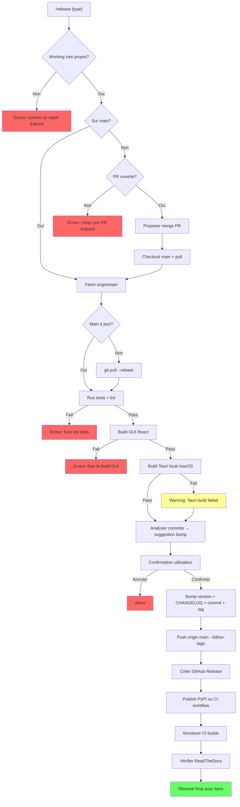

# Niamoto Release Automation Skill (`/release`)

## Overview

Skill Claude Code qui automatise l'intégralité du pipeline de release Niamoto : merge PR, bump de version, vérification des builds, publication PyPI, création de release GitHub, builds cross-platform (PyInstaller + Tauri), et rebuild de la documentation Sphinx/ReadTheDocs.

Mode **semi-automatique** : le skill exécute toutes les vérifications, présente un résumé, puis demande une seule confirmation avant de tout publier.

## Problem Statement

Le processus de release actuel est fragmenté et manuel :
- `bump2version` pour le versioning (4 fichiers synchronisés, mais pas `Cargo.toml`)
- `scripts/build/publish.sh` pour PyPI (script bash interactif)
- `scripts/build/build_gui.sh` pour le build React
- GitHub Actions `build-binaries.yml` déclenché manuellement sur tag push (PyInstaller uniquement)
- Pas de workflow CI pour les builds Tauri
- Pas de workflow CI pour la publication PyPI
- Pas de CHANGELOG.md
- Pas de vérification pré-release intégrée
- ReadTheDocs rebuild déclenché par webhook sur push (non vérifié)

**Risques du processus actuel** : oubli d'un fichier de version, publication avec des tests cassés, versions désynchronisées entre Python et Tauri, pas de traçabilité des changements.

## Proposed Solution

Un skill Claude Code `/release` qui orchestre le pipeline complet en 3 phases :

```
Phase 1: PREFLIGHT (vérifications locales + CI)
Phase 2: PREPARE (bump, changelog, commit, tag)
Phase 3: PUBLISH (push, PyPI, release GitHub, CI builds, docs)
```

### Invocation

```bash
/release              # Auto-détection du type de bump
/release patch        # Force patch
/release minor        # Force minor
/release major        # Force major
/release --dry-run    # Simule sans rien publier
```

## Technical Approach

### Architecture du Skill

Le skill est un fichier SKILL.md installé dans les skills Claude Code du projet. Il orchestre des commandes bash existantes et des appels `gh` CLI.

### Inventaire complet des fichiers de version

| Fichier | Champ | Géré par bump2version | Statut |
|---------|-------|----------------------|--------|
| `pyproject.toml` | `version = "X.Y.Z"` | Oui | OK |
| `src/niamoto/__version__.py` | `__version__ = "X.Y.Z"` | Oui | OK |
| `docs/conf.py` | `release = "X.Y.Z"` | Oui | OK |
| `src-tauri/tauri.conf.json` | `"version": "X.Y.Z"` | Oui | OK |
| `src-tauri/Cargo.toml` | `version = "0.1.0"` | **Non** | **A ajouter** |
| `.bumpversion.cfg` | `current_version = X.Y.Z` | Auto-géré | OK |

### Phase 1 : PREFLIGHT

Vérifications séquentielles avec arrêt au premier échec :

```
1.1  Working tree propre (git status)
1.2  Branche = main (ou merge PR si sur feature branch)
1.3  Main à jour avec origin/main (git fetch + compare)
1.4  Pas de PR ouverte en attente de merge (optionnel: proposer de merger)
1.5  Tests Python passent (uv run pytest)
1.6  Linting passe (uvx ruff check src/)
1.7  Build GUI React (cd src/niamoto/gui/ui && pnpm install && pnpm run build)
1.8  Build Tauri local macOS (cd src-tauri && cargo build --release)
1.9  Analyse des commits depuis le dernier tag pour suggestion de bump
```

**Gestion PR (étape 1.2-1.4)** :
- Si sur une feature branch avec PR ouverte vers main :
  - Vérifier que la CI passe sur la PR
  - Proposer de merger la PR via `gh pr merge --squash`
  - Checkout main + pull
- Si sur main mais PR ouverte non mergée :
  - Avertir l'utilisateur, continuer ou annuler

**Analyse des commits (étape 1.9)** :
```
feat:            → minor
fix:, perf:      → patch
refactor:, docs: → patch
BREAKING CHANGE  → major (dans footer ou feat!:)
chore:, style:   → patch
```
Afficher la suggestion avec la liste des commits classés, demander confirmation.

### Phase 2 : PREPARE

Actions locales réversibles :

```
2.1  Créer/mettre à jour CHANGELOG.md (format Keep a Changelog)
2.2  Bump version via bump2version (+ patch Cargo.toml si ajouté)
2.3  Commit de release : "release: vX.Y.Z"
2.4  Tag git : vX.Y.Z
```

**Format CHANGELOG.md** (Keep a Changelog) :
```markdown
# Changelog

All notable changes to this project will be documented in this file.

The format is based on [Keep a Changelog](https://keepachangelog.com/).

## [X.Y.Z] - 2026-03-25

### Added
- feat: description (from commit messages)

### Fixed
- fix: description

### Changed
- refactor: description

## [0.9.0] - 2026-03-XX
...
```

**Point de confirmation** : Après la phase 2, afficher un résumé complet :
```
=== Release Summary ===
Version: 0.9.0 → 0.10.0 (minor)
Commits: 12 (5 feat, 4 fix, 3 refactor)
Files modified: 5 (pyproject.toml, __version__.py, docs/conf.py, tauri.conf.json, Cargo.toml)
CHANGELOG: 12 entries added

Preflight results:
  Tests:     142 passed, 0 failed
  Linting:   0 errors
  GUI build: OK (dist/ 2.1 MB)
  Tauri:     OK (macOS arm64)

Ready to publish? [y/N]
```

### Phase 3 : PUBLISH

Actions irréversibles (après confirmation unique) :

```
3.1  git push origin main --follow-tags
3.2  Build wheel PyPI avec GUI inclus (scripts/build/publish.sh logic)
3.3  Publish sur PyPI (uv publish)
3.4  Créer GitHub Release via gh release create
3.5  Monitorer CI: build-binaries.yml (déclenché par le tag)
3.6  Monitorer CI: workflow Tauri (à créer)
3.7  Vérifier rebuild ReadTheDocs
```

**Publication PyPI (étape 3.2-3.3)** :
Le skill reproduit la logique de `scripts/build/publish.sh` :
1. Activer l'inclusion GUI dans `pyproject.toml` (uncomment `force-include`)
2. `uv build --wheel`
3. Restaurer `pyproject.toml`
4. `uv build --sdist`
5. `uv publish` avec token ou OIDC

**Monitoring CI (étapes 3.5-3.6)** :
```bash
# Attendre que le workflow démarre
gh run list --workflow=build-binaries.yml --limit 1 --json status,conclusion

# Suivre l'exécution
gh run watch <run_id>
```

**ReadTheDocs (étape 3.7)** :
ReadTheDocs est configuré avec un webhook GitHub. Le push du tag déclenche automatiquement un rebuild. Le skill vérifie le statut via :
```bash
# Vérification simple : le tag apparaît dans les versions RTD
# Alternative : API RTD si un token est configuré
curl -s "https://readthedocs.org/api/v3/projects/niamoto/versions/" \
  -H "Authorization: Token $RTD_TOKEN" | jq '.results[0]'
```

### Workflows GitHub Actions à créer

#### 1. Workflow PyPI Publish (`publish-pypi.yml`)

```yaml
name: Publish to PyPI

on:
  release:
    types: [published]

permissions:
  id-token: write  # Pour OIDC Trusted Publishers

jobs:
  build-gui:
    runs-on: ubuntu-latest
    steps:
      - uses: actions/checkout@v6
      - run: corepack enable
      - uses: actions/setup-node@v6
        with:
          node-version: '18'
          cache: 'pnpm'
          cache-dependency-path: src/niamoto/gui/ui/pnpm-lock.yaml
      - run: cd src/niamoto/gui/ui && pnpm install --frozen-lockfile && pnpm run build
      - uses: actions/upload-artifact@v7
        with:
          name: gui-dist
          path: src/niamoto/gui/ui/dist/

  publish:
    needs: build-gui
    runs-on: ubuntu-latest
    environment: pypi  # Environnement GitHub pour OIDC
    steps:
      - uses: actions/checkout@v6
      - uses: actions/setup-python@v6
        with:
          python-version: '3.11'
      - uses: actions/download-artifact@v8
        with:
          name: gui-dist
          path: src/niamoto/gui/ui/dist/
      - name: Enable GUI in wheel
        run: |
          sed -i 's/# "src\/niamoto\/gui\/ui\/dist"/"src\/niamoto\/gui\/ui\/dist"/' pyproject.toml
      - name: Build
        run: |
          pip install uv
          uv build --wheel
          # Restore and build sdist without GUI
          git checkout pyproject.toml
          uv build --sdist
      - name: Publish to PyPI
        uses: pypa/gh-action-pypi-publish@release/v1
        # Avec Trusted Publishers, pas besoin de token
```

#### 2. Workflow Tauri Build (`build-tauri.yml`)

```yaml
name: Build Tauri Desktop

on:
  push:
    tags:
      - 'v*.*.*'
  workflow_dispatch:

jobs:
  build-tauri:
    strategy:
      fail-fast: false
      matrix:
        include:
          - os: macos-14
            name: macOS-arm64
            target: aarch64-apple-darwin
          - os: ubuntu-22.04
            name: Linux-x86_64
            target: x86_64-unknown-linux-gnu
          - os: windows-latest
            name: Windows-x86_64
            target: x86_64-pc-windows-msvc

    runs-on: ${{ matrix.os }}
    steps:
      - uses: actions/checkout@v6

      - name: Install system deps (Linux)
        if: matrix.os == 'ubuntu-22.04'
        run: |
          sudo apt-get update
          sudo apt-get install -y libgtk-3-dev libwebkit2gtk-4.1-dev \
            libappindicator3-dev librsvg2-dev patchelf \
            gdal-bin libgdal-dev libproj-dev

      - uses: actions/setup-python@v6
        with:
          python-version: '3.11'

      - name: Install Python package
        run: |
          pip install uv
          uv venv
          uv pip install -e .

      - name: Build Python binary (PyInstaller)
        run: |
          uv pip install pyinstaller
          uv run pyinstaller build_scripts/niamoto.spec --clean --noconfirm
          # Copy binary to src-tauri/bin/
          mkdir -p src-tauri/bin
          cp dist/niamoto${{ matrix.os == 'windows-latest' && '.exe' || '' }} \
             src-tauri/bin/niamoto-${{ matrix.target }}${{ matrix.os == 'windows-latest' && '.exe' || '' }}

      - run: corepack enable
      - uses: actions/setup-node@v6
        with:
          node-version: '18'
          cache: 'pnpm'
          cache-dependency-path: src/niamoto/gui/ui/pnpm-lock.yaml

      - name: Install frontend deps
        run: cd src/niamoto/gui/ui && pnpm install --frozen-lockfile

      - uses: dtolnay/rust-toolchain@stable

      - name: Build Tauri
        uses: tauri-apps/tauri-action@v0
        with:
          projectPath: src-tauri
        env:
          GITHUB_TOKEN: ${{ secrets.GITHUB_TOKEN }}

      - uses: actions/upload-artifact@v7
        with:
          name: tauri-${{ matrix.name }}
          path: src-tauri/target/release/bundle/**/*
```

#### 3. Workflow Docs Check (`docs-check.yml`) — optionnel

```yaml
name: Docs Build Check

on:
  push:
    tags:
      - 'v*.*.*'

jobs:
  docs:
    runs-on: ubuntu-latest
    steps:
      - uses: actions/checkout@v6
      - uses: actions/setup-python@v6
        with:
          python-version: '3.11'
      - run: |
          pip install -e ".[dev]"
          cd docs && make html
```

### Pré-requis : Corrections à apporter avant le skill

#### 1. Ajouter `Cargo.toml` au bump2version

```ini
# .bumpversion.cfg — ajouter :
[bumpversion:file:src-tauri/Cargo.toml]
search = version = "{current_version}"
replace = version = "{new_version}"
```

**Attention** : Le `Cargo.toml` a actuellement `version = "0.1.0"` alors que le reste est à `0.9.0`. Il faut d'abord aligner manuellement, puis ajouter au bump2version.

#### 2. Créer le CHANGELOG.md initial

Générer un CHANGELOG rétroactif à partir des tags existants (v0.7.1 → v0.9.0) ou démarrer avec la prochaine release.

#### 3. Configurer PyPI Trusted Publishers (recommandé)

Sur pypi.org → Manage project → Publishing :
- Publisher: GitHub Actions
- Owner: `niamoto`
- Repository: `niamoto`
- Workflow: `publish-pypi.yml`
- Environment: `pypi`

#### 4. Configurer les GitHub Environments

Créer l'environnement `pypi` dans Settings → Environments avec protection rules (required reviewers optionnel).

## Alternative Approaches Considered

### python-semantic-release (rejeté)

Outil tout-en-un qui analyse les commits et publie automatiquement. Rejeté car :
- Trop opinionated, difficile à personnaliser pour le cas multi-artifact (Python + Tauri)
- Ne gère pas le build GUI ni le Tauri
- Le skill Claude Code offre plus de flexibilité et de visibilité

### GitHub Actions only (rejeté)

Tout automatiser via GitHub Actions sans skill Claude Code. Rejeté car :
- Perd l'aspect interactif et la confirmation utilisateur
- Plus difficile à débugger quand quelque chose échoue
- Le skill permet des vérifications locales avant de pousser

### Makefile / Just (complémentaire)

Un `Justfile` pourrait encapsuler les commandes de build. Le skill Claude Code appellerait ces commandes. Option à considérer pour la phase d'implémentation.

## Acceptance Criteria

### Functional Requirements

- [ ] `/release` analyse les commits et suggère le type de bump (patch/minor/major)
- [ ] L'utilisateur peut override le type de bump suggéré
- [ ] `/release --dry-run` simule sans rien modifier
- [ ] Le skill vérifie que le working tree est propre
- [ ] Le skill vérifie que la branche est main (ou propose de merger la PR)
- [ ] Les tests Python passent avant toute publication
- [ ] Le linting ruff passe avant toute publication
- [ ] Le GUI React build réussit avant toute publication
- [ ] Le build Tauri local (macOS) réussit avant toute publication
- [ ] La version est bumpée dans **tous** les fichiers (y compris Cargo.toml)
- [ ] Un CHANGELOG.md est généré/mis à jour au format Keep a Changelog
- [ ] Un commit de release est créé : `release: vX.Y.Z`
- [ ] Un tag git `vX.Y.Z` est créé
- [ ] Le package est publié sur PyPI (wheel avec GUI + sdist sans GUI)
- [ ] Une GitHub Release est créée avec les release notes
- [ ] Les workflows CI cross-platform (PyInstaller) sont déclenchés et monitorés
- [ ] Les workflows CI Tauri sont déclenchés et monitorés (à créer)
- [ ] Le rebuild ReadTheDocs est vérifié
- [ ] Un résumé final avec tous les liens (PyPI, GitHub Release, RTD) est affiché

### Non-Functional Requirements

- [ ] Le skill gère les erreurs gracieusement avec messages clairs
- [ ] Chaque étape irréversible est précédée d'une confirmation
- [ ] Le skill peut reprendre après un échec partiel (idempotence)
- [ ] Temps total < 10 min pour la phase PREFLIGHT locale
- [ ] Le skill ne stocke jamais de tokens/secrets en clair

### Quality Gates

- [ ] Le skill est testé sur un dry-run complet
- [ ] La documentation du skill est complète (README dans le fichier SKILL.md)
- [ ] Les workflows GitHub Actions sont testés via `workflow_dispatch`

## Implementation Phases

### Phase 1 : Fondations (pré-requis)

**Objectif** : Aligner l'infrastructure existante

- [x] Aligner `Cargo.toml` version sur `0.9.0`
- [x] Ajouter `Cargo.toml` à `.bumpversion.cfg`
- [x] Créer `CHANGELOG.md` initial (depuis v0.7.0, via generate_changelog.py)
- [x] Créer le workflow `publish-pypi.yml`
- [x] Créer le workflow `build-tauri.yml` (workflow_dispatch uniquement)
- [ ] Configurer PyPI Trusted Publishers ou documenter la config token
- [ ] Tester les workflows via `workflow_dispatch`

**Livrable** : Infrastructure de release fonctionnelle via GitHub Actions

### Phase 2 : Le Skill Claude Code

**Objectif** : Créer le skill `/release`

- [x] Écrire le SKILL.md avec les 3 phases (PREFLIGHT, PREPARE, PUBLISH)
- [x] Implémenter l'analyse des conventional commits
- [x] Implémenter le dry-run mode
- [x] Implémenter la gestion de PR (merge avant release)
- [x] Implémenter le monitoring CI via `gh run watch`
- [x] Ajouter le skill aux skills du projet (CLAUDE.md)

**Livrable** : Skill `/release` fonctionnel

### Phase 3 : Polish

**Objectif** : Robustesse et ergonomie

- [ ] Gestion des cas d'erreur (CI fail, PyPI timeout, etc.)
- [ ] Reprise après échec partiel
- [ ] Ajout d'un mode `--only-check` (preflight uniquement)
- [ ] Notifications de succès/échec (optionnel)
- [ ] Documentation utilisateur complète

**Livrable** : Skill production-ready

## Dependencies & Prerequisites

| Dépendance | Statut | Action |
|-----------|--------|--------|
| `bump2version` | Installé (dev dep) | OK |
| `gh` CLI | Installé localement | Vérifier auth (`gh auth status`) |
| `uv` | Installé | OK |
| `pnpm` | Installé | OK |
| `cargo` / Rust toolchain | Installé localement | Vérifier (`rustup show`) |
| PyPI account + token | Existant (scripts/.env) | Migrer vers Trusted Publishers |
| GitHub Actions secrets | `CODECOV_TOKEN` existe | Ajouter `PYPI_TOKEN` si pas OIDC |
| ReadTheDocs webhook | Configuré | Vérifier qu'il se trigger sur tags |

## Risk Analysis & Mitigation

| Risque | Probabilité | Impact | Mitigation |
|--------|------------|--------|------------|
| PyPI publish échoue | Moyenne | Haute | Dry-run d'abord, fallback sur token manuel |
| Tauri CI build échoue (deps système) | Haute | Moyenne | Tester workflow_dispatch avant la première release |
| Version mismatch résiduel | Faible | Haute | Vérification post-bump de tous les fichiers |
| ReadTheDocs ne rebuild pas sur tag | Faible | Faible | Fallback : trigger manuel via API RTD |
| PR merge conflict | Moyenne | Moyenne | Le skill détecte et demande résolution manuelle |
| Tag déjà existant | Faible | Haute | Vérification `git tag -l vX.Y.Z` avant de tagger |
| Partial publish (tag pushé mais PyPI échoue) | Faible | Haute | Ordre : PyPI d'abord, puis tag push (ou atomic) |

**Point critique** : L'ordre des opérations dans la Phase 3 est important. Si on push le tag d'abord et que PyPI échoue, on a une release GitHub sans package PyPI. **Solution** : publier sur PyPI avant de push le tag, ou utiliser un workflow CI déclenché par `release: published`.

### Ordre des opérations recommandé (Phase PUBLISH)

```
3.1  Build wheel + sdist localement (vérifier que ça build)
3.2  Push commits + tag vers GitHub
3.3  → CI: tests.yml se déclenche (push sur main)
3.4  → CI: build-binaries.yml se déclenche (tag v*)
3.5  → CI: build-tauri.yml se déclenche (tag v*)
3.6  Créer GitHub Release (draft)
3.7  → CI: publish-pypi.yml se déclenche (release published)
3.8  OU: publish PyPI localement via uv publish
3.9  → ReadTheDocs rebuild (webhook sur tag push)
3.10 Monitorer tous les workflows
3.11 Afficher résumé final avec liens
```

**Option A** (recommandée) : PyPI via GitHub Actions (Trusted Publishers, OIDC)
- Plus sécurisé (pas de token à gérer)
- Reproductible
- Déclenché par `release: published`

**Option B** : PyPI local via `uv publish`
- Plus rapide pour debug
- Nécessite un token PyPI local
- Garde la logique de `scripts/build/publish.sh`

## Documentation Plan

| Document | Action |
|---------|--------|
| `SKILL.md` (le skill lui-même) | Créer |
| `CLAUDE.md` | Ajouter le skill à la liste des skills |
| `docs/development-commands.md` | Ajouter section Release |
| `scripts/build/publish.sh` | Garder comme fallback, documenter relation avec le skill |
| `.github/workflows/publish-pypi.yml` | Créer + documenter |
| `.github/workflows/build-tauri.yml` | Créer + documenter |

## References & Research

### Internal References

- Version management: `.bumpversion.cfg`
- Current publish script: `scripts/build/publish.sh`
- GUI build: `scripts/build/build_gui.sh`
- CI tests: `.github/workflows/tests.yml`
- CI binaries: `.github/workflows/build-binaries.yml`
- Tauri config: `src-tauri/tauri.conf.json`
- Sphinx docs: `docs/conf.py` + `.readthedocs.yaml`
- Python version: `src/niamoto/__version__.py`

### External References

- [PyPI Trusted Publishers](https://docs.pypi.org/trusted-publishers/)
- [gh-action-pypi-publish](https://github.com/pypa/gh-action-pypi-publish)
- [Tauri GitHub Action](https://github.com/tauri-apps/tauri-action)
- [Keep a Changelog](https://keepachangelog.com/)
- [Conventional Commits](https://www.conventionalcommits.org/)
- [bump2version](https://github.com/c4urself/bump2version)

### Related Work

- Existing tags: v0.7.1 through v0.9.0
- Latest release: v0.8.1 (2026-03-15)
- Existing skill: `changelog` (slash command pour CHANGELOG)

## Diagramme de flux


