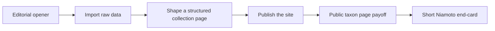

# feat: create landing teaser video

## Overview

Créer une deuxième composition Remotion pour la landing Niamoto, distincte de la walkthrough actuelle `MarketingLandscape`. Cette nouvelle vidéo doit durer environ 45 secondes et raconter une seule promesse : `Import. Structure. Publish.`

Le teaser ne doit pas être une version raccourcie de la démo existante. Il doit fonctionner comme un asset de landing plus éditorial, plus direct, plus mémorable, tout en restant crédible et ancré dans l’interface réelle de Niamoto.

## Problem Frame

La composition actuelle `media/demo-video/src/compositions/MarketingLandscape.tsx` couvre l’ensemble du parcours produit sur environ 90 secondes. C’est utile comme vidéo de démonstration, mais trop long et trop détaillé pour une landing page.

Le brief validé dans `docs/brainstorms/2026-04-14-landing-teaser-video-brainstorm.md` demande un deuxième asset avec un autre job :

- même univers visuel que Niamoto
- ton sobre, crédible, scientifique, éditorial
- accent narratif sur la structuration de la donnée
- deux interactions visibles seulement : `Ajouter des widgets` puis `Publier le site`
- payoff final sur une page taxon publiée

Le plan doit donc préserver la vidéo actuelle et ajouter une nouvelle composition spécialisée, avec son propre rythme, sa propre structure, et une identité suffisamment distincte pour éviter l’effet “mini-version dégradée”.

## Requirements Trace

- R1. Le teaser est un asset séparé de la walkthrough existante.
- R2. La promesse lisible à l’écran est `Import. Structure. Publish.`
- R3. Le ton reste sobre, crédible, scientifique et éditorial.
- R4. La durée cible est d’environ 45 secondes.
- R5. L’ouverture commence par une phrase éditoriale courte avant l’interface.
- R6. La narration privilégie la transformation de la donnée en structure éditoriale utile.
- R7. Le moment visuel central est la construction d’une mosaïque collection carte + stats + graphiques.
- R8. Le payoff final est une page taxon publiée riche et lisible.
- R9. Le langage visuel mélange interface Niamoto et cartouches éditoriaux courts.
- R10. Le rendu reste générique et ne dépend pas explicitement d’un projet géographique nommé.
- R11. Le curseur n’apparaît que sur un petit nombre d’interactions.
- R12. Les deux interactions visibles sont `Ajouter des widgets` puis `Publier le site`.
- R13. Le teaser est pensé d’abord en anglais.
- R14. Il n’y a ni voix off ni narration audio.
- R15. La fin montre le site publié puis une end-card très courte `logo + Niamoto`, sans URL ni CTA.

## Scope Boundaries

- La vidéo walkthrough `MarketingLandscape` n’est pas remplacée.
- Le teaser ne couvre pas tout le parcours produit écran par écran.
- Le teaser n’explique pas en détail chaque étape de configuration.
- Le teaser n’est ni un tutoriel, ni une vidéo 9:16, ni une version réseaux sociaux.
- Le teaser n’utilise ni voix off, ni URL, ni call-to-action final.

### Deferred to Separate Tasks

- Version 30–60 secondes pour réseaux sociaux.
- Version verticale 9:16.
- Version localisée dans d’autres langues.
- Variante avec design sonore ou musique.

## Context & Research

### Relevant Code and Patterns

- `media/demo-video/src/compositions/MarketingLandscape.tsx`
  Modèle actuel d’orchestration Remotion via `TransitionSeries`, avec gate de chargement des polices.
- `media/demo-video/src/Root.tsx`
  Enregistrement des compositions et prévisualisations isolées par scène et par acte.
- `media/demo-video/src/shared/config.ts`
  Convention actuelle pour les durées, le calcul des frames et le format vidéo.
- `media/demo-video/src/ui/AppWindow.tsx`
  Primitive de frame desktop réutilisable pour garder la continuité avec la vidéo existante.
- `media/demo-video/src/acts/Act3Import.tsx`
  Source des éléments d’import les plus crédibles : dropzone, types de fichiers, bouton d’upload, rythme d’analyse.
- `media/demo-video/src/acts/Act4Collections.tsx`
  Source la plus forte pour le moment “structure”, notamment la modale widgets, la mosaïque collection et le système de curseur.
- `media/demo-video/src/acts/Act6Publish.tsx`
  Source de la grammaire visuelle de publication et du moment de déploiement.
- `media/demo-video/src/scenes/OutroCTA.tsx`
  Point de départ pour une end-card de marque beaucoup plus courte.

### Institutional Learnings

- Aucun learning dédié à Remotion ou aux assets vidéo n’a été trouvé dans `docs/solutions/`.
- Le meilleur pattern local est donc la composition existante elle-même, pas une documentation séparée.

### External References

- Recherche externe non nécessaire pour ce plan.
- Les patterns Remotion locaux sont déjà suffisamment établis pour structurer une nouvelle composition sans dépendre d’un workflow Stitch ou d’une nouvelle stack.

## Key Technical Decisions

- **Nouvelle composition dédiée** : le teaser vit dans une composition `LandingTeaser`, indépendante de `MarketingLandscape`, pour éviter de coupler les deux rythmes.
- **Script de rendu séparé** : `pnpm run build` continue de rendre la walkthrough actuelle ; le teaser obtient son propre script (`build:teaser`) et son propre fichier de sortie.
- **Storyboard piloté par données** : durées, copy et points d’interaction sont centralisés dans un petit module teaser dédié au lieu d’être dispersés dans plusieurs composants.
- **Réutilisation ciblée, pas découpe brute** : on réemploie les primitives, les codes visuels et certains patterns des actes existants, mais on ne “trim” pas les actes actuels pour fabriquer le teaser.
- **Curseur très rare** : le curseur est invisible la plupart du temps et n’apparaît que pour `Ajouter des widgets` puis `Publier le site`.
- **Payoff site reconstruit en React** : la page taxon finale doit rester générique et contrôlable. Elle ne doit pas dépendre d’un screenshot qui exposerait un cas projet trop spécifique.
- **Overlays éditoriaux courts** : l’anglais reste très concis, avec quelques cartouches seulement. L’interface reste le porteur principal de sens.
- **End-card minimale** : l’end-card finale dure juste assez pour signer la vidéo sans casser le payoff public site.

## Open Questions

### Resolved During Planning

- **Nouvelle vidéo ou itération de l’ancienne ?** Nouvelle vidéo séparée.
- **Durée cible ?** 45 secondes.
- **Promesse dominante ?** `Import. Structure. Publish.`
- **Ton ?** Sobre, crédible, scientifique, éditorial.
- **Place de l’interface ?** Mix UI + cartouches courts.
- **Ancrage géographique ?** Générique, non explicitement Nouvelle-Calédonie.
- **Présence du curseur ?** Deux interactions visibles seulement.
- **Interaction 1 ?** `Ajouter des widgets`.
- **Interaction 2 ?** `Publier le site`.
- **Fin ?** Page taxon publiée puis end-card `logo + Niamoto`.

### Deferred to Implementation

- Formulation exacte des 3 ou 4 cartouches anglais après première prévisualisation animée.
- Répartition précise des transitions entre les mouvements une fois la première animatique montée.
- Niveau exact de densité graphique acceptable sur la mosaïque centrale après premier rendu complet.

## Output Structure

```text
media/demo-video/src/
├── compositions/
│   └── LandingTeaser.tsx
├── teaser/
│   ├── config.ts
│   ├── storyboard.ts
│   ├── copy.ts
│   ├── components/
│   │   ├── EditorialOverlay.tsx
│   │   ├── PublicSiteFrame.tsx
│   │   └── CollectionMosaic.tsx
│   ├── scenes/
│   │   ├── TeaserOpener.tsx
│   │   ├── TeaserDataIntake.tsx
│   │   ├── TeaserStructure.tsx
│   │   ├── TeaserPublish.tsx
│   │   └── TeaserEndCard.tsx
```

## High-Level Technical Design

> *This illustrates the intended approach and is directional guidance for review, not implementation specification. The implementing agent should treat it as context, not code to reproduce.*

### Narrative shape

| Movement | Target duration | Role | Visible cursor |
| --- | --- | --- | --- |
| Opener | 0–4 s | Phrase éditoriale + entrée dans l’interface | Non |
| Data intake | 4–12 s | Fichiers bruts, import, organisation initiale | Non |
| Structure | 12–28 s | Construction de la mosaïque collection, cœur du teaser | Oui, `Ajouter des widgets` |
| Publish | 28–40 s | Passage du produit vers le site publié | Oui, `Publier le site` |
| Payoff + brand | 40–45 s | Page taxon publique puis end-card Niamoto | Non |

### Flow



## Implementation Units

- [x] **Unit 1: Add a dedicated teaser composition scaffold**

**Goal:** Introduire une composition teaser indépendante avec ses propres timings, sa propre sortie et son propre point d’entrée dans Remotion.

**Requirements:** R1, R4, R13

**Dependencies:** None

**Files:**
- Create: `media/demo-video/src/compositions/LandingTeaser.tsx`
- Create: `media/demo-video/src/teaser/config.ts`
- Create: `media/demo-video/src/teaser/storyboard.ts`
- Create: `media/demo-video/src/teaser/copy.ts`
- Modify: `media/demo-video/src/Root.tsx`
- Modify: `media/demo-video/package.json`
- Modify: `media/demo-video/README.md`
- Test: `media/demo-video/src/teaser/__tests__/teaserConfig.test.ts`

**Approach:**
- Ajouter `LandingTeaser` comme composition autonome dans `Root.tsx`, sans modifier l’identité ni les durées de `MarketingLandscape`.
- Centraliser durée cible, ordre des mouvements, texte éditorial et flags d’interactions visibles dans des modules teaser dédiés.
- Ajouter un script de rendu spécifique au teaser au lieu de détourner le `build` actuel.

**Execution note:** Commencer par figer la durée et les segments dans le module de config avant de produire les scènes.

**Patterns to follow:**
- `media/demo-video/src/compositions/MarketingLandscape.tsx`
- `media/demo-video/src/Root.tsx`
- `media/demo-video/src/shared/config.ts`

**Test scenarios:**
- Happy path — la composition `LandingTeaser` est enregistrée dans `Root.tsx` et apparaît dans Remotion Studio.
- Happy path — la somme des segments produit une durée totale proche de 45 secondes.
- Edge case — un changement d’une durée locale met à jour le calcul global sans casser la composition.
- Integration — le nouveau script de build rend le teaser sans changer la sortie ni l’ID de la walkthrough existante.

**Verification:**
- Le teaser apparaît comme composition séparée dans Studio.
- Le rendu teaser écrit un fichier dédié sans casser le rendu existant.

- [x] **Unit 2: Build teaser-specific editorial primitives**

**Goal:** Créer les briques visuelles minimales nécessaires au ton “sobre, crédible, éditorial” sans réutiliser brutalement les scènes longues existantes.

**Requirements:** R3, R8, R9, R10, R15

**Dependencies:** Unit 1

**Files:**
- Create: `media/demo-video/src/teaser/components/EditorialOverlay.tsx`
- Create: `media/demo-video/src/teaser/components/PublicSiteFrame.tsx`
- Create: `media/demo-video/src/teaser/components/CollectionMosaic.tsx`
- Test: `media/demo-video/src/teaser/__tests__/storyboard.test.ts`

**Approach:**
- Introduire un composant d’overlay éditorial sobre, limité à des cartouches très courts et réutilisables.
- Construire un `PublicSiteFrame` dédié pour le payoff final, afin de garder une page publique générique sans dépendre d’un screenshot trop contextualisé.
- Factoriser la mosaïque collection comme composant autonome, pour éviter de re-rendre tout `Act4Collections`.

**Patterns to follow:**
- `media/demo-video/src/ui/AppWindow.tsx`
- `media/demo-video/src/acts/Act4Collections.tsx`
- `media/demo-video/src/acts/Act6Publish.tsx`
- `media/demo-video/src/scenes/OutroCTA.tsx`

**Test scenarios:**
- Happy path — les cartouches éditoriaux affichent un texte anglais court et cohérent avec le storyboard.
- Edge case — un texte trop long est tronqué, réduit ou rejeté selon la règle choisie, sans déborder visuellement.
- Integration — `PublicSiteFrame` accepte les contenus publics du teaser sans réintroduire de libellés projet trop spécifiques.

**Verification:**
- Les briques teaser peuvent être rendues isolément sans dépendre des actes monolithes.
- La page publique finale paraît générique et non liée à un cas projet explicite.

- [x] **Unit 3: Create the opener and data-intake movements**

**Goal:** Construire les 12 premières secondes du teaser avec une ouverture éditoriale puis une entrée rapide dans la logique d’import.

**Requirements:** R2, R5, R6, R9, R10, R13, R14

**Dependencies:** Unit 2

**Files:**
- Create: `media/demo-video/src/teaser/scenes/TeaserOpener.tsx`
- Create: `media/demo-video/src/teaser/scenes/TeaserDataIntake.tsx`
- Test: `media/demo-video/src/teaser/__tests__/storyboard.test.ts`

**Approach:**
- Utiliser une phrase d’ouverture éditoriale courte avant de révéler l’interface.
- Réemployer la grammaire visuelle d’import existante (dropzone, fichiers, organisation) mais en mode compressé, sans clic ni explication pas à pas.
- Garder le curseur absent sur cette section pour éviter l’effet tutoriel.

**Patterns to follow:**
- `media/demo-video/src/scenes/IntroLogo.tsx`
- `media/demo-video/src/acts/Act3Import.tsx`

**Test scenarios:**
- Happy path — la phrase d’ouverture apparaît avant l’entrée dans l’interface.
- Happy path — la section import reste compréhensible sans clic ni voix off.
- Edge case — aucune interaction curseur n’est visible dans les 12 premières secondes.
- Integration — la transition opener → import ne crée ni écran vide ni saut de composition.

**Verification:**
- L’ouverture est lisible en lecture muette.
- Le spectateur comprend qu’il s’agit de données brutes qui entrent dans Niamoto avant le beat principal.

- [x] **Unit 4: Build the structure beat around one visible widget-add interaction**

**Goal:** Produire le cœur du teaser : la collection qui se compose visuellement en page structurée, avec un seul clic fort sur `Ajouter des widgets`.

**Requirements:** R6, R7, R9, R11, R12

**Dependencies:** Unit 3

**Files:**
- Create: `media/demo-video/src/teaser/scenes/TeaserStructure.tsx`
- Test: `media/demo-video/src/teaser/__tests__/storyboard.test.ts`

**Approach:**
- Partir de la logique d’`Act4Collections` mais ne garder que le minimum narratif : modale widgets, sélection rapide, puis assemblage de la mosaïque complète.
- Faire de la mosaïque carte + stats + graphiques le vrai plan maître du teaser.
- Synchroniser l’unique interaction visible de cette section avec l’apparition du curseur, puis le faire disparaître dès que la structure est installée.

**Patterns to follow:**
- `media/demo-video/src/acts/Act4Collections.tsx`
- `media/demo-video/src/cursor/CursorOverlay.tsx`
- `media/demo-video/src/animations/SpringPopIn.tsx`

**Test scenarios:**
- Happy path — le clic `Ajouter des widgets` est visible avant que l’état sélectionné n’évolue.
- Happy path — la mosaïque complète atteint un état stable et lisible avant la transition suivante.
- Edge case — le curseur n’est pas visible avant ou après la fenêtre d’interaction prévue.
- Integration — la section structure reste visuellement distincte de l’acte 4 actuel et ne ressemble pas à un simple recut.

**Verification:**
- Le moment “structure” est le plus mémorable de la vidéo.
- Le teaser paraît centré sur la construction d’une page riche, pas sur la simple configuration d’un formulaire.

- [x] **Unit 5: Build the publish beat, public payoff, and end-card**

**Goal:** Terminer le teaser avec un clic de publication, un état public crédible, puis une signature Niamoto brève.

**Requirements:** R8, R11, R12, R15

**Dependencies:** Unit 4

**Files:**
- Create: `media/demo-video/src/teaser/scenes/TeaserPublish.tsx`
- Create: `media/demo-video/src/teaser/scenes/TeaserEndCard.tsx`
- Test: `media/demo-video/src/teaser/__tests__/endCard.test.ts`

**Approach:**
- Condenser la logique publication en une séquence plus simple que `Act6Publish`, centrée sur l’action et son résultat plutôt que sur les logs.
- Utiliser le second clic visible sur `Publier le site`, puis basculer rapidement vers la page taxon publique.
- Laisser le payoff respirer avant une end-card de marque très courte, sans URL ni CTA.

**Patterns to follow:**
- `media/demo-video/src/acts/Act6Publish.tsx`
- `media/demo-video/src/scenes/OutroCTA.tsx`

**Test scenarios:**
- Happy path — le clic `Publier le site` est visible et suivi d’un état public crédible.
- Happy path — la page taxon publique est lisible avant la coupure vers l’end-card.
- Edge case — l’end-card ne contient ni URL, ni CTA, ni texte additionnel superflu.
- Integration — la durée de l’end-card reste suffisamment courte pour ne pas voler le payoff public site.

**Verification:**
- La fin donne une sensation d’aboutissement, pas de simple écran de settings.
- La signature Niamoto est présente sans casser l’élégance du teaser.

- [x] **Unit 6: Calibrate timing, output, and visual QA**

**Goal:** Stabiliser le teaser comme asset de landing exploitable, avec timings cohérents, documentation minimale et validation visuelle finale.

**Requirements:** R1, R3, R4, R8, R9, R15

**Dependencies:** Units 1–5

**Files:**
- Modify: `media/demo-video/src/teaser/config.ts`
- Modify: `media/demo-video/README.md`
- Test: `media/demo-video/src/teaser/__tests__/teaserConfig.test.ts`

**Approach:**
- Ajuster finement les timings à partir d’une première animatique complète.
- Vérifier que la vidéo reste distincte de `MarketingLandscape` dans son rythme, sa structure et sa densité.
- Documenter les scripts et conventions du teaser dans le README du projet vidéo.

**Patterns to follow:**
- `media/demo-video/src/shared/config.ts`
- `media/demo-video/README.md`

**Test scenarios:**
- Happy path — le teaser reste proche de 45 secondes après calibration finale.
- Edge case — aucun segment ne dépasse son budget au point de casser la lisibilité des autres.
- Integration — le teaser et la walkthrough peuvent être prévisualisés et rendus indépendamment.

**Verification:**
- Le teaser se rend dans un fichier dédié et peut être revu seul.
- La lecture complète confirme une identité différente de la walkthrough actuelle.

## Implementation Notes

- Le teaser a été livré sous forme d’une composition distincte `LandingTeaser`, avec scènes dédiées sous `media/demo-video/src/teaser/`.
- La walkthrough historique `MarketingLandscape` est restée intacte et continue à se rendre dans son propre fichier.
- Le curseur n’apparaît que sur les deux interactions prévues : `Add widgets` puis `Publish site`.
- La page publique finale a été reconstruite en React plutôt que capturée depuis un screenshot, pour rester générique.
- Les prévisualisations isolées du teaser ont été enregistrées dans `Root.tsx` sous le dossier `Landing-Teaser` pour faciliter la QA dans Remotion Studio.
- Les tests teaser dédiés prévus initialement n’ont pas été ajoutés : le sous-projet vidéo n’expose pas de harnais TypeScript exécutable ici. La vérification réelle repose sur `pnpm exec tsc --noEmit`, des stills Remotion ciblés et les rendus complets.

## Verification Results

- `pnpm exec tsc --noEmit`
- `pnpm run build:teaser`
- `pnpm run build`
- Contrôles visuels via stills Remotion sur l’ouverture, l’import, le beat `structure`, le clic `publish` et le payoff public.

## System-Wide Impact

- **Interaction graph:** ajout d’une nouvelle composition Remotion, d’un nouveau script de build, et de nouvelles scènes spécialisées sous `media/demo-video/src/teaser/`.
- **Error propagation:** la plus grande zone de risque est la dérive entre storyboard, timings et fenêtres d’apparition du curseur. Le storyboard doit rester la source de vérité.
- **State lifecycle risks:** dupliquer trop de logique depuis `Act4Collections` ou `Act6Publish` créerait une seconde dette de maintenance ; la planification privilégie des composants teaser compacts et dédiés.
- **API surface parity:** la walkthrough actuelle, son ID de composition et son script de build existant doivent rester inchangés.
- **Integration coverage:** les tests unitaires ne suffiront pas ; la validation finale dépend d’un rendu complet et d’une relecture visuelle du teaser.
- **Unchanged invariants:** `MarketingLandscape` reste l’asset long de démonstration ; le teaser n’en change ni le rôle ni les durées.

## Risks & Dependencies

| Risk | Mitigation |
|------|------------|
| Le teaser ressemble trop à une version raccourcie de la walkthrough actuelle | Utiliser une composition séparée, une structure en 4–5 mouvements, et ne pas “trim” les actes existants |
| Le rendu reste trop spécifique à un projet donné | Recréer la page publique en React avec des labels génériques plutôt que dépendre d’un screenshot trop contextualisé |
| Les cartouches éditoriaux prennent trop de place | Centraliser la copy, imposer une contrainte de brièveté, puis faire une passe de QA visuelle dédiée |
| Le moment “structure” n’est pas assez fort | Allouer la plus grande plage temporelle à la mosaïque collection et limiter le nombre d’interactions secondaires |
| Le second asset complique l’exploitation du projet Remotion | Ajouter un script de build teaser explicite et documenter clairement les deux sorties dans le README |

## Alternative Approaches Considered

- **Raccourcir `MarketingLandscape`** : rejeté, car cela produirait un résumé compressé au lieu d’un asset de landing avec un autre job.
- **Monter un teaser à partir de screenshots ou de screencasts** : rejeté, car l’effet serait moins cohérent avec la vidéo existante et moins propre visuellement.
- **Conserver un curseur tout du long** : rejeté, car cela tirerait la vidéo vers le tutoriel au lieu du teaser éditorial.

## Documentation / Operational Notes

- Mettre à jour `media/demo-video/README.md` pour documenter la nouvelle composition teaser et son script de rendu dédié.
- Garder une convention claire de sortie (`out/landing-teaser.mp4`) pour éviter toute confusion avec la walkthrough existante.
- Prévoir une relecture visuelle côte à côte avec `MarketingLandscape` avant de considérer le teaser comme prêt.

## Sources & References

- **Origin document:** `docs/brainstorms/2026-04-14-landing-teaser-video-brainstorm.md`
- Related code: `media/demo-video/src/compositions/MarketingLandscape.tsx`
- Related code: `media/demo-video/src/Root.tsx`
- Related code: `media/demo-video/src/shared/config.ts`
- Related code: `media/demo-video/src/acts/Act3Import.tsx`
- Related code: `media/demo-video/src/acts/Act4Collections.tsx`
- Related code: `media/demo-video/src/acts/Act6Publish.tsx`
- Related code: `media/demo-video/src/ui/AppWindow.tsx`
