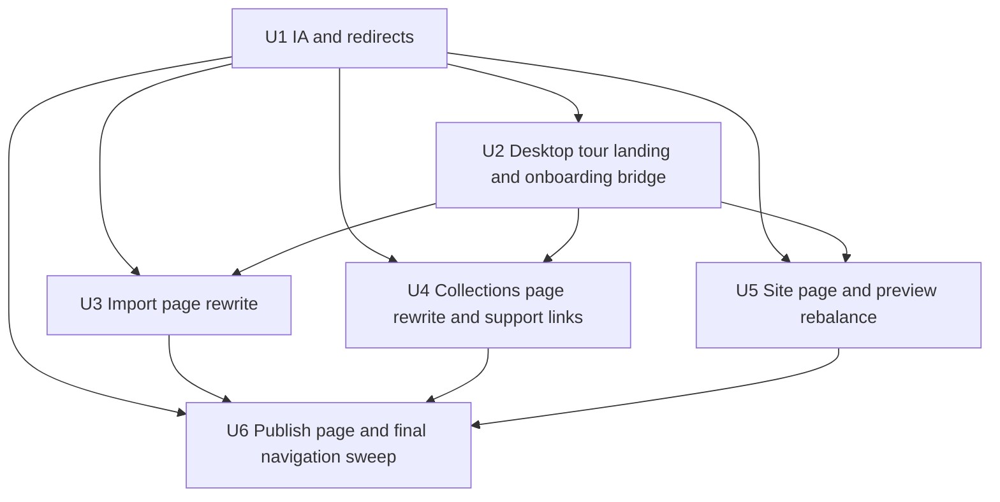

# refactor: align desktop user guide with current UI

## Overview

Refocus the public documentation on the real desktop experience by rewriting
`docs/02-user-guide/` around the current UI flow, the current reader-facing
vocabulary, and the screenshot set already curated in `docs/plans/caps/`.

This first pass is intentionally public and desktop-only. It does not attempt
to rewrite the maintainer documentation for the GUI runtime, FastAPI layer, or
Tauri shell in the same change.

## Problem Frame

The current desktop product is documented, but not as one coherent user-facing
guide. The main path is split across short guides, architecture notes, code
READMEs, and older roadmap material. The result is a guide that is factually
better than before, but still not anchored strongly enough in the interface a
desktop user actually sees.

The origin document defines a clear first pass: rewrite the public desktop user
guide around the main path from app launch to publication, use current UI
vocabulary such as "Collections" and "Publish", and use the real capture set in
`docs/plans/caps/` as the visual source of truth while keeping the guide stable
enough to maintain (see origin:
`docs/brainstorms/2026-04-18-desktop-ui-user-guide-requirements.md`).

## Requirements Trace

- R1-R5. The first pass must target the public desktop guide, cover only the
  main path, keep `docs/01-getting-started/` short, and make
  `docs/02-user-guide/README.md` the detailed desktop entry point.
- R6-R11. The guide must use current UI vocabulary, rename the reader-facing
  "Transform" and "Export" surfaces to "Collections" and "Publish", add a
  dedicated Site page, and preserve old URLs through redirects.
- R12-R15. The guide must be strongly visual, using the screenshot set in
  `docs/plans/caps/` as truth without turning into a brittle storyboard.
- R16-R18. The guide must stay UI-first while adding light bridges to
  `import.yml`, `transform.yml`, and `export.yml` only when they clarify what
  the UI is driving.
- R19-R21. Maintainer-facing GUI runtime and README cleanup remain out of scope
  for this pass and must stay as a separate follow-up track.

## Scope Boundaries

- No web-parity rewrite in this pass.
- No detailed documentation of secondary desktop surfaces such as settings,
  tools, plugins, or explorer.
- No broad rewrite of GUI maintainer documentation in `docs/07-architecture/`,
  `src/niamoto/gui/README.md`, or `src/niamoto/gui/ui/README.md`.
- No screenshot-for-every-state storyboard.
- No attempt to rename configuration files or pipeline concepts under the hood.

### Deferred to Separate Tasks

- Follow-up maintainer pass for GUI runtime architecture in
  `docs/07-architecture/`.
- Follow-up README refresh for `src/niamoto/gui/README.md` and
  `src/niamoto/gui/ui/README.md`.

## Context & Research

### Relevant Code and Patterns

- `docs/01-getting-started/first-project.md` already shows the right style for a
  short screenshot-anchored onboarding page that hands off into deeper docs.
- `docs/02-user-guide/README.md`, `import.md`, `transform.md`, `export.md`,
  `preview.md`, and `widget-catalogue.md` are the current rewrite targets.
- `docs/plans/caps/video-fidelity-mapping.md` already groups the screenshot set
  by product phase and is the strongest local artifact for deciding which
  captures belong to which page.
- `src/niamoto/gui/ui/src/app/router.tsx` confirms the active user-facing module
  map: sources, collections on `/groups`, site, publish, tools.
- `docs/07-architecture/gui-overview.md` and `docs/07-architecture/gui-runtime.md`
  already hold the runtime explanation that should stay out of the public guide
  in this pass.

### Institutional Learnings

- No relevant `docs/solutions/` artifacts were present in this repository at
  planning time.

### External References

- None. Local patterns and current repo artifacts are strong enough for this
  pass, so no external research is needed.

## Key Technical Decisions

- Rewrite the existing user-guide pages instead of adding a parallel gallery or
  "tour" document that would compete with them.
- Keep `docs/02-user-guide/README.md` as the desktop tour landing page, with a
  short linear walkthrough followed by module-level links.
- Rename `docs/02-user-guide/transform.md` to `docs/02-user-guide/collections.md`
  and `docs/02-user-guide/export.md` to `docs/02-user-guide/publish.md`, with
  redirects from the previous public URLs.
- Add a dedicated `docs/02-user-guide/site.md` page rather than hiding the Site
  Builder inside preview or publication docs.
- Keep `preview.md` and `widget-catalogue.md` as supporting references instead
  of main-path entry pages.
- Use a two-tier screenshot strategy:
  - the landing page gets one anchor screenshot per major phase
  - module pages carry the denser screenshot sets for that module

## Open Questions

### Resolved During Planning

- Should the landing page be screenshot-heavy or mostly textual?
  It should be moderately visual: enough screenshots to anchor the main path,
  while the denser image treatment lives in the module pages.
- Should the first pass include maintainer GUI runtime docs?
  No. The first pass stays public and desktop-focused.
- Should Site remain folded into preview or publication?
  No. It gets its own page.

### Deferred to Implementation

- Exact caption wording for each screenshot and whether some images need tighter
  cropping or pairing once the pages are edited.
- Whether `preview.md` should stay at its current depth or be trimmed after the
  new module pages are in place.
- Whether `widget-catalogue.md` should keep its current title or adopt a more
  explicit "Collections extras" framing after the main guide stabilizes.

## Implementation Units

- [ ] **Unit 1: Rebuild the user-guide information architecture**

**Goal:** Establish the documentation structure, naming, and redirect plumbing
for a desktop-first user guide aligned with the current UI.

**Requirements:** R1, R4, R6-R11

**Dependencies:** None

**Files:**
- Modify: `docs/02-user-guide/README.md`
- Modify: `docs/README.md`
- Modify: `docs/index.rst`
- Modify: `docs/conf.py`

**Approach:**
- Reposition `docs/02-user-guide/README.md` as the "Desktop app tour" landing
  page instead of a flat list of module links.
- Update the section and root-level indexes so the desktop guide is clearly the
  primary user-facing path after getting started.
- Add redirect entries for the user-facing URL changes from `transform` to
  `collections` and from `export` to `publish`.
- Preserve support-page discoverability without letting `preview.md` and
  `widget-catalogue.md` dominate the main-path narrative.

**Patterns to follow:**
- `docs/01-getting-started/README.md` for section entry style
- `docs/conf.py` redirect mapping style already used for the previous docs
  reclassification

**Test scenarios:**
- Happy path: a reader starting from `docs/README.md` can reach the desktop user
  guide without needing architecture pages.
- Edge case: old links to `docs/02-user-guide/transform.md` resolve to the new
  collections page.
- Edge case: old links to `docs/02-user-guide/export.md` resolve to the new
  publish page.
- Integration: the updated `toctree` and redirect map do not introduce
  `toc.not_included` or broken-cross-reference failures in the strict docs
  build.

**Verification:**
- The user-guide section reads as one coherent desktop path from the docs root.
- The strict HTML docs build succeeds with the new page names and redirects.

- [ ] **Unit 2: Rewrite the desktop tour landing and tighten the onboarding bridge**

**Goal:** Make the public guide entry path clear by pairing a short onboarding
page in getting-started with a richer desktop tour landing page in the user
guide.

**Requirements:** R2, R4, R5, R12-R15

**Dependencies:** Unit 1

**Files:**
- Modify: `docs/01-getting-started/first-project.md`
- Modify: `docs/02-user-guide/README.md`

**Approach:**
- Keep `first-project.md` short and end-to-end, but explicitly hand readers off
  to the richer desktop guide once the basics are established.
- Rewrite `docs/02-user-guide/README.md` so its opening section becomes a short,
  linear walkthrough of the desktop path using representative captures.
- Use a compact anchor set on the landing page rather than every available
  screenshot. The likely ladder is:
  - `02.welcome-project-picker.png`
  - `05.project-create-ready.png`
  - `06.dashboard-get-started.png` or `11.import-config-detected.png`
  - `15.collections-overview.png`
  - `21.site-builder-home-page.png`
  - `26.deploy-provider-picker.png` or `29.deploy-success.png`
- Keep the lower half of the page as a module map that points to Import,
  Collections, Site, Publish, plus supporting references such as Preview.

**Patterns to follow:**
- `docs/01-getting-started/first-project.md` for concise screenshot-led prose
- `docs/plans/caps/video-fidelity-mapping.md` for phase ordering

**Test scenarios:**
- Happy path: a new desktop reader can follow the top-level journey from welcome
  screen to publication through the landing page alone.
- Happy path: the getting-started page remains shorter than the detailed user
  guide and clearly hands off to it.
- Edge case: the landing page still works if a reader enters directly at
  `docs/02-user-guide/README.md` without reading getting-started.
- Integration: the landing page links route readers into the correct module
  pages and not into architecture pages for basic product understanding.

**Verification:**
- `first-project.md` stays quick and introductory.
- `docs/02-user-guide/README.md` becomes the unambiguous desktop user-guide
  entry point.

- [ ] **Unit 3: Rewrite the import page around the actual desktop flow**

**Goal:** Turn `import.md` into a user-facing walkthrough of the import module
that matches the current desktop UI and its visible states.

**Requirements:** R2, R3, R12-R18

**Dependencies:** Units 1-2

**Files:**
- Modify: `docs/02-user-guide/import.md`

**Approach:**
- Shift the page away from code-entry-point framing and toward the visible
  desktop workflow: source selection, live analysis, config review, import
  execution, and post-import continuation.
- Use the import screenshot run as the page backbone:
  - `07.import-sources-select.png`
  - `08.import-sources-review.png`
  - `10.import-analysis-progress.png`
  - `11.import-config-detected.png`
  - `13.data-dashboard-summary.png`
- Add light bridges to `import.yml` only where they help readers understand what
  the review and YAML editor are controlling.
- Keep enrichment as a follow-on note rather than letting it dominate the import
  page.

**Patterns to follow:**
- `docs/02-user-guide/import.md` current section structure for the core phases
- `docs/05-ml-detection/README.md` as the deeper destination for auto-detection,
  rather than duplicating that implementation detail here

**Test scenarios:**
- Happy path: a reader can understand how files move from selection to imported
  project data using the page alone.
- Edge case: the page explains live analysis and YAML review without requiring
  readers to understand backend jobs or FastAPI routes.
- Edge case: the page makes clear which parts of the flow are primary and which
  are optional follow-ups, such as enrichment.
- Integration: links from the landing page and getting-started flow land on a
  page that matches the screenshots used elsewhere in the guide.

**Verification:**
- The page reads as product guidance, not as a code map.
- Import-to-next-step handoff into Collections or Site is obvious.

- [ ] **Unit 4: Rename and rewrite the collections area as the main transform-facing guide**

**Goal:** Replace the outdated transform-first surface with a collections-first
user guide page and align the supporting reference pages around it.

**Requirements:** R2, R6-R9, R12-R18

**Dependencies:** Units 1-2

**Files:**
- Create: `docs/02-user-guide/collections.md`
- Modify: `docs/02-user-guide/widget-catalogue.md`
- Modify: `docs/02-user-guide/preview.md`
- Remove or redirect via config: `docs/02-user-guide/transform.md`

**Approach:**
- Rewrite the main page around the visible collections workflow rather than the
  technical "transform" term.
- Use the collections capture set to explain the visible work:
  - `15.collections-overview.png`
  - `14.collections-widget-config.png`
  - `16.collections-add-widget-modal.png`
  - `17.collections-widget-catalog.png`
  - `20.collections-processing.png`
- Keep lightweight bridges to `transform.yml` and widget-backed outputs when
  readers need to understand what saves where.
- Reframe `widget-catalogue.md` and `preview.md` as support pages hanging off
  Collections, not as peers to the main module page.

**Patterns to follow:**
- `docs/02-user-guide/widget-catalogue.md` for the supporting-page split
- `src/niamoto/gui/ui/src/app/router.tsx` and
  `docs/07-architecture/gui-overview.md` for the canonical "collections"
  terminology under the still-legacy `/groups` route

**Test scenarios:**
- Happy path: the main collections page teaches a reader how to open a
  collection, configure content, preview it, and recompute it.
- Edge case: the page explains that the user-facing term is Collections while
  the underlying config file is still `transform.yml`.
- Edge case: old public links to `transform.md` continue to work via redirect.
- Integration: `widget-catalogue.md` and `preview.md` link back to the new
  collections page and no longer anchor readers on the old transform term.

**Verification:**
- "Collections" becomes the dominant reader-facing term in the user guide.
- Support pages read like extensions of the main collections flow rather than
  competing entry points.

- [ ] **Unit 5: Add a dedicated site-builder page and rebalance preview coverage**

**Goal:** Give the Site Builder its own user-facing home and stop forcing site
editing to share narrative space with preview or publish.

**Requirements:** R2, R11-R18

**Dependencies:** Units 1-2

**Files:**
- Create: `docs/02-user-guide/site.md`
- Modify: `docs/02-user-guide/preview.md`
- Modify: `docs/02-user-guide/README.md`

**Approach:**
- Build `site.md` around the actual Site Builder surfaces and their place in the
  flow between Collections and Publish.
- Use the site capture set:
  - `21.site-builder-home-page.png`
  - `22.site-builder-methodology-page.png`
  - `23.site-builder-collection-page.png`
- Keep site preview explained in context, but trim `preview.md` so it functions
  as a supporting explanation of preview surfaces rather than the primary way to
  understand the Site Builder.
- Add a small bridge to `export.yml` where readers need to understand that page
  and navigation edits change the generated site definition.

**Patterns to follow:**
- `docs/02-user-guide/preview.md` current three-surface breakdown
- `docs/07-architecture/gui-preview-system.md` for terminology consistency on
  preview surfaces, without importing architecture detail into the page

**Test scenarios:**
- Happy path: a reader can understand what the Site area is for, what kinds of
  edits happen there, and how it connects to publication.
- Edge case: the new page does not duplicate the full preview explanation that
  still belongs in `preview.md`.
- Integration: the landing page and the publish page both treat Site as its own
  stage in the desktop flow.

**Verification:**
- Site is no longer a hidden subtopic of preview or publish.
- Preview remains documented, but no longer bears the full load of teaching the
  Site Builder.

- [ ] **Unit 6: Rename export to publish and finish the navigation sweep**

**Goal:** Reframe the final stage of the guide around Publish, connect it cleanly
to the Site stage, and complete the cross-link sweep across the desktop user
guide.

**Requirements:** R2, R6-R10, R12-R18

**Dependencies:** Units 1, 3, 4, 5

**Files:**
- Create: `docs/02-user-guide/publish.md`
- Modify: `docs/02-user-guide/preview.md`
- Modify: `docs/02-user-guide/README.md`
- Modify: `docs/01-getting-started/first-project.md`
- Remove or redirect via config: `docs/02-user-guide/export.md`
- Modify: `docs/conf.py`

**Approach:**
- Rewrite the final-stage page around build and deployment as the user sees
  them, not around the older "export" label.
- Use the publish capture set:
  - `24.publish-preview-loading.png`
  - `25.publish-generation-preview.png`
  - `26.deploy-provider-picker.png`
  - `27.deploy-github-pages-config.png`
  - `28.deploy-build-log.png`
  - `29.deploy-success.png`
- Keep a light bridge to `export.yml` and `deploy.yml` so readers understand
  what the Publish area is driving behind the interface.
- Perform the final sweep of user-guide cross-links so every renamed page,
  landing-page section, and getting-started handoff uses the new Collections /
  Site / Publish vocabulary consistently.

**Patterns to follow:**
- `docs/02-user-guide/export.md` for the current high-level stage split
- `docs/plans/caps/video-fidelity-mapping.md` for the publication screenshot
  order
- `docs/conf.py` redirect approach already used elsewhere in the docs tree

**Test scenarios:**
- Happy path: a reader can understand the transition from site editing to build
  preview to deployment destination selection and final success state.
- Edge case: the page explains Publish as the reader-facing term while still
  naming `export.yml` and `deploy.yml` when relevant.
- Edge case: old public links to `export.md` continue to resolve correctly.
- Integration: the full path `first-project -> desktop guide -> import ->
  collections -> site -> publish` can be navigated without term drift or broken
  links.

**Verification:**
- Publish becomes the canonical reader-facing final stage across the user guide.
- The user guide reads end-to-end as one desktop narrative with consistent page
  names and links.

## System-Wide Impact

- **Interaction graph:** `docs/README.md`, `docs/index.rst`,
  `docs/01-getting-started/`, `docs/02-user-guide/`, and `docs/conf.py` all
  participate in the public navigation contract.
- **Error propagation:** broken redirects, stale cross-links, or missing
  `toctree` entries will surface as strict Sphinx build failures or visibly dead
  navigation for readers.
- **State lifecycle risks:** terminology drift can reappear if renamed pages and
  supporting pages are not updated in the same pass.
- **API surface parity:** public URLs for `transform.md` and `export.md` must
  remain valid through redirects even after the page rename.
- **Integration coverage:** the full path from docs root through the desktop user
  guide must be validated as one navigation experience, not page by page in
  isolation.
- **Unchanged invariants:** runtime architecture remains documented in
  `docs/07-architecture/`, and GUI code-structure documentation remains in the
  GUI READMEs for a later pass.

## Risks & Dependencies

| Risk | Mitigation |
|------|------------|
| Screenshot-heavy pages become noisy or brittle | Use a fixed screenshot budget per page and reserve denser image sets for module pages only |
| Public terminology diverges from underlying config names | Add short bridges to `import.yml`, `transform.yml`, `export.yml`, and `deploy.yml` exactly where the UI needs explanation |
| Old links break during rename from Transform and Export | Add redirects in `docs/conf.py` and verify them in the strict docs build |
| Scope expands into secondary tools or maintainer docs | Keep those surfaces explicitly out of the first-pass implementation units and route them to follow-up work |

## Documentation / Operational Notes

- Treat `docs/plans/caps/` as the approved source screenshot pool for this pass
  rather than introducing new ad hoc image sources.
- Preserve the separation between public product guidance and maintainer runtime
  guidance while updating cross-links.
- After this pass lands, the next documentation candidate should be the GUI
  maintainer split between `docs/07-architecture/` and the GUI READMEs.

## Sources & References

- **Origin document:** `docs/brainstorms/2026-04-18-desktop-ui-user-guide-requirements.md`
- Related docs: `docs/01-getting-started/first-project.md`
- Related docs: `docs/02-user-guide/README.md`
- Related docs: `docs/plans/caps/video-fidelity-mapping.md`
- Related code: `src/niamoto/gui/ui/src/app/router.tsx`
- Related code: `src/niamoto/gui/api/app.py`
- Related code: `src-tauri/src/lib.rs`
