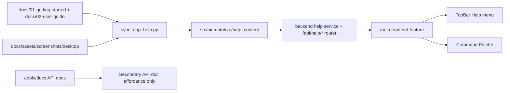
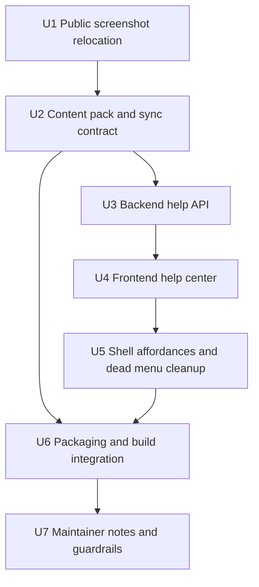

# feat: integrate desktop user guide into app shell

## Overview

Expose the refreshed desktop user guide inside the Niamoto web/Tauri app as a
real in-app help center instead of leaving documentation outside the product.

This pass targets user-facing help only. It does not redesign the API
documentation. The current API docs surface stays available, but the generic
"Documentation" entry points in the app must stop resolving to API-only content
or dead menu items.

## Problem Frame

The public desktop guide now matches the real product path in
`docs/02-user-guide/`, but the application shell still has a documentation gap:

- `src/niamoto/gui/ui/src/components/layout/TopBar.tsx` renders a Help dropdown
  whose visible items do not navigate anywhere.
- `src/niamoto/gui/ui/src/components/layout/CommandPalette.tsx` exposes a
  generic docs affordance, but it actually points to `ApiDocs`.
- `src/niamoto/gui/ui/src/app/router.tsx` only has `/tools/docs`, which is the
  API docs page.
- `src/niamoto/gui/api/app.py` serves the SPA and `/api/docs`, but no user-docs
  content.
- `build_scripts/niamoto.spec` currently bundles `src/niamoto/gui/ui/dist`, not
  the public docs or their screenshots.
- The screenshots now used by the public guide still live under
  `docs/plans/caps/`, which makes a public asset set look like planning-only
  material.

The user request is to integrate the refreshed user documentation into the
web/Tauri app itself. The origin document still matters because it defines the
editorial source of truth, the page set, the vocabulary ("Collections",
"Publish"), and the screenshot set that the in-app help must reuse rather than
re-invent (see origin:
`docs/brainstorms/2026-04-18-desktop-ui-user-guide-requirements.md`).

## Requirements Trace

- R1. The app must expose the desktop user guide inside the product, not only as
  external docs links.
- R2. User docs must stay distinct from API docs. This pass must not collapse
  both into the same route or label.
- R3. The content source for the in-app help remains the refreshed public guide:
  `docs/01-getting-started/first-project.md` plus the selected pages from
  `docs/02-user-guide/`.
- R4. The first in-app pass must cover the main desktop path: onboarding bridge,
  import, collections, site, and publish, with support pages only where they
  help the journey.
- R5. Existing visible help affordances in the app shell must stop being dead
  ends.
- R6. The same help center must work in dev, in the Python-served web UI, and
  in packaged desktop builds without depending on an internet connection.
- R7. API docs redesign is out of scope for this pass. API docs may stay on
  their current implementation for now.
- R8. The public docs remain the editorial source of truth. The app must consume
  or sync from them instead of forking manual copy in React components.
- R9. App chrome may be localized, but the help body may stay English in v1 to
  match the public docs and avoid inventing a translation pipeline.
- R10. The in-app help content must preserve the current user-facing vocabulary
  and screenshot grounding from the refreshed public guide.
- R11. Public screenshots used by `README.md`, `docs/01-getting-started/`, and
  `docs/02-user-guide/` must move to a stable public docs asset location before
  the app help content depends on them.

## Scope Boundaries

- No API docs redesign, OpenAPI theming, or `/api/docs` replacement in this
  pass.
- No full embed of the entire docs tree. The target is the desktop user-guide
  subset, not reference, troubleshooting, plugin docs, or architecture pages.
- No requirement that every feature screen gets its own contextual help button
  in v1. A central help center is sufficient for the first pass.
- No French translation pipeline for the documentation body in this pass.
- No dependency on ReadTheDocs or a live hosted docs site for the primary user
  help experience.
- No need to move every planning-only screenshot artifact out of
  `docs/plans/caps/` in the same first pass. The target is the public screenshot
  subset actually used by the guide.

### Deferred to Separate Tasks

- Contextual module-level help links from feature pages into specific help
  articles.
- API docs cleanup, including whether `/tools/docs` should later become
  `/tools/api-docs`.
- A fuller keyboard-shortcuts help sheet if the command palette opener is not
  sufficient.

## Context & Research

### Relevant Code and Patterns

- `src/niamoto/gui/ui/src/app/router.tsx` defines the current shell routes and
  shows that `/tools/docs` is reserved for `ApiDocs`.
- `src/niamoto/gui/ui/src/components/layout/TopBar.tsx` already exposes a Help
  dropdown, which is the most obvious surface to rehabilitate.
- `src/niamoto/gui/ui/src/components/layout/CommandPalette.tsx` already has a
  docs action and shows the current route-selection pattern.
- `src/niamoto/gui/ui/src/stores/navigationStore.ts` centralizes route labels
  and is the right place to disambiguate `Documentation` vs `API Documentation`.
- `src/niamoto/gui/ui/src/features/tools/views/ApiDocs.tsx` is a useful pattern
  for a dedicated docs surface, but it is API-specific and relies on an iframe
  to `/api/docs`.
- `src/niamoto/gui/api/app.py` shows the current backend surface: SPA assets and
  OpenAPI docs are served, but no user-doc endpoints exist.
- `src/niamoto/gui/api/routers/site.py` already contains markdown-to-HTML logic
  and file/asset handling patterns that can inform a static help-content router.
- `build_scripts/niamoto.spec` currently bundles `src/niamoto/gui/ui/dist` only,
  which means public docs content is not automatically present in frozen builds.
- `pyproject.toml` shows that wheel packaging currently force-includes a small
  explicit set of non-code assets and will need to be checked if the help
  content lives outside the normal package-data path.
- `scripts/build/build_gui.sh` and `build_scripts/build_desktop.sh` are the
  existing build hooks if a help-content sync step needs to run before packaging.
- `docs/02-user-guide/README.md`, `import.md`, `collections.md`, `site.md`,
  `publish.md`, `preview.md`, and `widget-catalogue.md` are the current
  editorial source pages for the help center.
- `docs/plans/caps/video-fidelity-mapping.md` is the strongest local artifact
  for deciding which screenshots belong in the embedded help subset.

### Institutional Learnings

- No relevant `docs/solutions/` artifact was present for this topic.

### External References

- None. The repository already has enough local product, routing, packaging, and
  docs context to plan this work responsibly without external research.

## Key Technical Decisions

- Use a dedicated user-help route such as `/help`, not `/tools/docs`.
  Rationale: generic "Documentation" should point to user help, while API docs
  remain a clearly named secondary surface.
- Keep the current public docs as source-of-truth content, but ship an
  app-owned help-content pack derived from them.
  Rationale: direct filesystem reads from `docs/` are fragile in wheel and
  frozen environments, and a full Sphinx embed is heavier than needed.
- Move public-facing desktop screenshots to a stable docs asset directory such
  as `docs/assets/screenshots/desktop/` before the help-content sync depends on
  them.
  Rationale: `docs/plans/caps/` is now both a planning artifact location and a
  public asset source, which makes ownership and packaging intent ambiguous.
- Serve help content through the Python backend, not via raw Vite imports from
  the repo docs tree.
  Rationale: the backend already exists in every supported runtime and can own
  markdown rendering, link rewriting, and asset URLs consistently.
- Preserve the existing API docs route for now, but rename any visible affordance
  that points there to `API Documentation`.
  Rationale: this avoids route churn while restoring semantic clarity in the UI.
- Prefer live destinations over placeholder Help menu items.
  Rationale: if an item is visible, it should route somewhere meaningful. The
  menu should either wire `Shortcuts` and `About` to real destinations or hide
  them until such destinations exist.
- Keep doc body content English in v1, localize only the surrounding app chrome.
  Rationale: the public docs are English already, and a translation pipeline
  would add scope and drift risk immediately.
- Start with a central help center, not inline contextual help across every
  module.
  Rationale: it solves the current product gap without forcing invasive changes
  through every feature area at once.

## Open Questions

### Resolved During Planning

- Should the user docs reuse `/tools/docs`?
  No. A dedicated user-help route is cleaner and avoids conflating user docs
  with API docs.
- Should the first version iframe ReadTheDocs or a Sphinx build?
  No. A curated in-app content pack gives better offline support, better app
  chrome integration, and a smaller blast radius.
- Should the first version translate the doc body?
  No. Keep the source docs English-only in v1 and localize the app labels
  around them.

### Deferred to Implementation

- Exact slug model for article deep links (`/help/publish` vs `/help?page=publish`)
  once the frontend route state is wired.
- Whether `Shortcuts` becomes a lightweight modal or simply opens the command
  palette with a focused hint in v1.
- Whether the API docs route path itself should move in a later cleanup once the
  user-help route has landed.

## Output Structure

```text
docs/assets/screenshots/desktop/
scripts/build/sync_app_help.py
src/niamoto/gui/help_content/
  manifest.json
  pages/
  assets/
src/niamoto/gui/api/services/help_content.py
src/niamoto/gui/api/routers/help.py
src/niamoto/gui/ui/src/features/help/
  views/HelpCenter.tsx
  components/
  hooks/
tests/gui/test_help_content_sync.py
tests/gui/api/routers/test_help.py
src/niamoto/gui/ui/src/features/help/helpRouting.test.tsx
```

## High-Level Technical Design

> *This illustrates the intended approach and is directional guidance for review, not implementation specification. The implementing agent should treat it as context, not code to reproduce.*



## Alternative Approaches Considered

- Full Sphinx or ReadTheDocs embed in an iframe:
  Rejected for v1 because it adds packaging weight, duplicates navigation, and
  weakens offline desktop support.
- Raw Vite imports from `docs/`:
  Rejected because the docs tree lives outside the UI root, current Vite config
  does not expose that tree, and the approach would still leave wheel/frozen
  packaging fragile.
- Manual React copy of the guide:
  Rejected because it would fork the just-refreshed public docs immediately and
  recreate editorial drift.

## Implementation Units



- [ ] **Unit 1: Relocate public desktop screenshots to a stable docs asset directory**

**Goal:** Separate public desktop screenshots from planning-only artifacts so
the user guide and embedded help depend on a stable public asset path.

**Requirements:** R10, R11

**Dependencies:** None

**Files:**
- Create: `docs/assets/screenshots/desktop/`
- Modify: `README.md`
- Modify: `docs/01-getting-started/first-project.md`
- Modify: `docs/02-user-guide/README.md`
- Modify: `docs/02-user-guide/import.md`
- Modify: `docs/02-user-guide/collections.md`
- Modify: `docs/02-user-guide/site.md`
- Modify: `docs/02-user-guide/publish.md`
- Modify: `docs/02-user-guide/widget-catalogue.md`
- Modify: `docs/plans/caps/video-fidelity-mapping.md`

**Approach:**
- Move or copy the screenshot subset already used by the public README and the
  desktop user-guide pages into `docs/assets/screenshots/desktop/`.
- Update public markdown references so shipped docs no longer read from
  `docs/plans/caps/`.
- Keep `docs/plans/caps/` for planning-only material and the fidelity mapping
  document, while updating that mapping to reference the new public asset
  location for the shared screenshots.
- Avoid a larger churn that relocates screenshots used only by old plans or
  brainstorms in the same pass.

**Patterns to follow:**
- Existing `docs/assets/` structure for public documentation assets
- Current screenshot references in `docs/01-getting-started/` and
  `docs/02-user-guide/`

**Test scenarios:**
- Happy path: all public user-guide pages render the same screenshots after the
  asset-path move.
- Edge case: the README hero/example image still resolves from its public URL
  after the source path change.
- Integration: the strict docs build succeeds after all public screenshot links
  stop referencing `docs/plans/caps/`.

**Verification:**
- Public docs pages no longer depend on `docs/plans/caps/` for their screenshots.
- `docs/plans/caps/` goes back to being primarily a planning/fidelity area.

- [ ] **Unit 2: Define the app-owned help-content pack and sync pipeline**

**Goal:** Establish the finite in-app content set and a repeatable way to derive
it from the refreshed public docs.

**Requirements:** R1, R3, R4, R6, R8, R9, R10

**Dependencies:** Unit 1

**Files:**
- Create: `scripts/build/sync_app_help.py`
- Create: `src/niamoto/gui/help_content/manifest.json`
- Create: `src/niamoto/gui/help_content/pages/`
- Create: `src/niamoto/gui/help_content/assets/`
- Test: `tests/gui/test_help_content_sync.py`

**Approach:**
- Select the canonical v1 page set from the public guide: the onboarding bridge,
  user-guide landing page, and the main module pages, with support pages only
  if they materially help the in-app journey.
- Define stable slugs, page order, short descriptions, and source-path metadata
  in one generated manifest.
- Copy or generate only the screenshots needed by the selected pages from the
  stable public screenshot directory instead of bundling the full docs media
  tree.
- Make the sync step the only supported path for refreshing embedded help
  content from the public docs.

**Patterns to follow:**
- `docs/brainstorms/2026-04-18-desktop-ui-user-guide-requirements.md`
- `docs/plans/caps/video-fidelity-mapping.md`
- `docs/assets/screenshots/desktop/`
- Existing build-script location and naming under `scripts/build/`

**Test scenarios:**
- Happy path: syncing from the current source docs produces the expected page
  slugs and ordered manifest entries for the desktop main path.
- Edge case: a referenced source page or screenshot is missing, and the sync
  step fails with a clear error instead of silently producing a partial pack.
- Edge case: renamed public-guide links such as `collections` and `publish`
  normalize to the in-app slug map instead of leaking old `transform` or
  `export` names.
- Integration: the help-content pack contains only the curated page subset and
  the assets it actually needs.

**Verification:**
- A single package-owned help-content directory exists with predictable page and
  asset slugs.
- Refreshing the public guide can regenerate the in-app pack without hand-edits
  in frontend code.

- [ ] **Unit 3: Expose the help-content pack through backend APIs**

**Goal:** Let every runtime fetch the same manifest, article HTML, and assets
through the Python backend.

**Requirements:** R1, R2, R6, R8, R10

**Dependencies:** Unit 2

**Files:**
- Create: `src/niamoto/gui/api/services/help_content.py`
- Create: `src/niamoto/gui/api/routers/help.py`
- Modify: `src/niamoto/gui/api/app.py`
- Test: `tests/gui/api/routers/test_help.py`

**Approach:**
- Add a dedicated help router, for example around `/api/help/manifest`,
  `/api/help/pages/{slug}`, and `/api/help/assets/{path}`.
- Render markdown to HTML on the server so the frontend can stay focused on app
  chrome, routing, and state.
- Reuse or extract markdown-rendering helpers already present in the site router
  where that reduces duplicate rendering logic.
- Rewrite internal page links and image URLs to app-local routes and assets so
  the help center does not depend on repo-relative paths.
- Return structured, debuggable errors when content is missing rather than
  leaking low-level file failures to the UI.

**Execution note:** Start with router contract tests for manifest, page, and
asset endpoints before wiring the frontend.

**Patterns to follow:**
- `src/niamoto/gui/api/routers/site.py` markdown rendering and asset-handling
  patterns
- Router registration in `src/niamoto/gui/api/app.py`
- Existing router tests under `tests/gui/api/routers/`

**Test scenarios:**
- Happy path: the manifest endpoint returns the ordered page list and metadata
  expected by the help center.
- Happy path: requesting the `collections` or `publish` article returns rendered
  HTML with rewritten image URLs.
- Edge case: an unknown article slug returns a 404 response instead of a 500.
- Edge case: a missing packaged asset returns a clear not-found response.
- Integration: internal article links rewrite to in-app help destinations rather
  than to repo-relative markdown files.

**Verification:**
- The backend can serve the same help content in dev, Python GUI mode, and
  packaged desktop mode without reading directly from the repo docs tree.

- [ ] **Unit 4: Build the frontend Help Center route and article chrome**

**Goal:** Render the user guide inside the app with deep-linkable navigation and
  app-native framing.

**Requirements:** R1, R3, R4, R6, R9, R10

**Dependencies:** Unit 3

**Files:**
- Create: `src/niamoto/gui/ui/src/features/help/views/HelpCenter.tsx`
- Create: `src/niamoto/gui/ui/src/features/help/components/`
- Create: `src/niamoto/gui/ui/src/features/help/hooks/`
- Modify: `src/niamoto/gui/ui/src/app/router.tsx`
- Modify: `src/niamoto/gui/ui/src/stores/navigationStore.ts`
- Modify: `src/niamoto/gui/ui/src/i18n/locales/en/common.json`
- Modify: `src/niamoto/gui/ui/src/i18n/locales/fr/common.json`
- Test: `src/niamoto/gui/ui/src/features/help/helpRouting.test.tsx`

**Approach:**
- Add a dedicated route such as `/help` that is reachable without adding a new
  main sidebar pillar.
- Render a compact help-center shell around the article body: page list,
  desktop-tour framing, and article content area.
- Support URL-deep-linkable article state so help links can target a specific
  page from future surfaces.
- Keep the view desktop-first in density and layout, while still functioning in
  browser mode.
- Provide a graceful fallback state with an external-docs escape hatch if the
  backend help content is temporarily unavailable.

**Execution note:** Add route-selection and article-state tests before wiring
the shell affordances.

**Patterns to follow:**
- `src/niamoto/gui/ui/src/features/tools/views/ApiDocs.tsx` for a dedicated docs
  view pattern
- `src/niamoto/gui/ui/src/features/collections/components/CollectionsModule.tsx`
  for URL-driven local state
- Existing co-located frontend test patterns such as
  `src/niamoto/gui/ui/src/features/collections/routing.test.ts`

**Test scenarios:**
- Happy path: opening `/help` loads the help center and a default landing page.
- Happy path: opening a specific deep link loads the corresponding article.
- Edge case: backend unavailability shows a non-crashing fallback state with a
  clear recovery path.
- Integration: clicking an internal article link updates the route state and the
  displayed article without a full page reload.

**Verification:**
- The app has a stable user-help route that displays the refreshed desktop guide
  content inside the existing shell.

- [ ] **Unit 5: Rewire shell affordances and remove dead Help menu actions**

**Goal:** Make the visible help entry points in the app shell lead somewhere
real and distinguish user docs from API docs.

**Requirements:** R2, R5, R7, R9

**Dependencies:** Unit 4

**Files:**
- Modify: `src/niamoto/gui/ui/src/components/layout/TopBar.tsx`
- Modify: `src/niamoto/gui/ui/src/components/layout/CommandPalette.tsx`
- Modify: `src/niamoto/gui/ui/src/stores/navigationStore.ts`
- Modify: `src/niamoto/gui/ui/src/features/tools/views/Settings.tsx`
- Modify: `src/niamoto/gui/ui/src/i18n/locales/en/common.json`
- Modify: `src/niamoto/gui/ui/src/i18n/locales/fr/common.json`
- Modify: `src/niamoto/gui/ui/src/i18n/locales/en/tools.json`
- Modify: `src/niamoto/gui/ui/src/i18n/locales/fr/tools.json`
- Test: `src/niamoto/gui/ui/src/features/help/helpRouting.test.tsx`

**Approach:**
- Wire the Help dropdown `Documentation` item to the new `/help` route.
- Either wire `Keyboard shortcuts` and `About Niamoto` to existing meaningful
  destinations, or remove them if they remain placeholders after scoping.
- Keep the API docs reachable, but rename its discoverability points so users
  see `API Documentation` rather than a generic `Documentation` label.
- Ensure the topbar, command palette, and route labels all use the same naming
  split between user docs and API docs.

**Patterns to follow:**
- Existing `useNavigate` and command-item selection patterns in
  `src/niamoto/gui/ui/src/components/layout/CommandPalette.tsx`
- Settings About surface in `src/niamoto/gui/ui/src/features/tools/views/Settings.tsx`

**Test scenarios:**
- Happy path: clicking Help -> Documentation navigates to the in-app help route.
- Happy path: the command palette exposes separate entries for user docs and API
  docs with distinct destinations.
- Edge case: compact or narrow layouts still expose at least one working path to
  the help center.
- Integration: no visible Help dropdown item remains inert after the change.

**Verification:**
- The app no longer has a visible help dropdown that opens actions with no
  destination.

- [ ] **Unit 6: Integrate help-content packaging into web and desktop builds**

**Goal:** Ensure the embedded help works in distributed artifacts, not only in
development.

**Requirements:** R1, R6, R8

**Dependencies:** Units 2-5

**Files:**
- Modify: `build_scripts/niamoto.spec`
- Modify: `build_scripts/build_desktop.sh`
- Modify: `scripts/build/build_gui.sh`
- Modify: `pyproject.toml`
- Test: `tests/gui/test_help_content_sync.py`

**Approach:**
- Include the packaged help-content directory in the Python and frozen-desktop
  build paths.
- Run the help sync/generation step before GUI or desktop packaging so a stale
  or missing content pack fails early.
- Verify whether wheel packaging needs an explicit `force-include` or whether
  placing the pack under `src/niamoto/gui/` is sufficient.
- Keep the desktop build independent from `docs/_build` and any hosted docs
  site.

**Patterns to follow:**
- Existing React-dist inclusion in `build_scripts/niamoto.spec`
- Current GUI and desktop build hooks in `scripts/build/build_gui.sh` and
  `build_scripts/build_desktop.sh`

**Test scenarios:**
- Happy path: the build path can locate the generated help pack before
  packaging.
- Edge case: stale or missing help content fails fast with an actionable build
  error.
- Integration: packaged desktop and packaged Python GUI modes can resolve the
  same help content without repo-relative filesystem access.

**Verification:**
- Shipping artifacts include the in-app help content and can render it offline.

- [ ] **Unit 7: Document the new split between user help and API docs**

**Goal:** Leave maintainers with clear rules for keeping embedded help aligned
with the public guide and separate from API docs.

**Requirements:** R2, R7, R8

**Dependencies:** Unit 6

**Files:**
- Modify: `src/niamoto/gui/README.md`
- Modify: `src/niamoto/gui/ui/README.md`

**Approach:**
- Document where the in-app help content comes from, how it is refreshed, and
  which build steps now depend on it.
- State clearly that generic `Documentation` in the app means user help, while
  API docs remain a separate tools surface.
- Record the decision that the first embedded-help pass is English-body-only and
  centered on the desktop main path.

**Patterns to follow:**
- Existing runtime/build sections in `src/niamoto/gui/README.md`
- Existing architecture and conventions sections in `src/niamoto/gui/ui/README.md`

**Test scenarios:**
- Test expectation: none -- documentation-only unit.

**Verification:**
- A maintainer can update the public desktop guide and know how to refresh the
  embedded help without guessing which surfaces or build steps are affected.

## System-Wide Impact

- **Interaction graph:** `docs/01-getting-started/` and `docs/02-user-guide/`
  feed a public screenshot set under `docs/assets/screenshots/desktop/`, which
  feeds the help-content sync step, which feeds backend help APIs, which feed
  the `/help` route, which is surfaced by the topbar and command palette.
- **Error propagation:** missing help content should become explicit backend
  not-found or configuration errors, and the frontend should degrade into a
  fallback state instead of crashing.
- **State lifecycle risks:** stale synced content, broken asset rewrites, and
  route-state/article-state mismatches are the main correctness risks.
- **API surface parity:** the Help dropdown, command palette, and any later deep
  links should resolve through one user-help route contract, while `/api/docs`
  stays independent.
- **Integration coverage:** the strongest verification path is end-to-end:
  source docs -> synced content pack -> backend responses -> frontend route ->
  packaged desktop runtime.
- **Unchanged invariants:** `docs/02-user-guide/` remains the editorial source
  of truth; `/api/docs` remains the API reference source; the main sidebar
  information architecture does not gain a sixth top-level module in v1.

## Risks & Dependencies

| Risk | Mitigation |
|------|------------|
| Public screenshots keep living in a planning-only path and confuse ownership | Move the public subset into `docs/assets/screenshots/desktop/` before app integration depends on it. |
| Embedded help drifts away from the public docs | Make the sync step the only supported source path and add stale-pack verification. |
| Desktop bundles omit help assets | Add explicit packaging coverage in the build scripts and PyInstaller spec, then verify offline behavior. |
| Generic "Documentation" still lands on API-only content | Rename API affordances explicitly and reserve the generic label for user help. |
| Markdown rendering opens unsafe behavior | Limit rendering to trusted repo-owned content and keep asset/link rewriting inside the backend. |
| Screenshot-heavy pages bloat the shipped app | Curate the screenshot subset and lazy-load article assets where practical. |

## Documentation / Operational Notes

- This plan assumes the public docs remain English; the app shell can localize
  labels around them without translating the body in v1.
- The sync/generation step should become part of the normal GUI/Desktop build
  path so a maintainer does not need a private checklist to keep help content
  fresh.
- A later API-doc pass can revisit route names and surfacing once the user-help
  route has landed and stabilized.

## Sources & References

- **Origin document:** `docs/brainstorms/2026-04-18-desktop-ui-user-guide-requirements.md`
- Related docs: `docs/02-user-guide/README.md`
- Related docs: `docs/assets/screenshots/desktop/`
- Related docs: `docs/plans/caps/video-fidelity-mapping.md`
- Related code: `src/niamoto/gui/ui/src/app/router.tsx`
- Related code: `src/niamoto/gui/ui/src/components/layout/TopBar.tsx`
- Related code: `src/niamoto/gui/ui/src/components/layout/CommandPalette.tsx`
- Related code: `src/niamoto/gui/ui/src/stores/navigationStore.ts`
- Related code: `src/niamoto/gui/ui/src/features/tools/views/ApiDocs.tsx`
- Related code: `src/niamoto/gui/api/app.py`
- Related packaging: `build_scripts/niamoto.spec`
- Related packaging: `pyproject.toml`
