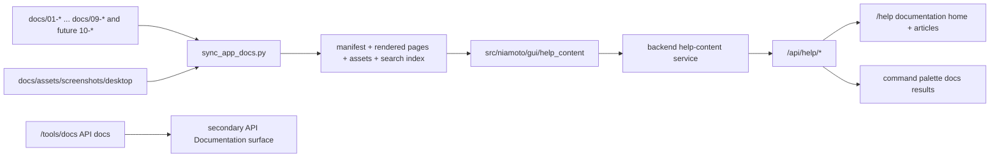
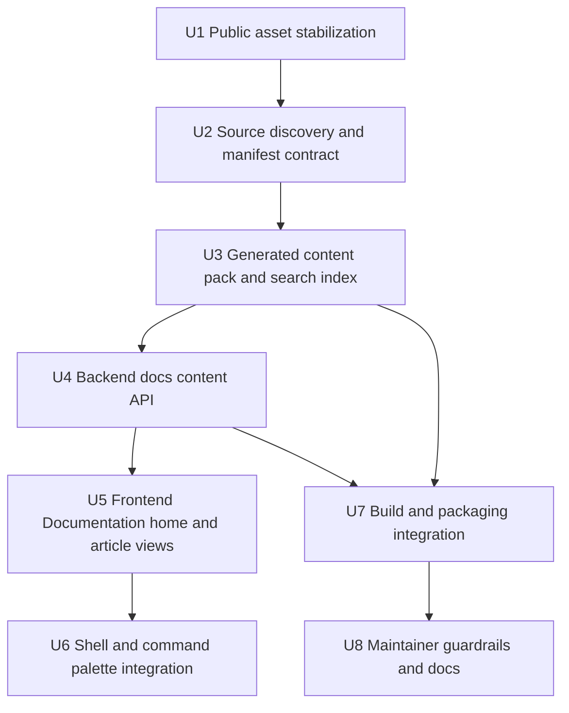

# feat: embed public documentation into app shell

## Overview

Expose the public numbered documentation corpus inside the Niamoto web/Tauri app
through a single `Documentation` surface, while keeping API docs separate.

This plan supersedes the narrower user-guide-only direction in
`docs/plans/2026-04-18-002-feat-in-app-user-docs-plan.md`. The target is no
longer just the desktop tour in `docs/02-user-guide/`, but the full public docs
tree under numbered top-level sections such as `docs/01-*` through
`docs/09-*`, with automatic discovery for future sections such as `docs/10-*`
after rebuild.

## Problem Frame

The repository now has a reasonably coherent public docs structure, but the app
shell still has no meaningful user-facing documentation surface:

- `src/niamoto/gui/ui/src/components/layout/TopBar.tsx` renders a Help dropdown
  with inert items.
- `src/niamoto/gui/ui/src/components/layout/CommandPalette.tsx` exposes API docs
  as the only visible documentation result.
- `src/niamoto/gui/ui/src/app/router.tsx` only exposes `/tools/docs`, which is
  the API docs page.
- `src/niamoto/gui/api/app.py` serves `/api/docs` but no user-docs manifest,
  article, or asset endpoints.
- `build_scripts/niamoto.spec` and the desktop build scripts package the UI, but
  not a generated public-doc content pack.

The origin requirements document changes the scope materially: the app should
embed the public numbered documentation corpus behind one `Documentation` entry
point, keep API docs separate, index docs entries in the command palette, and
discover future numbered sections automatically after build (see origin:
`docs/brainstorms/2026-04-18-in-app-public-documentation-requirements.md`).

## Requirements Trace

- R1. The shell exposes a single top-level `Documentation` entry.
- R2. Opening `Documentation` lands on an in-app editorial home page.
- R3. The command palette exposes an `Open Documentation` action.
- R4. Docs entries are discoverable in the command palette under a grouped
  `Documentation` result section.
- R5. The embedded corpus comes from the public numbered docs sections, not only
  from the desktop user guide.
- R6. The source corpus includes public `.md` and `.rst` pages under top-level
  numbered docs directories, including future `docs/10-*`-style sections.
- R7. The first pass excludes `docs/06-reference/api/` from the embedded
  Documentation experience.
- R8. Internal trees such as `docs/plans/`, `docs/brainstorms/`,
  `docs/ideation/`, and `docs/_archive/` stay out of the in-app corpus.
- R9. Adding a new numbered section with a section `README.md` makes it appear
  automatically after the next build.
- R10. The system supports a simple opt-out marker for pages or sections that
  should remain public in docs but hidden from the app.
- R11. Section structure in the app starts from each numbered section's
  `README.md` and then includes the rest of that section subtree.
- R12. Search indexes section titles, page titles, and intertitles.
- R13. The first pass does not require full-text indexing of all body content.
- R14. Search results open the matching in-app article or section directly.
- R15. User Documentation and API documentation remain distinct in naming,
  routing, and search behavior.
- R16. Generic `Documentation` affordances no longer resolve to API docs.
- R17. Public docs remain the editorial source of truth; the app consumes
  generated artifacts instead of a second handwritten copy.
- R18. Public screenshots or other media used by embedded pages live in a
  stable public docs asset location, not in planning-only directories.

## Scope Boundaries

- No redesign of the generated API reference in this pass.
- No requirement that the app shell expose every docs section as a dedicated
  navigation item.
- No full-text search across every paragraph in the first pass.
- No exposure of internal planning, brainstorming, ideation, or archive trees.
- No requirement yet for contextual help buttons inside every module screen.

### Deferred to Separate Tasks

- Contextual help entry points from specific product modules into relevant
  documentation articles.
- A later decision on whether `/tools/docs` should be renamed once the API docs
  surface is no longer the only documentation route.
- Full API reference integration, if that is ever desired, as a separate
  product decision after the public docs surface lands.

## Context & Research

### Relevant Code and Patterns

- `src/niamoto/gui/ui/src/components/layout/TopBar.tsx` already exposes the
  Help dropdown that should point to the new docs surface.
- `src/niamoto/gui/ui/src/components/layout/CommandPalette.tsx` already has the
  grouping model needed for mixed search results and route actions.
- `src/niamoto/gui/ui/src/stores/navigationStore.ts` centralizes route labels
  and is the right place to disambiguate `Documentation` from `API
  Documentation`.
- `src/niamoto/gui/ui/src/app/router.tsx` shows the current route map and the
  existing `/tools/docs` API-doc route.
- `src/niamoto/gui/ui/src/features/tools/views/ApiDocs.tsx` is a useful pattern
  for a dedicated documentation surface inside the app shell, even if the new
  docs view should not copy its iframe model.
- `src/niamoto/gui/api/app.py` is the registration point for new `/api/help/*`
  or `/api/docs-content/*` routes.
- `src/niamoto/gui/api/routers/site.py` already contains markdown rendering and
  asset-handling patterns that can be reused or extracted for documentation
  content.
- `docs/index.rst` and `docs/README.md` express the current public split
  between numbered public sections and internal trees.
- `build_scripts/niamoto.spec`, `scripts/build/build_gui.sh`, and
  `build_scripts/build_desktop.sh` are the packaging touchpoints needed to ship
  generated docs artifacts in both web and desktop builds.
- `pyproject.toml` shows that wheel packaging already force-includes selected
  non-code assets and may need an explicit include for generated help content if
  it lives outside the normal package tree.

### Institutional Learnings

- No relevant `docs/solutions/` artifact was present for this topic.

### External References

- None. The repository already exposes enough routing, docs, packaging, and UI
  context to plan this change responsibly without external research.

## Key Technical Decisions

- Use one dedicated user-facing route such as `/help` for the embedded public
  documentation.
  Rationale: generic `Documentation` should lead to user docs, not to API docs.
- Generate a manifest-driven documentation pack at build time rather than
  reading the repo docs tree directly at runtime.
  Rationale: build-time generation is robust for packaged desktop builds and
  still allows automatic discovery of future numbered sections after rebuild.
- Discover source sections dynamically from numbered top-level docs directories
  and treat each section `README.md` as the editorial entry point.
  Rationale: this preserves the section landing-page pattern already used in the
  public docs without coupling the app to Sphinx internals.
- Include `.md` and `.rst` source pages from public numbered sections, but
  exclude `docs/06-reference/api/`.
  Rationale: the public docs corpus is broader than the user guide, but the API
  subtree is a materially different product surface.
- Make automatic inclusion the default, with a simple opt-out marker.
  Rationale: adding `docs/10-*` should not require route edits, but the docs
  team still needs a safety valve for a page that should stay out of the app.
- Index section titles, page titles, and intertitles for palette search in v1.
  Rationale: this is enough to make the corpus discoverable without carrying
  full-text complexity immediately.
- Keep API docs reachable as a clearly named secondary surface such as `API
  Documentation`.
  Rationale: the app still needs API docs for developers, but that surface
  should stop occupying the generic documentation label.
- Relocate public screenshots used by embedded pages into a stable public asset
  directory before the generated app-doc pack depends on them.
  Rationale: `docs/plans/caps/` is no longer an appropriate long-term home for
  assets that feed a public product surface.

## Open Questions

### Resolved During Planning

- Should the shell expose multiple top-level docs destinations?
  No. The shell should expose one `Documentation` entry and let the home page
  plus search handle discovery.
- Should docs search use a dedicated mode instead of mixed command-palette
  results?
  No. Mixed results grouped under `Documentation` fit the current palette model
  better.
- Should the app parse Sphinx toctrees as its primary source of structure?
  No. Section `README.md` pages plus subtree discovery are simpler and more
  durable for the app use case.

### Deferred to Implementation

- Exact opt-out metadata contract for sections or pages, as long as it remains
  simple and local to the source docs.
- Exact route shape for deep links (`/help/<section>/<page>` versus a query
  parameter model), as long as links remain shareable and stable.
- Exact heading levels to include in the v1 search index once the parser is
  implemented against real pages.

## Output Structure

```text
docs/assets/screenshots/desktop/
scripts/build/sync_app_docs.py
src/niamoto/gui/help_content/
  manifest.json
  pages/
  assets/
  search-index.json
src/niamoto/gui/api/services/help_content.py
src/niamoto/gui/api/routers/help.py
src/niamoto/gui/ui/src/features/help/
  views/DocumentationHome.tsx
  views/DocumentationArticle.tsx
  components/
  hooks/
  lib/
tests/gui/test_help_content_sync.py
tests/gui/api/routers/test_help.py
src/niamoto/gui/ui/src/features/help/helpRouting.test.tsx
```

## High-Level Technical Design

> *This illustrates the intended approach and is directional guidance for review, not implementation specification. The implementing agent should treat it as context, not code to reproduce.*



## Alternative Approaches Considered

- Reuse `/tools/docs` for the public docs and move API docs elsewhere later:
  rejected because it preserves the current semantic confusion at the shell
  level.
- Read `docs/` directly at runtime from the repo tree:
  rejected because it is fragile in packaged desktop builds and creates
  deployment-time ambiguity.
- Parse Sphinx navigation as the primary manifest source:
  rejected because it adds a tighter coupling to docs-build structure than the
  app actually needs.
- Limit the in-app docs to `docs/01-getting-started/` and `docs/02-user-guide/`
  only:
  rejected because the new requirements explicitly broaden the corpus to the
  public numbered docs surface.

## Implementation Units



- [ ] **Unit 1: Stabilize public screenshots and media paths**

**Goal:** Move public screenshots used by pages that will be embedded in the app
to a stable public asset location.

**Requirements:** R17, R18

**Dependencies:** None

**Files:**
- Create: `docs/assets/screenshots/desktop/`
- Modify: `README.md`
- Modify: `docs/01-getting-started/first-project.md`
- Modify: `docs/02-user-guide/README.md`
- Modify: `docs/02-user-guide/import.md`
- Modify: `docs/02-user-guide/collections.md`
- Modify: `docs/02-user-guide/site.md`
- Modify: `docs/02-user-guide/publish.md`
- Modify: `docs/02-user-guide/widget-catalogue.md`
- Modify: `docs/plans/caps/video-fidelity-mapping.md`

**Approach:**
- Move or copy the public screenshot subset currently sourced from
  `docs/plans/caps/` into `docs/assets/screenshots/desktop/`.
- Update public markdown references so future generated app-doc content does not
  depend on planning-only paths.
- Keep planning-only screenshots in `docs/plans/caps/` out of scope for this
  pass.

**Patterns to follow:**
- Existing `docs/assets/` layout and public asset usage
- Current screenshot references in `docs/01-getting-started/` and
  `docs/02-user-guide/`

**Test scenarios:**
- Happy path: public docs pages still render the same screenshots after the
  asset-path move.
- Integration: the docs build no longer references `docs/plans/caps/` from the
  public pages that feed the in-app surface.

**Verification:**
- Embedded pages depend only on stable public docs asset paths.

- [ ] **Unit 2: Define source discovery and opt-out rules for public docs**

**Goal:** Establish the manifest contract for what counts as app-embeddable
public documentation.

**Requirements:** R5, R6, R7, R8, R9, R10, R11

**Dependencies:** Unit 1

**Files:**
- Create: `scripts/build/sync_app_docs.py`
- Test: `tests/gui/test_help_content_sync.py`
- Modify: `docs/README.md`

**Approach:**
- Discover public source sections from top-level numbered docs directories such
  as `docs/01-*`, `docs/02-*`, and future `docs/10-*`.
- Require each section to have a `README.md` landing page and use that file as
  the section entry in the generated structure.
- Include `.md` and `.rst` files under those public section trees, while
  explicitly excluding `docs/06-reference/api/` and internal top-level docs
  trees.
- Define a lightweight opt-out marker that the sync step can read from page or
  section source files without app code changes.

**Execution note:** Start with characterization tests that prove the current
public docs tree resolves to the expected section set before expanding the sync
logic.

**Patterns to follow:**
- Public numbered docs structure in `docs/index.rst` and `docs/README.md`
- Existing section `README.md` pattern under `docs/01-*` to `docs/09-*`

**Test scenarios:**
- Happy path: current numbered sections resolve to the expected public section
  set.
- Edge case: a future `docs/10-foo/README.md` section is discovered
  automatically by the sync step.
- Edge case: `docs/06-reference/api/` is ignored even though it sits under a
  public numbered section.
- Edge case: an opted-out page stays out of the manifest while the rest of its
  section remains visible.

**Verification:**
- The sync contract can describe the app-visible docs corpus without manual
  route registration.

- [ ] **Unit 3: Generate the content pack, navigation manifest, and search index**

**Goal:** Produce the app-owned artifact set consumed by backend and frontend.

**Requirements:** R9, R11, R12, R13, R14, R17

**Dependencies:** Unit 2

**Files:**
- Create: `src/niamoto/gui/help_content/manifest.json`
- Create: `src/niamoto/gui/help_content/pages/`
- Create: `src/niamoto/gui/help_content/assets/`
- Create: `src/niamoto/gui/help_content/search-index.json`
- Modify: `scripts/build/sync_app_docs.py`
- Test: `tests/gui/test_help_content_sync.py`

**Approach:**
- Generate one manifest containing section metadata, section landing pages, page
  ordering, slugs, short descriptions, and source-path provenance.
- Materialize a page payload per article, including normalized titles and
  extracted intertitles for search.
- Rewrite asset references so the generated content pack is self-contained and
  does not depend on repo-relative links at runtime.
- Generate a search index that captures section titles, page titles, and
  intertitles, but not paragraph-level full text.

**Patterns to follow:**
- Current public docs hierarchy under `docs/`
- Existing asset-packaging conventions under `src/niamoto/gui/`

**Test scenarios:**
- Happy path: sync produces the expected section structure with `README.md`
  entry pages first.
- Happy path: search index contains section titles, page titles, and intertitles
  for a representative set of pages.
- Edge case: a missing linked asset fails the generation step clearly instead of
  producing a partial pack.
- Edge case: old redirects or renamed pages such as `transform` and `export`
  normalize cleanly to current slugs where relevant.

**Verification:**
- A deterministic generated content pack exists for backend serving and palette
  search hydration.

- [ ] **Unit 4: Serve generated docs content through backend routes**

**Goal:** Expose the generated documentation pack consistently in dev, web, and
desktop runtimes.

**Requirements:** R2, R14, R15, R16, R17

**Dependencies:** Unit 3

**Files:**
- Create: `src/niamoto/gui/api/services/help_content.py`
- Create: `src/niamoto/gui/api/routers/help.py`
- Modify: `src/niamoto/gui/api/app.py`
- Test: `tests/gui/api/routers/test_help.py`

**Approach:**
- Add a dedicated help-content router for the docs home manifest, article
  payloads, assets, and search index.
- Centralize page lookup and rendering concerns in a service layer so frontend
  code does not need file-system knowledge.
- Reuse or extract markdown-rendering patterns from `src/niamoto/gui/api/routers/site.py`
  where that avoids duplicate transformation logic.
- Keep the API docs route intact, but clearly separate it from the user-docs
  router.

**Execution note:** Define route-contract tests first so frontend work can rely
on stable payloads.

**Patterns to follow:**
- Router registration pattern in `src/niamoto/gui/api/app.py`
- Markdown and asset handling patterns in `src/niamoto/gui/api/routers/site.py`

**Test scenarios:**
- Happy path: manifest endpoint returns the expected section and page metadata.
- Happy path: article endpoint returns the requested generated page content.
- Edge case: unknown article or asset slugs return not-found responses rather
  than low-level file errors.
- Integration: search index endpoint returns grouped docs entries suitable for
  the command palette.

**Verification:**
- Every supported runtime can serve the same generated docs artifact set through
  backend endpoints.

- [ ] **Unit 5: Build the frontend Documentation home and article experience**

**Goal:** Add an in-app docs surface with a home page, section/article
navigation, and stable deep links.

**Requirements:** R1, R2, R5, R11, R14, R15

**Dependencies:** Unit 4

**Files:**
- Create: `src/niamoto/gui/ui/src/features/help/views/DocumentationHome.tsx`
- Create: `src/niamoto/gui/ui/src/features/help/views/DocumentationArticle.tsx`
- Create: `src/niamoto/gui/ui/src/features/help/components/`
- Create: `src/niamoto/gui/ui/src/features/help/hooks/`
- Create: `src/niamoto/gui/ui/src/features/help/lib/`
- Modify: `src/niamoto/gui/ui/src/app/router.tsx`
- Modify: `src/niamoto/gui/ui/src/stores/navigationStore.ts`
- Modify: `src/niamoto/gui/ui/src/i18n/locales/en/common.json`
- Modify: `src/niamoto/gui/ui/src/i18n/locales/fr/common.json`
- Test: `src/niamoto/gui/ui/src/features/help/helpRouting.test.tsx`

**Approach:**
- Add a dedicated `/help` route with a documentation home page as the default
  entry point.
- Render section cards or grouped listings from the generated manifest rather
  than from hardcoded React content.
- Support article deep links within the same docs surface so palette results and
  internal links can open the right page directly.
- Preserve an app-native chrome while keeping the docs body faithful to the
  generated public content.

**Patterns to follow:**
- Dedicated route-view pattern from `src/niamoto/gui/ui/src/features/tools/views/ApiDocs.tsx`
- URL-driven state patterns already used elsewhere in `src/niamoto/gui/ui/src/features/`

**Test scenarios:**
- Happy path: opening `/help` loads the documentation home page.
- Happy path: opening a specific article route loads the matching article.
- Edge case: backend unavailability shows a non-crashing fallback state.
- Integration: clicking an internal docs link updates the current article inside
  the docs surface without a full app reload.

**Verification:**
- The app now has a stable user-facing docs surface distinct from API docs.

- [ ] **Unit 6: Integrate docs results into shell affordances and command palette**

**Goal:** Make `Documentation` discoverable from the existing shell and palette
without adding new top-level navigation clutter.

**Requirements:** R1, R3, R4, R12, R14, R15, R16

**Dependencies:** Unit 5

**Files:**
- Modify: `src/niamoto/gui/ui/src/components/layout/TopBar.tsx`
- Modify: `src/niamoto/gui/ui/src/components/layout/CommandPalette.tsx`
- Modify: `src/niamoto/gui/ui/src/stores/navigationStore.ts`
- Modify: `src/niamoto/gui/ui/src/i18n/locales/en/common.json`
- Modify: `src/niamoto/gui/ui/src/i18n/locales/fr/common.json`
- Modify: `src/niamoto/gui/ui/src/i18n/locales/en/tools.json`
- Modify: `src/niamoto/gui/ui/src/i18n/locales/fr/tools.json`
- Test: `src/niamoto/gui/ui/src/features/help/helpRouting.test.tsx`

**Approach:**
- Wire the Help dropdown `Documentation` item to `/help`.
- Add a dedicated `Open Documentation` action to the palette.
- Load docs search results from the generated search index and display them in a
  grouped `Documentation` result section alongside existing palette groups.
- Rename generic API-doc affordances to `API Documentation` so the shell stops
  conflating both surfaces.
- Remove or wire any remaining inert Help menu items so no visible action is a
  dead end.

**Patterns to follow:**
- Existing grouped `CommandGroup` structure in
  `src/niamoto/gui/ui/src/components/layout/CommandPalette.tsx`
- Existing route-label handling in `src/niamoto/gui/ui/src/stores/navigationStore.ts`

**Test scenarios:**
- Happy path: Help -> Documentation navigates to `/help`.
- Happy path: the command palette exposes `Open Documentation`.
- Happy path: a docs search result opens the correct article route.
- Edge case: searching for a heading present only as an intertitle still returns
  the parent article in the `Documentation` group.
- Integration: API docs remain reachable under a clearly distinct label.

**Verification:**
- The shell stays simple while docs become meaningfully discoverable.

- [ ] **Unit 7: Package generated docs artifacts into web and desktop builds**

**Goal:** Ensure the in-app documentation works in packaged outputs, not only in
development.

**Requirements:** R6, R9, R17, R18

**Dependencies:** Units 3 and 4

**Files:**
- Modify: `scripts/build/build_gui.sh`
- Modify: `build_scripts/build_desktop.sh`
- Modify: `build_scripts/niamoto.spec`
- Modify: `pyproject.toml`
- Test: `tests/gui/test_help_content_sync.py`

**Approach:**
- Run the docs sync step as part of GUI and desktop build flows before frontend
  packaging completes.
- Ensure generated docs content is bundled alongside the app package in both the
  Python and PyInstaller distributions.
- Keep the generated content inside package-owned paths so backend runtime lookup
  does not rely on repo-relative filesystem assumptions.

**Patterns to follow:**
- Existing frontend build flow in `scripts/build/build_gui.sh`
- Existing PyInstaller data bundling in `build_scripts/niamoto.spec`
- Existing desktop packaging sequence in `build_scripts/build_desktop.sh`

**Test scenarios:**
- Happy path: build-time sync runs before packaging and produces the expected
  generated docs tree.
- Edge case: sync failure aborts the build with a clear error.
- Integration: packaged runtime lookup resolves generated docs assets without
  needing the source `docs/` tree.

**Verification:**
- Distributed builds can serve the embedded docs surface offline.

- [ ] **Unit 8: Document the public-doc embedding contract for maintainers**

**Goal:** Prevent drift in how future docs sections become visible inside the
app.

**Requirements:** R9, R10, R17, R18

**Dependencies:** Unit 7

**Files:**
- Modify: `docs/README.md`
- Modify: `src/niamoto/gui/README.md`
- Modify: `src/niamoto/gui/ui/README.md`

**Approach:**
- Document the numbered-section discovery rule, the `README.md` section-entry
  rule, the API-doc exclusion, and the opt-out mechanism.
- Document where public screenshots should live when they are intended for both
  public docs and the in-app docs surface.
- Explain that the older user-guide-only plan is superseded by this broader
  public-doc embedding contract.

**Patterns to follow:**
- Existing documentation rules in `docs/README.md`
- Existing runtime/build sections in `src/niamoto/gui/README.md`
- Existing frontend conventions in `src/niamoto/gui/ui/README.md`

**Test scenarios:**
- Test expectation: none — this unit documents the contract rather than adding a
  new runtime behavior.

**Verification:**
- Maintainers can add a new numbered docs section and know how it reaches the
  app after rebuild.

## System-Wide Impact

- **Interaction graph:** the sync script feeds generated docs artifacts; backend
  routes expose them; frontend docs views render them; the topbar and command
  palette surface them.
- **Error propagation:** sync failures should fail builds clearly; runtime lookup
  failures should surface as explicit missing-doc states rather than generic
  crashes.
- **State lifecycle risks:** stale generated content, mismatched slugs between
  manifest and search index, or broken asset rewrites could leave docs partially
  navigable; the generated artifact set should be treated as one coherent unit.
- **API surface parity:** the app will now have both user-facing docs routes and
  API-doc routes; naming and discovery must stay distinct across router,
  labels, and palette behavior.
- **Integration coverage:** unit tests alone will not prove packaging behavior;
  at least one build-path verification is needed to confirm generated docs are
  shipped.
- **Unchanged invariants:** `docs/06-reference/api/` stays outside the embedded
  docs corpus in this pass, and `/tools/docs` may continue to serve API docs
  until a separate cleanup changes that.

## Risks & Dependencies

| Risk | Mitigation |
|------|------------|
| Generated docs drift from the public docs source | Make the sync step the only supported source path and fail clearly on stale or missing inputs |
| Automatic discovery exposes an unintended public page | Add a simple opt-out marker and keep internal trees excluded by default |
| Search results become noisy or irrelevant | Limit v1 indexing to section titles, page titles, and intertitles |
| Packaged desktop builds miss generated docs assets | Integrate sync and packaging explicitly into `build_gui.sh`, `build_desktop.sh`, and `niamoto.spec` |
| API docs and user docs remain semantically blurred | Rename visible API-doc affordances and keep generic `Documentation` reserved for the embedded public docs |

## Documentation / Operational Notes

- The generated docs pack should be treated as a build artifact derived from the
  public docs, not as a second editorial source.
- The earlier plan `docs/plans/2026-04-18-002-feat-in-app-user-docs-plan.md`
  should be considered superseded once implementation starts from this broader
  plan.

## Sources & References

- **Origin document:** [docs/brainstorms/2026-04-18-in-app-public-documentation-requirements.md](docs/brainstorms/2026-04-18-in-app-public-documentation-requirements.md)
- Prior narrower plan: [docs/plans/2026-04-18-002-feat-in-app-user-docs-plan.md](docs/plans/2026-04-18-002-feat-in-app-user-docs-plan.md)
- Related docs: [docs/index.rst](docs/index.rst)
- Related docs: [docs/README.md](docs/README.md)
- Related code: `src/niamoto/gui/ui/src/components/layout/TopBar.tsx`
- Related code: `src/niamoto/gui/ui/src/components/layout/CommandPalette.tsx`
- Related code: `src/niamoto/gui/ui/src/app/router.tsx`
- Related code: `src/niamoto/gui/api/app.py`
- Related code: `src/niamoto/gui/api/routers/site.py`
- Related code: `build_scripts/niamoto.spec`
