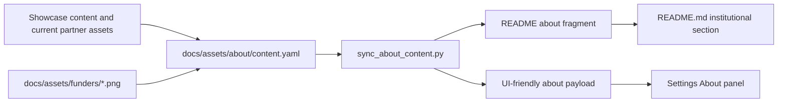
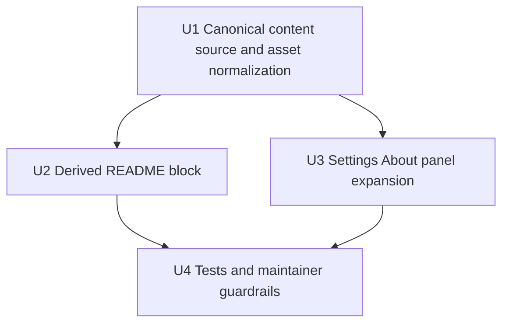

# feat: enrich about panel with team and partners

## Overview

Add a real institutional `À propos / About` surface to the desktop app and the
root `README.md`, backed by one bilingual repo-owned content source for
`Niamoteam` and `Partenaires & financeurs`.

## Problem Frame

The repository already has credible institutional material, but it is split
across the public showcase, partner logo assets, and site-builder examples.
Meanwhile the app still exposes only a narrow version/update card in
`Settings`, and `README.md` still lacks a proper institutional section. That
gap weakens trust on two important surfaces: the desktop product itself and the
public repository landing page.

The origin requirements document narrows the task clearly: this is not a full
marketing-site rewrite and not a showcase mirror. It is a repo-owned, bilingual
`About` content system for two output surfaces only: the app `Settings` panel
and the root `README.md` (see origin:
`docs/brainstorms/2026-04-18-about-team-partners-requirements.md`).

## Requirements Trace

- R1. Create one canonical repo-owned source for institutional `About` content.
- R2. Keep the canonical source bilingual (`fr` and `en`).
- R3. Limit the editorial scope to `Niamoteam` and `Partenaires & financeurs`.
- R4. Keep names and roles, omit photos, and normalize Julien's role to a
  developer title.
- R5. Show both text and logos in one merged `Partenaires & financeurs`
  section.
- R6. Enrich the existing `Settings` `À propos` area instead of creating a new
  app destination.
- R7. Preserve version/update behavior inside the same app panel.
- R8. Make names and logos clickable where links exist.
- R9. Add the same institutional content to `README.md`, not a token summary.
- R10. Place the README section in the lower part of the document.
- R11. Render logos directly in `README.md`.
- R12. Use the current showcase as editorial input only, not as a runtime
  dependency.
- R13. Keep the rendered structure to `Niamoteam` then one merged
  `Partenaires & financeurs` block.
- R14. Keep names, roles, links, and logos consistent between the app and
  `README.md`.

## Scope Boundaries

- No new standalone About route, dialog, or help-center destination.
- No full redesign of `Settings`.
- No team photos.
- No runtime fetch from the showcase.
- No attempt to unify every external/public Niamoto surface in this pass.

### Deferred to Separate Tasks

- Broader marketing copy unification across the website and docs.
- Any future rich About page with history, mission, or timeline content.
- Any CMS-like editing workflow for institutional metadata.

## Context & Research

### Relevant Code and Patterns

- `src/niamoto/gui/ui/src/features/tools/views/Settings.tsx` already hosts the
  desktop-only `About` card and the updater actions that must remain visible.
- `src/niamoto/gui/ui/src/i18n/locales/fr/tools.json` and
  `src/niamoto/gui/ui/src/i18n/locales/en/tools.json` already own the current
  `About` copy for `Settings`.
- `src/niamoto/gui/ui/src/shared/desktop/openExternalUrl.ts` is the existing
  pattern for opening outbound links from desktop UI controls.
- `docs/assets/funders/manifest.yaml` already contains a curated set of partner
  and funder identities, URLs, logos, and coarse roles that can seed the new
  canonical source.
- `docs/assets/funders/*.png` already provides logo assets that can be reused
  instead of re-collecting files.
- `tests/fixtures/export.yml` shows an existing `team`, `partners`, and
  `funders` structure used by the site builder, which is useful prior art for
  the content shape even though this plan intentionally merges partners and
  funders in the rendered output.
- `src/niamoto/gui/ui/src/features/site/components/forms/TeamForm.tsx` and
  related `site.json` translations show existing project vocabulary around
  people, partner organizations, funders, names, logos, and URLs.
- `README.md` already has a lower-page area between `Resources` and `License`
  that can absorb a new institutional block without disturbing the opening
  activation path.

### Institutional Learnings

- No relevant `docs/solutions/` artifact was present for this topic.

### External References

- The live showcase is useful as source material for the current `Niamoteam`
  roster and phrasing, but no external research beyond that is required for
  planning. The repository already contains enough app, content, and asset
  context to define the implementation safely.

## Key Technical Decisions

- Store the canonical institutional content in one repo-owned data file outside
  the `Settings` view.
  Rationale: app and README need the same material, so the source must not live
  inline in one renderer.
- Put the canonical source in a neutral content location under `docs/assets/`
  rather than under `src/niamoto/gui/ui/`.
  Rationale: this content is editorial project metadata shared by app and
  README, not UI-local state.
- Keep the source bilingual and structured data-first, with optional short
  prose fields per section.
  Rationale: the app needs localized rendering, and the README can derive its
  English block from the same source without inventing content.
- Reuse existing logo files from `docs/assets/funders/` where possible instead
  of duplicating assets into a second tree.
  Rationale: the repo already has a logo set and manifest; a second copy would
  create drift immediately.
- Generate the README institutional block from the canonical source instead of
  maintaining it manually.
  Rationale: the requirements explicitly call for consistency between app and
  README, which is best enforced by derivation, not discipline alone.
- Keep the app implementation inside the existing `Settings` card, but expand
  its content hierarchy.
  Rationale: this satisfies the requested scope without introducing new shell
  destinations or navigation questions.
- Render one merged `Partenaires & financeurs` section even if the canonical
  source preserves role metadata internally.
  Rationale: the output contract is user-facing simplicity, while the data
  source may still need role semantics for ordering and labels.

## Open Questions

### Resolved During Planning

- Should the app gain a dedicated About page or modal?
  No. The first pass extends `Settings`.
- Should partners and funders render as separate user-facing sections?
  No. The rendered output stays merged.
- Should README and app carry different editorial depth?
  No. They should remain materially aligned.

### Deferred to Implementation

- Exact showcase-derived `Niamoteam` roster and final bilingual role wording,
  once captured from the live page.
- Exact ordering rules inside the merged `Partenaires & financeurs` grid if an
  organization belongs to both categories or appears in both legacy sources.
- Exact GitHub/PyPI-safe HTML/Markdown fragment shape for the README logo row or
  grid, as long as it remains readable and robust.

## Output Structure

```text
docs/assets/about/
  content.yaml
  README-about.en.md
scripts/build/
  sync_about_content.py
README.md
src/niamoto/gui/ui/src/features/tools/views/Settings.tsx
src/niamoto/gui/ui/src/features/tools/components/
  AboutPanel.tsx
  AboutTeamSection.tsx
  AboutPartnersSection.tsx
src/niamoto/gui/ui/src/i18n/locales/fr/tools.json
src/niamoto/gui/ui/src/i18n/locales/en/tools.json
tests/gui/ui/features/tools/AboutPanel.test.tsx
tests/gui/ui/features/tools/Settings.about.test.tsx
tests/scripts/test_sync_about_content.py
```

## High-Level Technical Design

> This is directional guidance for review, not implementation specification.



## Alternative Approaches Considered

- Keep the content directly inline in `Settings.tsx` and copy it manually into
  `README.md`:
  rejected because it guarantees drift between the app and repository surfaces.
- Use the showcase page as the live source of truth:
  rejected because the requirements explicitly call for a repo-owned source and
  this would add network/runtime coupling.
- Create a dedicated new About route in the app:
  rejected because it increases shell complexity without being required for the
  first pass.
- Keep separate rendered `Partners` and `Funders` sections:
  rejected because the user explicitly chose one merged section.

## Implementation Units



### U1. Canonical content source and asset normalization

**Goal**

Create one bilingual, repo-owned institutional dataset that captures the team,
merged partner/funder organization list, text, links, and logo references.

**Primary files**

- `docs/assets/about/content.yaml`
- `docs/assets/funders/manifest.yaml`
- `docs/assets/funders/*.png`
- `tests/fixtures/export.yml`

**Changes**

- Create a dedicated canonical data file for `Niamoteam` and
  `Partenaires & financeurs`.
- Fold in the existing partner/funder manifest data instead of duplicating
  organization metadata by hand where possible.
- Normalize role wording for the team, including Julien's developer title.
- Keep enough internal metadata to support link rendering and deterministic
  ordering, even though the user-facing output remains merged.
- Record any missing live-showcase team details as explicit completion work in
  the implementation notes rather than leaving hidden assumptions.

**Test scenarios**

- The canonical file parses cleanly and contains both `fr` and `en` content.
- Every referenced logo path exists in the repo.
- Every rendered team entry includes a name and role in both languages.
- Every organization entry includes at least a display name and optional URL and
  logo metadata without broken references.

### U2. Derived README block

**Goal**

Generate or refresh the root `README.md` institutional section from the
canonical source so README and app stay aligned.

**Primary files**

- `scripts/build/sync_about_content.py`
- `README.md`
- `tests/scripts/test_sync_about_content.py`

**Changes**

- Introduce a small generator or synchronizer that renders the English README
  block from the canonical source.
- Bound the generated content with stable markers inside `README.md` so the rest
  of the file stays hand-edited.
- Render a lower-page `About` section with `Niamoteam` followed by
  `Partners & funders`, including logos and outbound links.
- Keep the output robust on both GitHub and PyPI by favoring simple Markdown or
  minimal embedded HTML where needed for logo layout.

**Test scenarios**

- Running the generator updates only the bounded README section.
- The generated README block includes the expected headings, names, and at
  least one linked logo row or grid.
- The generated block remains non-empty when organization logos are present.
- README output does not contain absolute local file paths.

### U3. Settings About panel expansion

**Goal**

Turn the current desktop `About` card into a richer panel that combines version
and update controls with team and institutional context.

**Primary files**

- `src/niamoto/gui/ui/src/features/tools/views/Settings.tsx`
- `src/niamoto/gui/ui/src/features/tools/components/AboutPanel.tsx`
- `src/niamoto/gui/ui/src/features/tools/components/AboutTeamSection.tsx`
- `src/niamoto/gui/ui/src/features/tools/components/AboutPartnersSection.tsx`
- `src/niamoto/gui/ui/src/i18n/locales/fr/tools.json`
- `src/niamoto/gui/ui/src/i18n/locales/en/tools.json`
- `src/niamoto/gui/ui/src/shared/desktop/openExternalUrl.ts`
- `tests/gui/ui/features/tools/AboutPanel.test.tsx`
- `tests/gui/ui/features/tools/Settings.about.test.tsx`

**Changes**

- Extract the existing `About` card into a dedicated component to keep
  `Settings.tsx` readable.
- Preserve current version and updater actions at the top of the panel.
- Add a localized `Niamoteam` section without photos, with clickable names when
  links exist.
- Add a merged localized `Partenaires & financeurs` section with clickable
  logos and names.
- Ensure the panel degrades cleanly when a person has no public link or an
  organization has no logo.

**Test scenarios**

- Desktop `Settings` still shows current version and update actions.
- The expanded panel renders both `Niamoteam` and `Partenaires & financeurs`.
- Clicking a linked team or organization item routes through the existing
  external-link mechanism.
- Entries without URLs render as plain text instead of broken link controls.
- The English and French UI both render the expected localized labels.

### U4. Tests and maintainer guardrails

**Goal**

Prevent drift between the canonical source, the generated README block, and the
app payload over time.

**Primary files**

- `tests/scripts/test_sync_about_content.py`
- `tests/gui/ui/features/tools/AboutPanel.test.tsx`
- `tests/gui/ui/features/tools/Settings.about.test.tsx`
- `docs/assets/about/content.yaml`
- `README.md`

**Changes**

- Add targeted tests for the content synchronizer and the About UI rendering.
- Add lightweight maintainer guidance near the canonical content source or
  generator explaining that edits should start from the repo-owned content file,
  not directly in both surfaces.
- Ensure future updates to team or organization metadata can be made without
  editing React and README prose independently.

**Test scenarios**

- Content sync tests fail if the generated README block diverges from the source.
- UI tests fail if expected sections disappear from `Settings`.
- Tests catch missing required bilingual fields in the canonical source.

## Sequencing and Dependencies

1. Land the canonical content source and asset normalization first.
2. Add the README synchronizer once the data contract is stable.
3. Expand the `Settings` About panel against the same source.
4. Finish with guardrail tests so later copy or asset edits cannot drift
   silently.

The README generator and UI expansion both depend on the canonical source, but
they can proceed in parallel once that contract is fixed.

## Risks and Mitigations

- Live showcase content may not map cleanly to a bilingual structured source.
  Mitigation: capture the exact roster and wording explicitly during execution,
  then normalize once into the canonical file.
- README logo rendering can behave differently across GitHub and PyPI.
  Mitigation: keep the generated fragment simple and cover it with a targeted
  generator test.
- The `Settings` card can become visually heavy if the panel layout is not kept
  disciplined.
  Mitigation: preserve update/version actions as one compact zone and move the
  new institutional content into clearly separated subsections.
- Existing partner/funder manifests may disagree on naming or category labels.
  Mitigation: use one normalized canonical file as the final output contract for
  this feature.

## Verification Strategy

- Targeted Python test for the content synchronizer.
- Targeted React tests for the About panel and `Settings` integration.
- `pnpm build` for the frontend after the UI changes.
- Manual spot-check of the generated `README.md` section on GitHub/PyPI-safe
  markup conventions before commit.

## Next Step

-> /ce:work `docs/plans/2026-04-18-004-feat-about-team-partners-plan.md`
