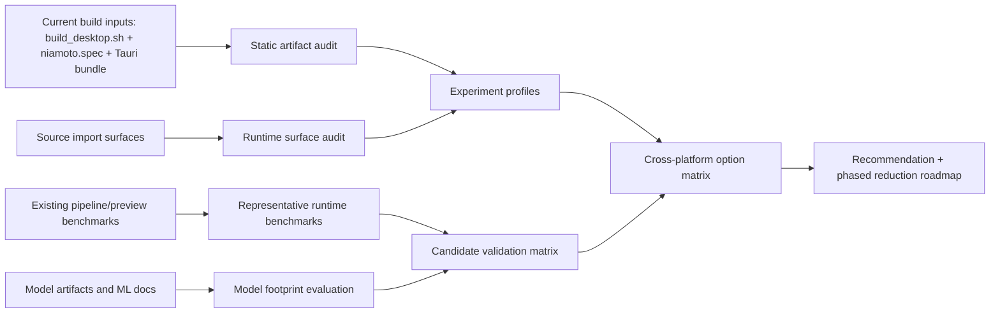
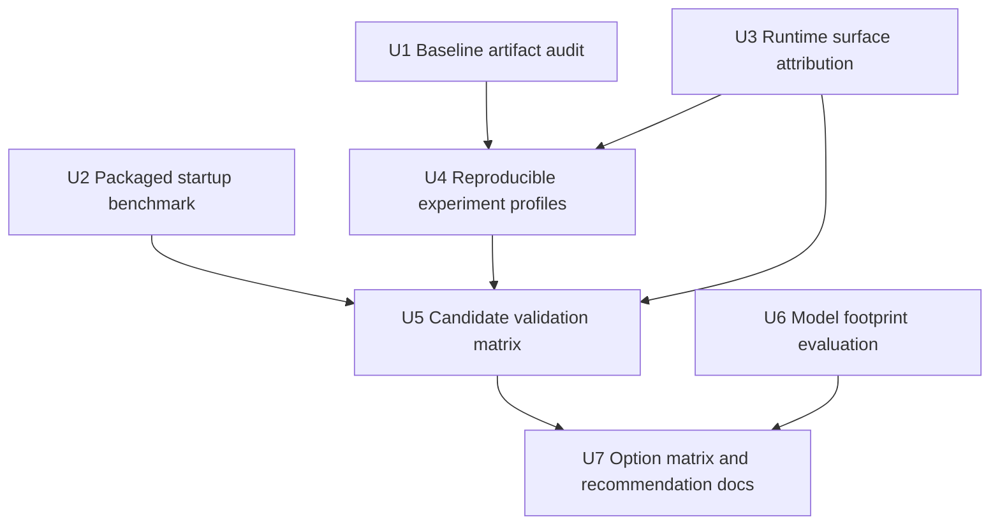

# refactor: desktop distribution size audit and strategy

## Overview

Build a reproducible analysis workflow that explains where Niamoto desktop size
comes from, measures the runtime cost of candidate reductions, and ends with a
ranked recommendation for how to reduce download and install size across macOS,
Windows, and Linux without cutting the current product scope.

The plan treats shell migration as a downstream comparison, not the initial
frame. The first job is to quantify the current bundle, sidecar, dependency,
and model footprint, then compare reduction strategies against the same
baseline.

## Problem Frame

The current desktop distribution is heavy enough that packaging decisions now
affect adoption friction, update cost, and future architecture choices. The
origin requirements document locked four constraints that planning must honor:

- size reduction is the primary optimization target
- the analysis must be multi-platform from the start
- the full current product scope must remain in scope
- the deliverable must include an audit, an option comparison, and an execution
  strategy

Verified repo context reinforces that framing:

- `src-tauri/target/release/bundle/macos/Niamoto.app` is roughly `498 MB`
- `src-tauri/target/release/bundle/dmg/Niamoto_0.15.2_aarch64.dmg` is roughly
  `195 MB`
- `src-tauri/resources/sidecar` is roughly `353 MB`
- the largest verified bundled contributors currently sit in the Python
  sidecar, especially geospatial/runtime libraries
- existing benchmarks already cover `transform`/`export` and preview behavior,
  but there is no dedicated packaged desktop startup benchmark yet

The plan therefore focuses on three questions:

1. What exactly is shipped, by platform and by dependency family?
2. Which reductions are realistic without losing product capability?
3. In what order should Niamoto test those reductions so the result is
   decision-grade rather than anecdotal?

## Requirements Trace

- R1-R4. Produce a cross-platform packaged-size audit with contributor
  attribution and platform-specific separation.
- R5-R8. Compare strategic options on the same baseline, with shell choice kept
  subordinate to measured bottlenecks and full product scope preserved.
- R9-R12. Re-evaluate the ML/runtime footprint, eager versus specialized heavy
  dependencies, and over-inclusion or duplication in packaging.
- R13-R16. Reuse and extend benchmarks, rank opportunities by size impact and
  risk, and end with a recommendation plus phased execution strategy.

## Scope Boundaries

- No immediate migration to Electron, Tauri alternatives, or optional-download
  architecture is assumed by this plan.
- No product family is removed from scope to make the numbers look better.
- No reduction experiment is considered viable unless it is measured against a
  shared validation matrix.
- The default release path must remain buildable while the audit harness is
  added.

### Deferred to Separate Tasks

- Executing the recommended size-reduction changes after the audit is complete.
- Any final product decision about optional downloads or split payloads.
- Any final shell migration decision after normalized bundle comparisons exist.

## Context & Research

### Relevant Code and Patterns

- `build_scripts/build_desktop.sh` is the current build orchestrator. It builds
  the React frontend, runs PyInstaller in `onedir` mode, copies the sidecar
  into `src-tauri/resources/sidecar/<target>/niamoto`, and then builds Tauri.
- `build_scripts/niamoto.spec` is the current inclusion boundary for Python
  code, data files, metadata, hidden imports, and bundled binaries. It already
  contains hard-coded inclusions for `pyproj`, `pyogrio`, UI dist assets, and
  model artifacts.
- `build_scripts/pyinstaller_hooks/hook-sklearn.py` already shows the local
  pattern for trimming non-runtime package data through PyInstaller hook
  excludes.
- `build_scripts/README.md` already documents the current bundle composition
  and explicitly calls out future optimization ideas such as DuckDB Spatial and
  Polars.
- `src-tauri/src/lib.rs` shows the current runtime assumption: release builds
  resolve a PyInstaller `onedir` sidecar from
  `src-tauri/resources/sidecar/<triple>/niamoto/niamoto`, so any experiment
  that changes sidecar packaging must account for this contract.
- `scripts/dev/bench_pipeline.py` and `scripts/dev/bench_preview.py` are the
  current benchmark patterns to follow for repeatable JSON-friendly scripts.
- `src/niamoto/gui/api/app.py` imports the full router set at module import
  time, making startup-path dependency attribution important.
- `src/niamoto/gui/api/routers/files.py` imports `geopandas` at module scope,
  which is a strong signal that some geospatial weight may be on the startup
  path rather than only behind advanced actions.
- `src/niamoto/core/imports/engine.py` imports `geopandas` in the generic
  importer, which matters for deciding whether geospatial libraries are core or
  specialized.
- `src/niamoto/gui/api/services/map_renderer.py` imports `plotly` at module
  scope, which matters for eager UI/service payload analysis.
- `src/niamoto/core/imports/ml/classifier.py` already lazy-loads joblib models
  on first use, which is a useful pattern for distinguishing bundled weight
  from startup cost.
- `src/niamoto/core/imports/ml/value_features.py` imports `scipy.stats` at
  module scope, which is relevant to startup-path classification and potential
  import-boundary experiments.
- `tests/e2e/test_reference_reproduction.py` provides realistic preview/export
  smoke coverage for desktop-relevant workflows.
- `tests/test_resource_cascade.py` is a good invariant pattern for keeping
  desktop and CLI behavior aligned while packaging changes are explored.
- No relevant `docs/solutions/` artifact was present for this topic.

### External References

- PyInstaller hook documentation: <https://pyinstaller.org/en/stable/hooks.html>
- Electron Packager documentation: <https://electron.github.io/packager/main/index.html>
- Electron packaging overview: <https://www.electronjs.org/docs/latest/tutorial/distribution-overview>
- Tauri size positioning: <https://tauri.app/start/>

External research was warranted here because this work touches cross-platform
packaging behavior, payload attribution, and a possible future shell
comparison.

## Key Technical Decisions

- Use a single audit matrix across macOS, Windows, and Linux.
  Rationale: the requirements explicitly prioritize multi-platform decisions,
  and one-platform numbers would bias the recommendation.
- Separate static bundle attribution from runtime-path attribution.
  Rationale: a package can be large, startup-critical, both, or neither. The
  plan needs both views to avoid optimizing the wrong thing.
- Treat the current `onedir` sidecar shape as the baseline invariant.
  Rationale: `src-tauri/src/lib.rs` currently expects that structure, so the
  first comparison pass should normalize against the current contract instead of
  mixing multiple packaging shapes immediately.
- Make reduction experiments profile-driven rather than hand-edited.
  Rationale: reproducible profiles make size comparisons auditable and avoid
  accidental drift between runs.
- Introduce a candidate validation matrix before deciding whether an experiment
  is acceptable.
  Rationale: the product scope is non-negotiable, so size-only wins are not
  sufficient.
- Evaluate model footprint as a dedicated workstream, but not as the default
  top-priority bet.
  Rationale: current verified model size is material, but the sidecar’s
  geospatial/runtime stack appears larger and should be measured first.
- Compare Electron only after normalizing the app payload.
  Rationale: otherwise the shell comparison will hide the current sidecar
  bottleneck behind a larger browser-runtime debate.

## Open Questions

### Resolved During Planning

- Which artifact types should define the baseline?
  Use both final distributables and unpacked installed payloads where
  accessible, plus the embedded sidecar subtree, because each answers a
  different size question.
- Which classes of reduction strategies are in-scope for comparison?
  Packaging trim, import-boundary changes, model artifact reductions, optional
  payload simulation, and shell-normalized comparison are all in scope. Full
  product rewrites are not.
- Is a new packaged startup benchmark required?
  Yes. Existing benchmarks cover runtime workflows, but not packaged desktop
  startup-to-health readiness.

### Deferred to Implementation

- Exact artifact extraction mechanics for Windows and Linux installers when the
  build host cannot install them natively.
- Exact acceptance thresholds for “no loss” on model experiments beyond the
  default rule that existing evaluation baselines and smoke flows must not
  regress.
- Exact profile naming once the initial experiment matrix is implemented against
  real bundle data.

## Output Structure

```text
docs/analysis/
  2026-04-19-desktop-distribution-size-audit.md
  2026-04-19-desktop-distribution-size-options.md
  2026-04-19-desktop-distribution-size-validation-matrix.md
build_scripts/desktop_size_profiles.py
scripts/build/audit_desktop_bundle.py
scripts/build/audit_python_runtime_surface.py
scripts/build/report_desktop_size_matrix.py
scripts/dev/bench_desktop_startup.py
scripts/dev/bench_model_footprint.py
scripts/dev/validate_desktop_size_candidate.py
tests/scripts/test_audit_desktop_bundle.py
tests/scripts/test_audit_python_runtime_surface.py
tests/scripts/test_bench_desktop_startup.py
tests/scripts/test_bench_model_footprint.py
tests/scripts/test_desktop_size_profiles.py
tests/scripts/test_report_desktop_size_matrix.py
tests/scripts/test_validate_desktop_size_candidate.py
```

## High-Level Technical Design

> *This illustrates the intended approach and is directional guidance for review, not implementation specification. The implementing agent should treat it as context, not code to reproduce.*



## Phased Delivery

### Phase 1

Establish the baseline: what is shipped today, what is imported eagerly, and
what current startup/runtime behavior looks like.

### Phase 2

Add reproducible experiment profiles and a validation matrix so candidate
reductions can be compared without changing the product goalposts.

### Phase 3

Run targeted model and packaging experiments, then synthesize the option matrix
and recommendation documents.

## Alternative Approaches Considered

- Start with an Electron spike first.
  Rejected because the current verified bottleneck is the sidecar footprint,
  and shell-first work would delay the real audit.
- Decide monolithic versus optional payloads before measurement.
  Rejected because the implication of that choice is one of the analysis
  outputs, not an input assumption.
- Focus only on file-size trimming inside PyInstaller.
  Rejected because the requirements also need runtime-path attribution,
  validation guardrails, and model re-evaluation.

## Implementation Units



- [ ] **Unit 1: Establish the baseline artifact audit**

**Goal:** Produce a repeatable audit of current bundle size by artifact, by
platform, and by dependency family.

**Requirements:** R1, R2, R3, R4, R15

**Dependencies:** None

**Files:**
- Create: `scripts/build/audit_desktop_bundle.py`
- Create: `tests/scripts/test_audit_desktop_bundle.py`
- Create: `docs/analysis/2026-04-19-desktop-distribution-size-audit.md`

**Approach:**
- Traverse build outputs and sidecar trees from configurable input paths rather
  than hard-coding one machine-specific layout.
- Attribute files into explicit families such as Python runtime, native
  libraries, geospatial stack, ML artifacts, frontend assets, documentation,
  and unknown/unclassified remainder.
- Emit both machine-readable results and a human-readable audit summary so later
  units can reuse the same baseline data.

**Execution note:** Start with characterization coverage against fixture trees
before pointing the audit at real build outputs.

**Patterns to follow:**
- `scripts/dev/bench_pipeline.py`
- `build_scripts/build_desktop.sh`
- `tests/scripts/test_sync_about_content.py`

**Test scenarios:**
- Happy path: a fixture bundle tree containing sidecar, native libs, and UI
  assets produces per-artifact totals and family totals that add up to the
  expected overall size.
- Edge case: files that do not match any known family are grouped under an
  explicit fallback category instead of being silently dropped.
- Error path: an invalid or incomplete input root returns a clear failure that
  identifies the missing artifact class.
- Integration: running the audit against the current `src-tauri/resources/sidecar`
  and `src-tauri/target/release/bundle` surfaces the same dominant contributors
  already observed manually.

**Verification:**
- The audit doc records a reproducible baseline matrix and ranked top
  contributors for the currently shipped desktop payload.

- [ ] **Unit 2: Add a packaged desktop startup benchmark**

**Goal:** Measure packaged startup cost and align it with the existing runtime
benchmark style already used elsewhere in the repo.

**Requirements:** R13, R14, R15

**Dependencies:** None

**Files:**
- Create: `scripts/dev/bench_desktop_startup.py`
- Create: `tests/scripts/test_bench_desktop_startup.py`
- Modify: `docs/analysis/2026-04-19-desktop-distribution-size-audit.md`

**Approach:**
- Measure cold start from app launch to authenticated health readiness, using
  the existing startup logging and health semantics already defined by
  `src-tauri/src/lib.rs` and `src/niamoto/gui/api/app.py`.
- Keep the benchmark configurable so it can target packaged bundles from
  multiple platforms or local unpacked app payloads.
- Report percentiles and repeatability in the same spirit as the current
  benchmark scripts instead of inventing a different format.

**Patterns to follow:**
- `scripts/dev/bench_pipeline.py`
- `scripts/dev/bench_preview.py`
- `src-tauri/src/lib.rs`
- `src/niamoto/gui/startup_logging.py`

**Test scenarios:**
- Happy path: a fixture startup log or benchmark stub produces startup duration,
  readiness status, and repeatable percentile output.
- Edge case: repeated runs on the same app path reset measurement state instead
  of mixing results across sessions.
- Error path: a packaged app that never reaches health readiness fails with a
  timeout result rather than hanging indefinitely.
- Integration: benchmarking a real packaged app records startup-to-health data
  in the same result family as the other analysis scripts.

**Verification:**
- The audit doc includes a packaged startup baseline alongside static size
  measurements.

- [ ] **Unit 3: Attribute eager versus specialized dependency surfaces**

**Goal:** Distinguish what is large from what is startup-critical, and separate
 core-path dependencies from workflow-specific ones.

**Requirements:** R2, R11, R12, R15

**Dependencies:** Unit 1

**Files:**
- Create: `scripts/build/audit_python_runtime_surface.py`
- Create: `tests/scripts/test_audit_python_runtime_surface.py`
- Modify: `docs/analysis/2026-04-19-desktop-distribution-size-audit.md`

**Approach:**
- Combine packaging-surface inspection from `build_scripts/niamoto.spec` with
  source import-surface analysis over the Python app entrypoints.
- Classify heavy packages into at least four buckets: eager-at-startup,
  lazy-at-runtime, workflow-specific, and packaging-only.
- Seed the first pass with verified hotspots from `src/niamoto/gui/api/app.py`,
  `src/niamoto/gui/api/routers/files.py`, `src/niamoto/core/imports/engine.py`,
  `src/niamoto/gui/api/services/map_renderer.py`,
  `src/niamoto/core/imports/ml/classifier.py`, and
  `src/niamoto/core/imports/ml/value_features.py`.

**Patterns to follow:**
- `build_scripts/niamoto.spec`
- `src/niamoto/gui/api/app.py`
- `src/niamoto/core/imports/ml/classifier.py`

**Test scenarios:**
- Happy path: a module with top-level imports of a heavy package is classified
  as eager-at-startup when it sits under an app entrypoint import chain.
- Edge case: a lazily loaded model or library accessed only inside a method is
  not incorrectly marked as eager-at-startup.
- Error path: files that cannot be parsed or imported are reported explicitly
  and do not corrupt the rest of the attribution result.
- Integration: the runtime-surface audit produces a table that explains why
  `geopandas`, `plotly`, `scipy`, and model artifacts belong to different
  priority buckets.

**Verification:**
- The audit doc clearly separates “large and always on” from “large but
  specialized”, which is the minimum bar for later reduction decisions.

- [ ] **Unit 4: Add reproducible size-reduction experiment profiles**

**Goal:** Make candidate reduction builds reproducible and comparable without
manual spec edits between runs.

**Requirements:** R5, R6, R12, R15

**Dependencies:** Units 1 and 3

**Files:**
- Modify: `build_scripts/niamoto.spec`
- Modify: `build_scripts/build_desktop.sh`
- Create: `build_scripts/desktop_size_profiles.py`
- Create: `tests/scripts/test_desktop_size_profiles.py`
- Modify: `build_scripts/pyinstaller_hooks/hook-sklearn.py`

**Approach:**
- Introduce named experiment profiles that control packaging includes/excludes
  and any simulation toggles needed for size experiments.
- Preserve the current default release profile exactly, so analysis harnesses do
  not silently change the shipping behavior.
- Use profile metadata to capture what changed for each experiment so later
  audit results remain comparable.

**Patterns to follow:**
- `build_scripts/build_desktop.sh`
- `build_scripts/niamoto.spec`
- `build_scripts/pyinstaller_hooks/hook-sklearn.py`

**Test scenarios:**
- Happy path: the baseline profile reproduces current inclusion behavior and can
  still build the existing desktop payload.
- Edge case: a profile that excludes one dependency family only affects the
  intended inclusion set and leaves unrelated families unchanged.
- Error path: an unknown profile name fails fast with a clear list of supported
  profiles.
- Integration: a profile-driven build emits enough metadata for Unit 1’s audit
  script to identify which experiment produced which artifact set.

**Verification:**
- Multiple candidate builds can be reproduced from named profiles without hand
  editing the spec or build script.

- [ ] **Unit 5: Build the candidate validation matrix**

**Goal:** Define the no-loss guardrails every reduction experiment must pass.

**Requirements:** R7, R13, R14, R15

**Dependencies:** Units 2, 3, and 4

**Files:**
- Create: `scripts/dev/validate_desktop_size_candidate.py`
- Create: `tests/scripts/test_validate_desktop_size_candidate.py`
- Create: `docs/analysis/2026-04-19-desktop-distribution-size-validation-matrix.md`
- Modify: `tests/e2e/test_reference_reproduction.py`
- Modify: `tests/test_resource_cascade.py`

**Approach:**
- Aggregate representative checks that cover the current product promise:
  packaged startup, preview, transform/export, and desktop-versus-CLI parity.
- Reuse existing smoke tests and benchmarks wherever possible, and only add new
  coverage when a required product family is currently unrepresented.
- Make the validation matrix explicit in docs so experiment outcomes are judged
  against the same contract every time.

**Patterns to follow:**
- `tests/e2e/test_reference_reproduction.py`
- `tests/test_resource_cascade.py`
- `scripts/dev/bench_pipeline.py`

**Test scenarios:**
- Happy path: a candidate profile that keeps core behavior intact reports a full
  pass across startup, preview, export, and parity checks.
- Edge case: a candidate profile that skips one artifact class reports a
  partial-result state with a clear “not comparable” outcome instead of a false
  pass.
- Error path: if preview, export, or plugin parity breaks, the validator
  returns a failing result tied to the broken capability family.
- Integration: a real candidate build can be validated end-to-end without
  manual interpretation of scattered scripts.

**Verification:**
- Every size-reduction candidate is accompanied by an explicit pass/fail matrix
  against the preserved product scope.

- [ ] **Unit 6: Evaluate model footprint and no-loss model reductions**

**Goal:** Quantify whether model artifacts are important enough to prioritize
and test reduction paths without accuracy or workflow regressions.

**Requirements:** R9, R10, R13, R15

**Dependencies:** Units 1 and 5

**Files:**
- Create: `scripts/dev/bench_model_footprint.py`
- Create: `tests/scripts/test_bench_model_footprint.py`
- Modify: `docs/analysis/2026-04-19-desktop-distribution-size-audit.md`
- Modify: `docs/analysis/2026-04-19-desktop-distribution-size-options.md`

**Approach:**
- Measure current model file size, load cost, and representative inference cost
  before exploring any reduction path.
- Use existing ML documentation and evaluation assets as the acceptance frame
  for candidate reductions.
- Treat model work as a priority candidate only if the measured size and
  validation data justify it relative to the geospatial/runtime stack.

**Patterns to follow:**
- `src/niamoto/core/imports/ml/classifier.py`
- `docs/05-ml-detection/README.md`
- `ml/models/`

**Test scenarios:**
- Happy path: the benchmark reports per-model size, load time, and comparison
  output for the current `ml/models` contents.
- Edge case: missing or extra model files are surfaced clearly without breaking
  the rest of the footprint report.
- Error path: a candidate reduced model that fails evaluation parity is marked
  rejected and not merged into the recommendation set.
- Integration: model benchmark output can be joined with the global size audit
  so the team can compare model wins against geospatial/runtime wins.

**Verification:**
- The option matrix can explicitly state whether model reduction is worth
  prioritizing and under what acceptance bar.

- [ ] **Unit 7: Produce the option matrix, recommendation, and roadmap**

**Goal:** Turn the audit and experiment results into a decision-grade strategy
document.

**Requirements:** R5, R6, R8, R15, R16

**Dependencies:** Units 1 through 6

**Files:**
- Create: `scripts/build/report_desktop_size_matrix.py`
- Create: `tests/scripts/test_report_desktop_size_matrix.py`
- Create: `docs/analysis/2026-04-19-desktop-distribution-size-options.md`
- Modify: `build_scripts/README.md`

**Approach:**
- Build a scored comparison across at least baseline Tauri, optimized-current
  packaging, sidecar split simulation, and shell-normalized Electron.
- Score options primarily on size reduction, then on product complexity,
  technical complexity, runtime risk, update ergonomics, and reversibility.
- Make the recommendation explicit about what should happen first, what should
  be tested next, and what should not yet be pursued.

**Patterns to follow:**
- `docs/brainstorms/2026-04-19-desktop-distribution-size-reduction-requirements.md`
- `build_scripts/README.md`
- `docs/plans/2026-04-18-003-feat-in-app-public-documentation-plan.md`

**Test scenarios:**
- Happy path: a set of audit and validation inputs produces a ranked option
  matrix with deterministic scoring output.
- Edge case: when a candidate is missing one platform’s data, the report marks
  the confidence level down instead of treating the matrix as complete.
- Error path: invalid or incomplete experiment inputs fail with a clear reason
  instead of generating a misleading recommendation.
- Integration: the final docs reflect only candidates that passed the explicit
  validation matrix from Unit 5.

**Verification:**
- The final option doc answers which opportunity is highest leverage now, which
  experiments are medium-confidence next steps, and whether shell migration is
  currently justified.

## System-Wide Impact

- **Interaction graph:** build orchestration, PyInstaller inclusion rules, the
  Tauri sidecar contract, Python import surfaces, benchmark scripts, smoke
  tests, and final strategy docs all become part of one audit pipeline.
- **Error propagation:** a bad experiment profile can break sidecar resolution,
  startup readiness, preview rendering, import analysis, or ML runtime. The
  validation matrix exists specifically to surface those failures early.
- **State lifecycle risks:** experiment runs will generate multiple build
  outputs and temporary artifacts, so stale artifact reuse is a meaningful risk
  if result provenance is not recorded.
- **API surface parity:** desktop behavior must stay aligned with CLI/plugin
  behavior, especially when packaging or import-boundary changes are tested.
- **Integration coverage:** static size audit alone cannot prove safety;
  packaged startup, preview/export smoke, and parity checks are required.
- **Unchanged invariants:** the default desktop build remains supported, the
  full current product scope remains the comparison contract, and no shell
  decision is made before normalized payload data exists.

## Risks & Dependencies

| Risk | Mitigation |
|------|------------|
| Cross-platform artifact collection is uneven because the current machine cannot build or unpack every installer format natively. | Separate artifact schema from host execution, allow imported measurements from CI or foreign-host runs, and lower confidence explicitly when a platform is incomplete. |
| Packaging trims appear to save space but actually remove runtime-required data or libraries. | Introduce Unit 5’s validation matrix before treating any size win as viable. |
| Startup-path attribution is distorted by eager imports spread across router imports and service modules. | Use explicit runtime-surface analysis over entrypoint import graphs instead of relying only on package presence. |
| Model optimization work consumes time without materially changing total shipped size. | Run Unit 6 only after Unit 1 baseline numbers and rank model work against larger dependency families. |
| Electron comparison becomes apples-to-oranges because the app payload is not normalized. | Compare Electron only after the same app payload assumptions are held constant and the current sidecar footprint is measured. |

## Documentation / Operational Notes

- Keep `build_scripts/README.md` aligned with the measured baseline and the
  current recommendation, so the repository does not continue to document rough
  size guesses after the audit exists.
- Treat `docs/analysis/` as the durable home for this investigation’s outputs,
  rather than scattering conclusions across ad hoc comments or PR descriptions.
- If CI or external hosts are needed to fill Windows/Linux measurements, record
  the provenance of those measurements in the analysis docs.

## Sources & References

- **Origin document:** `docs/brainstorms/2026-04-19-desktop-distribution-size-reduction-requirements.md`
- Related code:
  - `build_scripts/build_desktop.sh`
  - `build_scripts/niamoto.spec`
  - `build_scripts/pyinstaller_hooks/hook-sklearn.py`
  - `src-tauri/src/lib.rs`
  - `src/niamoto/gui/api/app.py`
  - `src/niamoto/gui/api/routers/files.py`
  - `src/niamoto/core/imports/engine.py`
  - `src/niamoto/gui/api/services/map_renderer.py`
  - `src/niamoto/core/imports/ml/classifier.py`
  - `src/niamoto/core/imports/ml/value_features.py`
  - `scripts/dev/bench_pipeline.py`
  - `scripts/dev/bench_preview.py`
  - `tests/e2e/test_reference_reproduction.py`
  - `tests/test_resource_cascade.py`
- External docs:
  - <https://pyinstaller.org/en/stable/hooks.html>
  - <https://electron.github.io/packager/main/index.html>
  - <https://www.electronjs.org/docs/latest/tutorial/distribution-overview>
  - <https://tauri.app/start/>
