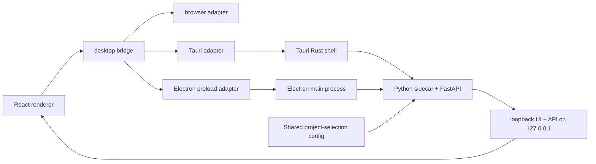

# feat: parallel Electron shell alongside Tauri

## Overview

Prepare Niamoto for an Electron desktop shell running in parallel with the
current Tauri shell, without destabilizing the existing desktop release path.

The first objective is not to migrate the product. It is to create a
decision-grade experiment that answers a narrower question:

- can Niamoto run under an Electron shell with the same React frontend and the
  same FastAPI/Python sidecar,
- while keeping Tauri as the production shell,
- and without forcing the frontend to depend directly on Tauri-specific APIs.

This plan treats Electron as a parallel shell spike with a clear go/no-go
checkpoint. Tauri remains the canonical release path until the Electron shell
proves stable enough to justify any broader migration discussion.

## Problem Frame

The current Tauri desktop app already works and already carries significant
desktop-specific behavior:

- `src-tauri/src/lib.rs` launches the bundled Python sidecar, chooses a local
  port, waits for an authenticated `/api/health` probe, and only then
  navigates the webview to the loopback origin
- `src-tauri/src/commands.rs` owns desktop-only concerns such as recent
  projects, project validation, native dialogs, settings persistence, and
  external URL opening
- the React frontend still knows about Tauri directly in a small but
  meaningful set of desktop helpers and hooks

The user goal is not size reduction. It is shell uniformity and stability
across desktop platforms. Electron is attractive for that reason, but it
introduces extra runtime weight and should not be adopted blindly.

The plan therefore optimizes for:

1. preserving the working Tauri release path
2. extracting a shell-neutral desktop contract in the renderer
3. building an Electron shell that reuses the current frontend and Python
   backend architecture
4. comparing shells from real behavior rather than intuition

## Requirements Trace

- R1. Keep Tauri as the production desktop shell while the Electron work is
  being developed.
- R2. Reuse the current React frontend and FastAPI/Python sidecar rather than
  redesigning the desktop architecture in the first pass.
- R3. Remove direct renderer dependence on Tauri-specific APIs by introducing a
  shell-neutral desktop bridge.
- R4. Reproduce the essential desktop flows under Electron:
  startup, project bootstrap, project switching, settings, external URL
  opening, and shutdown.
- R5. Keep Electron-specific process and IPC access behind a preload bridge,
  not direct Node access in the renderer.
- R6. Keep Tauri and Electron identities, config locations, log directories,
  and updater channels isolated.
- R7. Defer updater parity until the shell bootstrap and runtime contract are
  proven.
- R8. End with a concrete comparison of Tauri and Electron startup path,
  packaging path, and maintenance burden for Niamoto specifically.
- R9. Keep the project-selection and reload contract interoperable across
  shells during the spike.

## Scope Boundaries

### In Scope

- Extracting a shared desktop bridge in the frontend
- Refitting existing Tauri integration to go through that bridge
- Adding an Electron shell with main-process and preload code
- Reproducing the current sidecar startup contract under Electron
- Generalizing desktop runtime metadata where needed so the frontend can tell
  desktop mode apart from shell identity
- Adding dedicated build and dev scripts for the Electron shell
- Updating architecture docs to describe dual-shell support
- Producing a comparison artifact and recommendation gate

### Out of Scope

- Replacing Tauri as the default release shell in this plan
- Reworking the Python sidecar architecture
- Reducing Python/geospatial/model payload size
- Release-grade Windows and Linux Electron support in the first pass
- Full updater parity in the initial Electron spike
- Rewriting the frontend UI for Electron-specific behavior

### Deferred to Separate Tasks

- A final Tauri vs Electron migration decision
- Electron auto-update implementation
- Cross-platform packaging hardening for Electron beyond the initial target OS
- Any shell-driven rework of startup visuals, menus, tray behavior, or native
  integrations beyond what is required for parity

## Context & Research

### Relevant Code and Patterns

- `docs/07-architecture/gui-runtime.md` documents the current runtime split:
  packaged mode serves the frontend from FastAPI, and Tauri navigates to the
  loopback origin only after an authenticated health probe succeeds.
- `src-tauri/src/lib.rs` is the authoritative startup contract today:
  sidecar resolution, port allocation, startup token generation, readiness
  polling, loader/error screens, and process cleanup all live there.
- `src-tauri/src/commands.rs` is the authoritative desktop command surface
  today: recent projects, project validation, folder browsing, app settings,
  devtools, and external URL opening.
- `src/niamoto/gui/ui/src/shared/desktop/tauri.ts` is the current thin bridge
  to the Tauri renderer API.
- `src/niamoto/gui/ui/src/shared/desktop/appSettings.ts`,
  `src/niamoto/gui/ui/src/shared/desktop/openExternalUrl.ts`,
  `src/niamoto/gui/ui/src/shared/hooks/useProjectSwitcher.ts`, and
  `src/niamoto/gui/ui/src/shared/desktop/updater/useAppUpdater.ts` show that
  direct Tauri coupling is present but concentrated.
- `src/niamoto/gui/ui/src/shared/hooks/useRuntimeMode.ts` already separates
  `desktop` and `web` mode through backend runtime detection, which is a good
  foundation for adding an Electron runtime signal.
- `src/niamoto/gui/ui/src/app/App.tsx` contains desktop bootstrap behavior that
  must keep working when the renderer stops assuming Tauri directly.
- `src/niamoto/gui/api/context.py` and `src/niamoto/gui/api/routers/health.py`
  already expose a shell-neutral config path through `NIAMOTO_DESKTOP_CONFIG`,
  but still describe the reload flow as Tauri-specific in code and docs.
- `docs/brainstorms/2026-04-02-tauri-onboarding-audit-brainstorm.md` and
  `docs/plans/2026-04-02-fix-tauri-onboarding-pre-release-plan.md` capture
  important desktop boot and project-switch assumptions that the Electron shell
  must preserve.
- `docs/plans/2026-04-01-feat-tauri-release-readiness-plan.md` confirms the
  current release shell is already treated as a meaningful deployment surface,
  so parallel-shell work must not destabilize it.

### Technology & Architecture Summary

- Renderer: React 19 + Vite + TypeScript
- Local backend: FastAPI served from the bundled Python sidecar
- Current desktop shell: Tauri 2.x + Rust
- Current desktop runtime shape: shell boots, waits for authenticated backend
  readiness, then navigates the main window to `http://127.0.0.1:<port>`
- Frontend desktop coupling: small enough to refactor, but not zero
- Existing product assumption: desktop mode is still a localhost-backed web UI,
  not a fully offline static renderer with rich native IPC

### Institutional Learnings

- There is strong prior work on Tauri onboarding, startup contract, updater
  behavior, and release hardening.
- There is no existing institutional document for Electron in this repo.
- That means the safest path is to preserve Niamoto’s current startup model and
  treat Electron as a new outer shell rather than a new application runtime.

## Key Technical Decisions

- Introduce a shell-neutral desktop bridge before adding Electron.
  Rationale: if the renderer keeps importing Tauri directly, dual-shell support
  will create long-term divergence immediately.

- Keep one shared project-selection config contract across shells, while
  separating shell-specific preferences, logs, updater state, and packaging
  identity.
  Rationale: the current welcome and project-switch flows already reload from
  `NIAMOTO_DESKTOP_CONFIG`. Sharing that contract keeps the spike compatible
  with existing backend behavior while still isolating shell-specific state.

- Keep the application API contract unchanged in the first pass, while allowing
  narrow desktop-runtime metadata extensions.
  Rationale: Niamoto already uses the backend loopback origin as the real app
  surface. Electron should prove shell value without dragging backend redesign
  into the evaluation, but the runtime metadata contract must grow enough to
  express shell identity.

- Keep Electron main/preload code separate from the frontend workspace.
  Rationale: the renderer already has its own Vite toolchain. The Electron
  shell should add only main-process and preload concerns, not a second
  renderer stack.

- Use a preload bridge, not unrestricted renderer Node access.
  Rationale: Electron should improve shell uniformity, not weaken the security
  model by exposing arbitrary Node primitives to the UI.

- Reproduce the Tauri startup contract closely under Electron.
  Rationale: a fair shell comparison requires the same sidecar launch,
  readiness gating, and project bootstrap semantics.

- Reuse the same packaged sidecar relative layout under both shells:
  `resources/sidecar/<triple>/niamoto/<exe>`.
  Rationale: the current Tauri contract is explicit and already proven. Keeping
  the same relative layout under Electron reduces packaging ambiguity and keeps
  shell differences focused on the shell, not the artifact shape.

- Keep Electron identifiers and persisted state separate from Tauri.
  Rationale: the experimental shell must not corrupt or silently reuse Tauri’s
  shell-specific settings, updater state, or file associations.

- Defer updater parity until after runtime parity.
  Rationale: updater wiring is real work, but it is not needed to decide
  whether the Electron shell is operationally worth pursuing.

- Make shell identity explicit and separate from desktop-mode semantics.
  Rationale: the backend still needs to answer "desktop or web?" for feature
  gating, while the renderer now also needs to know "Tauri or Electron?" for
  adapter resolution. Those are related but not identical pieces of state.

- By the end of Unit 2, no shared renderer module may import `@tauri-apps/*`
  directly.
  Rationale: keeping Tauri runtime or updater imports in shared renderer code
  would make the Electron spike fail before the shell itself is meaningfully
  exercised.

- Start with one target shell package path and one target OS.
  Rationale: the user goal is to evaluate feasibility and stability, not to
  simultaneously ship a second production matrix.

## Open Questions

### Resolved During Planning

- Should Electron replace Tauri immediately?
  No. Tauri remains the production shell while Electron is developed as a
  parallel build.

- Should the first pass redesign the backend/runtime boundary?
  No. The first pass keeps the existing loopback FastAPI model.

- Should the first pass include auto-updates?
  No. Manual or disabled update handling is acceptable until shell parity is
  demonstrated.

- Should the project-selection config be shared or split between shells?
  Share the project-selection contract through `NIAMOTO_DESKTOP_CONFIG` for the
  spike. Split only shell-specific settings, logs, updater state, and app
  identity.

- Where should shell identity come from?
  The backend remains the source of truth for `mode: desktop|web`, while shell
  identity is surfaced separately as `shell: tauri|electron|null`.

### Deferred to Implementation

- Exact Electron packaging tool choice:
  `electron-builder` is the default assumption, but implementation may confirm
  whether another official packaging path is more practical.
- Whether the initial Electron dev loop should load the Vite dev server or the
  loopback FastAPI UI in every case.
- Whether drag-region, titlebar, and native chrome parity are valuable enough
  to include in the spike.
- Which OS beyond the initial evaluation target should receive packaged
  validation first.

## Output Structure

```text
docs/plans/
  2026-04-19-002-feat-parallel-electron-shell-plan.md
docs/07-architecture/gui-runtime.md
docs/analysis/
  2026-04-19-tauri-electron-shell-comparison.md
electron/
  package.json
  tsconfig.json
  main.ts
  preload.ts
  shell/
    appState.ts
    commands.ts
    config.ts
    sidecar.ts
    startup.ts
  __tests__/
    sidecar.test.ts
    startup.test.ts
    commands.test.ts
scripts/dev/
  dev_electron.sh
scripts/build/
  build_electron.sh
src/niamoto/gui/api/
  context.py
  routers/health.py
src/niamoto/gui/ui/src/shared/desktop/
  bridge.ts
  runtime.ts
  types.ts
  adapters/
    browser.ts
    tauri.ts
    electron.ts
  updater/
    controller.ts
    providers/
      tauri.ts
    support.ts
  __tests__/
    bridge.test.ts
    runtime.test.ts
    controller.test.ts
src/niamoto/gui/ui/src/shared/hooks/
  useRuntimeMode.ts
  useProjectSwitcher.ts
src/niamoto/gui/ui/src/shared/desktop/
  appSettings.ts
  openExternalUrl.ts
src/niamoto/gui/ui/src/app/
  App.tsx
```

## High-Level Technical Design

> This is directional guidance for review, not implementation code.



The renderer should know only:

- whether backend mode is `web` or `desktop`
- which shell identity is active: `tauri`, `electron`, or `null`
- whether desktop features are available
- which typed desktop capabilities it may call

It should not know whether those capabilities are fulfilled by Tauri invoke or
Electron preload IPC.

## Phased Delivery

### Phase 1

Extract the renderer desktop bridge and migrate current Tauri usage to that
contract without changing behavior.

### Phase 2

Add an Electron shell that can boot the same app architecture in development
mode and packaged mode.

### Phase 3

Reach parity for the critical desktop flows and produce a shell comparison
artifact.

### Phase 4

Decide whether Electron deserves a second hardening phase or should remain an
abandoned spike.

## Implementation Units

### Unit 1: Introduce a Shell-Neutral Desktop Bridge

**Goal**

Replace direct renderer dependence on Tauri primitives with a typed bridge that
can support browser, Tauri, and Electron adapters.

**Primary files**

- `src/niamoto/gui/ui/src/shared/desktop/types.ts`
- `src/niamoto/gui/ui/src/shared/desktop/runtime.ts`
- `src/niamoto/gui/ui/src/shared/desktop/bridge.ts`
- `src/niamoto/gui/ui/src/shared/desktop/adapters/browser.ts`
- `src/niamoto/gui/ui/src/shared/desktop/adapters/tauri.ts`
- `src/niamoto/gui/ui/src/shared/desktop/tauri.ts`
- `src/niamoto/gui/ui/src/shared/hooks/useRuntimeMode.ts`
- `src/niamoto/gui/api/routers/health.py`

**Tests**

- `src/niamoto/gui/ui/src/shared/desktop/__tests__/bridge.test.ts`
- `src/niamoto/gui/ui/src/shared/desktop/__tests__/runtime.test.ts`

**Design notes**

- Define a single typed interface for the desktop capabilities the renderer is
  allowed to use.
- Keep runtime detection explicit: backend mode remains `web` or `desktop`,
  while shell identity is `tauri`, `electron`, or `null`.
- Keep a browser adapter so the web app and tests still have safe defaults.
- Make the old `tauri.ts` file either a compatibility shim or remove it once
  all call sites are migrated.

**Test scenarios**

- Renderer in plain web mode resolves the browser adapter and does not throw on
  desktop capability checks.
- Renderer in Tauri mode resolves the Tauri adapter without changing current
  behavior.
- Runtime metadata exposes shell identity consistently without breaking the
  current `desktop` feature-gating contract.
- Runtime detection does not misclassify the packaged localhost app as plain
  web when a desktop shell is present.
- Unsupported desktop commands fail through one consistent error shape.

**Exit criteria**

- No renderer file imports `@tauri-apps/*` directly outside the Tauri adapter
  or a Tauri-only updater provider.
- Existing Tauri desktop behavior still works through the new bridge.
- Web mode behavior remains unchanged.

### Unit 2: Port Existing Desktop Features to the Shared Bridge

**Goal**

Migrate the current desktop feature surface so the renderer uses the new bridge
everywhere that matters before Electron is introduced.

**Primary files**

- `src/niamoto/gui/ui/src/shared/desktop/appSettings.ts`
- `src/niamoto/gui/ui/src/shared/desktop/openExternalUrl.ts`
- `src/niamoto/gui/ui/src/shared/hooks/useProjectSwitcher.ts`
- `src/niamoto/gui/ui/src/app/App.tsx`
- `src/niamoto/gui/ui/src/shared/desktop/updater/useAppUpdater.ts`
- `src/niamoto/gui/ui/src/shared/desktop/updater/controller.ts`
- `src/niamoto/gui/ui/src/shared/desktop/updater/providers/tauri.ts`

**Tests**

- `src/niamoto/gui/ui/src/shared/desktop/__tests__/controller.test.ts`
- `src/niamoto/gui/ui/src/shared/hooks/__tests__/useProjectSwitcher.test.ts`
- `src/niamoto/gui/ui/src/app/__tests__/App.desktop-runtime.test.tsx`

**Design notes**

- Separate generic updater state management from the Tauri-specific updater
  implementation.
- Keep the Tauri updater as the only real updater implementation in this unit,
  but move it behind a Tauri-only provider boundary.
- Project switching, settings, and external URL opening should stop assuming
  Tauri by name and instead depend on the bridge contract.
- Remove top-level `@tauri-apps/*` imports from shared renderer modules. Use a
  Tauri-only provider or dynamic import boundary so the Electron renderer does
  not eagerly load Tauri runtime code.

**Test scenarios**

- Desktop project switching still loads, validates, and reloads the expected
  project path.
- Desktop app settings still read and persist through the shell adapter.
- External URL opening preserves current validation and browser fallback
  semantics.
- The desktop boot path in `App.tsx` still behaves correctly for welcome,
  loaded, and invalid-project states.

**Exit criteria**

- The renderer reaches desktop parity under Tauri using only the shared bridge.
- Tauri-specific logic is isolated to the adapter layer and updater-specific
  compatibility code.
- Shared renderer modules no longer import `@tauri-apps/*` directly.

### Unit 3: Create the Electron Shell Skeleton

**Goal**

Add a second desktop shell with an isolated app identity, preload boundary,
and the minimum IPC surface needed to satisfy the shared bridge contract.

**Primary files**

- `electron/package.json`
- `electron/tsconfig.json`
- `electron/main.ts`
- `electron/preload.ts`
- `electron/shell/config.ts`
- `electron/shell/commands.ts`
- `electron/shell/appState.ts`

**Tests**

- `electron/__tests__/commands.test.ts`

**Design notes**

- Expose a minimal, typed preload API that mirrors the shared bridge contract.
- Do not expose arbitrary Node APIs to the renderer.
- Use an explicit Electron-specific runtime marker so the renderer can select
  the Electron adapter without depending on Node globals directly.
- Keep shell-specific settings and log paths separate from Tauri, using a
  distinct app identifier and directory namespace.
- Reuse the shared project-selection config contract through
  `NIAMOTO_DESKTOP_CONFIG` so the existing backend reload flow remains valid.

**Test scenarios**

- Preload exposes only the allowlisted desktop API surface.
- Renderer runtime detection recognizes Electron correctly.
- Recent project and settings commands return the same data shape as Tauri.
- Opening an external URL is routed through the Electron shell, not through
  unrestricted renderer code.

**Exit criteria**

- The Electron shell starts, opens a window, and exposes the shared bridge
  contract through preload.
- No renderer code depends on Electron-specific IPC types directly.

### Unit 4: Reproduce Sidecar Startup and Shutdown Under Electron

**Goal**

Make the Electron shell boot the same Python sidecar architecture and enforce
the same readiness contract that Tauri uses today.

**Primary files**

- `electron/shell/sidecar.ts`
- `electron/shell/startup.ts`
- `electron/main.ts`
- `scripts/dev/dev_electron.sh`

**Tests**

- `electron/__tests__/sidecar.test.ts`
- `electron/__tests__/startup.test.ts`

**Design notes**

- Resolve the sidecar path explicitly for development and packaged modes.
- Keep the packaged sidecar layout shell-neutral and explicit:
  `resources/sidecar/<triple>/niamoto/<exe>`.
- Reuse the existing runtime assumptions:
  dynamic or configured local port, authenticated health probe, project-aware
  environment variables, and graceful shutdown.
- Show a simple loading/error state in Electron until the backend is ready.
- Mirror the current Tauri behavior closely enough that shell differences are
  attributable to the shell, not to a different startup design.

**Test scenarios**

- Electron launches the sidecar with the expected environment variables and
  project context.
- Electron resolves the sidecar from the documented packaged resource layout
  rather than from packager-specific incidental paths.
- Electron waits for an authenticated `/api/health` success before navigating
  the renderer to the loopback origin.
- Electron handles sidecar startup failure with a visible, recoverable error
  state.
- Electron kills the child process tree on app exit.
- The welcome flow and project switching continue to work through the same
  backend endpoints as Tauri.

**Exit criteria**

- An Electron development shell can boot the app end to end with the current
  Python backend.
- A packaged Electron shell can start the bundled sidecar and reach the same
  authenticated ready state.

### Unit 5: Add Build Wiring, Documentation, and Comparison Gates

**Goal**

Make the Electron shell reproducible as a parallel build and define the
decision checkpoint that compares it against Tauri.

**Primary files**

- `scripts/build/build_electron.sh`
- `docs/07-architecture/gui-runtime.md`
- `docs/analysis/2026-04-19-tauri-electron-shell-comparison.md`
- `src/niamoto/gui/api/context.py`
- `src/niamoto/gui/api/routers/health.py`
- CI or release-related config only if a manual build path is insufficient

**Tests**

- `src/niamoto/gui/ui` build checks already used by the current desktop path
- targeted Electron shell tests from Units 3 and 4

**Design notes**

- Keep build outputs and artifact names distinct from Tauri outputs.
- Make the Electron build script stage the sidecar into the same relative
  resource layout used by Tauri:
  `resources/sidecar/<triple>/niamoto/<exe>`.
- Do not wire updater publishing in this unit.
- Capture a comparison document that evaluates:
  startup path complexity, renderer coupling, packaging burden, artifact size,
  and operational stability.

**Test scenarios**

- Renderer build still works once the bridge abstraction lands.
- Electron build produces a distinct artifact without modifying Tauri outputs.
- Backend runtime metadata cleanly reports `mode` and `shell` for both shells
  without breaking existing desktop flows.
- Architecture docs describe the dual-shell model clearly.
- The comparison document captures real Tauri vs Electron observations from the
  implemented spike.

**Exit criteria**

- Tauri still builds through the existing path.
- Electron has a reproducible local build path.
- The repo contains a written go/no-go comparison for the next decision.

## Sequencing & Dependencies

1. Unit 1 must land before Electron work starts.
2. Unit 2 should finish before Unit 3 so the renderer contract is already
   stable.
3. Unit 3 can start once the bridge exists, but Unit 4 depends on it.
4. Unit 5 depends on Units 3 and 4 producing a runnable Electron shell.

## Risks & Mitigations

- **Bridge scope expands too far**
  Mitigation: keep the first contract to the current desktop feature surface
  only. Do not abstract imagined future features.

- **Electron shell diverges from Tauri semantics**
  Mitigation: treat `src-tauri/src/lib.rs` and `src-tauri/src/commands.rs` as
  the parity reference and mirror their observable behavior first.

- **Shared project-selection config becomes ambiguous**
  Mitigation: share only the project-selection contract through
  `NIAMOTO_DESKTOP_CONFIG`; keep shell-specific preferences, logs, updater
  state, and bundle identity isolated and documented explicitly.

- **Dual-shell maintenance becomes permanent**
  Mitigation: end the plan with an explicit comparison gate and recommendation,
  not an open-ended second platform commitment.

- **Experimental shell pollutes user state**
  Mitigation: separate identifiers, config directories, logs, and artifact
  names from day one.

- **Updater work derails the spike**
  Mitigation: keep updater parity out of the first milestone.

## Verification Strategy

At minimum, the implementation that follows this plan should verify:

- targeted frontend tests for the bridge and runtime detection
- targeted Electron unit tests for preload commands and sidecar orchestration
- `pnpm build` for the renderer
- existing Tauri build or smoke validation for regression confidence
- one packaged Electron startup validation on the primary target OS

## Go/No-Go Gate

At the end of the spike, answer these questions explicitly in
`docs/analysis/2026-04-19-tauri-electron-shell-comparison.md`:

1. Does Electron reduce cross-platform shell-specific uncertainty enough to
   justify its extra packaging/runtime cost?
2. Is the renderer materially cleaner once the desktop bridge exists, even if
   Tauri remains the chosen shell?
3. Is the Electron shell operationally credible for Niamoto, or did it merely
   move complexity from Rust/Tauri to Node/Electron?
4. Does the project gain enough from Electron to justify a second hardening
   phase?

If the answer to questions 1 and 4 is not clearly yes, Tauri should remain the
only maintained shell and the Electron spike should be archived as research.
