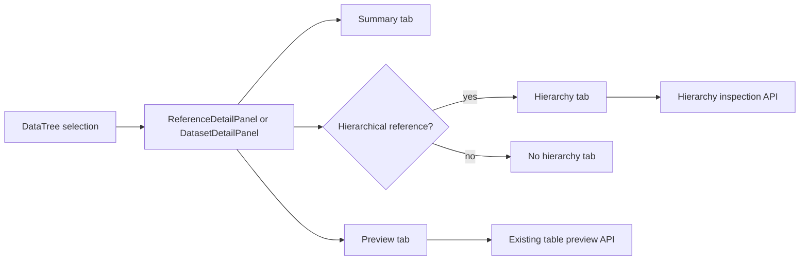

# feat: Improve Data Source Inspection Tabs

## Overview

Improve the Data module detail pages so opening a dataset or reference answers "what is this source, what can I inspect, and what should I do next?" instead of showing only table statistics and a truncated data preview.

The first delivery splits the current `Overview` tab into a useful `Summary` tab and a dedicated `Preview` tab, then adds a conditional `Hierarchy` tab for hierarchical references. Geographic map inspection remains a separate follow-up because it needs a mapping dependency and a clearer data-serving contract.

## Problem Frame

The current dataset/reference detail `Overview` mostly combines `TableStats` and `TableBrowser`. That duplicates the Data Explorer and does not make the entity's role, readiness, or source-specific structure obvious. For hierarchical references, the UI already knows the reference kind but only shows a small level badge instead of letting the user inspect the tree.

The target user is a botanist or ecology project maintainer who needs to quickly understand imported sources before configuring collections, enrichment, or publication.

## Requirements Trace

- R1. Replace the detail `Overview` behavior with a `Summary` tab focused on identity, readiness, and next actions.
- R2. Move raw table browsing into a dedicated `Preview` tab on dataset and reference detail pages.
- R3. Add a conditional `Hierarchy` tab for references with `kind === "hierarchical"`.
- R4. The hierarchy view must be navigable and useful for large references: expand/collapse, search, level labels, child counts, and clear empty/error states.
- R5. Keep the first implementation read-only: no data editing, no hierarchy mutation, no GIS-style map editing.
- R6. Preserve existing configuration, enrichment, delete, Data Explorer, and deep-link behavior.
- R7. Defer the full `Map` tab to a separate task while keeping the tab layout compatible with adding it later.

## Scope Boundaries

- Do not add an interactive map in this plan.
- Do not add a global data quality score.
- Do not change import, transform, or export configuration semantics.
- Do not add hierarchy editing.
- Do not replace the existing Data Explorer.
- Do not introduce a large visualization dependency for the hierarchy view unless implementation proves native UI primitives are insufficient.

### Deferred to Separate Tasks

- `Map` tab for geographic datasets and spatial references: requires choosing a lightweight map renderer, deciding how geometry is sampled/serialized, and adding map-specific tests.
- Persisted verification run history: the `Summary` can link to Verification, but this plan does not store or summarize historical verification results.

## Context & Research

### Relevant Code and Patterns

- `src/niamoto/gui/ui/src/features/import/module/DataModule.tsx` owns Data module routing and passes selected dataset/reference metadata into detail panels.
- `src/niamoto/gui/ui/src/features/import/components/panels/DatasetDetailPanel.tsx` currently renders `Overview` and `Configuration`.
- `src/niamoto/gui/ui/src/features/import/components/panels/ReferenceDetailPanel.tsx` currently renders `Overview`, `Configuration`, and `Enrichment`.
- `src/niamoto/gui/ui/src/features/import/components/data-preview/TableStats.tsx` and `TableBrowser.tsx` already provide stats and paginated preview patterns.
- `src/niamoto/gui/ui/src/features/import/queryUtils.ts` centralizes React Query options for table metadata, preview, and entity config prefetching.
- `src/niamoto/gui/api/routers/data_explorer.py` exposes safe table listing, column metadata, and paginated query endpoints.
- `src/niamoto/gui/api/routers/stats.py` already resolves configured entities, spatial references, and taxonomy consistency using import config first.
- `src/niamoto/common/hierarchy_context.py` detects hierarchy metadata such as id, parent, rank, name, and nested-set fields.
- `tests/gui/api/routers/test_stats.py` already covers stats helpers and is the closest backend test home.
- `src/niamoto/gui/ui/src/features/import/components/data-preview/TableBrowser.test.tsx` shows the current frontend test style for detail-page data components.

### Institutional Learnings

- No relevant `docs/solutions/` entries were found in this repository during planning.

### External References

- External research skipped. The work follows existing FastAPI, React Query, shadcn/Radix UI, and local Data module patterns.

## Key Technical Decisions

- **Use dedicated tabs instead of embedding visualizations inside Summary:** Summary stays scannable; structure-heavy views get enough space and can load lazily.
- **Add hierarchy before map:** Hierarchy is higher value for the current reference workflow and requires less new infrastructure than map rendering.
- **Serve hierarchy through a bounded backend endpoint:** Large taxonomies should not force the browser to fetch or transform an entire table through the generic preview API. Use a root/children/search contract so expansion can load only the branch being inspected.
- **Reuse existing table/config query patterns:** New frontend data access should extend `importQueryKeys` and nearby API files instead of adding root-level API modules.
- **Keep tab selection local for now:** Existing detail panels use local tab state; URL-level tab state only exists for reference enrichment and should not be broadened unless implementation reveals a strong need.

## Open Questions

### Resolved During Planning

- Should map be part of the first build? No. It is valuable, but it has a different dependency and data-contract profile, so it is deferred.
- Should raw data remain in `Summary`? No. Raw rows belong in `Preview`; Summary should orient and direct.
- Where should hierarchy inspection live? Use the existing stats API surface with a route shaped as `GET /api/stats/hierarchy/{reference_name}` and query parameters for root, child, and search modes.

### Deferred to Implementation

- Exact display field priority for hierarchy nodes: use detected/configured fields first, then fall back to stable common columns.
- Exact row caps for roots, children, and search results: set conservative defaults during implementation and tune from real data shape.

## High-Level Technical Design

> *This illustrates the intended approach and is directional guidance for review, not implementation specification. The implementing agent should treat it as context, not code to reproduce.*

| Entity state | Tabs after this plan | Notes |
| --- | --- | --- |
| Dataset | `Summary`, `Preview`, `Configuration` | `Summary` uses identity/stats/actions; `Preview` owns `TableBrowser`. |
| Generic reference | `Summary`, `Preview`, `Configuration`, `Enrichment` | Enrichment tab behavior remains unchanged. |
| Hierarchical reference | `Summary`, `Hierarchy`, `Preview`, `Configuration`, `Enrichment` | `Hierarchy` is shown for hierarchical references; the tab itself handles missing or empty hierarchy metadata. |
| Spatial reference | `Summary`, `Preview`, `Configuration`, `Enrichment` | `Map` is intentionally deferred. |

## Implementation Units

- [x] **Unit 1: Split Summary and Preview in detail panels**

**Goal:** Replace the current `Overview` tab with `Summary`, move `TableBrowser` into `Preview`, and preserve existing actions.

**Requirements:** R1, R2, R5, R6

**Dependencies:** None

**Files:**
- Modify: `src/niamoto/gui/ui/src/features/import/components/panels/DatasetDetailPanel.tsx`
- Modify: `src/niamoto/gui/ui/src/features/import/components/panels/ReferenceDetailPanel.tsx`
- Modify: `src/niamoto/gui/ui/src/i18n/locales/en/sources.json`
- Modify: `src/niamoto/gui/ui/src/i18n/locales/fr/sources.json`
- Test: `src/niamoto/gui/ui/src/features/import/components/panels/DatasetDetailPanel.test.tsx`
- Test: `src/niamoto/gui/ui/src/features/import/components/panels/ReferenceDetailPanel.test.tsx`

**Approach:**
- Rename the user-facing tab label from `Overview` to `Summary`.
- Move the existing data preview card into a new `Preview` tab on both panels.
- Keep `TableStats` or equivalent compact metrics in `Summary`, but make it secondary to identity, role, and action affordances.
- Preserve the existing header actions: back, Data Explorer, delete, and enrichment/config links.
- Keep local tab state, resetting to `Summary` when the selected entity changes.

**Patterns to follow:**
- Existing `Tabs`, `TabsList`, `TabsTrigger`, and `PanelTransition` usage in the two detail panels.
- Existing `TableBrowser` loading, empty, and 404 behavior.

**Test scenarios:**
- Happy path: rendering a dataset detail shows `Summary`, `Preview`, and `Configuration` tabs, with raw rows absent from `Summary`.
- Happy path: selecting `Preview` renders `TableBrowser` with the dataset table name and keeps the Data Explorer action available.
- Happy path: rendering a reference detail keeps `Configuration` and `Enrichment` available after the tab split.
- Edge case: changing from one entity to another resets the active tab to `Summary`, except existing enrichment deep-link behavior remains intact.
- Integration: delete flow still invalidates import queries and navigates back through the existing callback.

**Verification:**
- Dataset and reference details have distinct summary and raw preview surfaces.
- Existing detail actions still behave as before.

- [x] **Unit 2: Add bounded hierarchy inspection API**

**Goal:** Provide per-reference hierarchy data for the frontend without relying on full-table preview queries.

**Requirements:** R3, R4, R5

**Dependencies:** None

**Files:**
- Modify: `src/niamoto/gui/api/routers/stats.py`
- Modify: `src/niamoto/common/hierarchy_context.py` if reusable metadata helpers need a small extension
- Test: `tests/gui/api/routers/test_stats.py`

**Approach:**
- Resolve the requested reference through import config and physical table names using existing stats helpers.
- Detect hierarchy columns using existing hierarchy conventions: `id`, `parent_id`, `level`, `rank_name`, `rank_value`, `full_name`, and nested-set fields when present.
- Add `GET /api/stats/hierarchy/{reference_name}` under the existing stats router.
- Support three bounded modes through query parameters: initial roots, children for a specific parent id, and search results.
- Return a bounded payload with summary metrics, level counts, requested nodes, child counts, `has_more`/continuation hints where needed, and issue counters such as orphan count.
- Support a search query for finding matching nodes without requiring the UI to load every record or expand the full tree.
- Return empty-but-successful payloads when the reference exists but no usable hierarchy metadata is available.
- Use identifier quoting and parameterized filters consistently with the current stats/data explorer routes.

**Execution note:** Add backend characterization tests around existing hierarchy conventions before broadening endpoint behavior.

**Patterns to follow:**
- Entity/table resolution helpers in `src/niamoto/gui/api/routers/stats.py`.
- Query safety and identifier quoting patterns in `src/niamoto/gui/api/routers/data_explorer.py`.
- Hierarchy metadata conventions in `src/niamoto/common/hierarchy_context.py`.

**Test scenarios:**
- Happy path: a configured hierarchical reference with `id`, `parent_id`, `level`, `rank_name`, and `rank_value` returns root nodes, level counts, total count, and child counts.
- Happy path: requesting children for a parent returns only that parent's bounded child set and preserves stable ordering.
- Happy path: searching by node label returns matching nodes with enough ancestor context to orient the user.
- Happy path: a nested-set hierarchy with `lft`/`rgt` still returns a navigable first payload when `parent_id` is absent or incomplete.
- Edge case: a hierarchical reference table with no rows returns zero counts and no nodes.
- Edge case: orphaned records are counted and exposed without failing the response.
- Error path: requesting an unknown reference returns an appropriate not-found response.
- Error path: a non-hierarchical reference returns an empty/not-applicable response rather than a server error.
- Integration: configured reference names resolve to physical tables instead of relying on hardcoded `taxons`.

**Verification:**
- The frontend can request hierarchy inspection by reference name and receive a bounded, stable response.

- [x] **Unit 3: Add frontend hierarchy API hooks and data shaping**

**Goal:** Expose the hierarchy inspection endpoint through feature-local API utilities and query keys.

**Requirements:** R3, R4, R6

**Dependencies:** Unit 2

**Files:**
- Modify: `src/niamoto/gui/ui/src/features/import/queryKeys.ts`
- Modify: `src/niamoto/gui/ui/src/features/import/queryUtils.ts`
- Modify or create: `src/niamoto/gui/ui/src/features/import/api/hierarchy.ts`
- Test: `src/niamoto/gui/ui/src/features/import/queryUtils.test.ts`
- Test: `src/niamoto/gui/ui/src/features/import/api/hierarchy.test.ts`

**Approach:**
- Add typed client helpers close to the import feature rather than under root `src/lib/api`.
- Add React Query options for root hierarchy load, child loading by parent id, and search.
- Keep query keys scoped by reference name, parent id, and search term so switching references or expanding different branches cannot show stale trees.
- Add small pure helpers only if needed to normalize API rows into UI-friendly tree nodes.

**Patterns to follow:**
- `tablePreviewQueryOptions`, `tableColumnsQueryOptions`, and existing `importQueryKeys` nesting.
- Existing feature-local API files under `src/niamoto/gui/ui/src/features/import/api/`.

**Test scenarios:**
- Happy path: query options include reference name and search term in their key.
- Happy path: child-loading query options include reference name and parent id in their key.
- Happy path: API helper calls the expected endpoint and returns typed hierarchy data.
- Edge case: empty response normalizes to an empty node list without throwing.
- Error path: API error propagation matches existing feature API behavior.

**Verification:**
- Hierarchy UI code can consume stable query options without ad hoc fetch calls.

- [x] **Unit 4: Build the conditional Hierarchy tab UI**

**Goal:** Let users inspect hierarchical references through a dense, read-only tree view.

**Requirements:** R3, R4, R5, R6

**Dependencies:** Unit 3

**Files:**
- Create: `src/niamoto/gui/ui/src/features/import/components/hierarchy/HierarchyView.tsx`
- Create: `src/niamoto/gui/ui/src/features/import/components/hierarchy/HierarchyTree.tsx`
- Modify: `src/niamoto/gui/ui/src/features/import/components/panels/ReferenceDetailPanel.tsx`
- Modify: `src/niamoto/gui/ui/src/i18n/locales/en/sources.json`
- Modify: `src/niamoto/gui/ui/src/i18n/locales/fr/sources.json`
- Test: `src/niamoto/gui/ui/src/features/import/components/hierarchy/HierarchyView.test.tsx`
- Test: `src/niamoto/gui/ui/src/features/import/components/panels/ReferenceDetailPanel.test.tsx`

**Approach:**
- Show `Hierarchy` only for hierarchical references.
- Render compact summary metrics above the tree: total nodes, levels, roots, orphans, and current search result count when relevant.
- Provide expand/collapse controls, lazy child loading, a search input, level/rank badges, and child counts.
- Keep the first version read-only and keyboard-accessible with buttons/collapsible primitives rather than a canvas or graph library.
- Provide clear states for loading, API error, no hierarchy metadata, empty hierarchy, and no search results.

**Patterns to follow:**
- Compact diagnostic card style from `TaxonomicConsistencyView`.
- Existing Radix/shadcn primitives in `src/niamoto/gui/ui/src/components/ui`.
- Existing dense data component patterns from `TableBrowser`.

**Test scenarios:**
- Happy path: hierarchical reference renders the `Hierarchy` tab and shows root nodes with level badges and child counts.
- Happy path: expanding a node loads its children and keeps already opened branches stable.
- Happy path: search input sends the search term through query options and displays matching nodes.
- Edge case: generic and spatial references do not render the `Hierarchy` tab.
- Edge case: empty hierarchy payload shows a non-blocking empty state.
- Error path: API failure shows an actionable error state without breaking other tabs.
- Integration: switching references clears the previous hierarchy search and loaded nodes.

**Verification:**
- A hierarchical reference can be inspected without leaving the Data detail page.
- Non-hierarchical references keep a simpler tab set.

- [x] **Unit 5: Summary readiness cues and future map affordance boundary**

**Goal:** Make `Summary` useful without turning it into a full diagnostics or map workspace.

**Requirements:** R1, R5, R7

**Dependencies:** Unit 1

**Files:**
- Modify or create: `src/niamoto/gui/ui/src/features/import/components/panels/SourceSummary.tsx`
- Modify: `src/niamoto/gui/ui/src/features/import/components/panels/DatasetDetailPanel.tsx`
- Modify: `src/niamoto/gui/ui/src/features/import/components/panels/ReferenceDetailPanel.tsx`
- Modify: `src/niamoto/gui/ui/src/i18n/locales/en/sources.json`
- Modify: `src/niamoto/gui/ui/src/i18n/locales/fr/sources.json`
- Test: `src/niamoto/gui/ui/src/features/import/components/panels/SourceSummary.test.tsx`

**Approach:**
- Surface identity and role: entity type, table name, row/column count, reference kind, and enrichment status when known.
- Surface narrow readiness cues only: empty table, hierarchy available, enrichment configured/available, and Data Explorer link.
- Include next actions such as `Preview data`, `Configure`, `Open enrichment`, or `Inspect hierarchy` when the corresponding tab exists.
- For geographic data, keep the copy neutral: detect and show that geographic fields exist only if this can be done from existing columns/config, but do not show a non-functional map button.
- Keep wording away from broad "healthy" or "all good" claims.

**Patterns to follow:**
- Sources dashboard wording from `docs/brainstorms/2026-04-01-sources-dashboard-redesign-brainstorm.md`.
- Existing compact card/list patterns from `SourcesOverview` and `MetricCard`.

**Test scenarios:**
- Happy path: dataset summary shows table identity, row/column counts, and actions to preview/configure/open explorer.
- Happy path: hierarchical reference summary includes an action to inspect hierarchy.
- Happy path: reference with enrichment enabled keeps the enrichment cue and action.
- Edge case: zero-row table displays a structural alert without implying global validation.
- Edge case: geographic columns are described as available data, not as a completed map feature.

**Verification:**
- The Summary tab helps users decide the next step without duplicating the Preview tab.

- [x] **Unit 6: Documentation and regression polish**

**Goal:** Keep module docs and translations aligned with the new detail workflow.

**Requirements:** R1, R2, R3, R6, R7

**Dependencies:** Units 1-5

**Files:**
- Modify: `src/niamoto/gui/ui/README.md` if it describes the Data detail workflow
- Modify: `docs/brainstorms/2026-04-01-sources-dashboard-redesign-brainstorm.md` only if implementation changes contradict its Data module assumptions
- Test: no dedicated test file beyond units above

**Approach:**
- Update only documentation that currently mentions the old `Overview` behavior.
- Keep docs focused on current behavior, not future map aspirations.
- Confirm English and French i18n keys are complete and use consistent tab names.

**Test scenarios:**
- Test expectation: none -- this unit is documentation and translation completion; behavioral coverage belongs to the feature units.

**Verification:**
- No visible stale `Overview` copy remains in the Data detail workflow unless kept intentionally for backward-compatible translation keys.

## System-Wide Impact

- **Interaction graph:** Data tree selection still flows through `DataModule.tsx` into dataset/reference detail panels. New hierarchy UI calls a Data module inspection endpoint and does not affect import execution.
- **Error propagation:** Backend inspection errors should appear only inside the `Hierarchy` tab. Summary, Preview, Configuration, and Enrichment remain usable.
- **State lifecycle risks:** Query keys must include reference name, parent id, and search term to prevent stale hierarchy results when switching references or expanding different branches.
- **API surface parity:** This adds a GUI inspection API; it does not change CLI, import config, transform config, or exported site behavior.
- **Integration coverage:** Backend tests must cover configured logical reference names resolving to physical tables. Frontend tests must cover conditional tab rendering by reference kind.
- **Unchanged invariants:** Existing table preview, Data Explorer navigation, configuration editing, enrichment behavior, and delete behavior remain intact.

## Risks & Dependencies

| Risk | Mitigation |
|------|------------|
| Large taxonomies overload the frontend | Use a bounded backend payload, search, and collapsible rendering instead of full-table fetch. |
| Hierarchy schemas vary between imported projects | Reuse existing hierarchy metadata detection and test adjacency-list plus nested-set conventions. |
| Summary drifts into unverifiable quality scoring | Limit cues to structural facts and available actions. |
| Existing enrichment tab deep links regress | Keep `requestedTab` behavior in `ReferenceDetailPanel` and add tests around it. |
| Map scope creeps into the first pass | Document map as a separate task and avoid adding a map dependency in this plan. |

## Documentation / Operational Notes

- User-facing copy should be available in English and French.
- No database migration is expected.
- No feature flag is expected; this is a GUI workflow improvement behind existing routes.
- If the implementation adds a new backend endpoint, include it in API/router tests rather than relying only on frontend mocks.

## Sources & References

- Related brainstorm: `docs/brainstorms/2026-04-01-sources-dashboard-redesign-brainstorm.md`
- Related code: `src/niamoto/gui/ui/src/features/import/components/panels/DatasetDetailPanel.tsx`
- Related code: `src/niamoto/gui/ui/src/features/import/components/panels/ReferenceDetailPanel.tsx`
- Related code: `src/niamoto/gui/api/routers/stats.py`
- Related code: `src/niamoto/gui/api/routers/data_explorer.py`
- Related code: `src/niamoto/common/hierarchy_context.py`
