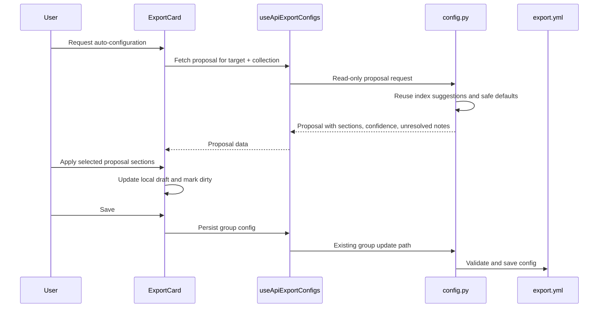

# feat: Add reviewable API export auto-configuration

## Summary

Add a V2 layer to the existing Collections > Export UI: a read-only auto-configuration proposal from the backend, a review/apply flow in each export card, and synchronized visual/JSON editing for static API export sections. The plan extends the current FastAPI config router, React Query hooks, export cards, field mapping editors, and i18n resources without rewriting the export engine.

---

## Problem Frame

The current static API export card is in the right product location, but important configuration still starts from opaque JSON fields or empty mappings. The origin requirements ask for a domain-friendly default path while preserving the advanced JSON escape hatch and the simple JSON pass-through mode.

---

## Requirements

- R1. Static API exports must offer an auto-configuration action that generates a proposal instead of silently applying changes.
- R2. The auto-configuration proposal must cover index fields, detail fields, JSON formatting options, and Darwin Core mapping when the export uses Darwin Core.
- R3. The proposal must be reviewable before application, with clear accept, edit, and cancel paths.
- R4. Auto-configuration must not remove or overwrite an existing custom configuration without explicit user action.
- R5. Index fields must be editable through structured interface controls rather than requiring raw JSON.
- R6. Detail fields must be editable through structured interface controls when the user chooses a curated detail payload.
- R7. Darwin Core mapping must remain editable through a guided interface that is more understandable than editing raw JSON.
- R8. Field editors must preserve generated values and custom parameters without hiding them from advanced users.
- R9. Each relevant export section must provide a synchronized JSON view for the same configuration represented by the visual editor.
- R10. The visual editor remains the default editing mode; JSON is an advanced view, not the primary path.
- R11. JSON edits must validate before they update the visual editor or become saveable.
- R12. When JSON and visual forms cannot be reconciled, the UI must make the problem visible and protect the last valid configuration.
- R13. Simple JSON API exports must always keep the option to export all transformed data.
- R14. Auto-configuration may suggest a curated detail payload, but it must not remove the user's ability to keep pass-through detail export.
- R15. Index configuration and detail configuration must remain separate choices.
- R16. Export cards must summarize the current configuration in domain language, including pass-through, curated detail, and Darwin Core states.
- R17. Auto-configuration proposals must explain why the suggested fields or mappings are useful at a level understandable to ecology project users.
- R18. Advanced controls should remain available through progressive disclosure rather than being removed or made mandatory.

**Origin actors:** A1 Collection editor, A2 Advanced integrator, A3 Downstream implementer.

**Origin flows:** F1 Review auto-configuration for an export, F2 Edit fields visually then inspect JSON, F3 Keep simple JSON export broad when desired.

**Origin acceptance examples:** AE1 review without overwrite, AE2 visual/JSON synchronization, AE3 generated Darwin Core mappings remain editable, AE4 pass-through remains available.

---

## Scope Boundaries

- In scope: a read-only backend auto-configuration proposal for static API export group configuration.
- In scope: review/apply UI inside existing export cards.
- In scope: visual editors for index fields, curated detail fields, and Darwin Core mapping.
- In scope: synchronized JSON views for the same section data represented by visual controls.
- In scope: preserving `detail.pass_through` as a first-class simple JSON option.
- Out of scope: previewing final generated JSON output.
- Out of scope: running an export test directly from an export card.
- Out of scope: rewriting `json_api_exporter.py` or the export pipeline.
- Out of scope: moving broad Collections logic into shared modules or refactoring unrelated collection workflows.

### Deferred to Follow-Up Work

- Dirty navigation warnings for unsaved export-card drafts: valuable but not required by the confirmed V2 requirements.
- A richer data-quality report for Darwin Core: this plan only needs confidence and unresolved proposal notes, not a full validation product.

---

## Context & Research

### Relevant Code and Patterns

- `src/niamoto/gui/api/routers/config.py` already owns static API export target listing, creation, group get/update, config validation, `export.yml` persistence, `_default_dwc_transformer_params`, and the current index-suggestion reuse endpoint.
- `src/niamoto/gui/ui/src/features/collections/hooks/useApiExportConfigs.ts` already centralizes React Query hooks and static API export types.
- `src/niamoto/gui/ui/src/features/collections/components/api/ExportCard.tsx` already manages server config, local dirty state, save/reset, pass-through, index fields, Darwin Core mapping, transformer params, and advanced JSON options.
- `src/niamoto/gui/ui/src/features/collections/components/api/ApiFieldMappingsEditor.tsx` already provides a structured mapping editor for index fields and can be extended for detail fields.
- `src/niamoto/gui/ui/src/features/collections/components/api/DwcMappingEditor.tsx` already provides guided Darwin Core mapping editing with source/static/generator modes.
- `src/niamoto/gui/ui/src/components/forms/fields/JsonField.tsx` already validates JSON locally and only emits parsed values when the text is valid.
- `tests/gui/api/routers/test_config_api_exports.py` already covers the API export suggestions route and is the right home for backend proposal contract tests.
- `src/niamoto/gui/ui/src/features/collections/components/api/AddExportWizard.test.tsx` and `src/niamoto/gui/ui/src/components/index-config/IndexConfigEditor.test.tsx` show the current jsdom/Vitest harness style for collection UI tests.

### Institutional Learnings

- No `docs/solutions/` directory was present during planning, so no prior solution note was available to apply.
- The expected `docs/06-gui/` reference directory was not present; the active GUI reference material found during planning was `src/niamoto/gui/README.md`, `src/niamoto/gui/ui/README.md`, and `docs/06-reference/api-export-guide.md`.

### External References

- External research was not used. The relevant framework and UI patterns are already present in the repository, and this work extends an internal configuration flow rather than introducing a new platform integration.

---

## Key Technical Decisions

- Add a dedicated auto-configuration proposal path instead of overloading the current index suggestions endpoint. The existing suggestions endpoint remains useful for field chips; the proposal contract needs section-level intent, confidence, and unresolved notes.
- Treat auto-configuration as read-only until the user applies it to the local card draft. Applying a proposal should mark the card dirty; persistence still goes through the existing save path.
- Preserve simple JSON pass-through as the safest default. Auto-configuration may propose curated detail fields, but it must keep `detail.pass_through` visible and selectable.
- Reuse existing editors and add a small synchronization wrapper rather than introducing a new form framework. This keeps the implementation close to current React/Vite and shadcn-style patterns.
- Keep Darwin Core suggestions conservative. The backend should only prefill mappings it can justify from existing defaults, detected fields, or known generators; uncertain terms should be surfaced as unresolved review notes.
- Keep JSON validation local and section-scoped. Invalid JSON should stay in the text editor draft and should not update the shared card config until it parses and normalizes successfully.

---

## Open Questions

### Resolved During Planning

- What confidence signals should auto-configuration expose? Use section-level confidence plus human-readable notes and unresolved item counts.
- Which Darwin Core mappings can be suggested safely? Use existing `_default_dwc_transformer_params`, known transformer mapping shapes, and detected field suggestions conservatively; mark uncertain terms unresolved.
- What validation boundary prevents JSON edits from corrupting visual state? Parse and normalize JSON before committing to local card config, preserving the last valid config while the JSON draft is invalid.

### Deferred to Implementation

- Exact Darwin Core term-to-field matching heuristics: implementation should start conservative and adjust based on the actual field metadata exposed by `suggest_index_fields`.
- Final component names for the synchronization wrapper and review dialog: the plan names their responsibility, but implementation may choose names that fit local style.

---

## High-Level Technical Design

> *This illustrates the intended approach and is directional guidance for review, not implementation specification. The implementing agent should treat it as context, not code to reproduce.*

---

## Implementation Units

- U1. **Backend auto-configuration proposal contract**

**Goal:** Add a read-only backend proposal endpoint for static API export group configuration.

**Requirements:** R1, R2, R3, R4, R13, R14, R17; F1; AE1.

**Dependencies:** None.

**Files:**
- Modify: `src/niamoto/gui/api/routers/config.py`
- Test: `tests/gui/api/routers/test_config_api_exports.py`

**Approach:**
- Add typed response models for a proposal that can represent suggested group config sections, section confidence, notes, and unresolved items without committing to a save.
- Keep `/suggestions` backward-compatible for current field chips, and add a separate read-only auto-config proposal path under the existing API export target/group route family.
- Reuse `suggest_index_fields(group_by)` for available field analysis and index/detail field candidates.
- Include a JSON formatting options section even when the best proposal is "keep current/default options", so the review UI covers the full static API export surface from the origin requirements.
- For simple JSON exports, propose compact index fields while preserving pass-through as the detail default and as an explicit user option.
- For Darwin Core exports, reuse `_default_dwc_transformer_params(group_by)` and add conservative mapping suggestions only where current metadata makes them credible.
- Do not call `_save_export_config` from the proposal path.

**Execution note:** Start with backend contract tests so the endpoint remains demonstrably read-only.

**Patterns to follow:**
- Existing static API export route models and error handling in `src/niamoto/gui/api/routers/config.py`.
- Existing `suggest_api_export_index_fields` validation pattern for target existence.
- Existing `IndexFieldSuggestions` serialization test in `tests/gui/api/routers/test_config_api_exports.py`.

**Test scenarios:**
- Happy path: given a simple JSON API target and mocked field suggestions, requesting auto-configuration returns index and detail proposal sections with total entity context and does not save `export.yml`.
- Happy path: given target-level JSON options, requesting auto-configuration includes an explicit JSON options proposal section rather than omitting that surface.
- Covers AE1. Given an existing group with custom fields, requesting auto-configuration leaves the loaded export config unchanged and returns a proposal rather than a mutated group.
- Edge case: given no display-field suggestions, the proposal still returns a valid pass-through simple JSON detail recommendation and a low-confidence index section.
- Error path: given an unknown export target, the proposal route returns the same not-found behavior family as the existing suggestions route.
- Integration: given a Darwin Core target, the proposal includes transformer parameters compatible with the existing group update model and marks uncertain mappings unresolved rather than inventing confident mappings.

**Verification:**
- Targeted backend API router tests pass.
- Proposal responses are serializable through FastAPI response models.
- Existing suggestions route behavior remains unchanged.

---

- U2. **Frontend proposal hooks and config synchronization helpers**

**Goal:** Add frontend types, query hooks, and pure helpers that normalize export configs and safely apply proposal/JSON changes to a local draft.

**Requirements:** R2, R4, R9, R11, R12, R13, R14, R15; F1, F2, F3; AE2, AE4.

**Dependencies:** U1.

**Files:**
- Modify: `src/niamoto/gui/ui/src/features/collections/hooks/useApiExportConfigs.ts`
- Create: `src/niamoto/gui/ui/src/features/collections/components/api/apiExportConfigUtils.ts`
- Test: `src/niamoto/gui/ui/src/features/collections/components/api/apiExportConfigUtils.test.ts`

**Approach:**
- Add frontend interfaces and a React Query hook for the backend proposal contract.
- Centralize normalization of missing `detail`, `index`, `json_options`, `transformer_plugin`, and `transformer_params` defaults so `ExportCard` and new editors do not each invent slightly different defaults.
- Add helper logic for applying proposal sections to a local draft while preserving untouched custom sections.
- Add helper logic for JSON edits that parses, validates shape at the section boundary, and returns an explicit invalid-draft state without mutating the last valid config.
- Keep all helpers feature-local under the API export component area unless they become genuinely shared later.

**Execution note:** Implement these helpers test-first because they are the state boundary that protects visual/JSON synchronization.

**Patterns to follow:**
- Current hook organization in `useApiExportConfigs.ts`.
- Current default-building behavior in `ExportCard.tsx`.
- Existing feature-local test style under `src/niamoto/gui/ui/src/features/collections`.

**Test scenarios:**
- Happy path: normalizing a sparse server config produces explicit `detail.pass_through` and `index.fields` defaults without dropping unknown config keys.
- Happy path: applying an index-only proposal updates only index fields and leaves detail and advanced options unchanged.
- Covers AE4. Applying a proposal to a simple JSON config preserves the ability to keep `detail.pass_through` enabled.
- Covers AE2. Invalid JSON section text returns a validation error and the previous normalized config remains unchanged.
- Edge case: applying a Darwin Core proposal merges mapping updates without dropping non-mapping transformer parameters.

**Verification:**
- Pure helper tests pass.
- TypeScript accepts the new proposal types and hook callers.

---

- U3. **Synchronized visual/JSON section editors**

**Goal:** Make export section editing form-first with an advanced synchronized JSON view, including curated detail fields.

**Requirements:** R5, R6, R8, R9, R10, R11, R12, R13, R14, R15; F2, F3; AE2, AE3, AE4.

**Dependencies:** U2.

**Files:**
- Modify: `src/niamoto/gui/ui/src/features/collections/components/api/ApiFieldMappingsEditor.tsx`
- Create: `src/niamoto/gui/ui/src/features/collections/components/api/SynchronizedJsonConfigSection.tsx`
- Test: `src/niamoto/gui/ui/src/features/collections/components/api/ApiFieldMappingsEditor.test.tsx`
- Test: `src/niamoto/gui/ui/src/features/collections/components/api/SynchronizedJsonConfigSection.test.tsx`

**Approach:**
- Extend `ApiFieldMappingsEditor` so it can represent both index mappings and detail field arrays, including simple string entries and object/generator entries.
- Introduce a small section wrapper that offers visual and JSON modes for one config section, using existing JSON validation behavior rather than replacing the whole editor stack.
- Keep visual mode as the default and JSON mode as progressive disclosure.
- Preserve curated detail fields while pass-through is enabled so users can switch back without losing work.
- Ensure generated mappings and generator parameters remain visible in visual mode and round-trip through JSON mode.

**Patterns to follow:**
- Existing `ApiFieldMappingsEditor` row editing and i18n patterns.
- Existing `DwcMappingEditor` source/static/generator handling and validation style.
- Existing `JsonField` parse-on-valid-change behavior.

**Test scenarios:**
- Covers AE2. Adding a detail field visually and switching to JSON mode shows the corresponding JSON representation.
- Covers AE2. Editing valid JSON updates the visual field rows after the section accepts the parsed value.
- Covers AE2. Editing invalid JSON shows a validation error and keeps the visual editor on the last valid state.
- Covers AE3. A generated field mapping with params remains editable after switching visual to JSON and back.
- Covers AE4. Enabling pass-through hides or de-emphasizes curated detail editing without deleting the existing curated fields from local state.
- Edge case: a simple string detail field round-trips without being forced into a lossy object-only mapping.

**Verification:**
- Targeted Vitest component/helper tests pass.
- Existing index field editing still works inside `ExportCard`.

---

- U4. **Auto-configuration review flow in ExportCard**

**Goal:** Add the user-facing auto-config action, proposal review, local-draft application, and save behavior to export cards.

**Requirements:** R1, R3, R4, R10, R13, R14, R15, R16, R17, R18; F1, F3; AE1, AE4.

**Dependencies:** U1, U2, U3.

**Files:**
- Modify: `src/niamoto/gui/ui/src/features/collections/components/api/ExportCard.tsx`
- Create: `src/niamoto/gui/ui/src/features/collections/components/api/AutoConfigReviewDialog.tsx`
- Test: `src/niamoto/gui/ui/src/features/collections/components/api/ExportCard.test.tsx`
- Test: `src/niamoto/gui/ui/src/features/collections/components/api/AutoConfigReviewDialog.test.tsx`

**Approach:**
- Add an auto-configuration action to each enabled export card and show it as a CTA for empty/default sections.
- Fetch proposals on demand; do not automatically run or apply auto-configuration when a card is enabled.
- Present proposal sections with confidence, notes, and unresolved items before application.
- Applying a proposal updates the local card draft only and marks the card unsaved; the existing Save action remains the only persistence step.
- Allow cancellation to leave local and server config unchanged.
- Replace the current raw detail-field JSON-only path with the synchronized visual/JSON section editor while keeping the pass-through switch prominent.
- Keep summaries accurate for disabled, pass-through, curated JSON, and Darwin Core states.

**Patterns to follow:**
- Existing `ExportCardForm` local dirty state, reset counter, save mutation, and toast behavior.
- Existing dialog patterns in `AddExportWizard.tsx`.
- Existing card section organization and accordion use in `ExportCard.tsx`.

**Test scenarios:**
- Covers AE1. With custom server config loaded, opening and cancelling auto-config review leaves local state unchanged and does not call the save mutation.
- Covers AE1. Applying a proposal changes local draft and shows unsaved state, but persistence only happens when the user saves.
- Covers AE4. A simple JSON export review keeps the pass-through option visible and selectable after proposal application.
- Happy path: an index proposal applied through the review dialog appears in the visual index editor and JSON view.
- Error path: a failed proposal fetch displays an error state and does not mutate the local draft.
- Edge case: enabling an export card does not silently auto-apply a proposal.

**Verification:**
- Targeted ExportCard and review-dialog tests pass.
- Existing AddExportWizard behavior remains unaffected.

---

- U5. **Darwin Core proposal readability and guided editing**

**Goal:** Make Darwin Core auto-config review understandable and safe without pretending uncertain mappings are guaranteed.

**Requirements:** R7, R8, R12, R16, R17, R18; F1, F2; AE3.

**Dependencies:** U1, U3, U4.

**Files:**
- Modify: `src/niamoto/gui/ui/src/features/collections/components/api/DwcMappingEditor.tsx`
- Modify: `src/niamoto/gui/ui/src/features/collections/components/api/AutoConfigReviewDialog.tsx`
- Test: `src/niamoto/gui/ui/src/features/collections/components/api/DwcMappingEditor.test.tsx`
- Test: `src/niamoto/gui/ui/src/features/collections/components/api/AutoConfigReviewDialog.test.tsx`

**Approach:**
- Surface proposal confidence and unresolved Darwin Core terms in the review dialog rather than burying them in raw JSON.
- Keep the existing guided mapping editor as the primary way to adjust accepted Darwin Core mappings.
- Ensure source/static/generator mappings remain visible and editable after proposal application.
- Do not add a full Darwin Core validation report in this plan; keep the UI focused on proposal review and mapping edits.

**Patterns to follow:**
- Existing `DwcMappingEditor` row validation and i18n keys.
- Existing Darwin Core transformer params shape in `src/niamoto/core/plugins/models.py`.
- Existing hidden mapping behavior in `JsonSchemaForm` for non-mapping transformer params.

**Test scenarios:**
- Covers AE3. A proposal containing generator-based Darwin Core mappings renders them as generated rows, not raw JSON-only content.
- Happy path: unresolved Darwin Core proposal notes are visible in the review dialog before application.
- Edge case: accepting a partial Darwin Core proposal preserves existing non-mapping transformer params.
- Error path: invalid generator params remain blocked by the mapping editor validation and do not update the local draft.

**Verification:**
- Targeted Darwin Core editor/review tests pass.
- Accepted Darwin Core proposal remains compatible with the existing group update payload.

---

- U6. **Copy, documentation, and final regression coverage**

**Goal:** Align user-facing language, documentation, and final verification with the new reviewable auto-configuration workflow.

**Requirements:** R1 through R18; F1, F2, F3; AE1 through AE4.

**Dependencies:** U1, U2, U3, U4, U5.

**Files:**
- Modify: `src/niamoto/gui/ui/src/i18n/locales/en/sources.json`
- Modify: `src/niamoto/gui/ui/src/i18n/locales/fr/sources.json`
- Modify: `docs/06-reference/api-export-guide.md`
- Test: `src/niamoto/gui/ui/src/features/collections/components/api/ExportCard.test.tsx`

**Approach:**
- Add i18n keys for auto-config actions, proposal review states, confidence labels, unresolved notes, JSON mode, validation messages, and pass-through reminders.
- Keep French translations accented and consistent with current collection vocabulary.
- Update the API export reference guide to document review-first auto-configuration, visual editing, JSON mode, and pass-through behavior as current implementation.
- Add or extend regression coverage where full user flows cross multiple units, especially apply-proposal then save.

**Patterns to follow:**
- Existing `collectionPanel.api` translation structure in `sources.json`.
- Existing concise reference-doc style in `docs/06-reference/api-export-guide.md`.

**Test scenarios:**
- Covers AE1. Full UI flow test shows proposal application remains local until save.
- Covers AE2. Full UI flow test shows visual edits and JSON edits remain synchronized for a section.
- Covers AE4. Full UI flow test shows pass-through remains available after auto-config proposal application.
- Integration: frontend production build succeeds with both locale JSON files.

**Verification:**
- Targeted frontend tests pass.
- Frontend production build succeeds.
- Documentation describes the implemented workflow rather than aspirational future behavior.

---

## System-Wide Impact

- **Interaction graph:** `ApiExportsTab` renders `ExportCard`; `ExportCard` uses React Query hooks; hooks call `config.py`; only the existing update path writes `export.yml`.
- **Error propagation:** Proposal fetch failures should stay local to the review action and should not block existing manual editing or saving.
- **State lifecycle risks:** The card will have server config, local draft config, proposal data, and possible invalid JSON drafts. Helpers from U2 are the boundary that keeps those states explicit.
- **API surface parity:** The current `/suggestions` route remains available for field chips. The new proposal route is additive and read-only.
- **Integration coverage:** Tests must prove proposal review, local application, save persistence, and invalid JSON protection across UI and API boundaries.
- **Unchanged invariants:** Simple JSON pass-through remains valid; index and detail config remain separate; `json_api_exporter.py` continues consuming the same group config shape.

---

## Risks & Dependencies

| Risk | Mitigation |
|------|------------|
| Auto-config creates a false sense of correctness for Darwin Core | Use conservative suggestions, section confidence, and unresolved notes rather than claiming complete mapping. |
| Proposal application overwrites custom user config | Apply proposals to local draft only, support cancellation, and test custom-config preservation. |
| Visual and JSON editors drift out of sync | Centralize normalization/parse/apply helpers and test invalid and valid JSON transitions. |
| Detail pass-through becomes less visible when curated fields are introduced | Keep the pass-through switch prominent and preserve it through proposal application. |
| New endpoint accidentally writes export config | Make the backend proposal path read-only and cover no-save behavior in tests. |
| The UI gets too complex inside one card | Keep JSON mode and advanced notes behind progressive disclosure and reuse existing card/accordion patterns. |

---

## Documentation / Operational Notes

- Update `docs/06-reference/api-export-guide.md` when implementation lands so users can understand the current static API export workflow from the GUI.
- No database migration or export data migration is expected.
- No Cloudflare deployment behavior changes are expected; this plan changes static API export configuration ergonomics, not publication infrastructure.
- Slack context was not requested for this planning pass. If organizational decisions exist outside the repository, they can be searched before implementation starts.

---

## Sources & References

- **Origin document:** `docs/brainstorms/2026-03-31-api-export-ux-simplification-brainstorm.md`
- Related prior plan: `docs/plans/2026-03-31-feat-api-export-ux-simplification-plan.md`
- API export guide: `docs/06-reference/api-export-guide.md`
- Backend static API export routes: `src/niamoto/gui/api/routers/config.py`
- JSON API exporter config consumer: `src/niamoto/core/plugins/exporters/json_api_exporter.py`
- Darwin Core transformer model: `src/niamoto/core/plugins/models.py`
- Export tab: `src/niamoto/gui/ui/src/features/collections/components/api/ApiExportsTab.tsx`
- Export card: `src/niamoto/gui/ui/src/features/collections/components/api/ExportCard.tsx`
- API export hooks: `src/niamoto/gui/ui/src/features/collections/hooks/useApiExportConfigs.ts`
- Field mapping editor: `src/niamoto/gui/ui/src/features/collections/components/api/ApiFieldMappingsEditor.tsx`
- Darwin Core mapping editor: `src/niamoto/gui/ui/src/features/collections/components/api/DwcMappingEditor.tsx`
- JSON field editor: `src/niamoto/gui/ui/src/components/forms/fields/JsonField.tsx`
