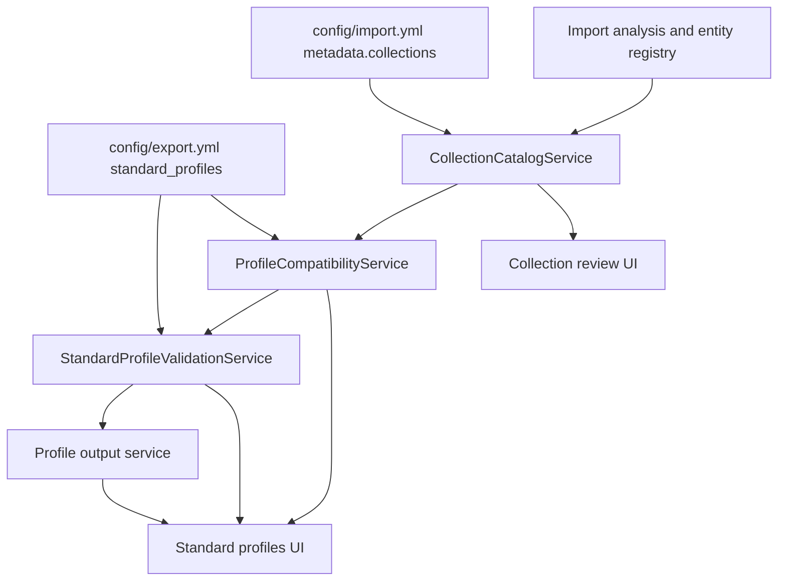
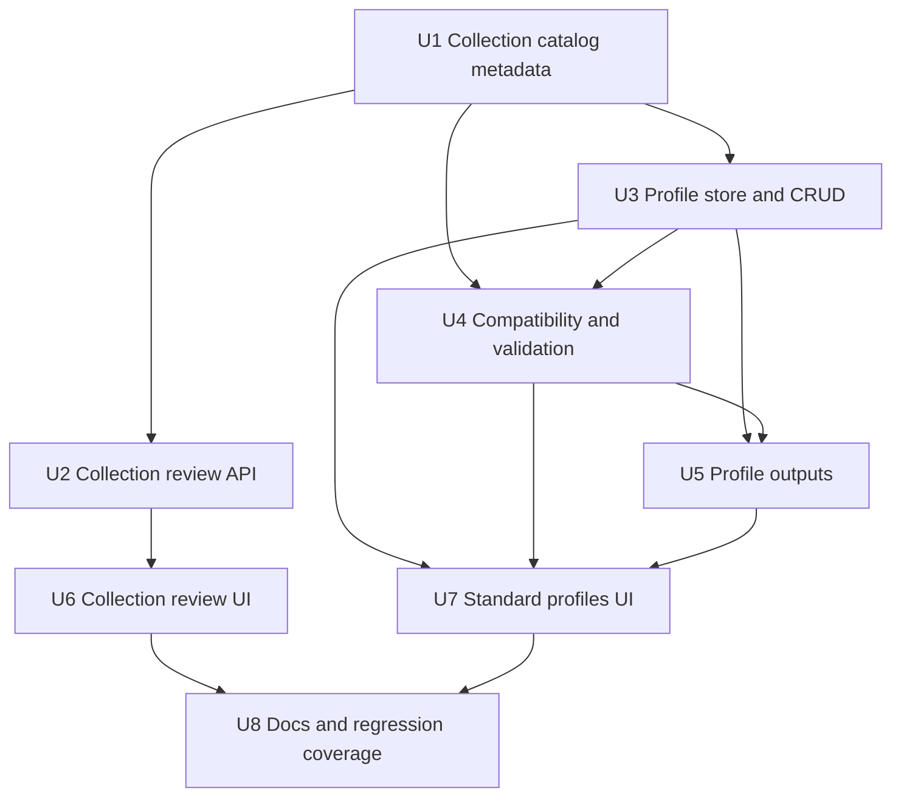
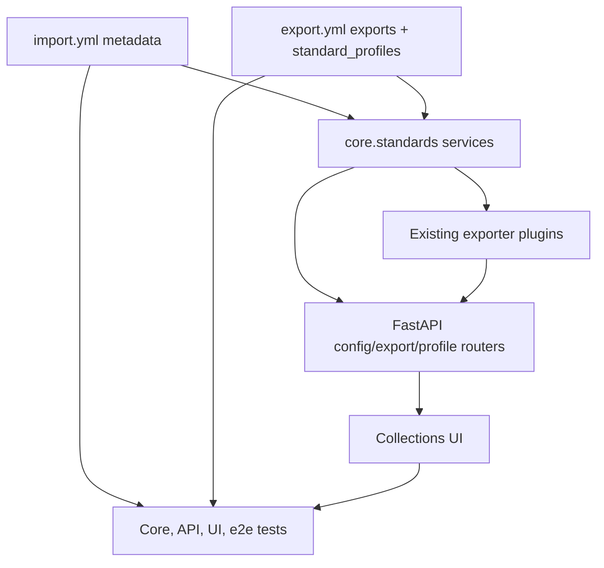

# feat: Add standardized export profiles

## Summary

Add a profile layer above Niamoto collections so standards are configured, validated, and exported as publication profiles instead of ordinary collection formats. The implementation should keep the existing collection and simple JSON API workflows, add explicit collection review metadata, and introduce Darwin Core Occurrence and Humboldt/Event profile flows with compatibility evidence, validation reports, and separate profile outputs.

---

## Problem Frame

The origin requirements identify a semantic risk in the current export model: collection-centered data such as taxons, plots, and shapes can currently appear to support Darwin Core as though the collection itself were the standard grain. That is unsafe because Darwin Core Occurrence is occurrence-grain, while Humboldt inventory data extends `dwc:Event` semantics and should not be treated as a cosmetic JSON shape.

This plan therefore separates three concepts that the current UI and config can blur: collection views, source data grain, and standardized publication profiles.

---

## Assumptions

*This plan was authored without synchronous confirmation of plan-time decisions after research. The items below are implementation bets that should be reviewed before coding begins.*

- Collection review metadata should be persisted as a non-breaking overlay under `config/import.yml` `metadata.collections`, so existing `entities.references` and importer behavior remain compatible.
- Standard publication profiles should be persisted in `config/export.yml` under a new top-level `standard_profiles` section, not as plain `json_api_exporter` targets.
- The first implementation should include a structural Humboldt/Event profile and validation path, but defer a complete term-by-term Humboldt rule catalog.
- Darwin Core Occurrence standard files should reuse the existing Darwin Core Archive exporter where possible; Humboldt/Event file output should start with an Event-oriented standard bundle rather than pretending to be a fully mature GBIF/IPT workflow.

---

## Requirements

- R1. Automatic collection detection must remain available so import stays fast for existing projects.
- R2. Detected collections must become reviewable candidates rather than opaque final product decisions.
- R3. Collection review must be non-blocking and returnable later.
- R4. Collection review must support user-facing naming, visibility, and role adjustments.
- R5. Collection review must expose inferred meaning and confidence when a collection could be interpreted in several ways.
- R6. Users must be able to create a collection manually from a source dataset or plausible aggregation path.
- R7. Manual collection creation must allow collections that are not website pages.
- R8. Collections must support explicit roles such as site, API, standard, technical, or combinations of those roles.
- R9. Manual collection creation must help users choose intended grain from available data, not only collection names.
- R10. Standard outputs must be modeled as publication profiles, not ordinary collection formats.
- R11. Darwin Core Occurrence must be represented as an occurrence-grain profile whose source is occurrence data, optionally contextualized by aggregate collections.
- R12. Humboldt/Event must be represented as an event or inventory-grain profile, not an occurrence profile.
- R13. Aggregate collections may expose standard profile compatibility only when their relation to the target grain is explicit.
- R14. Standard profile compatibility must be permissive with warnings.
- R15. Standard profiles must support multiple output types, including static API JSON and standard publication files.
- R16. Niamoto must not label a standard output conformant while critical validation errors remain.
- R17. Validation must include a visible checklist summary for each standard profile.
- R18. Validation must provide a detailed report for advanced review, debugging, or handoff.
- R19. Validation must distinguish critical errors, warnings, missing recommended information, and draft or partial states.
- R20. Validation must check both mapping structure and product semantics, including whether the chosen collection or source can legitimately produce the standard grain.
- R21. The UI must explain collection, source data, standard profile, and output format in domain language.
- R22. Existing simple JSON API exports must remain available and separate from standard-conformance workflows.
- R23. The current Darwin Core occurrence export should be described as a Darwin Core Occurrence profile output rather than a generic Darwin Core collection format.

**Origin actors:** A1 Ecology project maintainer, A2 Data publisher, A3 Advanced integrator, A4 Downstream planner or implementer.

**Origin flows:** F1 Review detected collections after import, F2 Create a collection from a source or aggregation, F3 Configure a standardized publication profile, F4 Validate before publication.

**Origin acceptance examples:** AE1 collection review, AE2 manual occurrence-centered collection, AE3 Darwin Core Occurrence reached through taxon context, AE4 Humboldt/Event plausibility with warnings, AE5 validation blocks conformant status, AE6 simple JSON remains separate from standard outputs.

---

## Scope Boundaries

### Deferred for later

- Detailed term-by-term Humboldt mapping rules.
- A complete validation rule catalog for every supported standard term.
- Migration behavior for every historical export configuration variant.
- External publication workflows such as direct GBIF/IPT submission.
- Rich visual layout polish for collection review and the profile editor beyond a complete functional UI.

### Outside this product's identity

- Treating Darwin Core or Humboldt as cosmetic JSON formatting.
- Treating `dwc_occurrence_json` as a universal export format for every collection.
- Replacing Niamoto's collection model with a standards-only publishing tool.
- Removing automatic collection detection as a prerequisite for profile configuration.
- Forcing standard-oriented or technical collections to become website pages.

### Deferred to Follow-Up Work

- Full GBIF/IPT publication packaging UX after the first standard file outputs work locally.
- Batch migration wizard for old `dwc_occurrence_json` configurations; first implementation should recognize and describe the legacy config without rewriting every project automatically.
- Advanced profile templates for standards beyond Darwin Core Occurrence and Humboldt/Event.

---

## Context & Research

### Relevant Code and Patterns

- `src/niamoto/core/imports/auto_config_service.py` already detects source files, relationships, hierarchy candidates, semantic evidence, and review warnings for import auto-configuration.
- `src/niamoto/core/imports/auto_config_review.py` already models review levels and reasons for inferred import decisions.
- `src/niamoto/core/imports/registry.py` and `src/niamoto/core/imports/source_registry.py` already persist imported entity and transform-source metadata in internal metadata tables.
- `src/niamoto/core/imports/config_models.py` already supports permissive `metadata` in `import.yml`, which can host non-breaking collection overlay metadata.
- `src/niamoto/gui/api/routers/config.py` already exposes reference discovery, static API export target CRUD, read-only API export auto-config proposals, and JSON preview endpoints.
- `src/niamoto/gui/api/services/templates/config_service.py` centralizes `transform.yml` and `export.yml` load/save behavior and should remain the persistence boundary for GUI config writes.
- `src/niamoto/core/plugins/models.py` validates `export.yml` targets and currently models `json_api_exporter`, `dwc_archive_exporter` inputs, and `DwcTransformerParams`.
- `src/niamoto/core/plugins/transformers/formats/niamoto_to_dwc_occurrence.py` already maps occurrence source data to Darwin Core Occurrence records and exposes `config_model`.
- `src/niamoto/core/plugins/exporters/json_api_exporter.py` and `src/niamoto/core/plugins/exporters/dwc_archive_exporter.py` provide the output foundation for JSON profile outputs and Darwin Core archive files.
- `src/niamoto/gui/ui/src/features/collections` is the current feature boundary for collection configuration and static API export UI.
- `src/niamoto/gui/ui/src/features/collections/components/api` already contains `ApiExportsTab`, `ExportCard`, `AutoConfigReviewDialog`, `DwcMappingEditor`, and synchronized JSON helpers that should be reused rather than replaced.
- `docs/06-gui/` was referenced by repository guidance but was not present during planning; active docs found were `src/niamoto/gui/README.md`, `src/niamoto/gui/ui/README.md`, `docs/02-user-guide/collections.md`, and `docs/06-reference/api-export-guide.md`.

### Institutional Learnings

- No `docs/solutions/` directory was present, so there were no persisted solution notes to apply.
- The completed `docs/plans/2026-04-29-001-feat-api-export-autoconfig-plan.md` is reflected in the current code and should be treated as existing foundation, not repeated work.

### External References

- Darwin Core Quick Reference: `https://dwc.tdwg.org/terms/`
- TDWG Darwin Core standard page: `https://www.tdwg.org/standards/dwc/`
- Humboldt Extension quick reference: `https://eco.tdwg.org/terms/`
- Humboldt Extension Vocabulary List of Terms, version issued 2025-07-10: `https://eco.tdwg.org/list/`
- GBIF Darwin Core Archive guide: `https://ipt.gbif.org/manual/en/ipt/latest/dwca-guide`

---

## Key Technical Decisions

| Decision | Rationale |
|---|---|
| Add a `CollectionCatalogService` instead of renaming all references to collections immediately. | The current GUI and config are built around references; a catalog service can expose the product concept while preserving compatibility with `entities.references`, transform groups, and existing tests. |
| Persist collection review state in `import.yml` `metadata.collections`. | `metadata` already exists, is generic, and avoids dataset-specific hardcoding or destructive importer schema changes. |
| Persist standard profiles as `export.yml` `standard_profiles`. | Profiles belong to publication/export configuration, but they are not ordinary exporter targets. Keeping them top-level makes that distinction visible and lets outputs reference existing exporters internally. |
| Represent grain and compatibility as evidence-backed results, not name matching. | The origin explicitly rejects relying on collection names; compatibility should draw from semantic evidence, source relations, registry metadata, and profile mappings. |
| Use permissive profile startup with honest validation states. | Users can start plausible profiles, but `conformant` is blocked by critical validation failures. |
| Keep simple JSON API exports in the existing API export UI. | R22 requires simple JSON to remain available and separate from standard-conformance workflows. |
| Reuse existing Darwin Core transformer and mapping editor for Occurrence profiles. | This keeps the implementation aligned with current plugin mechanisms and avoids rebuilding proven behavior. |
| Introduce a generic standard-profile validation report model before full rule catalogs. | R16-R20 require visible validation now, while the origin explicitly defers exact full rule catalogs. |

---

## Open Questions

### Resolved During Planning

- What evidence should Niamoto use to infer collection grain and compatibility confidence? Use a weighted evidence set from import semantic profiles, explicit `import.yml` relations, entity registry metadata, transform group sources, standard profile mappings, and available source schemas. Collection names may be shown as labels but must not be the deciding evidence.
- Which Humboldt/Event fields are critical, recommended, or optional for the first supported inventory profile? The first pass should treat `eventID`, Event grain evidence, and a legitimate Event source or aggregation path as critical for conformant status; `eventDate`, sampling protocol, location/site scope, sample size, inventory type, and Humboldt inventory metadata should start as recommended or warning-level checks until the full catalog is implemented.
- What validation severity model should be used? Use `critical`, `warning`, `recommended`, and `info` issue severities, plus profile states `draft`, `partial`, `invalid`, and `conformant`.
- Which standard file outputs should be supported first? Darwin Core Occurrence should support profile API JSON and DwC-A occurrence archives. Humboldt/Event should support profile API JSON and an Event-oriented standard file bundle, while full publication-grade Humboldt packaging remains constrained by validation status.
- How should existing auto-detected and manual collections be persisted? Existing references remain valid collection candidates, while explicit review choices and manual collection views are stored in `import.yml` `metadata.collections` as a non-breaking overlay.

### Deferred to Implementation

- Exact helper names and module boundaries inside the new `core.collections` and `core.standards` packages.
- Exact UI copy and translation keys for the profile editor and validation report.
- The final shape of Humboldt file packaging after the first structural writer is built and exercised against real project data.
- Whether the legacy `dwc_occurrence_json` fixture should be auto-migrated or only annotated in the first implementation.

---

## High-Level Technical Design

> *This illustrates the intended approach and is directional guidance for review, not implementation specification. The implementing agent should treat it as context, not code to reproduce.*



Profiles should be stored separately from exporter targets while still compiling down to exporter-compatible output work:

```text
Collections are reviewable views over source/transform data.
Profiles are publication configurations with a target standard and grain.
Outputs are generated artifacts owned by a profile.

collection catalog -> profile compatibility -> profile validation -> profile outputs
```

---

## Implementation Units



- U1. **Collection catalog metadata foundation**

**Goal:** Introduce a backend collection catalog that exposes reviewable collection candidates and explicit collection metadata without breaking existing reference-driven projects.

**Requirements:** R1, R2, R3, R4, R5, R7, R8, R9; F1, F2; AE1, AE2.

**Dependencies:** None.

**Files:**
- Create: `src/niamoto/core/collections/models.py`
- Create: `src/niamoto/core/collections/catalog.py`
- Create: `src/niamoto/core/collections/__init__.py`
- Modify: `src/niamoto/core/imports/config_models.py`
- Modify: `src/niamoto/core/imports/auto_config_service.py`
- Modify: `src/niamoto/gui/api/services/templates/config_service.py`
- Test: `tests/core/collections/test_collection_catalog.py`
- Test: `tests/core/imports/test_auto_config_service.py`

**Approach:**
- Add typed collection catalog models for name, source entity, grain, roles, visibility, review status, confidence, evidence, and optional display label.
- Treat existing `entities.references` as implicit collection candidates when no explicit metadata overlay exists.
- Store explicit review and manual collection choices in `import.yml` `metadata.collections`, keyed by collection name.
- Keep automatic detection fast by defaulting inferred collections to usable current behavior with `review_status` equivalent to pending or inferred, not blocking import.
- Derive grain evidence from import semantic evidence, relation metadata, entity kind, source registry metadata, and transform group sources.
- Preserve existing reference and transform config validation by keeping new metadata under permissive metadata fields.

**Patterns to follow:**
- Review-level modeling in `src/niamoto/core/imports/auto_config_review.py`.
- Entity metadata access in `src/niamoto/core/imports/registry.py`.
- Non-breaking transform config extra-field preservation in `src/niamoto/common/transform_config_models.py`.
- Centralized config file IO in `src/niamoto/gui/api/services/templates/config_service.py`.

**Test scenarios:**
- Covers AE1. Happy path: given existing taxon, plot, and shape references with no metadata overlay, the catalog returns all as usable inferred collection candidates with non-blocking review status.
- Happy path: given `metadata.collections` overriding a collection label, roles, visibility, and review status, the catalog returns the explicit values while preserving source evidence.
- Covers AE2. Happy path: given a manual occurrence collection stored in metadata with `roles` including API and standard but not visible page, the catalog returns it without requiring a website page.
- Edge case: given transform groups or API export groups that reference a collection not present in `entities.references`, the catalog reports the collection as technical/inferred rather than crashing.
- Error path: given malformed collection metadata, validation reports the specific collection entry and falls back to existing references only when safe.
- Integration: auto-config output includes enough evidence for the collection catalog to show why a collection needs review when ML and heuristic classification disagree.

**Verification:**
- Existing import auto-configuration tests remain compatible.
- Catalog tests prove current projects still see the same default collections.
- New metadata is written and reloaded without rewriting unrelated import config sections.

---

- U2. **Collection review and manual collection API**

**Goal:** Expose GUI APIs for reviewing inferred collections and creating manual source- or aggregation-backed collections.

**Requirements:** R2, R3, R4, R5, R6, R7, R8, R9; F1, F2; AE1, AE2.

**Dependencies:** U1.

**Files:**
- Create: `src/niamoto/gui/api/routers/collections.py`
- Modify: `src/niamoto/gui/api/app.py`
- Modify: `src/niamoto/gui/api/routers/config.py`
- Test: `tests/gui/api/routers/test_collections.py`

**Approach:**
- Add collection catalog endpoints that return current candidates, review state, evidence, roles, and compatible source choices.
- Add update endpoints for accepting, renaming, hiding, re-roling, or deferring review for a collection candidate.
- Add manual collection creation endpoints that let the UI create a collection from an existing dataset, reference, or transform aggregation path.
- Keep legacy `/api/config/references` behavior available for existing consumers, but route new product UI through collection-specific endpoints.
- Validate collection names and role combinations generically; do not hardcode ecology project entity names.
- Record changes through the config service so backups and YAML formatting behavior stay consistent with existing GUI config edits.

**Patterns to follow:**
- API export target CRUD patterns in `src/niamoto/gui/api/routers/config.py`.
- Reference discovery shape in `get_references`.
- FastAPI response-model style used by existing GUI routers.

**Test scenarios:**
- Covers AE1. Happy path: listing collections after import returns detected collections with review evidence and default active state.
- Happy path: updating a detected collection to hidden and technical persists the metadata overlay and does not remove the underlying reference config.
- Covers AE2. Happy path: creating an occurrence-centered manual collection from a dataset persists a non-visible API/standard-capable collection.
- Edge case: deferring review leaves the collection usable and marks review status without deleting defaults.
- Error path: trying to create a collection from an unknown source returns a 404-style error and does not write config.
- Error path: trying to assign an unsupported role returns a validation error and preserves the previous metadata.

**Verification:**
- Collection endpoints are covered by API router tests.
- Existing `/api/config/references` tests continue to pass.
- Config writes remain scoped to `config/import.yml`.

---

- U3. **Standard profile store and CRUD API**

**Goal:** Add first-class standard publication profiles in `export.yml` and expose profile creation/editing APIs separate from simple JSON API exports.

**Requirements:** R10, R11, R12, R13, R14, R15, R21, R22, R23; F3; AE3, AE4, AE6.

**Dependencies:** U1.

**Files:**
- Create: `src/niamoto/core/standards/models.py`
- Create: `src/niamoto/core/standards/profile_store.py`
- Create: `src/niamoto/core/standards/__init__.py`
- Create: `src/niamoto/gui/api/routers/standard_profiles.py`
- Modify: `src/niamoto/core/plugins/models.py`
- Modify: `src/niamoto/gui/api/services/templates/config_service.py`
- Modify: `src/niamoto/gui/api/app.py`
- Test: `tests/core/standards/test_profile_store.py`
- Test: `tests/gui/api/routers/test_standard_profiles.py`
- Test: `tests/core/plugins/test_export_config_models.py`

**Approach:**
- Extend export config validation to allow a top-level `standard_profiles` list while preserving the existing `exports` list contract.
- Model profiles with standard type, target grain, source entity, optional contextual collection, mappings, outputs, validation status, and draft metadata.
- Provide profile CRUD endpoints that never create plain `json_api_exporter` targets as the primary profile record.
- Include explicit profile types for Darwin Core Occurrence and Humboldt/Event.
- Allow aggregate collection contexts only when the profile source grain remains explicit. For example, a taxon context may filter or group an occurrence profile, but it should not become the occurrence source itself.
- Recognize legacy `dwc_occurrence_json` targets as Darwin Core Occurrence-like output candidates for display/migration hints without auto-mutating them.

**Patterns to follow:**
- `_list_api_export_targets` and `_find_api_export_target` in `src/niamoto/gui/api/routers/config.py`, but keep profile routes separate.
- Existing `DwcTransformerParams` validation for Darwin Core mapping payloads.
- Config service backup and save behavior for `export.yml`.

**Test scenarios:**
- Happy path: creating a Darwin Core Occurrence profile with an occurrence source and taxon context persists under `standard_profiles`, not under `exports`.
- Covers AE3. Happy path: a Darwin Core profile reached from a taxon context stores occurrence grain as the target profile grain.
- Covers AE4. Happy path: creating a Humboldt/Event profile from a plot collection stores event/inventory grain and starts in a draft or partial state when metadata is incomplete.
- Covers AE6. Integration: existing simple JSON API targets remain listed by API export endpoints and are not returned as standard profiles unless explicitly recognized as legacy hints.
- Edge case: a profile with missing mapping can be saved as draft but not marked conformant.
- Error path: an unsupported profile type is rejected before writing `export.yml`.
- Error path: a profile source that is neither a collection catalog entry nor an import entity returns a validation error.

**Verification:**
- Profile CRUD tests prove profile persistence is separate from API export targets.
- Existing API export target tests still pass unchanged.
- Export config validation accepts both legacy `exports` and new `standard_profiles`.

---

- U4. **Grain compatibility and validation engine**

**Goal:** Implement compatibility analysis and profile validation that distinguish plausible, warning, invalid, draft, partial, and conformant standard profile states.

**Requirements:** R5, R9, R11, R12, R13, R14, R16, R17, R18, R19, R20, R21, R23; F3, F4; AE3, AE4, AE5.

**Dependencies:** U1, U3.

**Files:**
- Create: `src/niamoto/core/standards/compatibility.py`
- Create: `src/niamoto/core/standards/validation.py`
- Create: `src/niamoto/core/standards/rules.py`
- Modify: `src/niamoto/gui/api/routers/standard_profiles.py`
- Test: `tests/core/standards/test_compatibility.py`
- Test: `tests/core/standards/test_validation.py`
- Test: `tests/gui/api/routers/test_standard_profiles.py`

**Approach:**
- Build compatibility reports that include target grain, source grain, contextual collection, evidence, confidence, warnings, and blockers.
- Treat Darwin Core Occurrence as compatible only when occurrence data or a credible occurrence relation exists, even if reached through taxon, plot, or shape context.
- Treat Humboldt/Event as compatible only when event, inventory, site, or sampling evidence exists; plot collections may be plausible but not automatically conformant.
- Implement validation issue severities: `critical`, `warning`, `recommended`, and `info`.
- Implement validation states: `draft` for incomplete unvalidated work, `partial` for exportable-but-incomplete profiles, `invalid` for critical failures, and `conformant` only when critical issues are clear.
- Provide checklist summaries and detailed reports from the same validation result so UI and future CLI surfaces do not diverge.
- Keep the first Humboldt rules structural and semantic rather than exhaustive: require Event grain evidence and event identity for conformant status, then surface missing timing, sampling protocol, site/scope, and inventory metadata as warnings or recommended gaps.

**Patterns to follow:**
- Review/evidence vocabulary in `src/niamoto/core/imports/auto_config_decision.py`.
- API export auto-config section confidence and unresolved items in `src/niamoto/gui/api/routers/config.py`.
- Existing Darwin Core transformer validation patterns in `src/niamoto/core/plugins/transformers/formats/niamoto_to_dwc_occurrence.py`.

**Test scenarios:**
- Covers AE3. Happy path: a taxon collection with an explicit relation to occurrence data yields Darwin Core Occurrence compatibility with occurrence grain and contextual taxon evidence.
- Covers AE4. Happy path: a plot collection with partial inventory metadata yields Humboldt/Event plausible compatibility with warnings, not conformant status.
- Covers AE5. Happy path: a profile missing critical fields returns checklist failures and detailed report entries, allows draft or partial export state, and blocks conformant status.
- Edge case: a collection name containing occurrence-like text but lacking occurrence relation evidence does not become high-confidence compatible.
- Edge case: a profile with all required mapping structure but wrong grain evidence remains invalid or warning-heavy because semantics fail.
- Error path: malformed profile mappings produce critical validation issues rather than unhandled exceptions.
- Integration: compatibility reports from the API include enough evidence for the UI to explain why a profile is available, warning-only, or blocked.

**Verification:**
- Core compatibility tests cover Darwin Core and Humboldt/Event independently.
- API tests verify summary and detailed validation report serialization.
- No validation path reaches directly into plugin internals without using services or declared plugin config models.

---

- U5. **Standard profile output generation**

**Goal:** Generate profile-owned API JSON and standard publication files while enforcing validation status and keeping simple JSON API exports separate.

**Requirements:** R10, R11, R12, R15, R16, R18, R19, R20, R22, R23; F4; AE3, AE4, AE5, AE6.

**Dependencies:** U3, U4.

**Files:**
- Create: `src/niamoto/core/standards/output_service.py`
- Create: `src/niamoto/core/plugins/transformers/formats/niamoto_to_humboldt_event.py`
- Modify: `src/niamoto/core/plugins/transformers/formats/__init__.py`
- Modify: `src/niamoto/core/plugins/exporters/dwc_archive_exporter.py`
- Modify: `src/niamoto/core/services/exporter.py`
- Modify: `src/niamoto/gui/api/routers/export.py`
- Modify: `src/niamoto/gui/api/routers/standard_profiles.py`
- Test: `tests/core/standards/test_output_service.py`
- Test: `tests/core/plugins/transformers/formats/test_niamoto_to_humboldt_event.py`
- Test: `tests/core/plugins/exporters/test_dwc_archive_exporter.py`
- Test: `tests/gui/api/routers/test_export.py`

**Approach:**
- Add a standard profile output service that compiles a profile into exporter-compatible work without storing it as an ordinary API export target.
- Reuse `JsonApiExporter` for profile API JSON output where practical.
- Reuse `NiamotoDwCTransformer` and `DwcArchiveExporter` for Darwin Core Occurrence standard files, while tightening naming and metadata around profile ownership.
- Add a Humboldt/Event transformer with `config_model` that maps event or inventory source rows to Event/Humboldt terms using the generic mapping model and first-pass structural rules.
- Add a file-output path for Humboldt/Event that produces Event-oriented standard files and marks the result according to validation status.
- Block any output from being labeled conformant when critical validation issues remain; allow draft/partial exports with explicit status.
- Keep existing `/api/export/execute` behavior for simple `exports` intact, and add profile-specific execution through standard profile endpoints or an explicit profile export type.

**Patterns to follow:**
- Plugin `config_model` validation in `niamoto_to_dwc_occurrence.py`.
- Export orchestration and result payload style in `src/niamoto/core/services/exporter.py`.
- GUI export job status payload style in `src/niamoto/gui/api/routers/export.py`.
- Existing exporter tests under `tests/core/plugins/exporters`.

**Test scenarios:**
- Covers AE3. Happy path: a Darwin Core Occurrence profile using occurrence source data and taxon context produces occurrence-grain API JSON records.
- Happy path: a validated Darwin Core Occurrence profile can produce a DwC-A occurrence archive through the profile output service.
- Covers AE4. Happy path: a Humboldt/Event profile with event identity and partial inventory metadata produces a draft or partial Event-oriented output with warnings.
- Covers AE5. Error path: a profile with critical validation issues cannot return `conformant` in output metadata even if draft files are generated.
- Covers AE6. Integration: simple JSON API export execution still runs existing `exports` targets and does not require profile validation.
- Edge case: a profile output request for a disabled or draft-only output type returns a clear profile-output error instead of falling back to a generic collection export.
- Error path: a transformer config validation failure is surfaced in the profile validation/report payload.

**Verification:**
- Profile output tests prove output status follows validation state.
- Existing export API and exporter tests continue to pass.
- Generated profile output metadata identifies standard, profile name, source grain, validation state, and output type.

---

- U6. **Collection review and manual creation UI**

**Goal:** Add UI for reviewing detected collections and creating non-page collections while preserving the current Collections overview and detail workflows.

**Requirements:** R1, R2, R3, R4, R5, R6, R7, R8, R9, R21; F1, F2; AE1, AE2.

**Dependencies:** U2.

**Files:**
- Create: `src/niamoto/gui/ui/src/features/collections/hooks/useCollectionsCatalog.ts`
- Create: `src/niamoto/gui/ui/src/features/collections/components/review/CollectionReviewPanel.tsx`
- Create: `src/niamoto/gui/ui/src/features/collections/components/review/AddCollectionDialog.tsx`
- Create: `src/niamoto/gui/ui/src/features/collections/components/review/CollectionEvidenceBadge.tsx`
- Modify: `src/niamoto/gui/ui/src/features/collections/components/CollectionsModule.tsx`
- Modify: `src/niamoto/gui/ui/src/features/collections/components/CollectionsOverview.tsx`
- Modify: `src/niamoto/gui/ui/src/features/collections/components/CollectionsTree.tsx`
- Modify: `src/niamoto/gui/ui/src/features/collections/components/CollectionPanel.tsx`
- Modify: `src/niamoto/gui/ui/src/i18n/locales/en/sources.json`
- Modify: `src/niamoto/gui/ui/src/i18n/locales/fr/sources.json`
- Test: `src/niamoto/gui/ui/src/features/collections/components/review/CollectionReviewPanel.test.tsx`
- Test: `src/niamoto/gui/ui/src/features/collections/components/review/AddCollectionDialog.test.tsx`
- Test: `src/niamoto/gui/ui/src/features/collections/routing.test.ts`

**Approach:**
- Add a review entry point from Collections overview that shows review-needed candidates without blocking existing navigation.
- Show collection role, visibility, grain, and evidence as concise controls and badges.
- Add actions to accept, rename, hide, re-role, or defer each detected collection.
- Add a manual collection dialog that starts from available source datasets, references, and plausible aggregation paths returned by the backend.
- Keep collection cards and the left navigation compatible with current references, while hiding non-visible collections from website-oriented contexts unless the user is in API/standards workflows.
- Use domain language: collection, source data, grain, standard profile, and output should be visibly distinct concepts.

**Patterns to follow:**
- Current card density and action style in `CollectionsOverview.tsx`.
- Current collection tab state and routing in `CollectionPanel.tsx` and `routing.ts`.
- Existing React Query hook style in `useApiExportConfigs.ts`.
- Existing i18n namespace usage in collection components.

**Test scenarios:**
- Covers AE1. Happy path: detected collections render as usable defaults with a non-blocking review callout.
- Happy path: accepting and re-roling a collection calls the update hook and updates the rendered role/status.
- Covers AE2. Happy path: manual occurrence collection creation allows role combinations including API, standard, and technical without visible page role.
- Edge case: hidden or technical collections do not disappear from profile/source selection workflows.
- Error path: backend validation errors in manual creation remain visible and do not close the dialog.
- Integration: existing collection overview shortcuts to content, list, and API tabs remain available for visible collections.

**Verification:**
- Frontend tests cover review state, manual creation, and route behavior.
- Existing collection routing and API export UI tests remain compatible.
- UI labels avoid presenting Darwin Core as a generic collection export format.

---

- U7. **Standard profiles UI**

**Goal:** Add a standards-focused UI where users can configure Darwin Core Occurrence and Humboldt/Event profiles, inspect compatibility, validate, and generate profile outputs.

**Requirements:** R10, R11, R12, R13, R14, R15, R16, R17, R18, R19, R20, R21, R22, R23; F3, F4; AE3, AE4, AE5, AE6.

**Dependencies:** U3, U4, U5.

**Files:**
- Create: `src/niamoto/gui/ui/src/features/collections/hooks/useStandardProfiles.ts`
- Create: `src/niamoto/gui/ui/src/features/collections/components/standards/StandardProfilesTab.tsx`
- Create: `src/niamoto/gui/ui/src/features/collections/components/standards/ProfileCompatibilityPanel.tsx`
- Create: `src/niamoto/gui/ui/src/features/collections/components/standards/ProfileEditor.tsx`
- Create: `src/niamoto/gui/ui/src/features/collections/components/standards/ProfileValidationReport.tsx`
- Create: `src/niamoto/gui/ui/src/features/collections/components/standards/ProfileOutputsPanel.tsx`
- Modify: `src/niamoto/gui/ui/src/features/collections/components/api/DwcMappingEditor.tsx`
- Modify: `src/niamoto/gui/ui/src/features/collections/components/CollectionPanel.tsx`
- Modify: `src/niamoto/gui/ui/src/features/collections/routing.ts`
- Modify: `src/niamoto/gui/ui/src/i18n/locales/en/sources.json`
- Modify: `src/niamoto/gui/ui/src/i18n/locales/fr/sources.json`
- Test: `src/niamoto/gui/ui/src/features/collections/components/standards/StandardProfilesTab.test.tsx`
- Test: `src/niamoto/gui/ui/src/features/collections/components/standards/ProfileCompatibilityPanel.test.tsx`
- Test: `src/niamoto/gui/ui/src/features/collections/components/standards/ProfileValidationReport.test.tsx`
- Test: `src/niamoto/gui/ui/src/features/collections/components/standards/ProfileOutputsPanel.test.tsx`

**Approach:**
- Add a standards/profile entry point distinct from the existing simple API export card UI.
- Present compatible profiles from the backend with status: compatible, plausible with warnings, blocked, or draft.
- For Darwin Core Occurrence, make occurrence grain explicit even when launched from a taxon collection context.
- For Humboldt/Event, describe plot or inventory context as plausible only when evidence supports Event/inventory grain.
- Reuse the Darwin Core mapping editor where it fits, but wrap it in profile language so users understand the mapping belongs to a profile.
- Add validation checklist and detailed report panels from the same backend validation result.
- Add output controls for API JSON and standard files, with draft/partial/conformant status visible next to generated outputs.
- Keep the existing simple JSON API tab and cards available, and cross-link only where helpful.

**Patterns to follow:**
- Current `ApiExportsTab` and `ExportCard` draft/save behavior.
- `AutoConfigReviewDialog` section confidence and unresolved display.
- `DwcMappingEditor` generator/source/static mapping modes.
- Existing collection tab routing and desktop preference persistence.

**Test scenarios:**
- Covers AE3. Happy path: a taxon collection with occurrence compatibility shows Darwin Core Occurrence as an occurrence-grain profile contextualized by taxons.
- Covers AE4. Happy path: a plot collection with partial inventory evidence shows Humboldt/Event as plausible with warnings and does not display conformant status.
- Covers AE5. Happy path: validation report shows critical checklist failures and detailed issue rows; conformant output action is disabled while draft output remains possible when allowed.
- Covers AE6. Integration: simple JSON API exports remain in the API tab and are not mixed into standard profile cards.
- Edge case: a hidden technical collection can be selected as a profile source even though it is not shown as a website page collection.
- Error path: profile save or validation API errors are visible and preserve the local draft.

**Verification:**
- Frontend tests cover compatibility rendering, validation state, output action state, and separation from simple API exports.
- TypeScript validates profile API types and mapping payloads.
- The UI can explain the legacy Darwin Core export as a Darwin Core Occurrence profile output, not a generic collection format.

---

- U8. **Documentation and regression alignment**

**Goal:** Update user and reference docs so the current implementation documents collections, simple JSON APIs, standard profiles, validation states, and legacy Darwin Core behavior accurately.

**Requirements:** R21, R22, R23; supports all flows and acceptance examples.

**Dependencies:** U6, U7.

**Files:**
- Modify: `docs/02-user-guide/collections.md`
- Modify: `docs/06-reference/api-export-guide.md`
- Create: `docs/06-reference/standard-profiles.md`
- Modify: `src/niamoto/gui/README.md`
- Modify: `src/niamoto/gui/ui/README.md`
- Modify: `docs/examples/config/export.yml`
- Modify: `tests/fixtures/export.yml`
- Test: `tests/e2e/test_gui_config_generation.py`
- Test: `tests/e2e/test_reference_reproduction.py`

**Approach:**
- Document the difference between collection, source data, standard profile, and output format.
- Update the API export guide so simple JSON API exports and profile-owned standard API JSON are described as separate workflows.
- Add a standards reference page that explains profile validation states and first supported output types.
- Update examples and fixtures only where they represent current behavior; avoid broad fixture churn.
- Preserve legacy Darwin Core fixture coverage while making the intended profile interpretation explicit in docs or metadata.

**Patterns to follow:**
- Current concise user-guide style in `docs/02-user-guide/collections.md`.
- Reference documentation tone in `docs/06-reference/api-export-guide.md`.
- Existing e2e fixture coverage around `export.yml`.

**Test scenarios:**
- Happy path: config generation tests still verify `export.yml` and `transform.yml` output after profile-aware changes.
- Covers AE6. Integration: e2e reference reproduction still proves simple API and website exports work without standard profile configuration.
- Edge case: fixture with legacy `dwc_occurrence_json` remains valid and is documented as profile-compatible legacy behavior rather than generic Darwin Core format.
- Test expectation: docs are reviewed for conceptual accuracy; no standalone doc test is required unless the project already has a docs build target in the implementation environment.

**Verification:**
- Documentation reflects the implemented config and UI, not aspirational future behavior.
- Existing e2e tests covering export config generation remain stable or are updated for intentional profile metadata.
- New docs use repo-relative links and avoid stale `docs/06-gui/` references unless that directory is restored.

---

## System-Wide Impact



- **Interaction graph:** Import auto-config, collection catalog, export config persistence, standard profile validation, profile output generation, and Collections UI will all interact. Keep service boundaries explicit so routers and components do not duplicate semantic logic.
- **Error propagation:** Compatibility and validation errors should surface as structured profile report issues, not as generic exporter failures when the problem is semantic or config-related.
- **State lifecycle risks:** Collection review writes to `import.yml`; profile writes to `export.yml`; profile output jobs may read both. Writes must stay scoped and preserve unrelated YAML sections.
- **API surface parity:** Simple JSON API target endpoints must remain backward-compatible while new profile endpoints carry standard-specific behavior.
- **Integration coverage:** Core unit tests alone will not prove GUI/API/config persistence handoffs; API router tests and at least targeted e2e config-generation coverage are needed.
- **Unchanged invariants:** Existing automatic import detection, reference listing compatibility, transform groups, simple JSON API exports, website export generation, and current Darwin Core transformer behavior should remain available.

---

## Alternative Approaches Considered

- Encode standards as more `json_api_exporter` targets: rejected because it preserves the product confusion the origin requirements are trying to remove.
- Replace references/collections with a new standards-first model: rejected because it would break Niamoto's existing collection workflow and contradict the requirement to keep auto-detection and simple JSON exports.
- Implement a full Humboldt catalog before any profile UI: rejected for first implementation because the origin defers exact term-by-term Humboldt rules; a structural profile and validation framework unlock safer iteration sooner.
- Store collection review metadata directly inside every reference entry: not chosen as the primary storage shape because manual dataset-backed or technical collections may not map cleanly to `entities.references`.

---

## Risk Analysis & Mitigation

| Risk | Likelihood | Impact | Mitigation |
|---|---|---|---|
| Profile metadata drifts from existing export target behavior. | Medium | High | Keep profile store separate, add tests proving simple JSON `exports` remain unchanged, and compile profile outputs through explicit services. |
| Humboldt/Event appears more conformant than it really is. | Medium | High | Use conservative first-pass rules, visible warnings, and block conformant status when critical Event grain or identity evidence is missing. |
| Collection review metadata breaks existing import projects. | Low | High | Store metadata in permissive `metadata.collections`, keep references as implicit candidates, and add backward-compatibility tests. |
| UI becomes too complex for field users. | Medium | Medium | Separate simple API exports from standard profiles, use domain labels, show evidence only progressively, and avoid raw YAML-first workflows. |
| Export execution becomes coupled to GUI-only assumptions. | Medium | Medium | Put profile compatibility, validation, and output compilation in core services, with GUI routers as transport only. |
| Legacy `dwc_occurrence_json` behavior regresses. | Low | Medium | Keep fixture coverage and treat legacy targets as profile-compatible hints rather than deleting or auto-migrating them in the first pass. |

---

## Documentation / Operational Notes

- Update docs in the same PR as behavior changes because this work changes product terminology and user workflow.
- No database migration is planned for the first pass; profile and collection metadata are YAML-backed, while existing metadata tables remain evidence sources.
- If implementation adds new output directories for profile files, keep generated outputs out of source control and update examples only with config, not generated files.
- For GUI work, run focused frontend component coverage for new collection/profile components plus the standard frontend production build check.
- For backend/core work, run targeted Python test coverage for core collection logic, standard profile logic, GUI routers, and exporter/transformer changes before broadening.

---

## Sources & References

- **Origin document:** [docs/brainstorms/2026-04-29-standardized-export-profiles-requirements.md](../brainstorms/2026-04-29-standardized-export-profiles-requirements.md)
- Related plan: [docs/plans/2026-04-29-001-feat-api-export-autoconfig-plan.md](2026-04-29-001-feat-api-export-autoconfig-plan.md)
- Related code: `src/niamoto/core/imports/auto_config_service.py`
- Related code: `src/niamoto/core/imports/auto_config_review.py`
- Related code: `src/niamoto/gui/api/routers/config.py`
- Related code: `src/niamoto/core/plugins/transformers/formats/niamoto_to_dwc_occurrence.py`
- Related code: `src/niamoto/core/plugins/exporters/json_api_exporter.py`
- Related code: `src/niamoto/core/plugins/exporters/dwc_archive_exporter.py`
- Related UI: `src/niamoto/gui/ui/src/features/collections`
- External docs: `https://dwc.tdwg.org/terms/`
- External docs: `https://eco.tdwg.org/terms/`
- External docs: `https://eco.tdwg.org/list/`
- External docs: `https://ipt.gbif.org/manual/en/ipt/latest/dwca-guide`
