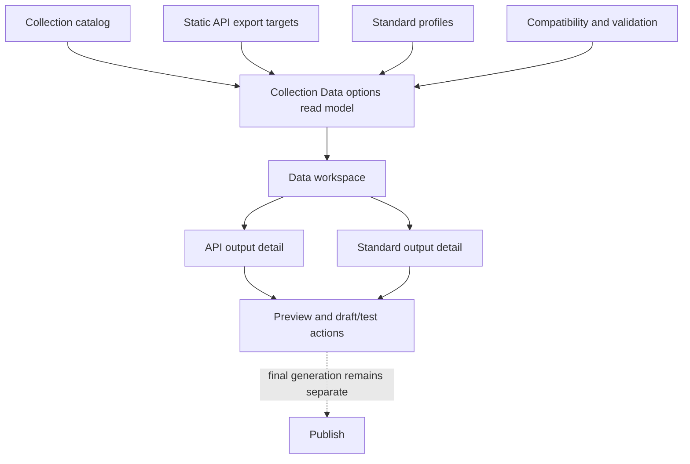
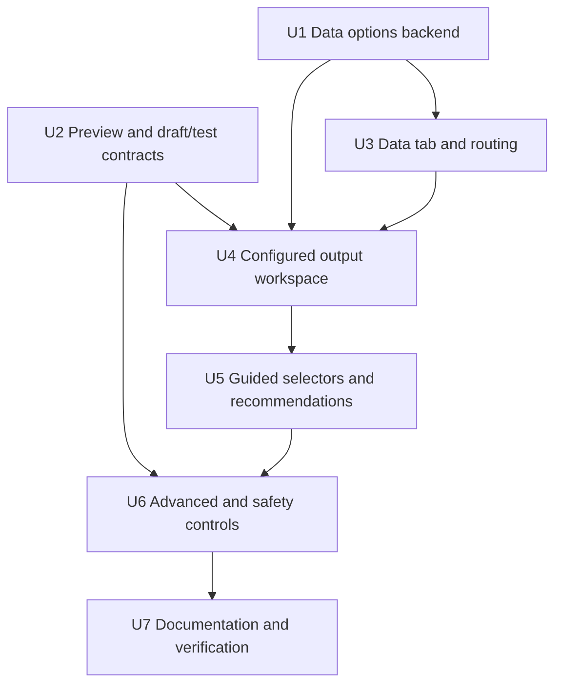

# feat: Add collection Data workspace

## Summary

Consolidate collection-scoped API exports and standard publication profiles into one evidence-guided Data workspace. The plan extends the existing collection catalog, API export, standard profile, validation, and preview foundations rather than rewriting export engines, with the first slice focused on discoverability, configured-output status, guided configuration, and safe draft/test generation.

---

## Problem Frame

The current collection UI exposes `Export` and `Standards` as separate technical surfaces, even though both produce reusable data outputs. Users must understand internal export targets, standard profiles, mappings, JSON paths, and global settings before knowing what action to take.

The origin document reframes this around collection intent: `Sources` feed the collection, collection-level `Site` output serves human readers, and `Data` output serves reuse, interoperability, and biodiversity publication.

---

## Requirements

- R1. Collection navigation distinguishes source data, collection site output, and collection data output.
- R2. Static API exports and standard profiles are represented inside Data before legacy entry points are removed.
- R3. Data recommendations are evidence-guided and may decline to show a primary action when evidence is missing or contradictory.
- R4. Data exposes configured outputs first when they already exist, with clear edit, preview, validate, and test actions.
- R5. Simple JSON remains the low-friction default when no stronger standard-specific recommendation applies.
- R6. Darwin Core Occurrence and Humboldt/Event standards remain available as guided biodiversity publication outputs.
- R7. Guided selectors replace normal-flow free-form field, path, and term entry where practical in the first slice.
- R8. Representative previews and test outputs expose sample basis, row count, status, errors, and draft isolation.
- R9. Publication-grade standard files are blocked by critical validation errors or incomplete rule coverage.
- R10. Advanced project defaults, per-output overrides, and raw configuration remain available but secondary.
- R11. Shareable outputs apply minimization, safe preview behavior, path constraints, and sensitivity-aware masking where metadata exists.
- R12. Data workspace interactions remain accessible and responsive enough for keyboard, screen reader, and small viewport use.

**Origin actors:** A1 Project maintainer, A2 Scientific data manager, A3 Advanced integrator, A4 Downstream planner or implementer.

**Origin flows:** F1 Configure site-facing collection output, F2 Start from the recommended data action, F3 Configure reusable JSON data, F4 Configure a biodiversity standard output, F5 Access advanced settings without making them primary.

**Origin acceptance examples:** AE1 collection tab model and legacy discoverability, AE2 evidence-backed recommendation, AE3 insufficient-evidence intent chooser, AE4 reusable JSON guided fields, AE5 preview/test output state, AE6 standard classification and publication blockers, AE7 advanced settings access, AE8 first implementation slice, AE9 configured output priority, AE10 sensitivity-aware previews, AE11 accessibility and responsive behavior.

---

## Scope Boundaries

- This plan does not rewrite `json_api_exporter`, `dwc_archive_exporter`, or standard profile persistence.
- This plan does not add biodiversity standards beyond Darwin Core Occurrence and Humboldt/Event.
- This plan does not implement a full automatic migration of all historical export variants.
- This plan does not add ML-assisted recommendation in the first slice.
- This plan does not redesign the global Publish area beyond preserving its final-generation responsibility.
- This plan does not redesign the global Site builder; collection-level Site remains the existing blocks/list/page configuration surface.

### Deferred to Follow-Up Work

- Full migration wizard for legacy export configurations: separate follow-up after Data can reliably surface current outputs.
- ML-assisted recommendation and semantic confidence improvements: later slice after the evidence contract is stable.
- Full Humboldt/Event rule catalog and external publication workflow: later standard-profile hardening.
- User research validation of `Sources / Site / Data` versus visible `Export / Standards`: product follow-up before removing compatibility entry points everywhere.

---

## Context & Research

### Relevant Code and Patterns

- `src/niamoto/core/collections/catalog.py` already exposes collection catalog metadata, roles, grains, review status, and manual collections.
- `src/niamoto/gui/api/routers/collections.py` already owns `/api/collections` listing and collection metadata mutations.
- `src/niamoto/gui/api/routers/config.py` already owns static API export targets, group config, suggestions, auto-config proposals, and JSON previews.
- `src/niamoto/core/standards/*` already owns standard profile models, store, compatibility, validation, auto-configuration, source fields, output previews, and output generation.
- `src/niamoto/gui/api/routers/standard_profiles.py` already exposes standard profile CRUD, compatibility, validation, auto-config, source fields, preview, and output endpoints.
- `src/niamoto/gui/ui/src/features/collections/components/CollectionPanel.tsx` currently renders `sources`, `content`, `index`, `api`, and `standards` tabs.
- `src/niamoto/gui/ui/src/features/collections/components/api/*` contains the existing API export UX: `ApiExportsTab`, `ExportCard`, `AddExportWizard`, preview, auto-config, field editors, and settings.
- `src/niamoto/gui/ui/src/features/collections/components/standards/*` contains the standard profile UX: `StandardProfilesTab`, `ProfileEditor`, compatibility, validation, outputs, auto-config, source-field selectors, and legacy hints.
- `src/niamoto/gui/ui/src/features/collections/hooks/useApiExportConfigs.ts`, `useStandardProfiles.ts`, and `useCollectionsCatalog.ts` already establish feature-local React Query patterns.
- `src/niamoto/gui/ui/README.md` confirms new product workflows should remain feature-scoped under `src/features/collections` rather than root hooks or shared API modules.

### Institutional Learnings

- No `docs/solutions/` directory is present.
- `docs/plans/2026-03-31-feat-api-export-ux-simplification-plan.md` and `docs/plans/2026-04-30-001-feat-standardized-export-profiles-plan.md` are implemented foundations, not competing plans to repeat.

### External References

- WCAG 2.2 guidance informs the accessibility requirement for focus order, names, status messages, and reachable controls.
- OWASP path traversal and logging guidance informs the requirements for output path containment, leaf archive filenames, and avoiding sensitive preview values in logs.

---

## Key Technical Decisions

- Add a collection-scoped Data options read model behind `/api/collections/{collection_name}/data-options`: the Data workspace needs one coherent contract for configured outputs, suitability evidence, fallbacks, and primary action rather than stitching unrelated endpoints in React.
- Implement Data as a new collection tab that replaces the normal `api` and `standards` tabs: this satisfies the product model while preserving existing API export and standard profile internals behind cards and detail panels.
- Gate removal of visible legacy tab triggers on Data parity: old `api` and `standards` entry points stay reachable until configured API exports, standard profiles, legacy hints, preview, validation, and test actions are all represented inside Data for the active collection.
- Keep `/groups/api-settings` as an advanced settings route for the first slice: advanced global JSON API defaults remain reachable without being the collection default path.
- Treat existing API exports, standard profiles, and legacy standard hints as configured or discoverable Data outputs: old entry points can only be hidden once this representation is complete.
- Default recommendation behavior should be conservative: the read model only returns a primary action when minimum evidence is present and consistent; otherwise it returns an intent chooser with missing-evidence reasons.
- Reuse existing preview endpoints but enrich their contracts incrementally: this avoids rewriting exporters while adding sample metadata, status states, and draft/test isolation where output writes occur.
- Use existing validation as the publication gate for standard files: `api_json` can remain draft-oriented, while `dwc_archive` and `standard_files` stay blocked by critical validation.
- Make sensitivity controls best-effort in this slice: when metadata exists, mask or minimize; when it does not, default to explicit review cues rather than inventing a full classification system.

---

## Open Questions

### Resolved During Planning

- Should `Data` be backed by frontend composition or a backend read model? Use a backend read model so recommendation, fallback, and configured-output state are consistent across the UI.
- Should the first slice remove the global API settings route? No. Keep it as advanced access while moving normal collection decisions into Data.
- Should standard profile and API export editors be merged into one editor immediately? No. Merge the workspace and output cards first; reuse specialized editors inside each output type.
- Should ML recommendation ship in the first slice? No. Use only current catalog, export config, standard profiles, field suggestions, compatibility, and validation evidence.

### Deferred to Implementation

- Exact Data option scoring thresholds after inspecting real configured projects.
- Exact i18n copy for recommendation reasons, draft warnings, and advanced labels.
- Final responsive breakpoint layout after implementation screenshots.
- Exact preview metadata fields once existing preview builders are patched.

---

## High-Level Technical Design

> *This illustrates the intended approach and is directional guidance for review, not implementation specification. The implementing agent should treat it as context, not code to reproduce.*

The Data workspace should operate as a state machine:

| State | Primary content | Primary action |
|---|---|---|
| No configured outputs, sufficient evidence | Recommended action and suitability catalog | Start guided output |
| No configured outputs, insufficient evidence | Intent chooser and suitability explanations | Choose JSON or standard path |
| Existing outputs | Configured outputs and status first | Edit, preview, validate, or test selected output |
| Advanced context | Project defaults, per-output overrides, raw config | Save validated advanced settings |

---

## Implementation Units

- U1. **Collection Data options backend**

**Goal:** Provide a collection-scoped read model for the Data workspace that combines collection metadata, static API exports, standard profiles, compatibility, validation, legacy hints, and recommendation fallbacks.

**Requirements:** R1, R2, R3, R4, R5, R6; origin R4-R8, R24-R32; F2; AE1, AE2, AE3, AE8, AE9.

**Dependencies:** None.

**Files:**
- Create: `src/niamoto/gui/api/services/collection_data_options.py`
- Modify: `src/niamoto/gui/api/routers/collections.py`
- Modify: `src/niamoto/gui/ui/src/features/collections/hooks/useCollectionsCatalog.ts`
- Create: `src/niamoto/gui/ui/src/features/collections/hooks/useCollectionDataOptions.ts`
- Test: `tests/gui/api/routers/test_collections.py`
- Test: `src/niamoto/gui/ui/src/features/collections/hooks/useCollectionDataOptions.test.tsx`

**Approach:**
- Add a service that accepts a collection name and returns the Data workspace state for that collection.
- Include configured static API outputs by scanning JSON API export targets that reference the collection.
- Include standard profiles whose profile source belongs to the collection, plus legacy standard hints that point to the collection.
- Include suitability options for simple JSON, Darwin Core Occurrence, and Humboldt/Event, with evidence and a nullable primary action.
- Include field metadata and sensitivity availability flags when they are already known; when they are absent, return an explicit "not available" state rather than inventing a classification.
- Set `primary_action` only when minimum evidence is both present and coherent: known collection grain, an output option compatible with that grain, required capability/source-field evidence available for that option, and no contradictory validation or compatibility result.
- Return an insufficient-evidence state when current catalog/compatibility data cannot justify a single recommendation.
- Keep recommendation scoring simple in the first slice: current roles, grain, configured outputs, compatibility status, validation status, source fields, and legacy hints.
- Follow the existing GUI API trust boundary and avoid expanding the endpoint into a data exposure surface: return status, evidence, labels, and configuration summaries, not raw preview payloads, secrets, or final filesystem paths.
- Expose the read model at `GET /api/collections/{collection_name}/data-options` while keeping `/api/collections` unchanged for review and navigation.

**Patterns to follow:**
- `CollectionCatalogService` construction in `src/niamoto/gui/api/routers/collections.py`.
- `_profile_store`, `_compatibility_service`, and `_validation_service` helpers in `src/niamoto/gui/api/routers/standard_profiles.py`.
- API export target summary logic in `src/niamoto/gui/api/routers/config.py`.
- React Query hook style in `src/niamoto/gui/ui/src/features/collections/hooks/useStandardProfiles.ts`.

**Test scenarios:**
- Covers AE2. Happy path: occurrence-grain collection with no outputs returns a Darwin Core option with enough evidence and a primary action.
- Covers AE3. Edge case: collection with unknown grain and no useful evidence returns no primary action and includes an intent chooser-style fallback reason.
- Covers AE3. Edge case: collection with partial or contradictory evidence returns no primary action even when one signal points toward a standard output.
- Covers AE9. Happy path: collection with configured API export and standard profile returns configured outputs before recommendations.
- Covers AE1. Happy path: legacy `dwc_occurrence_json` target is surfaced as a discoverable legacy standard-like output for the matching collection.
- Error path: unknown collection returns a not-found response without trying to read export or standard profile config.
- Error path: invalid standard profile in export config is represented as an error/fallback entry rather than crashing the whole Data options response.
- Integration: API router test covers catalog + export config + standard profile config in the same response.

**Verification:**
- Data options endpoint gives the frontend all state needed for the Data first screen without additional composition.
- Existing collection catalog tests and standard profile API tests still pass.

---

- U2. **Preview and draft/test output contracts**

**Goal:** Normalize preview and individual output behavior so Data can show representative previews, draft/test status, sample metadata, and safe artifact boundaries.

**Requirements:** R8, R9, R11; origin R13, R18, R22, R23, R35-R39, R41-R43; F3, F4; AE5, AE6, AE10.

**Dependencies:** U1.

**Files:**
- Modify: `src/niamoto/gui/api/routers/config.py`
- Modify: `src/niamoto/core/standards/models.py`
- Modify: `src/niamoto/core/standards/output_service.py`
- Modify: `src/niamoto/gui/api/routers/standard_profiles.py`
- Modify: `src/niamoto/gui/ui/src/features/collections/hooks/useApiExportConfigs.ts`
- Modify: `src/niamoto/gui/ui/src/features/collections/hooks/useStandardProfiles.ts`
- Test: `tests/gui/api/routers/test_config_api_exports.py`
- Test: `tests/gui/api/routers/test_standard_profiles.py`

**Approach:**
- Extend static API preview responses with sample metadata: selected item id, row count/sample size where available, source table/data source, and warnings.
- Extend standard output preview responses with sample metadata and explicit draft/publication status.
- Add a standard-profile draft/test output mode for Data-triggered file generation that writes to a confined preview location instead of final publication paths.
- Define draft/test retention and cleanup metadata in the response, even if the first implementation uses a simple fixed retention policy.
- Preserve existing publication output endpoints for current behavior, but ensure Data uses the draft/test path when the action is framed as verification.
- Keep publication file generation blocked when validation has critical issues, and surface that block in the response instead of making the UI infer it from exceptions.
- Apply output path and archive filename validation consistently through existing model validators and `_resolve_output_dir`.
- Avoid logging preview payload contents; logs should reference profile/output names, status, and error metadata only.

**Patterns to follow:**
- Static API preview helpers around `_build_api_export_preview` in `src/niamoto/gui/api/routers/config.py`.
- Standard profile preview and output result models in `src/niamoto/core/standards/models.py`.
- Output confinement already present in `StandardProfileOutputService._resolve_output_dir`.
- `DwcArchiveExporterParams.validate_archive_name` and `_safe_archive_path`.

**Test scenarios:**
- Covers AE5. Happy path: API JSON preview returns preview data plus sample metadata without writing files.
- Covers AE5. Happy path: standard profile preview returns one representative record, source record metadata, warnings, and no output path.
- Covers AE5. Happy path: Data draft generation writes under an isolated preview path and marks the result as draft/test.
- Covers AE5. Happy path: draft/test output response includes retention or cleanup policy metadata.
- Covers AE6. Error path: standard publication file generation with a critical validation issue returns a blocked response and writes no files.
- Covers AE10. Edge case: preview metadata is returned without logging raw preview values.
- Error path: absolute `output_dir`, parent directory segments, or archive names with separators are rejected.
- Integration: draft/test generation and publication generation use distinct result metadata so the UI can label them differently.

**Verification:**
- Existing preview UI still works with additive response fields.
- Draft/test outputs are distinguishable from final Publish outputs.
- Security-sensitive path tests cover API JSON, DwC archive, and standard file paths.

---

- U3. **Collection Data tab and routing**

**Goal:** Introduce `Data` as the collection destination intended to replace the normal `Export` and `Standards` tabs, while preserving legacy access until Data parity is complete.

**Requirements:** R1, R2, R3, R10, R12; origin R1-R3, R19-R21, R24-R26, R47-R48; F1, F5; AE1, AE7, AE8, AE11.

**Dependencies:** U1.

**Files:**
- Modify: `src/niamoto/gui/ui/src/features/collections/routing.ts`
- Modify: `src/niamoto/gui/ui/src/features/collections/components/CollectionPanel.tsx`
- Modify: `src/niamoto/gui/ui/src/features/collections/components/CollectionsModule.tsx`
- Modify: `src/niamoto/gui/ui/src/features/collections/utils/collectionDisplay.ts`
- Create: `src/niamoto/gui/ui/src/features/collections/components/data/DataWorkspace.tsx`
- Test: `src/niamoto/gui/ui/src/features/collections/routing.test.ts`
- Test: `src/niamoto/gui/ui/src/features/collections/components/CollectionPanel.test.tsx`
- Test: `src/niamoto/gui/ui/src/features/collections/utils/collectionDisplay.test.ts`

**Approach:**
- Introduce `data` as the collection output tab for reusable JSON and biodiversity standards.
- Add the Data route and tab shell first; stop rendering separate normal `api` and `standards` tab triggers only after U4 proves Data parity for configured outputs and legacy hints.
- Keep route compatibility for existing `?tab=api` and `?tab=standards` by redirecting or normalizing to `data` with a selected output family when possible.
- Keep `/groups/api-settings` available as an advanced route, but label it as project defaults rather than a normal collection destination.
- Ensure default collection tab behavior still favors `content` or existing collection defaults until the product explicitly changes the default to Data.
- Keep `Sources`, `Blocks`, and `List` behavior unchanged.
- Build the Data workspace as a feature-local component that consumes `useCollectionDataOptions`.

**Patterns to follow:**
- Existing collection tab routing helpers in `src/niamoto/gui/ui/src/features/collections/routing.ts`.
- `PanelTransition` usage in `CollectionPanel`.
- Existing `ApiSettingsPanel` advanced route pattern in `CollectionsModule`.
- Collection display utilities that already include collection metadata roles and visibility.

**Test scenarios:**
- Covers AE1. Happy path: collection panel can show `Sources`, `Blocks`, `List`, and `Data` while preserving legacy `Export` and `Standards` access until U4 parity is complete.
- Edge case: navigating to an old `?tab=api` URL resolves to Data without losing the collection selection.
- Edge case: navigating to an old `?tab=standards` URL resolves to Data and can focus standards output family when implemented.
- Happy path: `/groups/api-settings` remains reachable and outside the collection tab strip.
- Covers AE11. Accessibility: tab triggers have stable accessible names and keyboard navigation still reaches Data.
- Responsive: tab labels/icons do not overlap at current compact toolbar sizes.

**Verification:**
- Collection navigation tests pass.
- Existing source/content/index panels render unchanged.
- Manual browser check confirms old API/Standards URLs land in an understandable Data state.

---

- U4. **Configured output Data workspace**

**Goal:** Build the Data workspace UI around configured outputs first, with distinct cards/details for API JSON, standard profiles, legacy hints, and unresolved recommendations.

**Requirements:** R2, R3, R4, R5, R6; origin R4-R18, R27-R32, R38-R40; F2, F3, F4; AE2, AE3, AE4, AE6, AE9.

**Dependencies:** U1, U2, U3.

**Files:**
- Create: `src/niamoto/gui/ui/src/features/collections/components/data/DataOutputList.tsx`
- Create: `src/niamoto/gui/ui/src/features/collections/components/data/DataOutputDetail.tsx`
- Create: `src/niamoto/gui/ui/src/features/collections/components/data/DataRecommendationPanel.tsx`
- Create: `src/niamoto/gui/ui/src/features/collections/components/data/DataLegacyHintCard.tsx`
- Modify: `src/niamoto/gui/ui/src/features/collections/components/api/AddExportWizard.tsx`
- Modify: `src/niamoto/gui/ui/src/features/collections/components/api/ApiExportsTab.tsx`
- Modify: `src/niamoto/gui/ui/src/features/collections/components/api/ExportCard.tsx`
- Modify: `src/niamoto/gui/ui/src/features/collections/components/standards/ProfileEditor.tsx`
- Modify: `src/niamoto/gui/ui/src/features/collections/components/standards/StandardProfilesTab.tsx`
- Modify: `src/niamoto/gui/ui/src/features/collections/components/standards/ProfileOutputsPanel.tsx`
- Test: `src/niamoto/gui/ui/src/features/collections/components/data/DataWorkspace.test.tsx`
- Test: `src/niamoto/gui/ui/src/features/collections/components/standards/StandardProfilesTab.test.tsx`
- Test: `src/niamoto/gui/ui/src/features/collections/components/api/ExportCard.test.tsx`

**Approach:**
- Use the Data options response as the workspace index, with configured outputs sorted ahead of recommendations.
- Render API export outputs using existing `ExportCard` behavior inside a Data output detail, rather than duplicating API editor logic.
- Render standard outputs using existing `ProfileEditor`, `ProfileCompatibilityPanel`, `ProfileValidationReport`, and `ProfileOutputsPanel` inside a scoped detail panel.
- Make selected output context visually explicit so compatibility, validation, preview, and generation controls cannot be mistaken for global collection state.
- After creating or saving a new output, invalidate Data options and move the user to the saved output detail or overview with a visible success/status state, rather than leaving them in the initial creation form.
- Show legacy standard hints as migration/discovery cards rather than active profiles.
- For no configured output and sufficient evidence, show the recommended action and suitability catalog.
- For no configured output and insufficient evidence, show an intent chooser: reusable JSON, Darwin Core Occurrence, Humboldt/Event, and advanced configuration.
- Keep technical labels visible as secondary metadata on cards.

**Patterns to follow:**
- `StandardProfilesTab` current two-column layout, but with the selected-profile status card folded into the output detail.
- `ExportCard` save/reset/auto-config pattern.
- Legacy hint rendering in `StandardProfilesTab`.
- Existing badge and card design density in collection review components.

**Test scenarios:**
- Covers AE9. Happy path: configured API and standard outputs appear before recommendations for a collection.
- Covers AE2. Happy path: no configured outputs with a high-confidence recommendation shows one primary recommendation and secondary options.
- Covers AE3. Edge case: no primary action shows intent choices and evidence gaps, not an empty editor.
- Covers AE6. Happy path: standard output detail shows classification, validation, allowed actions, and disabled publication button when blocked.
- Happy path: saving a newly created output closes the creation flow and selects the saved configured output.
- Covers AE1. Legacy hint appears in Data for a collection with a legacy standard-like export.
- Error path: data-options load failure shows a recoverable error state without blanking the whole collection panel.
- Accessibility: selecting an output updates a heading/status region that screen readers can identify.

**Verification:**
- Data workspace can configure and preview both a simple JSON API output and an existing Darwin Core profile.
- Existing API export and standard profile component tests remain relevant and pass after embedding.

---

- U5. **Guided selectors and evidence-backed recommendations**

**Goal:** Improve normal-flow configuration so users select source fields and standard terms from detected options instead of typing unknown paths or terms, while keeping advanced custom entry available.

**Requirements:** R3, R5, R6, R7; origin R7-R8, R11-R18, R33-R34, R38-R40; F2, F3, F4; AE2, AE3, AE4, AE6.

**Dependencies:** U1, U4.

**Files:**
- Modify: `src/niamoto/gui/ui/src/features/collections/components/api/ApiFieldMappingsEditor.tsx`
- Modify: `src/niamoto/gui/ui/src/features/collections/components/api/DwcMappingEditor.tsx`
- Modify: `src/niamoto/gui/ui/src/features/collections/components/standards/ProfileEditor.tsx`
- Create: `src/niamoto/gui/ui/src/features/collections/components/data/FieldSelector.tsx`
- Create: `src/niamoto/gui/ui/src/features/collections/components/data/RecommendationEvidence.tsx`
- Modify: `src/niamoto/gui/ui/src/features/collections/hooks/useApiExportConfigs.ts`
- Modify: `src/niamoto/gui/ui/src/features/collections/hooks/useStandardProfiles.ts`
- Test: `src/niamoto/gui/ui/src/features/collections/components/api/ApiFieldMappingsEditor.test.tsx`
- Test: `src/niamoto/gui/ui/src/features/collections/components/api/DwcMappingEditor.test.tsx`
- Test: `src/niamoto/gui/ui/src/features/collections/components/standards/ProfileEditor.test.tsx`
- Test: `src/niamoto/gui/ui/src/features/collections/components/data/FieldSelector.test.tsx`

**Approach:**
- Introduce a shared feature-local selector component for source fields, with search, grouping, representative values when safe, missing states, and custom advanced entry.
- Use API export suggestions for JSON field selection and standard profile `source-fields` for standard term mapping.
- Keep existing JSON synchronized advanced editors as advanced fallbacks, not as the default surface.
- For standard profile mapping, group required, recommended, mapped, and unresolved terms; show evidence and confidence from auto-config where available.
- Treat generator mode as advanced: expose known generator presets with guided labels where existing mappings already support them, and keep raw generator params behind advanced controls.
- Display recommendation evidence and missing-evidence reasons from Data options in user-facing language.

**Patterns to follow:**
- `SynchronizedJsonConfigSection` for keeping guided and raw JSON views consistent.
- Standard profile auto-config term response in `useStandardProfiles.ts`.
- Current API export auto-config review in `AutoConfigReviewDialog`.
- Existing shadcn select/input/button patterns in collection review dialogs.

**Test scenarios:**
- Covers AE4. Happy path: JSON field selector lists detected source fields, supports search, and updates the mapping without typing a path.
- Edge case: selector shows an empty/missing-source state when suggestions are unavailable.
- Covers AE4. Happy path: advanced custom entry remains available and synchronized with raw JSON.
- Covers AE6. Happy path: standard term selector shows required and recommended terms separately and marks unresolved terms.
- Edge case: duplicate/conflicting mappings are shown as conflicts rather than silently overwritten.
- Error path: source-fields endpoint failure leaves existing profile mappings editable through advanced mode.
- Accessibility: selector options have readable labels and keyboard-selectable rows.

**Verification:**
- Normal JSON and standard profile creation can be completed without hand-typing a source path or standard term.
- Advanced raw configuration still round-trips existing custom mappings.

---

- U6. **Advanced settings and safe output controls**

**Goal:** Keep powerful settings available while making them secondary, validated, and safer for shareable outputs.

**Requirements:** R8, R10, R11, R12; origin R19-R23, R35-R37, R41-R48; F5; AE5, AE7, AE10, AE11.

**Dependencies:** U2, U4, U5.

**Files:**
- Modify: `src/niamoto/gui/ui/src/features/collections/components/api/ApiSettingsPanel.tsx`
- Modify: `src/niamoto/gui/ui/src/features/collections/components/api/ExportCard.tsx`
- Modify: `src/niamoto/gui/ui/src/features/collections/components/standards/ProfileOutputsPanel.tsx`
- Modify: `src/niamoto/gui/ui/src/features/collections/components/standards/ProfileEditor.tsx`
- Modify: `src/niamoto/core/standards/output_service.py`
- Modify: `src/niamoto/core/plugins/exporters/dwc_archive_exporter.py`
- Test: `src/niamoto/gui/ui/src/features/collections/components/api/ApiSettingsPanel.test.tsx`
- Test: `src/niamoto/gui/ui/src/features/collections/components/standards/ProfileOutputsPanel.test.tsx`
- Test: `tests/gui/api/routers/test_standard_profiles.py`
- Test: `tests/core/plugins/exporters/test_dwc_archive_exporter.py`

**Approach:**
- Reframe `ApiSettingsPanel` as advanced project data defaults, with concise summaries and links back to collection Data outputs.
- Keep per-output overrides in the selected output detail, visually secondary to guided fields and status.
- Surface path validation errors directly in output/detail panels rather than only as generic server errors.
- Add best-effort sensitivity/minimization affordances: output audience label, warning when no sensitivity metadata exists, and masked representative values when a field is known sensitive.
- Ensure draft/test output UI clearly separates preview locations from final publication paths.
- Add focus order, status announcements, and compact responsive behavior for the new Data workspace panels.
- Avoid nested cards where the Data layout can use unframed panels or individual output cards.

**Patterns to follow:**
- Existing `ApiSettingsPanel` settings-card pattern.
- Output path validation in `StandardProfileOutputService`.
- Archive name validation in `DwcArchiveExporterParams`.
- Existing status panel patterns in `ProfileValidationReport` and `ProfileCompatibilityPanel`.

**Test scenarios:**
- Covers AE7. Happy path: advanced project defaults remain reachable from Data and `/groups/api-settings`.
- Covers AE7. Happy path: per-output override changes remain scoped to the selected output.
- Covers AE10. Happy path: field marked sensitive in metadata is masked or omitted in selector preview and output preview.
- Edge case: no sensitivity metadata shows explicit review/minimization cue without blocking all output.
- Error path: unsafe output path or archive filename surfaces a specific validation message in the output panel.
- Covers AE11. Responsive: Data output list and detail stack on small screens without hidden actions or overlapping text.
- Accessibility: validation and generation status changes are announced and focus remains inside the active output detail.

**Verification:**
- Advanced controls are reachable but not required for the common create/edit path.
- Unsafe path and archive-name tests pass at backend and UI error-display levels.

---

- U7. **Documentation, regression tests, and rollout notes**

**Goal:** Document the new collection Data model and lock down key regression behaviors before execution moves to broader polish.

**Requirements:** R1-R12; origin R1-R48; all flows and acceptance examples.

**Dependencies:** U1, U2, U3, U4, U5, U6.

**Files:**
- Modify: `src/niamoto/gui/README.md`
- Modify: `src/niamoto/gui/ui/README.md`
- Modify: `docs/02-user-guide/collections.md`
- Modify: `docs/06-reference/api-export-guide.md`
- Create or modify: `docs/06-reference/standard-profiles.md`
- Test: `tests/gui/api/routers/test_collections.py`
- Test: `tests/gui/api/routers/test_config_api_exports.py`
- Test: `tests/gui/api/routers/test_standard_profiles.py`
- Test: `src/niamoto/gui/ui/src/features/collections/components/data/DataWorkspace.test.tsx`

**Approach:**
- Update GUI docs to describe `Sources / Site / Data` and clarify that Data contains static API JSON plus biodiversity standards.
- Document advanced project defaults separately from normal Data output configuration.
- Add user-facing docs explaining legacy hints, draft/test outputs, standard validation status, and Publish separation.
- Preserve old API export guide content where still accurate, but cross-link to Data workspace docs.
- Add a short rollout note: keep legacy links/routes during first release, then evaluate removal after user validation.
- Ensure tests cover the acceptance examples most likely to regress: routing, configured-output priority, insufficient-evidence fallback, preview status, validation blockers, advanced settings reachability.

**Patterns to follow:**
- GUI README structure for current responsibilities.
- Frontend README architecture guardrails.
- Existing docs under `docs/02-user-guide` and `docs/06-reference`.

**Test scenarios:**
- Documentation-only checks are not enough; this unit relies on the regression test files listed above.
- Covers AE1. Existing legacy routes remain understandable after Data tab introduction.
- Covers AE5. Preview/draft contract tests assert sample metadata and draft isolation.
- Covers AE6. Standard output tests assert publication blockers.
- Covers AE11. Frontend tests assert key accessibility labels and responsive state hooks where testable.

**Verification:**
- Docs describe the current implemented workflow, not the old two-tab mental model.
- Targeted backend and frontend tests cover the new Data contract and UI states.
- `pnpm build` succeeds after the frontend changes.

---

## System-Wide Impact

- **Interaction graph:** `CollectionPanel` tab routing feeds `DataWorkspace`; `DataWorkspace` reads `data-options`; output details call existing API export and standard profile endpoints.
- **Error propagation:** backend data-options should preserve partial output states where possible; per-output preview/generation errors should not blank the entire Data workspace.
- **State lifecycle risks:** configured output status can drift if query invalidation misses API export or standard profile mutations; hooks must invalidate both data-options and specialized output queries after saves.
- **API surface parity:** legacy API export and standard profile routes remain available; Data adds a collection-scoped read model on top.
- **Integration coverage:** unit tests must be complemented with API router tests that combine catalog, export config, and standard profile config.
- **Unchanged invariants:** export engines still own final file generation; Publish remains responsible for full project generation; raw YAML power remains available through advanced paths.

---

## Risks & Dependencies

| Risk | Mitigation |
|------|------------|
| Data workspace becomes a third UI on top of API and Standards instead of replacing their normal path | U3 introduces Data with compatibility routing, then hides normal legacy tab triggers only after U4 proves configured-output parity. |
| Recommendation appears overconfident | U1 makes primary action nullable and includes missing-evidence fallbacks. |
| Existing users lose access to configured exports | U1 and U4 surface configured API exports, standard profiles, and legacy hints before old routes are hidden. |
| Draft/test generation writes publishable artifacts | U2 introduces draft/test output semantics and isolated preview locations. |
| Advanced users cannot find global settings | U3 keeps `/groups/api-settings`; U6 reframes it as advanced project defaults. |
| Sensitive values appear in previews | U2 and U6 add best-effort masking/minimization and avoid raw preview logging. |
| UI becomes cramped with output list + detail + status panels | U4 and U6 define selected-output context, responsive stacking, and accessibility expectations. |

---

## Documentation / Operational Notes

- Update docs only after the implementation matches the new Data workflow.
- Keep release notes explicit that `Export` and `Standards` are consolidated into collection `Data`, while existing routes/config remain compatible.
- Manual verification should include one existing project with simple JSON exports, one with a Darwin Core profile, and one with no data outputs.

---

## Sources & References

- **Origin document:** [docs/brainstorms/2026-05-05-collections-data-outputs-ux-requirements.md](../brainstorms/2026-05-05-collections-data-outputs-ux-requirements.md)
- Prior API export UX plan: [docs/plans/2026-03-31-feat-api-export-ux-simplification-plan.md](2026-03-31-feat-api-export-ux-simplification-plan.md)
- Prior standard profiles plan: [docs/plans/2026-04-30-001-feat-standardized-export-profiles-plan.md](2026-04-30-001-feat-standardized-export-profiles-plan.md)
- Collection catalog API: `src/niamoto/gui/api/routers/collections.py`
- Static API export API: `src/niamoto/gui/api/routers/config.py`
- Standard profile API: `src/niamoto/gui/api/routers/standard_profiles.py`
- Collection frontend feature: `src/niamoto/gui/ui/src/features/collections`
- GUI backend README: `src/niamoto/gui/README.md`
- GUI frontend README: `src/niamoto/gui/ui/README.md`
